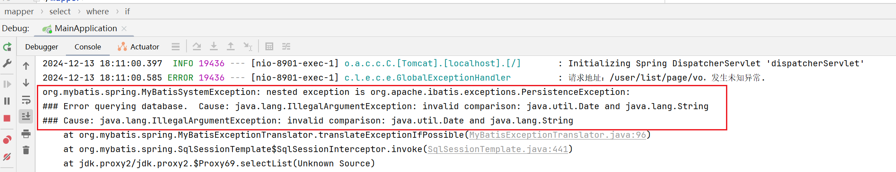
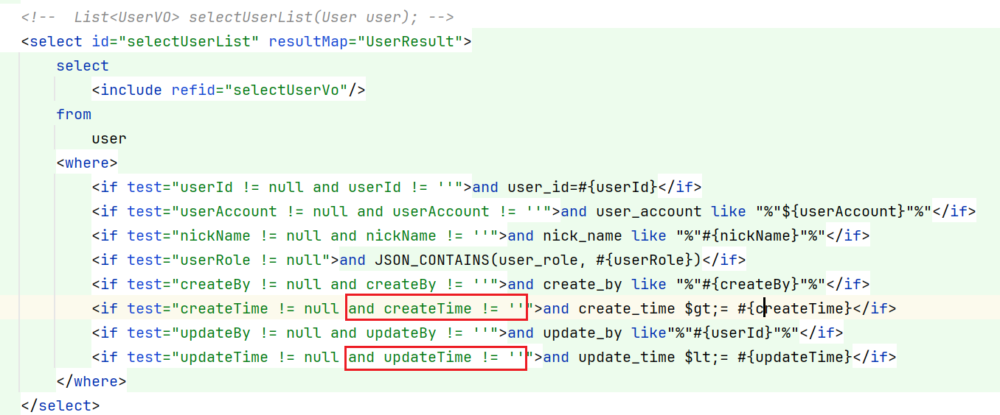

# MyBatis

## 一、Cause: java.lang.IllegalArgumentException: invalid comparison: java.util.Date and java.lang.String

报错截图如下

错误原因：使用Date类型与String字符串作比较

解决方案：时间只需要进行非空判断

---

# Java

## 一、JSON parse error: Cannot deserialize value of type `java.util.Date` from String "2024-12-08 23:22:03": not a valid representation (error: Failed to parse Date value '2024-12-08 23:22:03': Cannot parse date "2024-12-08 23:22:03": while it seems to fit format 'yyyy-MM-dd'T'HH:mm:ss.SSSX', parsing fails (leniency? null)); 

从异常信息来看，可能是日期型数据被序列化为JSON之后，无法转换成java.util.date类型，需要显式的指定一个日期转换格式。

在对应的bean日期属性上增加注解 @JsonFormat 注解

~~~java
/**
* 创建时间
*/
@JsonFormat(locale="zh", timezone = "GMT+8", pattern = "yyyy-MM-dd HH:mm:ss")
private Date createTime;
~~~

- 注解@JsonFormat主要是后台到前台的时间格式的转换
- 注解@DataFormat主要是前台到后台的时间格式的转换

---

