# CentOS7安装最新Git

## 一、YUM安装

### 删除旧的git

```powershell
sudo yum -y remove git
sudo yum -y remove git-*
```

### 添加端点 CentOS/RHEL 7 存储库

在 CentOS/RHEL 7 上安装最新版本 Git 的最快方法是从 End Point 存储库。

```powershell
sudo yum -y install https://packages.endpointdev.com/rhel/7/os/x86_64/endpoint-repo.x86_64.rpm
```

添加存储库后，[安装 Git](https://so.csdn.net/so/search?q=安装 Git&spm=1001.2101.3001.7020) 2.x：

```powershell
sudo yum install git
```

按 **y** 键接受安装，然后在 CentOS 7 上安装 git。

```powershell
....
Transaction Summary
======================================================================================================================================================================================================
Install  1 Package (+33 Dependent packages)

Total download size: 25 M
Installed size: 82 M
Is this ok [y/d/N]: y
```

安装 `git2u-all` 软件包后检查 `git` 版本

```powershell
$ git --version
git version 2.41.0
```

经确认，当前的 Git 版本是 `2.x.y`

---

## 二、源代码安装

在这种方法中，您的任务是从源代码构建 `git`。安装需要的依赖包：

```powershell
sudo yum -y remove git*
sudo yum -y install epel-release
sudo yum -y groupinstall "Development Tools"
sudo yum -y install wget perl-CPAN gettext-devel perl-devel  openssl-devel  zlib-devel curl-devel expat-devel  getopt asciidoc xmlto docbook2X
sudo ln -s /usr/bin/db2x_docbook2texi /usr/bin/docbook2x-texi
```

下载并安装最新的git：

```powershell
sudo yum -y install wget curl
export VER="v2.41.0"
wget https://github.com/git/git/archive/${VER}.tar.gz
tar -xvf ${VER}.tar.gz
rm -f ${VER}.tar.gz
cd git-*
make configure
sudo ./configure --prefix=/usr
sudo make
sudo make install
```

检查系统上安装的新版本 `git`

```powershell
$ git --version
git version 2.41.0
```

您现在应该在 CentOS 7 服务器上安装了最新版本的 Git 2.x。


----

# 使用轻量应用服务器搭建图床

## 一、在宝塔上安装Nginx

首先安装宝塔：https://www.bt.cn/new/download.html

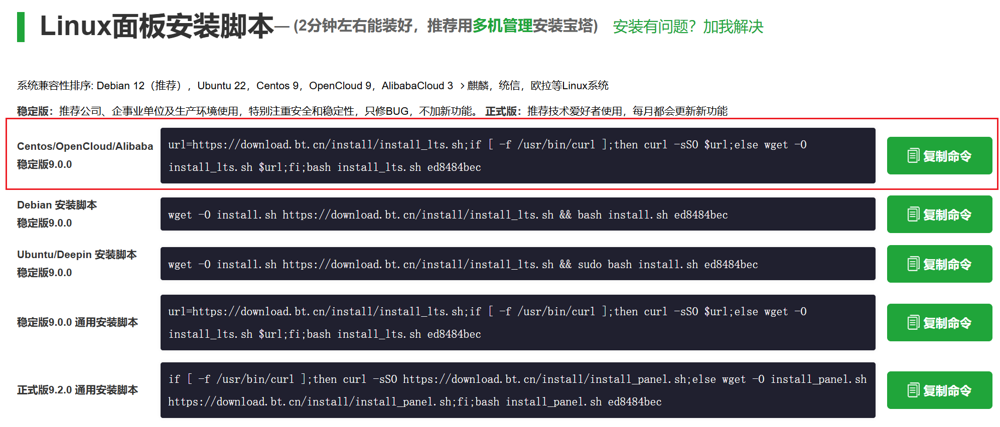

然后在宝塔中安装Nginx

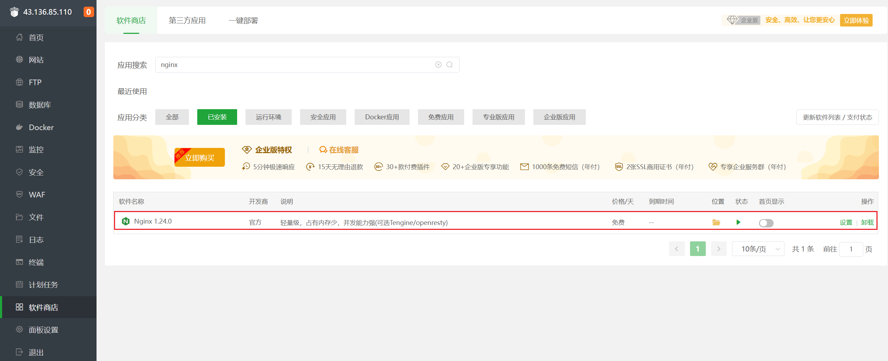

---

## 二、创建图床网站

我们需要通过Nginx设置一个网站，用来展示我们的图片，因为我们刚刚已经通过宝塔安装Nginx，所以在这再设置一个网站：

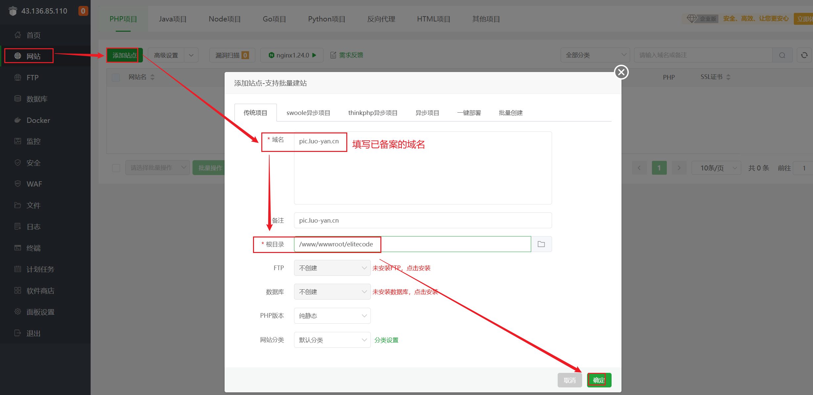

我们这里设置的图床网站地址为：`/www/wwwroot/elitecode`：默认创建的文件没有用可以删掉


---

## 三、服务器创建Git用户

首先，我们看看我们事先有没有创建Git用户，输入命令：

~~~bash
cat /etc/passwd|grep -v nologin|grep -v halt|grep -v shutdown|awk -F":" '{ print $1"|"$3"|"$4 }'|more
~~~


创建`git`用户：

~~~bash
adduser git
~~~

修改git的密码：

~~~bash
passwd git
~~~

然后两次输入git的密码确认后查看git是否添加成功

~~~bash
cd /home && ls -al
~~~


---

## 四、服务器创建图床仓库

切换为git用户

~~~bash
su - git
~~~

初始化叫 `elitecode.git` 的仓库

~~~bash
sudo git init --bare elitecode.git
~~~

看见 `Initialized empty Git repository in /home/git/elitecode.git/` 说明仓库创建成功

此时会多一个项目文件夹：

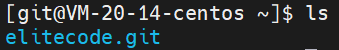

输入以下命令，为git用户赋予权限

~~~bash
chown -R git:git elitecode.git
~~~

进入项目文件夹查看初始化的内容：

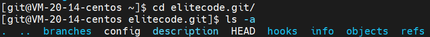

这个时候，我们`图床仓库`就创建好了。

---

## 五、设置hooks

我们设置一下hooks，用于每次本地仓库推送到云端时，自动用最新版本图床图片覆盖至Nginx网站下。我们刚刚Nginx创建的图床网站地址：`/www/wwwroot/elitecode`，所以：

~~~bash
# （当前在项目文件夹内）进入hooks文件夹内
cd hooks
# 创建并编辑钩子
vim post-receive
~~~

敲入：

- `--work-tree`：填Nginx网站地址。
- `--git-dir`：填图床仓库地址。

~~~bash
#!/bin/bash
git --work-tree=/www/wwwroot/elitecode --git-dir=/home/git/elitecode.git checkout -f
~~~

之后提取按，赋予**执行权**：

~~~bash
chmod +x post-receive
~~~

---

## 六、同步本地仓库

刚刚我们已经创建了`图床仓库`，本地也需要安装Git。这里不再赘述。在安装好后，克隆仓库到本地

~~~bash
git clone git@server-IP:/home/git/elitecode.git
~~~

其中，`server-IP`为你服务器的IP或域名：

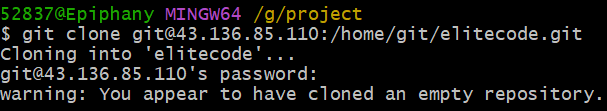

之后，本地就出现这个仓库了：


---

## 七、使用图床

之后，我们对本地仓库加入图片：


之后，我们在终端内操作：

服务器：

~~~bash
chmod 777 /www/wwwroot/elitecode
~~~

本地：

~~~git
# 添加所有文件
git add 
# 创建commit
git commit -m "init".
# 推送到服务器主分支
git push origin HEAD
~~~

---

## 八、创建SSH Key

~~~bash
ssh-keygen -t rsa -C "youremail@example.com"  
~~~

补充：ssh-keygen -t rsa -b 4096 -C "邮箱"：这条命令的目的是为了让本地机器ssh登录远程机器上的GitHub账户无需输入密码。

> ssh-keygen（基于密匙的安全验证）：需要依靠密钥进行安全验证，必须为自己创建一对密钥，并把公用密钥放在需要访问的服务器上。
> -t 即指定密钥的类型。密钥的类型有两种，一种是RSA，一种是DSA。
> -b 指定密钥长度。对于RSA密钥，最小要求768位，默认是2048位。命令中的4096指的是RSA密钥长度为4096位。DSA密钥必须恰好是1024位(FIPS 186-2 标准的要求)。
> -C 表示要提供一个新注释，用于识别这个密钥。“”里面不一定非要填邮箱，可以是任何内容，邮箱仅仅是识别用的key。

如果一切顺利的话，可以在用户主目录里找到.ssh目录，里面有id_rsa和id_rsa.pub两个文件，这两个就是SSH Key的秘钥对，id_rsa是私钥，不能泄露出去，id_rsa.pub是公钥，可以放心地告诉任何人。

---

## 九、Git服务器打开RSA认证

然后就可以去Git服务器上添加你的公钥用来验证你的信息了。在Git服务器上首先需要将/etc/ssh/sshd_config中将RSA认证打开，即：

~~~asp
1.RSAAuthentication yes     
2.PubkeyAuthentication yes     
3.AuthorizedKeysFile  .ssh/authorized_keys
~~~

这里我们可以看到公钥存放在.ssh/authorized_keys文件中。所以我们在/home/git下创建.ssh目录，然后创建authorized_keys文件，并将刚生成的公钥导入进去。

然后再次clone的时候，或者是之后push的时候，就不需要再输入密码了：

~~~bash
cd /home/git
mkdir .ssh
vim authorized_keys
~~~


---

## 十、设置git用户不允许Shell登录

为了安全性，一般都禁止

```bash
vi /etc/passwd
```

 按i进入编辑模式，在最后一行将git用户修改成以下配置

```bash
git:x:1000:1000::/home/git:/usr/bin/git-shell
```

按ESC退出插入模式，输入 “:wq” 保存并且退出vi模式 

---

## 十一、启动CDN加速

但是，这样很危险⚠️：

- **容易暴露服务器IP**
- 加载缓慢

所以，我们需要套上CDN加速。

我们进入CDN控制台，选择`域名管理-添加域名`：


在添加域名时，如果该域名需校验，在域名下方会提示需验证域名归属权，单击**验证方法**；


验证方法中，默认为 DNS 解析验证。 使用 DNS 解析验证的方式，需要您前往该域名的解析服务商，在主域名下添加一个主机记录值为`_cdnauth`的 TXT 记录。


在添加域名后，进入第三步：配置 CNAME 中，在 CNAME 信息内，复制当前域名的 CNAME 值；

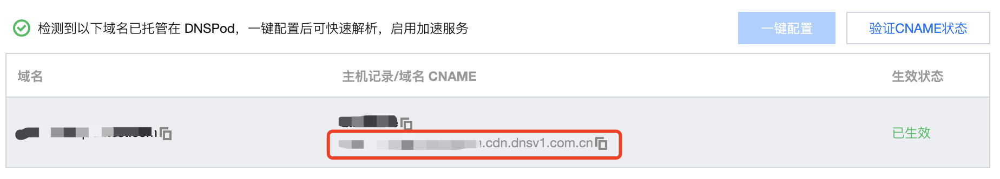

前往 [云解析控制台](https://console.cloud.tencent.com/cns)，找到对应的域名，单击**解析**按钮；


**注意：**同一区域不能同时有 CNAME 记录和A记录，如加速域名已经有A记录，则需将A记录切换为 CNAME 记录。

单击**保存**后，即可完成 CNAME 配置。

即可开启CDN，并可以在CDN控制台看到效果：


检测一下域名对应IP，可以看到是CDN节点服务器IP，而不是我们轻量应用服务器的IP：


注意⚠️：

- CDN可能会有延迟，最长需要72小时才可以全球缓存刷新
- 注意配置图片防盗链，避免流量被恶意脚本消耗殆尽

---

## 十二、CNAME

### 1、如何验证 CNAME 是否生效

1. 在配置完成 CNAME 后，您可以在添加域名的第三步中，单击验证 CNAME 状态，查看当前域名 CNAME 是否生效，如果生效状态显示为已生效，则当前 CNAME 解析已正确生效，域名已启动 CDN 加速，如果当前生效状态未生效，需检查当前是否已完成 CNAME 配置，如果确认当前 CNAME 已正确配置，可能是当前解析生效延迟问题，您也可以选择用第3种方式进行验证。




2. 您可以在控制台的域名管理列表内查看，如果域名的 CNAME 解析已有正确解析提示，表示当前 CDN 域名加速已生效。如果有两条 CNAME 解析的情况下，其中一条生效即可。




3. 您也可以使用 nslookup 或 dig 命令来查看当前域名的解析生效状态。如果您的系统为 Windows 系统，在 Window 系统中打开 cmd 运行程序，以域名`www.test.com`为例，您可以在 cmd 内运行：`nslookup -qt=cname www.test.com`，根据运行的解析结果内，可以查看该域名的 CNAME 信息，如果与腾讯云 CDN 提供的 CNAME 地址一致，即当前 CDN 加速已生效。


如果您的系统为 Mac 系统或 Linux 系统，可以使用 dig 命令进行验证，以域名`www.test.com`为例，您可以在终端内运行命令：`dig www.test.com`，根据运行的解析结果内，可以查看该域名的 CNAME 信息，如果与腾讯云 CDN 提供的 CNAME 地址一致，即当前的 CDN 加速已生效。

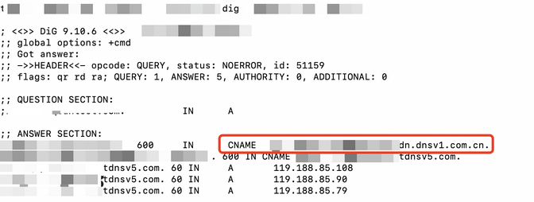

---

### 2、常见问题

#### 域名的 CNAME 已经修改，为什么控制台上还显示未生效？

新增的 CNAME 配置将实时生效，如果是修改 CNAME 配置，根据所设置的 TTL 时长生效时间不一（默认为600s，即10分钟）。如果您已确定完成了正确的 CNAME 配置，可忽略控制台内提示。

#### `example.com`的域名接入后，`www.example.com`有加速效果吗？

没有，`example.com`和`www.example.com`分别属于两个域名，需要在控制台上全部接入才会有 CDN 加速效果。

#### CNAME 域名可以当访问域名使用吗？

不可以，CNAME 域名为腾讯云 CDN 分配给每个域名的专属加速地址，不可以直接作为访问域名使用，需要用户将接入的业务域名 CNAME 到该地址上，访问用户的业务域名，即可有 CDN 加速效果。


---

# Logback

## 一、框架介绍

`Logback` 是基于 `slf4j` 的日志规范实现的框架，性能比之前使用的 `log4j` 要好

官方网站：https://logback.qos.ch/index.html

`logback` 主要分为三个技术模块

- `logback-core`：该模块为其他两个模块提供基础代码，必须有
- `logback-classic`：完整实现了slf4j API的模块。
- `logback-access`：与Tomcat 和 Jetty 等Servlet容器集成，以提供HTTP方法日志功能。

由于`logback` 是一个基于 `slf4j` 的日志框架， `slf4j` 是规范，规范中都是接口，因此需要导入


----

## 二、使用步骤

导入logback依赖

~~~xml
<dependency>
    <groupId>ch.qos.logback</groupId>
    <artifactId>logback-classic</artifactId>
    <version>1.5.6</version>
    <scope>test</scope>
</dependency>
~~~

把配置文件粘贴到resource文件夹下

* 在代码中获取日志对象

  ~~~java
  //getLogger()参数是类对象，类对象就是当前类的字节码文件对象
  //这个日志对象用了修饰符：private static final
  //static：在整个项目中，log日志是唯一的，共享的
  //final：获取完一次后，不想让别人去修改了
  //注意导包导的是slf4j的包
  private static final Logger LOGGER = LoggerFactory.getLogger("类对象");
  ~~~

* 调用方法打印日志

  ~~~java
  //手动写日志
  LOGGER.info("### 执行调用成功了...");
  ~~~

---

## 三、配置文件

Logback日志系统的特性都是通过核心配置文件logback.xml控制的。

在这个里面可以规定日志怎么输出，输出到哪。

**Logback日志输出位置、格式设置**

- 通过logback.xml中的 `<appender>` 标签可以设置输出位置和日志信息的详细格式。
- 通常可以设置两个日志输出位置：控制台、系统文件中

`<pattern>%d{yyyy-MM-dd HH:mm:ss.SSS} [%-100level]  %c [%thread] : %msg%n</pattern>`：-100表示从左显示5个字符宽度

日志级别有 `TRACE, DEBUG, INFO, WARN, ERROR`，最常用的就是 `DEBUG, INFO`，但是最长的是5个字母，因此一般就写5


```xml
<?xml version="1.0" encoding="UTF-8"?>
<!-- 日志级别从低到高分为TRACE < DEBUG < INFO < WARN < ERROR < FATAL，如果设置为WARN，则低于WARN的信息都不会输出 -->
<!-- scan:当此属性设置为true时，配置文件如果发生改变，将会被重新加载，默认值为true -->
<!-- scanPeriod:设置监测配置文件是否有修改的时间间隔，如果没有给出时间单位，默认单位是毫秒。当scan为true时，此属性生效。默认的时间间隔为1分钟。 -->
<!-- debug:当此属性设置为true时，将打印出logback内部日志信息，实时查看logback运行状态。默认值为false。 -->
<configuration scan="true" scanPeriod="10 seconds" debug="false">
    <!-- 设置日志上下文的名称 -->
    <contextName>logback</contextName>
    <!-- property标签用于定义变量：name的值是变量的名称，value的值时变量定义的值。通过定义的值会被插入到logger上下文中。定义变量后，可以使“${}”来使用变量。 -->
    <property name="log.path" value="log"/>
    <!--
        pattern：展示的格式
        %black(%contextName-)：上下文名称，黑色字体
        %red(%d{yyyy-MM-dd HH:mm:ss})：日期，红色字体，格式为年-月-日 时:分:秒
        %green([%thread])：线程名，绿色字体，包含在方括号内
        %highlight(%-5level)：日志级别，高亮显示，左对齐，占5个字符宽度
        %boldMagenta(%logger{36})：日志记录器名称，显示最多36个字符，粗体洋红色
        -：分隔符
        %gray(%msg%n)：日志消息，灰色字体，后跟换行符
        []：如果加上，那么打印出来就有括号，如果不写，那么打印出来就没有括号
    -->
    <property name="console_log_pattern"
              value="%black(%contextName-) %red(%d{yyyy-MM-dd HH:mm:ss}) %green([%thread]) %highlight(%-5level) %boldMagenta(%logger{36}) - %gray(%msg%n)"/>
    <!-- SpringBoot默认的日志格式 -->
    <property name="console_log_springboot_pattern"
              value="%black(%d{yyyy-MM-dd HH:mm:ss.SSS}) %green(%5p) %magenta(${PID:- }) %white(---) %black([%15.15t]) %cyan(%-40.40logger{39}) %black(:) %m%n"/>
    <property name="charset" value="UTF-8"/>
    <!--
        输出到控制台
        name：表示输出位置，后面的class表示哪个类来完成的往控制台输出的工作，即谁去输出的。
	    我们可以按住ctrl不松，点击ConsoleAppender，就可以跳转到这个类了，但是这个类具体怎么做的不需要我们操心，我们只需要知道是它做的就行了。
    -->
    <appender name="console" class="ch.qos.logback.core.ConsoleAppender">
        <!--此日志appender是为开发使用，只配置最底级别（ThresholdFilter），控制台输出的日志级别是大于或等于此级别的日志信息-->
        <!-- 例如：如果此处配置了INFO级别，则后面其他位置即使配置了DEBUG级别的日志，也不会被输出 -->
        <filter class="ch.qos.logback.classic.filter.ThresholdFilter">
            <level>DEBUG</level>
        </filter>
        <encoder>
            <!-- pattern：展示的格式 -->
            <pattern>${console_log_springboot_pattern}</pattern>
        </encoder>
    </appender>

    <!--
        输出到文件，只记录INFO级别信息
        name设置为info_file：表示当前的设置是跟文件相关的，只记录INFO级别信息，后面的class表示是那个类完成的往文件输出的工作
    -->
    <appender name="info_file" class="ch.qos.logback.core.rolling.RollingFileAppender">
        <!--指定日志文件拆分和压缩规则-->
        <rollingPolicy class="ch.qos.logback.core.rolling.TimeBasedRollingPolicy">
            <!--
                fileNamePattern：指定日志文件的命名模式
                ${log.path}：日志文件的路径变量
                /roll_info/：日志文件存储的子目录
                logback.%d{yyyy-MM-dd}.log：日志文件名，包含日期格式（年-月-日）；其中的日期格式决定了滚动的时间间隔，这里代表每天生成一个新的日志文件
                如果fileNamePattern 指定为 C:/code/itheima-data2-%d{yyyy-MMdd}.log%i.gz 表示：

            -->
            <fileNamePattern>${log.path}/roll_info/logback.%d{yyyy-MM-dd}.log</fileNamePattern>
            <!--如果格式为压缩包，那么需要指定文件拆分大小-->
            <!-- <maxFileSize>1MB</maxFileSize> -->
        </rollingPolicy>
        <!--指定日志文件拆分和压缩规则-->
        <rollingPolicy
                class="ch.qos.logback.core.rolling.SizeAndTimeBasedRollingPolicy">
            <!--通过指定压缩文件名称，来确定分割文件方式-->
            <!--
                 路径: 日志文件存储在 C:/code/ 目录下。
                 文件名: log-info-%d{yyyy-MMdd}.log，其中 %d{yyyy-MMdd} 表示按年和月-日格式生成新的日志文件。
                 序号: %i 表示在同一天内如果日志文件需要滚动（例如超出最大文件大小限制），会增加一个序号。
                 压缩: .gz 表示日志文件会被压缩成 gzip 格式。
            -->
            <fileNamePattern>${log.path}/info/log-info-%d{yyyy-MMdd}.log%i.gz</fileNamePattern>
            <!--文件拆分大小-->
            <maxFileSize>1MB</maxFileSize>
        </rollingPolicy>
        <encoder>
            <pattern>${console_log_pattern}</pattern>
            <charset>${charset}</charset>
        </encoder>
        <!-- 日志记录器的滚动策略，按日期，按大小记录 -->
        <rollingPolicy class="ch.qos.logback.core.rolling.TimeBasedRollingPolicy">
            <!-- 每天日志归档路径以及格式 -->
            <fileNamePattern>${log.path}/info/log-info-%d{yyyy-MM-dd}.%i.log</fileNamePattern>
            <timeBasedFileNamingAndTriggeringPolicy class="ch.qos.logback.core.rolling.SizeAndTimeBasedFNATP">
                <maxFileSize>100MB</maxFileSize>
            </timeBasedFileNamingAndTriggeringPolicy>
            <!--日志文件保留天数-->
            <maxHistory>15</maxHistory>
        </rollingPolicy>
        <!-- 如果超过10MB就删除 -->
        <triggeringPolicy class="ch.qos.logback.core.rolling.SizeBasedTriggeringPolicy">
            <maxFileSize>10MB</maxFileSize>
        </triggeringPolicy>
        <!-- 此日志文件只记录info级别的 -->
        <filter class="ch.qos.logback.classic.filter.LevelFilter">
            <level>INFO</level>
            <onMatch>ACCEPT</onMatch>
            <onMismatch>DENY</onMismatch>
        </filter>
    </appender>
    <!--输出到文件,只记录WARN级别信息-->
    <appender name="warn_file" class="ch.qos.logback.core.rolling.RollingFileAppender">
    </appender>
    <!--输出到文件,只记录ERROR级别信息-->
    <appender name="error_file" class="ch.qos.logback.core.rolling.RollingFileAppender">
    </appender>

    <!--
    root节点是必选节点，用来指定最基础的日志输出级别，只有一个level属性
    level:用来设置打印级别，大小写无关：TRACE, DEBUG, INFO, WARN, ERROR, ALL 和 OFF，默认是DEBUG。所有未单独配置的日志记录器都会使用这个级别。
    <root>可以包含零个或多个<appender-ref>元素，标识这个输出位置将会被<root>节点的 level 属性所设置的日志级别控制。即：console、info_file、warn_file、error_file）会根据 <root> 节点的日志级别来决定哪些日志信息被输出。
    换句话说，任何低于 INFO 级别的日志（如 DEBUG、TRACE）都不会被输出到这些位置。
    -->
    <root level="info">
        <appender-ref ref="console"/>
        <appender-ref ref="info_file"/>
        <appender-ref ref="warn_file"/>
        <appender-ref ref="error_file"/>
    </root>

    <!--
        <logger>用来设置某一个包或者具体的某一个类的日志打印级别、以及指定<appender>。
        <logger>仅有一个name属性，
        一个可选的level和一个可选的additivity属性。
        name:用来指定受此logger约束的某一个包或者具体的某一个类。
        level:用来设置打印级别，大小写无关：TRACE, DEBUG, INFO, WARN, ERROR, ALL 和 OFF，
              如果未设置此属性，那么当前logger将会继承上级的级别。
                    包层次结构: 日志记录器遵循 Java 包的层次结构。例如，com.example.service 的上级是 com.example，再上级是 com。
                    根记录器: 如果没有更具体的父级配置，则 <root> 记录器是所有日志记录器的最终上级。
        additivity:是否向上级logger传递打印信息,默认是true，此时可能会造成重复打印，因此建议设置为false
    -->
    <!-- 使用mybatis的时候，sql语句是debug下才会打印，而这里我们只配置了info，所以想要查看sql语句的话，有以下两种操作：
         第一种把<root level="INFO">改成<root level="DEBUG">这样就会打印sql，不过这样日志那边会出现很多其他消息
         第二种就是单独给mapper下目录配置DEBUG模式，代码如下，这样配置sql语句会打印，其他还是正常DEBUG级别：
    -->
    <!--可以输出项目中的debug日志，包括mybatis的sql日志-->
    <logger name="cn.luoyan.elitecode.mapper" level="DEBUG" additivity="false">
        <appender-ref ref="console"/>
        <appender-ref ref="info_file"/>
    </logger>

    <!-- 如果多环境开发可以用springProfile -->
    <!--开发环境:打印控制台-->
    <springProfile name="dev">
        <!--可以输出项目中的debug日志，包括mybatis的sql日志-->
        <logger name="com.hyh.logback.web" level="DEBUG">
            <appender-ref ref="console"/>
        </logger>

        <root level="INFO">
            <appender-ref ref="console"/>
        </root>
    </springProfile>
</configuration>
```

----

## 四、日志级别

为什么要有日志级别？因为我们会根据不同的情况来选择不同的日志级别进行输出。

TRACE太小了，一般不会用到它的，我们从第二个开始看。

`DEBUGB` 表示在调试的时候要用到。

`INFO` 表示要记录一些用户的信息，就要用到它。

`WARN` 表示代码中出现一些警告的时候，要用到它。

`ERROR` 代码出错了就要用到这个。

用到最多的是 `DEBUG、INFO`

```
TRACE < DEBUG < INFO < WARN < ERROR
```

作用：用于控制系统中哪些日志级别是可以输出的，只输出级别不低于设定级别的日志信息。

还有两个特殊的：

​	ALL：输出所有日志

​	OFF：关闭所有日志

如下，如果写的是INFO，表示只输出级别不低于设定级别的日志信息，即大于等于自己（INFO、WARN、ERROR）

但一般这里写 `ALL` 就行了，表示打印所有

~~~xml
<root level="INFO">
    <appender-ref ref="CONSOLE"/>
    <appender-ref ref="FILE" />
</root>
~~~

PS：在写的时候大写小写都是可以的，因为在写的时候是忽略大小写的。

---

## 五、标签介绍

### 1）`configuration`

如前所述，如果在 class path中找到 logback-test.xml 或 logback.xml 的文件，则 logback 将尝试使用文件进行自我配置。这是一个等效于我们刚刚由 BasicConfigurator 建立的配置文件 明显。

配置文件的最基本结构可以描述为 `<configuration>` 元素，包含零个或多个 `<appender>` 元素，后跟零个或多个 `<logger>` 元素，后跟最多一个 `<root>` 元素。下图说明了此基本结构。


---

### 2）`<property>`

变量可以在配置文件本身中一次定义一个，也可以从外部属性文件或外部资源批发加载。由于历史原因，用于定义变量的 XML 元素是 `<property>`，尽管在 logback 1.0.7 及更高版本中，元素 `<variable> ` 可以互换使用。

---

### 3）`<appender>`

附加程序配置了 `<appender>` 元素，它接受两个强制属性 name 和 class。 这 name 属性指定 appender 的名称，而 class 属性指定要实例化的 appender 类的完全限定名称。`<appender>` 元素可以包含零个或一个 `<layout>` 元素、零个或多个 `<encoder>` 元素和零个或多个 `<filter>` 元素。除了这三个公共元素之外，`<appender>` 元素可以包含与 appender 类的 JavaBean 属性相对应的任意数量的元素。无缝支持给定 logback 组件的任何属性是 Joran 的主要优势之一，如后面的章节所述。这下图说明了常见结构。请注意，下图中未显示对属性的支持。


`<layout>` 元素采用必需的 class 属性，指定要实例化的布局类的完全限定名称。与 `<appender>` 元素一样， `<layout>` 可能包含与布局实例的属性对应的其他元素。由于这是一种常见的情况，如果布局类是 PatternLayout，那么可以省略 class 属性，就像默认类映射所指定的那样规则。

`<encoder>` 元素采用必需的类属性，该属性指定要实例化的编码器类的完全限定名称。由于这是一种常见的情况，如果 encoder 类是 PatternLayoutEncoder，那么可以省略 class 属性，就像默认类映射所指定的那样规则。

案例：

~~~xml
<configuration>

  <appender name="FILE" class="ch.qos.logback.core.FileAppender">
    <file>myApp.log</file>

    <encoder>
      <pattern>%date %level [%thread] %logger{10} [%file:%line] -%kvp- %msg%n</pattern>
    </encoder>
  </appender>

  <appender name="STDOUT" class="ch.qos.logback.core.ConsoleAppender">
    <encoder>
      <pattern>%kvp %msg%n</pattern>
    </encoder>
  </appender>

  <root level="debug">
    <appender-ref ref="FILE" />
    <appender-ref ref="STDOUT" />
  </root>
</configuration>
~~~

这个配置脚本定义了两个 appender，分别是 FILE 和 STDOUT。

- **FILE appender**：将日志记录到名为 `myApp.log` 的文件中。这个 appender 使用 `PatternLayoutEncoder` 进行编码，输出的信息包括日期、日志级别、线程名、Logger 名称、文件名和行号、键值对（kvp）、日志消息以及换行符。
- **STDOUT appender**：将日志输出到控制台。它的编码器只输出日志消息字符串和换行符。

在 `<root>` 元素中，日志级别被设置为 `debug`，并且引用了两个 appender：FILE 和 STDOUT。这意味着所有日志都会同时写入文件和控制台。

这些 appenders 通过在 `<appender-ref>` 元素中按名称引用，附加到根 Logger 上。注意，每个 appender 都有自己的编码器。编码器通常不设计为多个 appender 共享。布局也是如此。因此，Logback 配置文件不提供任何语法手段来共享编码器或布局。

---

### 4）PatternLayoutEncoder

`PatternLayoutEncoder` 是 Logback 中用于格式化日志输出的组件。它通过指定的模式字符串（pattern）来定义日志消息的格式。每个模式包含特定的转换符，用于插入不同的日志信息，如日期、日志级别、线程名等。

常用转换符：

- `%date`：日志事件的时间和日期。
- `%level`：日志级别（如 DEBUG、INFO）。
- `%thread`：线程名称。
- `%logger`：Logger 名称。
- `%file`：日志请求所在的文件名。
- `%line`：日志请求所在的行号。
- `%msg`：日志消息。
- `%n`：换行符。

通过这些转换符，用户可以自定义日志的输出格式，使其符合特定需求。

---

### 5）配置 `Logger` 或 `<logger>` 元素

Logger 是通过 `<logger>` 元素配置的。一个 `<logger>` 元素必须包含一个名称属性（name），可以选择包含一个级别属性（level）和一个可选的可加性属性（additivity），其值可以是 true 或 false。级别属性的值可以是大小写不敏感的字符串：TRACE、DEBUG、INFO、WARN、ERROR、ALL 或 OFF。特殊的大小写不敏感值 INHERITED 或其同义词 NULL 会强制 Logger 从其层次结构的上级继承级别。如果你设置了 Logger 的级别，后来决定应该继承其级别，这会很有用。

例如

~~~xml
<!-- 系统模块日志级别控制  -->
<logger name="com.ruoyi" level="info" />
<!-- Spring日志级别控制  -->
<logger name="org.springframework" level="warn" />
<!--系统用户操作日志-->
<logger name="sys-user" level="info">
    <appender-ref ref="sys-user"/>
</logger>
~~~

这两个 `<logger>` 标签的效果是为特定的 Java 包设置日志级别：

1. **`<logger name="com.ruoyi" level="info" />`**：

   - 将 `com.ruoyi` 包及其子包的日志级别设置为 `INFO`。
   - 这意味着只有 `INFO` 级别及以上的日志（INFO、WARN、ERROR）会被记录。

2. **`<logger name="org.springframework" level="warn" />`**：

   - 将 `org.springframework` 包及其子包的日志级别设置为 `WARN`。
   - 这意味着只有 `WARN` 级别及以上的日志（WARN、ERROR）会被记录。

3. **`<logger name="sys-user" level="info">`**：

   - 定义了一个 Logger，专门用于处理与 `sys-user` 相关的日志。

   - 该 Logger 的日志级别设置为 `INFO`，意味着它会记录 `INFO` 级别及以上的日志（INFO、WARN、ERROR）。

   - **`<appender-ref ref="sys-user"/>`**：

     - 将名为 `sys-user` 的 appender 附加到这个 Logger。

     - 这个 appender 负责处理 `sys-user` Logger 生成的日志，例如将日志写入特定文件或输出到其他目标。

     - 当代码中使用 `Logger` 的名称为 `sys-user` 时，这个配置会被触发。

       例如：`Logger logger = LoggerFactory.getLogger("sys-user");`

----

### 6）`<root>`

`<root>` 元素用于配置根 Logger。它支持一个属性，即 `level` 属性。由于可加性标志不适用于根 Logger，所以不允许其他属性。此外，因为根 Logger 已经命名为 "ROOT"，所以也不允许使用 `name` 属性。`level` 属性的值可以是大小写不敏感的字符串：TRACE、DEBUG、INFO、WARN、ERROR、ALL 或 OFF。注意，根 Logger 的级别不能设置为 INHERITED 或 NULL。

例如：

~~~xml
<!--系统操作日志-->
<root level="info">
    <appender-ref ref="file_info" />
    <appender-ref ref="file_error" />
</root>
~~~

这个配置定义了根 Logger 的行为：

1. **`<root level="info">`**：
   - 设置根 Logger 的日志级别为 `INFO`。
   - 这意味着只有 `INFO` 级别及以上（INFO、WARN、ERROR）的日志会被记录。
2. **`<appender-ref ref="file_info" />`**：
   - 将名为 `file_info` 的 appender 附加到根 Logger。
   - `file_info` appender 负责处理符合条件的日志消息的输出，通常是写入文件。
3. **`<appender-ref ref="file_error" />`**：
   - 将名为 `file_error` 的 appender 也附加到根 Logger。
   - `file_error` appender 通常用于处理错误级别的日志，可能记录到另一个文件或其他输出目标。

整体效果：

- 所有 `INFO` 级别及以上的日志会通过 `file_info` 和 `file_error` 两个 appender 处理。
- 这两个 appender 可以将不同级别的日志输出到不同的目标，便于日志管理和分析。


---

# SpringBoot整合Logback日志框架

## 一、引入

SpringBoot使用 [Commons Logging](https://commons.apache.org/logging) 进行所有内部日志的记录，但默认配置也提供了对常用日志的支持，如 [Java Util Logging](https://docs.oracle.com/javase/8/docs/api//java/util/logging/package-summary.html)，[Log4J2](https://logging.apache.org/log4j/2.x/)，和[Logback](https://logback.qos.ch/). 每种logger都可以通过配置使用控制台或文件输出日志内容。

Logback 是log4j框架的作者开发的新一代日志框架，它效率更高、能够适应诸多的运行环境，同时天然支持SLF4J。

假设你使用starter启动创建SpringBoot应用，则默认已经导入了spring-boot-starter-logging的依赖，相继也就导入了logback所需要的依赖。

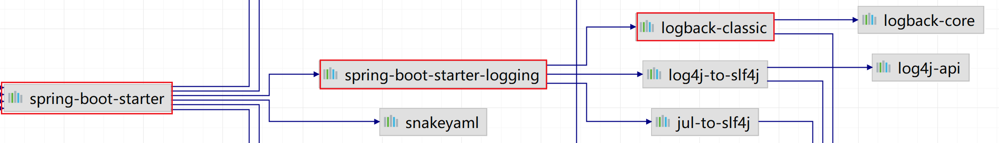

---

## 二、默认日志格式

当我们启动SpringBoot应用时，控制台将会显示INFO级别的日志输出。

在图中，Logger（日志记录器）是负责记录日志信息的组件。Logger 名是日志记录器的唯一标识符，用于区分不同源的日志信息。具体示例如下：

- `c.h.l.SpringBootLogbackApplication`
- `e.DevToolsPropertyDefaultsPostProcessor`

这些Logger名通常包括包名和类名，通过这种命名方式，可以很容易地辨别日志的来源。

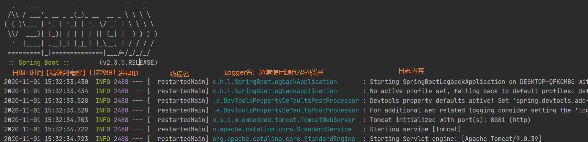

可以看到，输出内容如下：

- 日期和时间，精确到毫秒级别。
- 日志级别：INFO，【日志级别默认从高到低：ERROR，WARN，INFO，DEBUG，TRACE】。
- 进程ID
- 分隔符：来标识实际日志消息的开始。
- 线程名：用方括号括起来(在控制台输出时可能被截断)。
- 日志记录器名称:这通常是源类名称(通常缩写)。
- 日志信息

PS：logback是没有FATAL级别的，它对应的就是ERROR。

---

## 三、控制台输出

默认的日志配置就是将日志信息**显示到控制台**，默认情况下，**将会显示INFO级别以上**的日志信息。你还可以通过使用`--debug`标志启动debug模式。

```shell
java -jar myapp.jar --debug
```

使用IDEA操作可以编辑Program arguments：--debug。

在application.properties中配置debug=true同样也可以将日志级别调整到DEBUG。

---

## 四、文件输出

默认情况下，SpringBoot的日志只会输出到控制台，如果你还想输出到文件中，你需要配置`logging.file.name`和`logging.file.path`两个属性。

下面这个表格展示如何组合使用`logging.*`来达到理想的效果：

| `logging.file.name` | `logging.file.path` | Example  | Description                               |
| :------------------ | :------------------ | :------- | :---------------------------------------- |
| *(none)*            | *(none)*            |          | 只会输出到控制台                          |
| 指定文件            | *(none)*            | `my.log` | 写入指定的日志文件在当前项目目录下        |
| *(none)*            | 指定目录            | `log`    | 在当前项目下的log目录，写入spring.log文件 |

日志文件达到10 MB时会触发滚动策略【切分】，默认情况下会记录INFO以上级别的信息。 可以使用`logging.file.max-size`属性更改大小限制。 除非已设置`logging.file.max-history`属性，否则默认情况下**将保留最近7天的轮转日志文件**。 可以使用`logging.file.total-size-cap`限制日志归档文件的总大小。 当日志归档的总大小超过该阈值时，将删除备份。 要在应用程序启动时强制清除日志存档，请使用`logging.file.clean-history-on-start`属性。

---

## 五、日志级别

可以使用logging.level设置所有受支持的日志记录器的级别。

```properties
logging:
  level:
    root: warn
```

这里是用的root级别，即项目的所有日志，我们也可以使用package级别，即指定包下使用相应的日志级别，这里我们可以改动root还是INFO级别，将指定包下的日志级别设置为其它级别

```yml
logging:
  level:
    root: info
    com.fastech.framework: warn
    com.fastech.framework.mqtt.service: debug
    org.apache.hadoop.util.Shell: OFF
    org.mongodb.driver.*: OFF
    org.apache.zookeeper.ZooKeeper: OFF
```

---

## 六、日志组

使用logging.group能够将相关的logger组合在一起统一管理日志级别等配置。使用方法如下：

假设定义了group为tomcat：

```properties
logging.group.tomcat=org.apache.catalina, org.apache.coyote, org.apache.tomcat
```

一旦这样定义之后，就可以仅仅通过一行配置，完成相关三个logger的级别配置：

```properties
logging.level.tomcat=TRACE
```

SpringBoot预定义了两个开箱即用的日志组：

| Name | Loggers                                                      |
| :--- | :----------------------------------------------------------- |
| web  | `org.springframework.core.codec`, `org.springframework.http`, `org.springframework.web`, `org.springframework.boot.actuate.endpoint.web`, `org.springframework.boot.web.servlet.ServletContextInitializerBeans` |
| sql  | `org.springframework.jdbc.core`, `org.hibernate.SQL`, `org.jooq.tools.LoggerListener` |

```properties
# pre-defined
logging.level.web=debug
logging.level.sql=debug
```

----

## 七、自定义日志格式

在application.yml中添加

```yaml
logging:
  pattern:
    console: "%clr(%d{MM-dd HH:mm:ss.SSS}){faint} %clr(${server.name} ${LOG_LEVEL_PATTERN}) %clr(${PID:- }){magenta} %clr([%5.5t]){faint} %clr(%-20.20logger{39} %5.5line){cyan} %clr(:){faint} %m%n${LOG_EXCEPTION_CONVERSION_WORD:%wEx}}"
    file: "%clr(%d{MM-dd HH:mm:ss.SSS}){faint} %clr(${server.name} ${LOG_LEVEL_PATTERN:-%5p}) %clr(${PID:- }){magenta} %clr([%5.5t]){faint} %clr(%-20.20{39} %5.5line){cyan} %clr(:){faint} %m%n${LOG_EXCEPTION_CONVERSION_WORD:%wEx}}"
1234
```

**logging.pattern.console**

该属性用于定制日志控制台输出格式。

**logging.pattern.file**

该属性用于定制日志文件输出格式。

上述配置的编码中，对应符号的含义如下

```xml
%d{HH:mm:ss.SSS}——日志输出时间
%thread——输出日志的进程名字，这在Web应用以及异步任务处理中很有用
%-5level——日志级别，并且使用5个字符靠左对齐
%logger- ——日志输出者的名字
%msg——日志消息
%n——平台的换行符
123456
```

---

## 八、自定义log配置

由于日志服务一般都在ApplicationContext创建前就初始化了，它并不是必须通过Spring的配置文件控制。因此通过系统属性和传统的Spring Boot外部配置文件依然可以很好的支持日志控制和管理。

Spring Boot默认使用LogBack日志系统，你可以根据你的日志系统，按照下面表格的定义规则，选择定义对应的日志配置：

| Logging System          | Customization                                                |
| :---------------------- | :----------------------------------------------------------- |
| Logback                 | `logback-spring.xml`, `logback-spring.groovy`, `logback.xml`, or `logback.groovy` |
| Log4j2                  | `log4j2-spring.xml` or `log4j2.xml`                          |
| JDK (Java Util Logging) | `logging.properties`                                         |

SpringBoot官方推荐使用带有`-spring`的文件名作为配置，如`logback-spring.xml`而不是`logback.xml`。

这样命名的好处在于：因为标准的`logback.xml`配置文件加载得太早，所以不能在其中使用扩展，需要使用`logback-spring.xml`。

> 当然上面是默认的命名规则，如果你想自定义xml的名称，自定义路径，可以通过logging.config属性配置：`logging.config=classpath:logging-config.xml`

---

## 九、logback-spring.xml自定义

接下来分享一份配置十分详细的logback.xml配置，参照注释，应该就能够掌握xml的定义。

```xml
<?xml version="1.0" encoding="UTF-8"?>
<!-- 日志级别从低到高分为TRACE < DEBUG < INFO < WARN < ERROR < FATAL，如果设置为WARN，则低于WARN的信息都不会输出 -->
<!-- scan:当此属性设置为true时，配置文件如果发生改变，将会被重新加载，默认值为true -->
<!-- scanPeriod:设置监测配置文件是否有修改的时间间隔，如果没有给出时间单位，默认单位是毫秒。当scan为true时，此属性生效。默认的时间间隔为1分钟。 -->
<!-- debug:当此属性设置为true时，将打印出logback内部日志信息，实时查看logback运行状态。默认值为false。 -->
<configuration scan="true" scanPeriod="10 seconds" debug="false">
    <!-- 设置日志上下文的名称 -->
    <contextName>logback</contextName>
    <!-- property标签用于定义变量：name的值是变量的名称，value的值时变量定义的值。通过定义的值会被插入到logger上下文中。定义变量后，可以使“${}”来使用变量。 -->
    <property name="log.path" value="log"/>
    <!--
        pattern：展示的格式
        %black(%contextName-)：上下文名称，黑色字体
        %red(%d{yyyy-MM-dd HH:mm:ss})：日期，红色字体，格式为年-月-日 时:分:秒
        %green([%thread])：线程名，绿色字体，包含在方括号内
        %highlight(%-5level)：日志级别，高亮显示，左对齐，占5个字符宽度
        %boldMagenta(%logger{36})：日志记录器名称，显示最多36个字符，粗体洋红色
        -：分隔符
        %gray(%msg%n)：日志消息，灰色字体，后跟换行符
        []：如果加上，那么打印出来就有括号，如果不写，那么打印出来就没有括号
    -->
    <property name="console_log_pattern"
              value="%black(%contextName-) %red(%d{yyyy-MM-dd HH:mm:ss}) %green([%thread]) %highlight(%-5level) %boldMagenta(%logger{36}) - %gray(%msg%n)"/>
    <!-- SpringBoot默认的日志格式 -->
    <property name="console_log_springboot_pattern"
              value="%black(%d{yyyy-MM-dd HH:mm:ss.SSS}) %green(%5p) %magenta(${PID:- }) %white(---) %black([%15.15t]) %cyan(%-40.40logger{39}) %black(:) %m%n"/>
    <property name="charset" value="UTF-8"/>
    <!--
        输出到控制台
        name：表示输出位置，后面的class表示哪个类来完成的往控制台输出的工作，即谁去输出的。
	    我们可以按住ctrl不松，点击ConsoleAppender，就可以跳转到这个类了，但是这个类具体怎么做的不需要我们操心，我们只需要知道是它做的就行了。
    -->
    <appender name="console" class="ch.qos.logback.core.ConsoleAppender">
        <!--此日志appender是为开发使用，只配置最底级别（ThresholdFilter），控制台输出的日志级别是大于或等于此级别的日志信息-->
        <!-- 例如：如果此处配置了INFO级别，则后面其他位置即使配置了DEBUG级别的日志，也不会被输出 -->
        <filter class="ch.qos.logback.classic.filter.ThresholdFilter">
            <level>DEBUG</level>
        </filter>
        <encoder>
            <!-- pattern：展示的格式 -->
            <pattern>${console_log_springboot_pattern}</pattern>
        </encoder>
    </appender>

    <!--
        输出到文件，只记录INFO级别信息
        name设置为info_file：表示当前的设置是跟文件相关的，只记录INFO级别信息，后面的class表示是那个类完成的往文件输出的工作
    -->
    <appender name="file_info" class="ch.qos.logback.core.rolling.RollingFileAppender">
        <!--指定日志文件拆分和压缩规则-->
        <rollingPolicy class="ch.qos.logback.core.rolling.TimeBasedRollingPolicy">
            <!--
                fileNamePattern：指定日志文件的命名模式
                ${log.path}：日志文件的路径变量
                /roll_info/：日志文件存储的子目录
                logback.%d{yyyy-MM-dd}.log：日志文件名，包含日期格式（年-月-日）；其中的日期格式决定了滚动的时间间隔，这里代表每天生成一个新的日志文件
                如果fileNamePattern 指定为 C:/code/itheima-data2-%d{yyyy-MMdd}.log%i.gz 表示：

            -->
            <fileNamePattern>${log.path}/roll_info/logback.%d{yyyy-MM-dd}.log</fileNamePattern>
            <!--如果格式为压缩包，那么需要指定文件拆分大小-->
            <!-- <maxFileSize>1MB</maxFileSize> -->
        </rollingPolicy>
        <!--指定日志文件拆分和压缩规则-->
        <rollingPolicy
                class="ch.qos.logback.core.rolling.SizeAndTimeBasedRollingPolicy">
            <!--通过指定压缩文件名称，来确定分割文件方式-->
            <!--
                 路径: 日志文件存储在 C:/code/ 目录下。
                 文件名: log-info-%d{yyyy-MMdd}.log，其中 %d{yyyy-MMdd} 表示按年和月-日格式生成新的日志文件。
                 序号: %i 表示在同一天内如果日志文件需要滚动（例如超出最大文件大小限制），会增加一个序号。
                 压缩: .gz 表示日志文件会被压缩成 gzip 格式。
            -->
            <fileNamePattern>${log.path}/info/log-info-%d{yyyy-MMdd}.log%i.gz</fileNamePattern>
            <!--文件拆分大小-->
            <maxFileSize>1MB</maxFileSize>
        </rollingPolicy>
        <encoder>
            <pattern>${console_log_pattern}</pattern>
            <charset>${charset}</charset>
        </encoder>
        <!-- 日志记录器的滚动策略，按日期，按大小记录 -->
        <rollingPolicy class="ch.qos.logback.core.rolling.TimeBasedRollingPolicy">
            <!-- 每天日志归档路径以及格式 -->
            <fileNamePattern>${log.path}/info/log-info-%d{yyyy-MM-dd}.%i.log</fileNamePattern>
            <timeBasedFileNamingAndTriggeringPolicy class="ch.qos.logback.core.rolling.SizeAndTimeBasedFNATP">
                <maxFileSize>100MB</maxFileSize>
            </timeBasedFileNamingAndTriggeringPolicy>
            <!--日志文件保留天数-->
            <maxHistory>15</maxHistory>
        </rollingPolicy>
        <!-- 如果超过10MB就删除 -->
        <triggeringPolicy class="ch.qos.logback.core.rolling.SizeBasedTriggeringPolicy">
            <maxFileSize>10MB</maxFileSize>
        </triggeringPolicy>
        <!-- 此日志文件只记录info级别的 -->
        <filter class="ch.qos.logback.classic.filter.LevelFilter">
            <level>INFO</level>
            <onMatch>ACCEPT</onMatch>
            <onMismatch>DENY</onMismatch>
        </filter>
    </appender>
    <!--输出到文件,只记录WARN级别信息-->
    <appender name="warn_file" class="ch.qos.logback.core.rolling.RollingFileAppender">
    </appender>
    <!--输出到文件,只记录ERROR级别信息-->
    <appender name="error_file" class="ch.qos.logback.core.rolling.RollingFileAppender">
    </appender>

    <!--
    root节点是必选节点，用来指定最基础的日志输出级别，只有一个level属性
    level:用来设置打印级别，大小写无关：TRACE, DEBUG, INFO, WARN, ERROR, ALL 和 OFF，默认是DEBUG。所有未单独配置的日志记录器都会使用这个级别。
    <root>可以包含零个或多个<appender-ref>元素，标识这个输出位置将会被<root>节点的 level 属性所设置的日志级别控制。即：console、info_file、warn_file、error_file）会根据 <root> 节点的日志级别来决定哪些日志信息被输出。
    换句话说，任何低于 INFO 级别的日志（如 DEBUG、TRACE）都不会被输出到这些位置。
    -->
    <root level="info">
        <appender-ref ref="console"/>
        <appender-ref ref="info_file"/>
        <appender-ref ref="warn_file"/>
        <appender-ref ref="error_file"/>
    </root>

    <!--
        <logger>用来设置某一个包或者具体的某一个类的日志打印级别、以及指定<appender>。
        <logger>仅有一个name属性，
        一个可选的level和一个可选的additivity属性。
        name:用来指定受此logger约束的某一个包或者具体的某一个类。
        level:用来设置打印级别，大小写无关：TRACE, DEBUG, INFO, WARN, ERROR, ALL 和 OFF，
              如果未设置此属性，那么当前logger将会继承上级的级别。
                    包层次结构: 日志记录器遵循 Java 包的层次结构。例如，com.example.service 的上级是 com.example，再上级是 com。
                    根记录器: 如果没有更具体的父级配置，则 <root> 记录器是所有日志记录器的最终上级。
        additivity:是否向上级logger传递打印信息,默认是true，此时可能会造成重复打印，因此建议设置为false
    -->
    <!-- 使用mybatis的时候，sql语句是debug下才会打印，而这里我们只配置了info，所以想要查看sql语句的话，有以下两种操作：
         第一种把<root level="INFO">改成<root level="DEBUG">这样就会打印sql，不过这样日志那边会出现很多其他消息
         第二种就是单独给mapper下目录配置DEBUG模式，代码如下，这样配置sql语句会打印，其他还是正常DEBUG级别：
    -->
    <!--可以输出项目中的debug日志，包括mybatis的sql日志-->
    <logger name="cn.luoyan.elitecode.mapper" level="DEBUG" additivity="false">
        <appender-ref ref="console"/>
        <appender-ref ref="info_file"/>
    </logger>

    <!-- 如果多环境开发可以用springProfile -->
    <!--开发环境:打印控制台-->
    <springProfile name="dev">
        <!--可以输出项目中的debug日志，包括mybatis的sql日志-->
        <logger name="com.hyh.logback.web" level="DEBUG">
            <appender-ref ref="console"/>
        </logger>

        <root level="INFO">
            <appender-ref ref="console"/>
        </root>
    </springProfile>
</configuration>
```

最终的效果，会在项目路径下生成日志文件：`/log/info/log-info-2020-11-01.0.log`，并且日志文件的策略也在xml中定义。

控制台打印信息，如下图所示：


---

# 使用IDEA查看Maven依赖关系

## 一、查看

在要分析的模块的 **pom.xml** 上 `单击右键 ——> Show Diagram ——> Project Modules`

- **Show Diagram...**: 可能会打开一个完整的窗口或界面来显示图表，快捷键是 `Ctrl+Alt+Shift+U`。
- **Show Diagram Popup...**: 可能会以弹出窗口的形式显示图表，快捷键是 `Ctrl+Alt+U`。
- **Show Local Changes as UML**: 以UML（统一建模语言）格式显示本地更改，快捷键是 `Ctrl+Alt+Shift+D`。

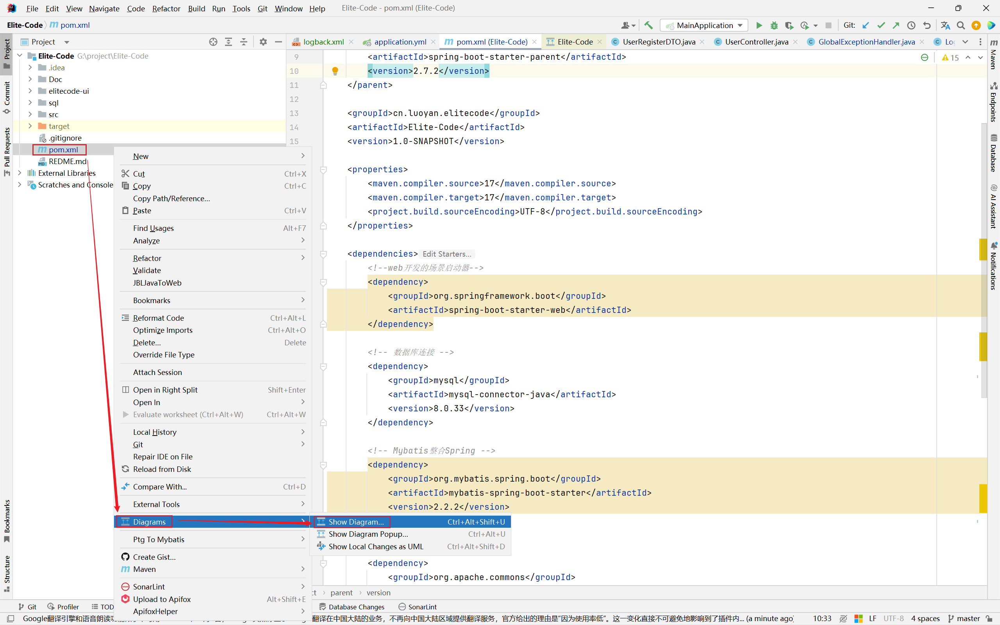

依赖关系如下

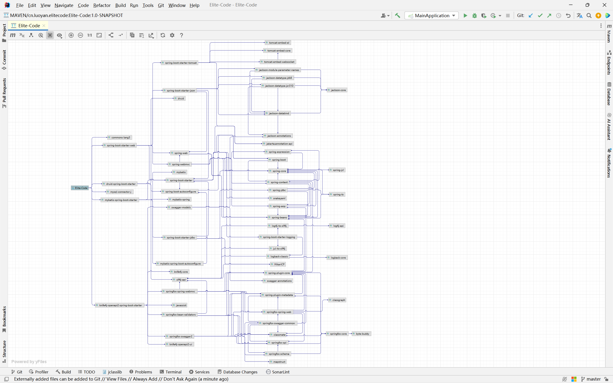

---

## 二、设置

但是这个图很乱很杂，我们需要对它进行调整

`鼠标右击 ——> Layout ——> Orthoganal ——> Hierachic Groups`

- **Compact**：紧凑布局，将图表中的元素尽量靠近排列，以减少图表占用的空间。
- **Hierarchic Groups**：层次化分组布局，根据层次结构对元素进行分组和排列，通常用于表示结构化的数据。
- **Hierarchic**：层次化布局，以层次结构排列元素，适合展示有上下级关系的内容。
- **Orthogonal Groups**：正交分组布局，以直角线连接分组的元素，保持清晰的结构。
- **Series Parallel**：串并联布局，适用于表示串联和并联关系的图表。
- **Channel**：通道布局，将元素排列在通道中，适合表示流程或数据流动的情况。


`鼠标右击 ——> Appearance ——> Show Bridges`，点击后会消失桥梁

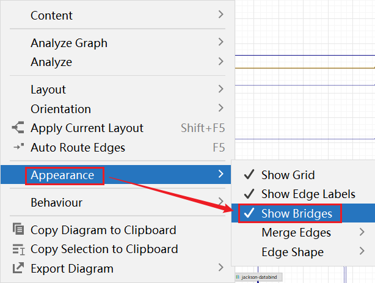

`鼠标右击 ——> Appearance ——> Merge Edges`，`By Sources` 和 `By Targets` 都要取消勾选

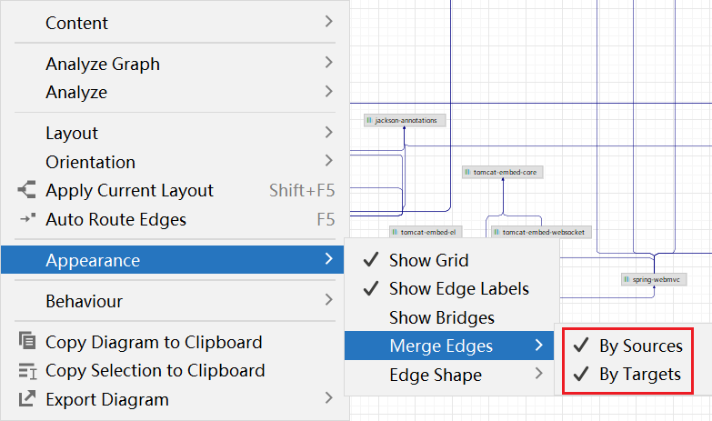

`鼠标右击 ——> Appearance ——> Edge Shape ——> Straight Polyline`，使拐角圆滑变为直接

- **Arc**：使用圆弧形状的连线，使连接更加圆滑。
- **Bezier**：使用贝塞尔曲线，使连线呈现出流畅的曲线形状，适合需要柔和转折的连接。
- **Quad Curve**：使用二次曲线连接，提供一种平滑的曲线效果。
- **Spline**：使用样条曲线，使连线更自然和流畅，适合复杂的曲线连接。
- **Straight Polyline（Polyline：折线）**：使用直线折线连接，连线由多个直线段组成，适合需要明确路径的连接。
- **Smoothed Polyline**：使用平滑的折线连接，直线段之间的转折点更圆滑。

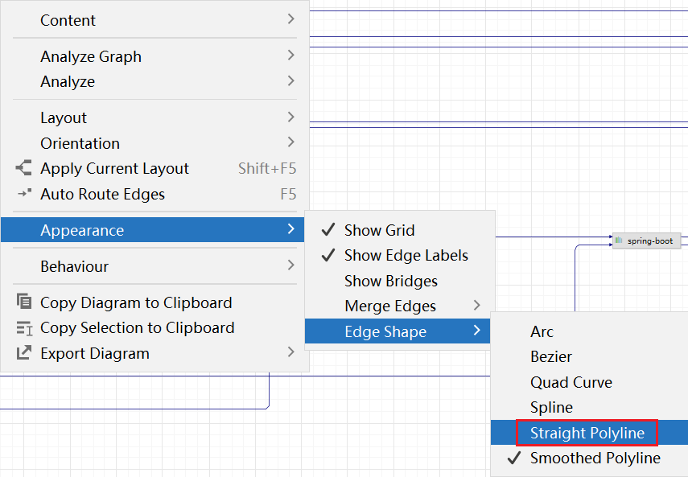

最后点击工具栏中的 `Apply Current Layout` 图标，它会帮助你根据当前你选择的布局重新排列

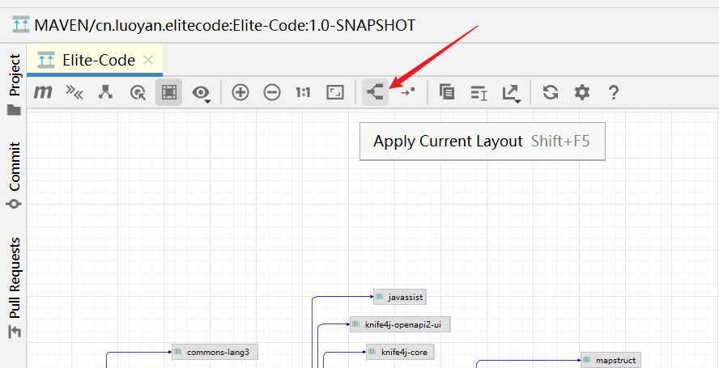

此时展现的图标就非常有条理


---

## 三、依赖排除

图中的红色实线就算是冲突的，可以入上图那样，右键，排除，他就自动在pom文件里面给exclud啦。

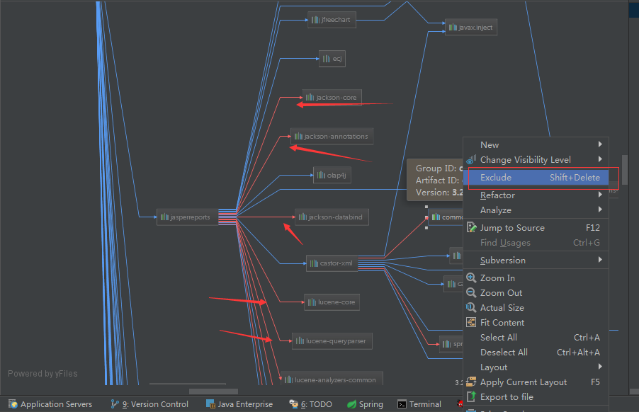

还有一种是虚线的红线，这种虚线，告诉你同一个jar都在哪里被多次引用了。

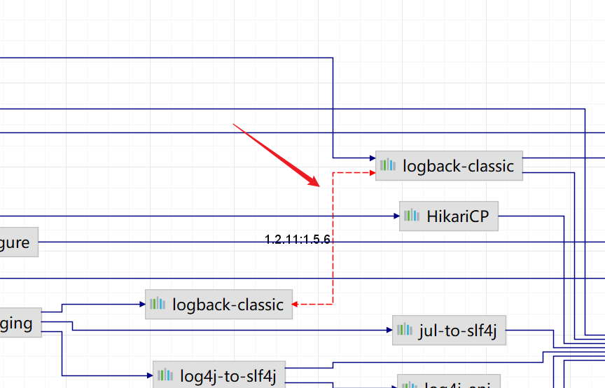

---

## 四、快捷方式

<kbd>ctrl + f</kbd> 可以查找jar包

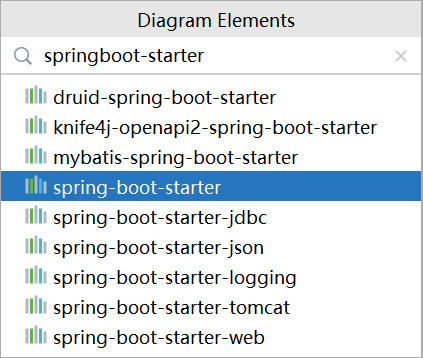

点击工具栏中的 `Actual Size` 可以将图标调整到合适大小

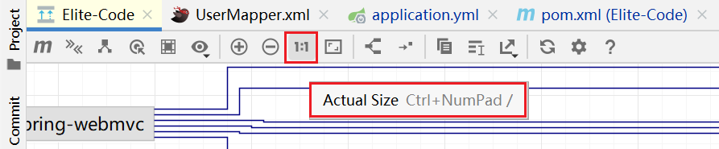

Windows电脑按 <kbd>alt</kbd> 就可以使用放大镜


---

# MyBatis自定义JSON类型处理器

## 一、使用场景

|         实体类          |                 数据库                  |
| :---------------------: | :-------------------------------------: |
|     `List<String>`      |           `["user", "admin"]`           |
| `List<List<List<ADT>>>` | `{"ADT":[[{"BookingCode":["N","N"]}]]}` |

复杂的Bean的定义如下（包含泛型）

```java
@Data
public class ADT {
    private List<String> BookingCode;
}

@Data
public class Price {
    private List<List<ADT>> ADT;
}
```

---

## 二、实现步骤

**UserMapper.xml**

~~~xml

<resultMap id="UserResult" type="User">
    <result property="userRole" column="user_role" typeHandler="cn.luoyan.elitecode.common.utils.JSONTypeHandler"/>
</resultMap>

<insert id="insertUser" useGeneratedKeys="true" keyProperty="userId">
insert into user(
<if test="userRole != null and userRole != ''">user_role,</if>
)
values(
<!-- PS：这里typeHandler无需用引号包围 -->
<if test="userRole != null and userRole != ''">
    #{userRole, typeHandler=cn.luoyan.elitecode.common.utils.JacksonTypeHandler},
</if>
)
</insert>
~~~

**添加类型处理器**

~~~java
package cn.luoyan.elitecode.common.utils;

import cn.hutool.core.lang.TypeReference;
import cn.hutool.json.JSONUtil;
import org.apache.commons.lang3.StringUtils;
import org.apache.ibatis.type.BaseTypeHandler;
import org.apache.ibatis.type.JdbcType;

import java.sql.CallableStatement;
import java.sql.PreparedStatement;
import java.sql.ResultSet;
import java.sql.SQLException;
import java.util.List;

public class JacksonTypeHandler<T> extends BaseTypeHandler<T> {

    private Class<T> type;

    public JacksonTypeHandler(Class<T> type) {
        this.type = type;
    }

    /**
     * 将非空参数设置到 PreparedStatement 中的指定位置
     *
     * @param preparedStatement 要设置参数的 PreparedStatement 对象
     * @param i                 参数的位置索引，从 1 开始
     * @param parameter         要设置的参数值，类型为 String
     * @param jdbcType          参数的 JDBC 类型，用于正确转换 Java 类型到数据库类型
     * @throws SQLException 如果设置参数时发生 SQL 异常
     */
    @Override
    public void setNonNullParameter(PreparedStatement preparedStatement, int i, T parameter, JdbcType jdbcType) throws SQLException {
        preparedStatement.setString(i, this.toJSON(parameter));
    }

    /**
     * 从 ResultSet 中获取指定列名的可为空结果
     *
     * @param resultSet  要从中获取结果的 ResultSet 对象
     * @param columnName 列名
     * @return 指定列名的结果，如果为空则返回 null
     * @throws SQLException 如果获取结果时发生 SQL 异常
     */
    @Override
    public T getNullableResult(ResultSet resultSet, String columnName) throws SQLException {
        String json = resultSet.getString(columnName);
        return StringUtils.isEmpty(json) ? null : this.parse(json);
    }

    /**
     * 从 ResultSet 中获取指定列索引的可为空结果
     *
     * @param resultSet   要从中获取结果的 ResultSet 对象
     * @param columnIndex 列的索引，从 1 开始
     * @return 指定列索引的结果，如果为空则返回 null
     * @throws SQLException 如果获取结果时发生 SQL 异常
     */
    @Override
    public T getNullableResult(ResultSet resultSet, int columnIndex) throws SQLException {
        String json = resultSet.getString(columnIndex);
        return StringUtils.isEmpty(json) ? null : this.parse(json);
    }

    /**
     * 从 CallableStatement 中获取指定列索引的可为空结果
     *
     * @param callableStatement 要从中获取结果的 CallableStatement 对象
     * @param columnIndex       列的索引，从 1 开始
     * @return 指定列索引的结果，如果为空则返回 null
     * @throws SQLException 如果获取结果时发生 SQL 异常
     */
    @Override
    public T getNullableResult(CallableStatement callableStatement, int columnIndex) throws SQLException {
        String json = callableStatement.getString(columnIndex);
        return StringUtils.isEmpty(json) ? null : this.parse(json);
    }

    /**
     * 字符串转JSON
     * @param parameter
     * @return
     */
    private String toJSON(T parameter) {
        return JSONUtil.toJsonStr(parameter);
    }

    /**
     * JSON转字符串
     * @param json
     * @return
     */
    private T parse(String json) {
        // 使用 TypeReference 来保留完整的泛型信息，避免因类型擦除导致的问题
        return JSONUtil.toBean(json, new TypeReference<T>() {}, false);
    }
}
~~~

---

## 三、为什么使用 `JSONUtil.toBean(json, new TypeReference<T>() {}, false)` 而不是直接使用 `JSONUtil.toBean(json, type)`？

**1）`JSONUtil.toBean(json, type)`**

这个方法主要用于将 JSON 对象转换为指定的 Java 类型。它的局限性在于：

- 它接受一个 `Class` 对象作为参数，这个 `Class` 对象在运行时不包含泛型信息。
- 由于 Java 的类型擦除机制，`List.class` 在运行时只代表原始的 `List` 类型，不包含元素类型信息。
- 对于 `["user", "admin"]` 这样的 JSON 数组，该方法无法正确识别元素应该是什么类型。
- 结果可能是一个包含 `Object` 类型元素的 `List`，而不是 `String` 类型。

示例：

```java
String json = "[\"user\", \"admin\"]";
List<String> list = JSONUtil.toBean(json, List.class); // 这不会正确工作
```


**2）`JSONUtil.toBean(json, new TypeReference<T>() {}, false)`**

这个方法更加灵活，能够处理复杂的泛型类型：

- Hutool 的 `TypeReference` 是一个抽象类，通过创建匿名内部类的方式来捕获完整的泛型类型信息。
- 当你使用 `new TypeReference<List<String>>() {}` 时，Hutool 可以通过反射获取到完整的泛型类型信息，包括元素类型。
- 这使得 Hutool 能够正确地将 JSON 数组中的元素解析为 `String` 类型。

示例：

```java
String json = "[\"user\", \"admin\"]";
List<String> list = JSONUtil.toBean(json, new TypeReference<List<String>>() {}, false); // 这可以正确工作
```


---

# 使用轻量应用服务器搭建图床（整合Typora、PicGo版）

## 一、在Nginx配置静态资源映射

我们需要通过Nginx设置一个网站，用来展示我们的图片，因为我们刚刚已经通过宝塔安装Nginx，所以在这再设置一个网站：


我们这里设置的图床网站地址为：`/www/wwwroot/elitecode`：默认创建的文件没有用可以删掉


---

## 二、提供API接口

编写API接口

~~~java
package cn.luoyan.elitecode.controller;

import cn.luoyan.elitecode.common.CommonResult;
import cn.luoyan.elitecode.common.constant.HttpStatus;
import org.springframework.beans.factory.annotation.Value;
import org.springframework.web.bind.annotation.PostMapping;
import org.springframework.web.bind.annotation.RequestMapping;
import org.springframework.web.bind.annotation.RestController;
import org.springframework.web.multipart.MultipartFile;

import java.io.File;
import java.io.IOException;
import java.nio.file.Paths;
import java.time.Instant;
import java.time.ZoneId;
import java.time.format.DateTimeFormatter;
import java.util.UUID;

/**
 * 文件接口
 */
@RestController
@RequestMapping("/file")
public class ImageUploadController {

    @Value("${file.upload.path}")
    private String uploadPath;
    @Value("${file.upload.subdirectory}")
    private String uploadSubdirectory;

    @Value("${file.access.url}")
    private String accessURL;
    @Value("${file.access.subdirectory}")
    private String accessSubdirectory;

    //上传图片
    @PostMapping("/upload")
    public CommonResult<String> uploadImg(MultipartFile uploadFile) {
        if (uploadFile.isEmpty()) {
            return CommonResult.error(HttpStatus.PARAMS_ERROR, "请选择文件");
        }
        // 按月份存储，获取存储目录
        String dir = DateTimeFormatter.ofPattern("yyyy-MM").format(Instant.now().atZone(ZoneId.of("Asia/Shanghai")));
        File targetLocation = Paths.get(uploadPath, uploadSubdirectory, dir).toFile();
        if (!targetLocation.exists()) {
            targetLocation.mkdirs();
        }
        // 获取上传图片名称
        String originalFilename = uploadFile.getOriginalFilename();
        // 获取文件扩展名
        String extName = originalFilename.substring(originalFilename.lastIndexOf("."));
        // 拼接的图片路径，使用UUID命名避免文件发生覆盖
        String newFileName = UUID.randomUUID().toString() + extName;
        File filePath = new File(targetLocation, newFileName);
        //上传图片
        try {
            uploadFile.transferTo(filePath);
        } catch (IllegalStateException e) {
            e.printStackTrace();
        } catch (IOException e) {
            e.printStackTrace();
        }
        //返回图片访问url
        return CommonResult.success(accessURL + "/" + accessSubdirectory + "/" + dir + "/" + newFileName);
    }
}
~~~

application.yml

~~~yml
# 文件相关配置
file:
  upload:
    # 文件上传的根路径
    path: /www/wwwroot/elitecode
    # 文件存储的子目录
    subdirectory: cos
  access:
    # 文件访问的基础URL
    url: https://pic.luo-yan.cn
    # 文件访问URL的子路径
    subdirectory: cos
~~~

---

## 三、配置反向代理

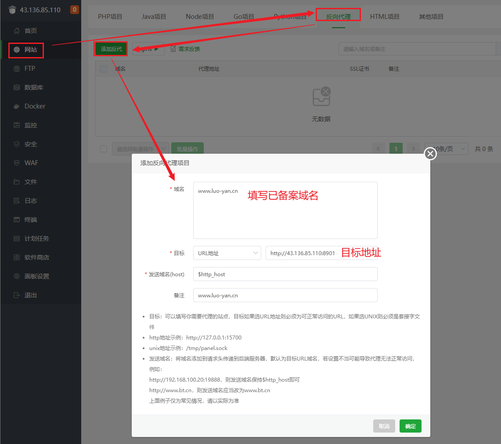

---

## 四、修改SpringBoot文件上传默认单个文件最大大小

application.yml

~~~yml
# Spring配置
spring:
  servlet:
    multipart:
      #配置单个文件最大上传大小
      max-file-size: 10MB
      #配置单个请求最大上传大小(一次请求可以上传多个文件，多个文件的总大小不能超过100M，通过集合上传)
      max-request-size: 100MB
~~~

---

## 五、测试

这里使用postman测试


点开返回的图像地址，可以发现图片上传成功


---

## 六、整合PicGo

插件官网：https://github.com/yuki-xin/picgo-plugin-web-uploader

下载好release后导入PicGo即可


新建自定义Web图床

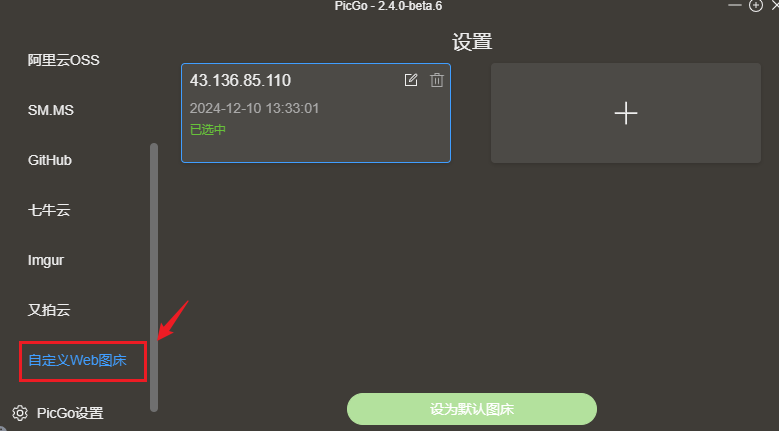

图床配置


---

## 七、整合Typora

在Typora的偏好设置中进行如图设置即可

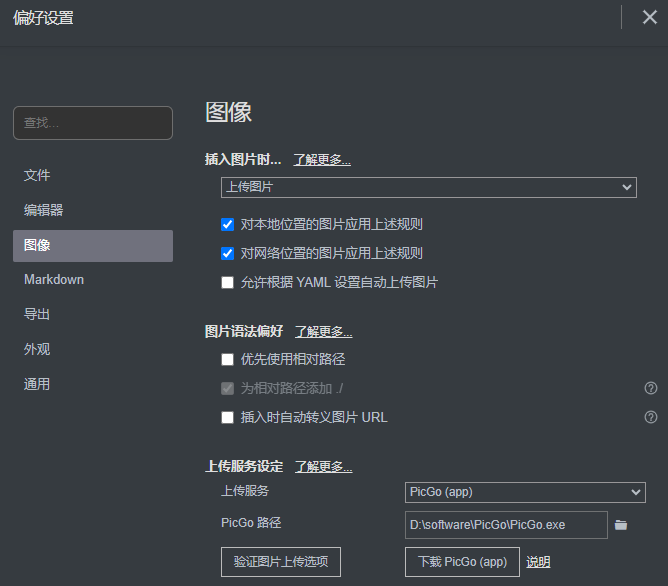

随便复制一张图片到md文件，可以看见上传成功，并在md文件中成功显示图片

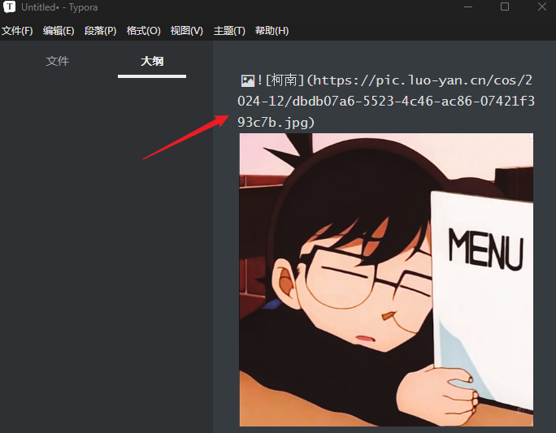

---

## 八、踩坑

最开始我的API返回的URL并没有封装成对象，而是直接返回一个字符串

~~~java
//上传图片
@PostMapping("/upload")
public String uploadImg(MultipartFile uploadFile) {
    ....
    //返回图片访问url
    return accessURL + "/" + accessSubdirectory + "/" + dir + "/" + newFileName;
}
~~~

当我在md文件中进行测试时，它所显示的格式如下图，多了一个双引号，导致图片无法正确显示


解决办法：将返回的URL封装成JSON对象，此时Typora即可正确解析格式


---

# 简历

中文字体：微软雅黑

英文字体：Segoe UI

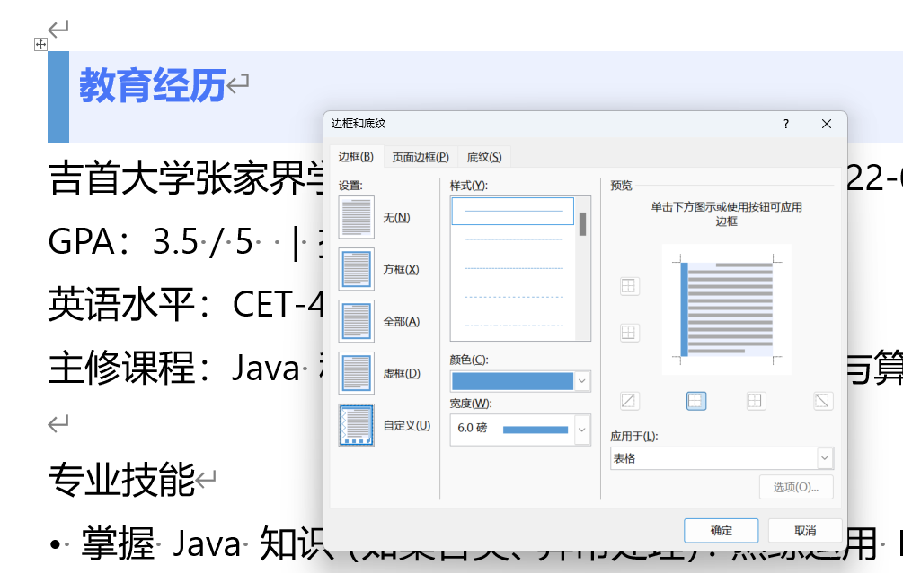

表格垂直居中：

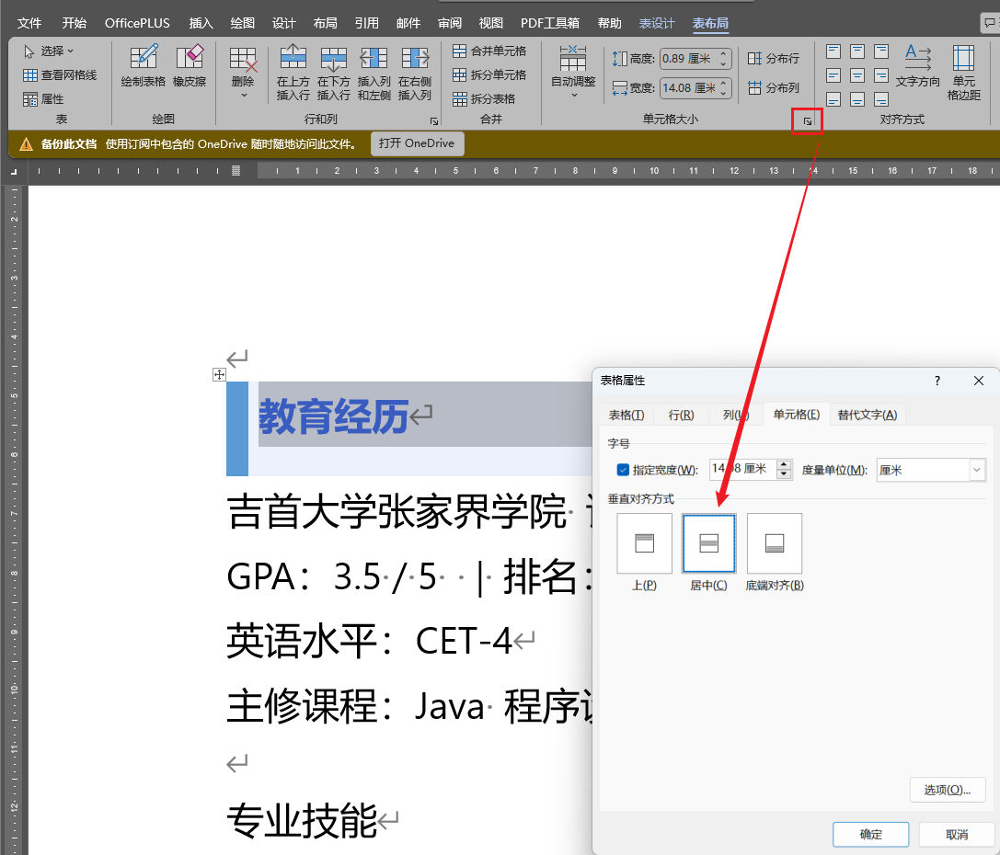

调整表格的段后距离：


表格使用格式刷

调整文字间距


图片与文字对齐：选中图片所在的段落


---

# MyBatis XML时间范围查询

方式一：使用实体字符

~~~xml
<if test="updateTime != null">and update_time &lt;= #{updateTime}</if>
~~~

方式二：

~~~xml
<if test="createTime != null">and createTime between #{startTime} and #{endTime}</if>
~~~


---

# MySQL JSON函数

PS：阅读MySQL官方文档真的很考验英语水平哈哈哈o(╥﹏╥)o

祝明天四六级的小伙伴过过过~

官网：https://dev.mysql.com/doc/refman/8.4/en/json-function-reference.html

下面展示我遇到的两种情况，以后遇到会继续补充

## 一、搜索JOSN值的函数

官方文档：https://dev.mysql.com/doc/refman/8.4/en/json-search-functions.html#function_json-contains

格式：

~~~sql
JSON_CONTAINS(target*, candidate[, path])
~~~

通过返回 1 或 0  来指示给定的候选 JSON 文档是否包含在目标 JSON 文档中。

要仅检查路径上是否存在任何数据，请使用 `JSON_CONTAINS_PATH()`。

以下规则定义了包含关系：

1. 当且仅当候选标量和目标标量可比较且相等时，候选标量才包含在目标标量中。两个标量值可比较的条件是它们具有相同的 JSON_TYPE() 类型，但 INTEGER 和 DECIMAL 类型的值也可以互相比较。
2. 当且仅当候选数组中的每个元素都包含在目标数组的某个元素中时，候选数组才包含在目标数组中。
3. 当且仅当候选非数组包含在目标数组的某个元素中时，候选非数组才包含在目标数组中。
4. 当且仅当候选对象中的每个键在目标对象中都有相同名称的键，并且与候选键关联的值包含在与目标键关联的值中时，候选对象才包含在目标对象中。

使用场景：

需求：后端存储 `roles字段` 为JSON数组，我想筛选有哪些用户具有某个角色

~~~sql
select * FROM user where JSON_CONTAINS(roles, '"admin"');
~~~

效果如下：


xml

~~~xml
<if test="userRole != null and userRole != ''">and JSON_CONTAINS(user_role, JSON_QUOTE(#{userRole}))</if>
~~~

---

## 二、筛选JSON里面的字段

官网文档：https://dev.mysql.com/doc/refman/8.4/en/json-search-functions.html#function_json-extract

格式：

~~~sql
JSON_EXTRACT(json_doc, path[, path] ...)
~~~

从 JSON 文档中返回数据，数据由路径参数匹配的文档部分选出。如果任何参数为 NULL 或没有路径在文档中找到值，则返回 NULL。如果 json_doc 参数不是有效的 JSON 文档，或者任何路径参数不是有效的路径表达式，则会出现错误。

返回值由路径参数匹配的所有值组成。如果这些参数可能返回多个值，匹配的值会自动包装成一个数组，顺序与生成它们的路径相对应。否则，返回值是单个匹配的值。

使用场景：

需求：写出mapper xml文件，我想要查找sys_data表中data字段，其中data字段是一个JSON，图二中的map参数，需要让JSON中的key与map中的key相等并且value也相等的数据，图三为sys_data表结构，请拿map中存储'key1'->'1'举例

~~~xml
<select id="shit" resultType="com.example.SysData">
    SELECT *
    FROM sys_data
    WHERE docuId = #{docuId}
    <if test="map != null and map.size() > 0">
        <foreach item="value" index="key" collection="map">
            AND JSON_EXTRACT(data, CONCAT('$.', #{key})) = #{value}
        </foreach>
    </if>
</select>
~~~

1. `index`属性的作用：
   - 在遍历集合时，`index`属性表示当前遍历到的元素的索引或键。
   - 对于List或数组，它代表元素的索引（从0开始）。
   - 对于Map，它代表当前元素的键（key）。
2. `item="value"` 表示我们将Map的值赋值给变量"value"。
3. JSON_EXTRACT 是一个MySQL函数，用于从JSON格式的数据中提取特定的值。这个函数在处理JSON数据时非常有用，特别是当你需要查询或操作存储在数据库中的JSON字段时。让我详细解释一下：
   1. 基本用法： JSON_EXTRACT(json_doc, path)
      - json_doc：JSON文档或JSON格式的字符串
      - path：用于指定要提取的值的路径
   2. 路径语法：
      - '$'表示整个JSON文档
      - '$.key'用于访问顶层的key
      - '$[0]'用于访问数组的第一个元素
      - '$.key1.key2'用于访问嵌套的JSON对象

---

## 三、将字符串作为 JSON 值引用

格式：

~~~sql
JSON_QUOTE(string)
~~~

将字符串作为 JSON 值引用，通过用双引号包裹并转义内部引号和其他字符，然后将结果作为 utf8mb4 字符串返回。如果参数为 NULL，则返回 NULL。

此函数通常用于生成有效的 JSON 字符串字面量，以包含在 JSON 文档中。

某些特殊字符根据表 14.23 “JSON_UNQUOTE() 特殊字符转义序列”中的转义序列用反斜杠转义。


---

# 使用Excel做待办列表

选中E2:E~(底)，【数据】→【数据验证】，允许【序列】，序列来源为：R,S


将F2:F12单元格区域的字体设置为Wingdings 2。


设置完成后，可在F列单击下拉菜单，选择R时，单元格显示为带方框的√号，表示当前事项已完成。选择S时，单元格显示为带方框的×号，表示当前事项尚未完成。

选中A2:E~(底)单元格区域，【开始】选项卡→【条件格式】→【新建规则】


选择【使用公式确定要设置格式的单元格】。

在公式编辑框中输入以下公式，单击【格式】按钮，设置一种填充颜色：
`=$E2="R"`


测试：

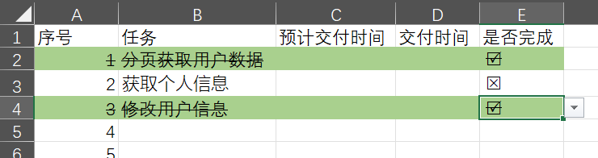


---

# MyBatis参数计算

## 一、问题

前端传入参数，PageRequest.java

~~~java
/**
 * 当前页号
 */
private int current = 1;

/**
 * 页面大小
 */
private int pageSize = 10;
~~~

xml文件

~~~xml
limit #{(current - 1) * pageSize}, #{pageSize}
~~~

报错

~~~
org.mybatis.spring.MyBatisSystemException: nested exception is org.apache.ibatis.builder.BuilderException: Parsing error in {(current - 1) * pageSize} in position 14
~~~

---

## 二、解决办法

### ① 法一

PageRequest.java 新增属性

~~~java
/**
 * 分页起始索引（默认为0）
 */
private int offset = 0;
~~~

Controller中进行动态计算

~~~java
pageRequest.setOffset((pageRequest.getCurrent() - 1) * pageRequest.getPageSize());
~~~

xml

~~~xml
limit #{offset}, #{pageSize}
~~~

---

### ② `<bind>` 标签

官方文档：https://mybatis.org/mybatis-3/zh_CN/dynamic-sql.html#bind-1

~~~xml
<select id="selectUserList" resultMap="UserResult">
    <bind name="offset" value="(current - 1) * pageSize" />
    select
    <include refid="selectUserVo"/>
    from
    user
    <where>
        <if test="userId != null and userId != 0">and id=#{userId}</if>
        <if test="userAccount != null and userAccount != ''">and user_account like '%${userAccount}%'</if>
        <if test="nickName != null and nickName != ''">and nick_name like '%#{nickName}%'</if>
        <if test="userRole != null and userRole != ''">and JSON_CONTAINS(roles, JSON_QUOTE(#{userRole}))</if>
        <if test="createBy != null and createBy != ''">and create_by like '%#{createBy}%'</if>
        <if test="updateBy != null and updateBy != ''">and update_by like '%#{updateBy}%'</if>
        <if test="startTime != null and endTime != null">and create_time between #{startTime} and #{endTime}</if>
    </where>
    <if test="sortField != null and sortField != ''">
        ORDER BY #{sortField}, #{sortOrder}
    </if>
    limit #{offset}, #{pageSize}
</select>
~~~

---

### ③ 使用 `$` 字符串拼接

xml

~~~xml
limit ${(current - 1) * pageSize}, #{pageSize}
~~~


---

# 【MyBatis】原来 `${}` 和 `#{}` 藏有这么多坑！

## 一、引入

众所周知，MyBatis获取参数值的两种方式：`${}` 和 `#{}`；`${}` 的本质就是字符串拼接，`#{}` 的本质就是占位符赋值。

`${}` 使用字符串拼接的方式拼接sql，若为字符串类型或日期类型的字段进行赋值时，需要手动加单引号；但是 `#{}` 使用占位符赋值的方式拼接sql，此时为字符串类型或日期类型的字段进行赋值时，可以自动添加单引号。

接下来考考大家，下面 `？` 的地方应该填 `$` 还是 `#`？（下面参数均为String类型）

~~~xml
select * from t_user where username like '%？{username}%'
~~~

~~~java
select * from t_user where username like "%"？{username}"%"
~~~

~~~xml
<if test="orderByList != null and orderByList.size() != 0">
    ORDER BY
    <foreach collection="orderByList" separator="," item="orderByItem">
        ？{orderByItem}
    </foreach>
</if>
~~~

---

## 二、解释

第一个案例应为 `$`，解释：

由于我们使用的是模糊查询，`%#{username}%` 需要写在一对单引号中，单引号在mysql中表示的是一个字符串；当我们用 `#{}` 时，并且在执行时，`?` 会代替 `#{}` 的时候，`?` 就存在了 `#{}` 里面，这个时候就会把 `?` 当做字符串的一部分，因此应该使用 `${}` 进行字符串拼接

~~~xml
select * from t_user where username like '%${username}%'
~~~

---

第二个案例应为 `#`，解释：

~~~xml
select * from t_user where username like "%"#{username}"%"
~~~

假设传入的参数 `username` 的值是 `john`，使用占位符后的 SQL 语句：

~~~java
SELECT * FROM t_user WHERE username LIKE "%john%"
~~~

在这种情况下，`#{username}` 会直接被替换为参数值，而不加引号。

因此，替换后是 `"%john%"`，而不是 `"%""%john%""%"`。

---

第三个案例应为 `$`，

~~~java
<if test="orderByList != null and orderByList.size() != 0">
    ORDER BY
    <foreach collection="orderByList" separator="," item="orderByItem">
        ${orderByItem}
    </foreach>
</if>
~~~

这是因为如果使用 `#{}`，那么在SQL解析的时候会加上单引号，假设传入的值为 `create_time desc, userId desc`，那么SQL解析后的结果就为

~~~xml
ORDER BY 'create_time desc, userId desc'
~~~

此时排序是不生效的，因此需要使用 `${}` 让它不自动加单引号

~~~xml
ORDER BY create_time desc, userId desc
~~~


---

# 使用虚拟机安装Linux

## 一、内容

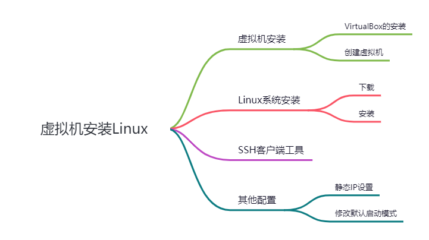

---

## 二、虚拟机软件安装

### ① VirtualBox的安装

> VirtualBox 是一款开源虚拟机软件，由Sun公司出品，现在则由Oracle进行开发。VirtualBox号称是最强的免费虚拟机软件，它性能优异且简单易用。可虚拟的系统包括Windows、Linux、MacOS、Android等操作系统！本文将使用VirtualBox作为虚拟机来安装Linux系统。

- 我们先下载VirtualBox安装包，下载地址：https://www.virtualbox.org/wiki/Downloads

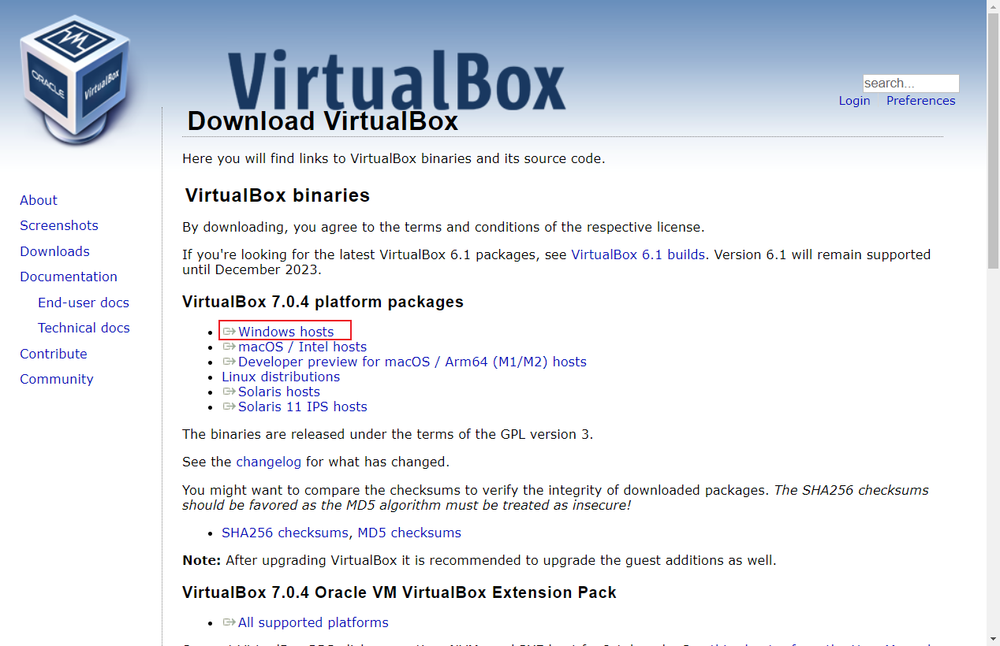

- 下载完成后双击运行安装包一路点击下一步即可：

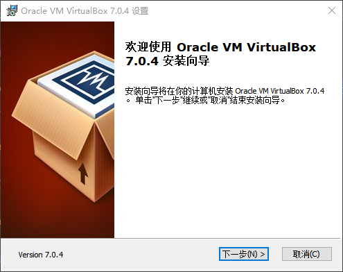

- 中途需要自定义一下安装路径：

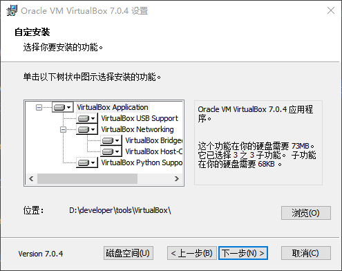

- 最后点击完成，完成安装。

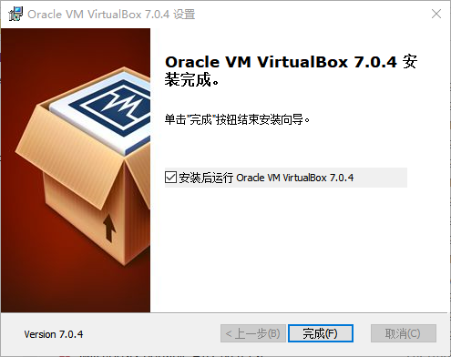

---

### ② VMWare安装

进入官网的 [VMware Workstation Pro 页面](https://www.vmware.com/cn/products/workstation-pro.html)，浏览功能特性、应用场景、系统要求等。下滑页面点击 `试用 Workstation 17Pro` 下方的下载链接，跳转至[下载页面](https://www.vmware.com/products/workstation-pro/workstation-pro-evaluation.html)。

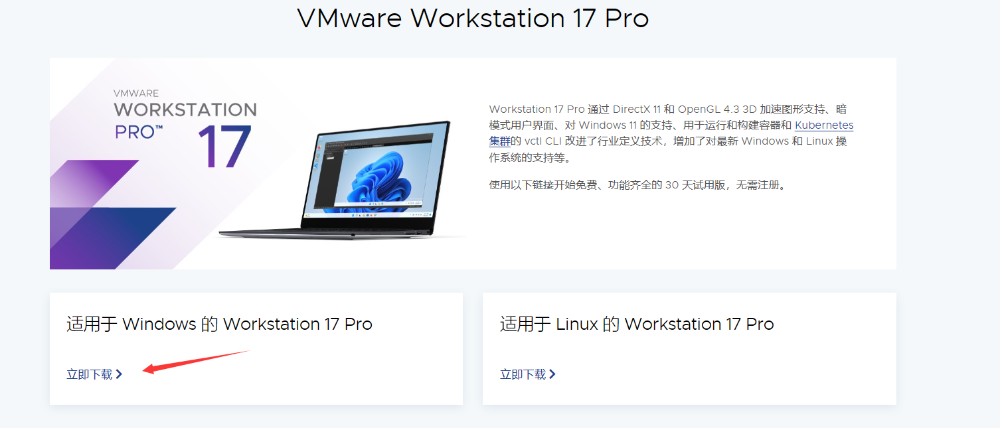

在下载页面中下滑，根据操作系统选择合适的产品，在这里以 Windows10 系统为例，选择 `Workstation 17 Pro for Windows`，开始下载安装文件。

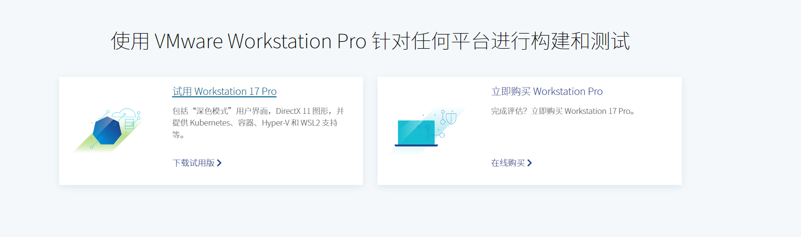

在我们下载好的文件夹中找到安装文件，双击，等待安装程序运行。

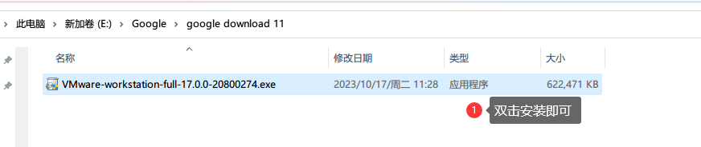

点击**下一步**——> 选中**接受许可后**——>点击 **下一步**。

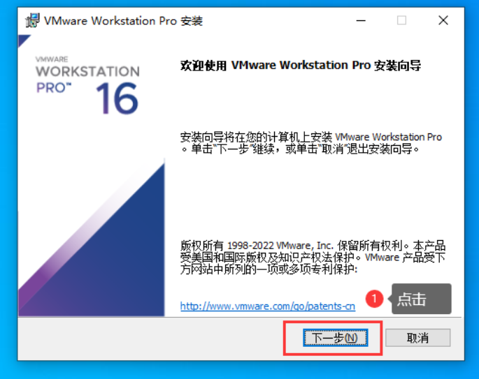

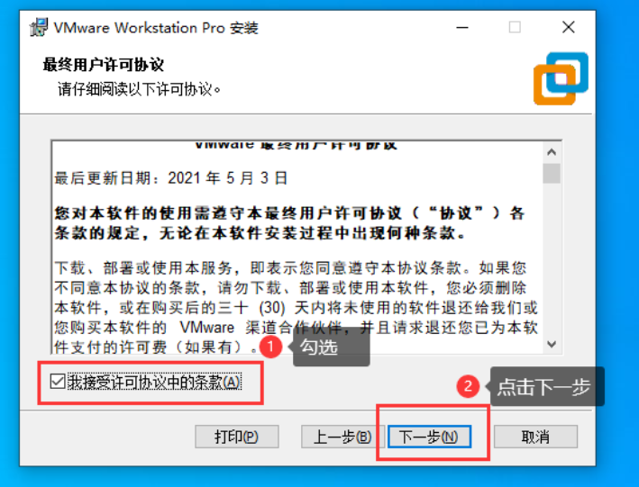

更改安装路径：把**√**去掉——>点击右上角的“更改”，修改安装路径，默认本地C盘（这个路径看自己情况决定，最好文件名是纯英文 ）——>点击**确定**——>点击“下一步”。（虚拟机名字并不会创建一层文件夹）

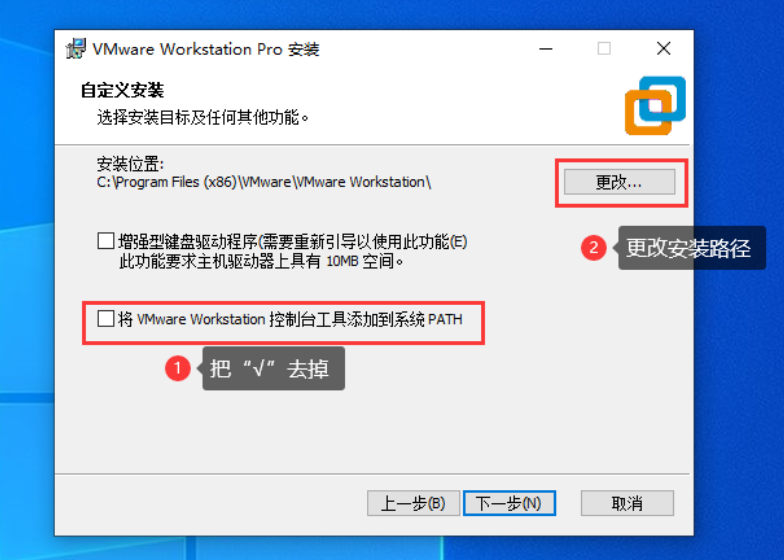

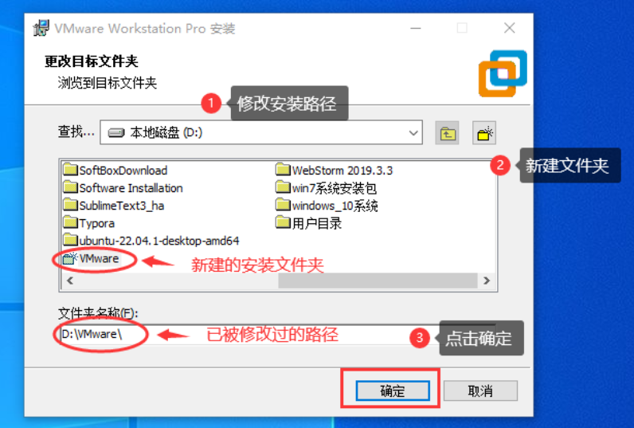

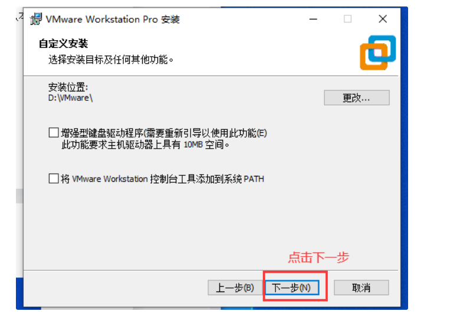

默认，点击**下一步**——>点击**安装**，开始安装。

建议把两个“√”都取消，启动自检要是开了的话，每次一打开VW就会内存爆满，客户计划就是垃圾根本没用

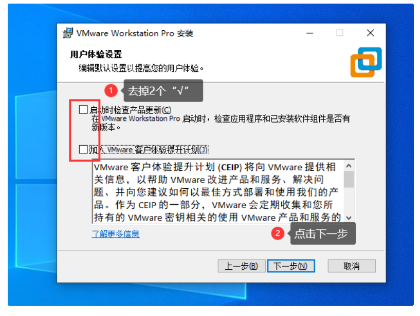

按照步骤，点击右下角许可证密钥，输入密钥——>点击 **输入**——>点击“完成”退出安装向导。

建议输入许可证密钥，可以永久使用VMware，否则就是试用版本一个月。

---

## 三、创建虚拟机

### ① VirtualBox

- 创建一个Linux虚拟机：（虚拟机名字并不会创建一层文件夹）

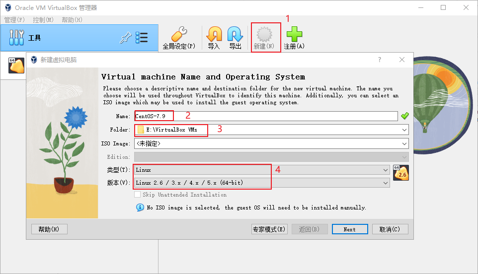

- 分配虚拟机内存大小，可以根据自己电脑配置来决定：

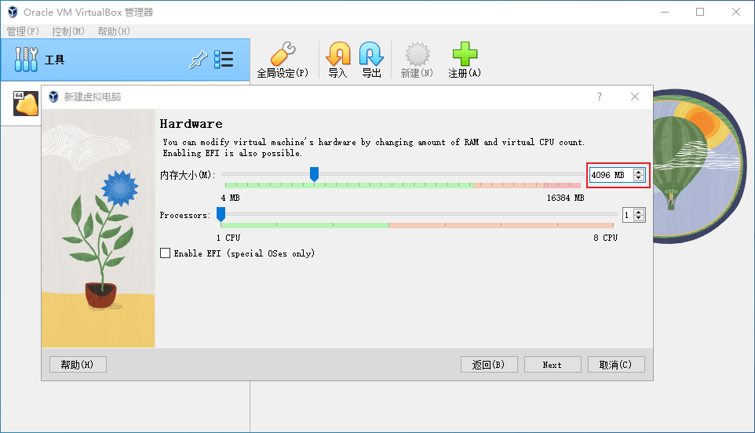

- 创建虚拟硬盘，设置好虚拟硬盘的大小，这里推荐设置`30G`以上：

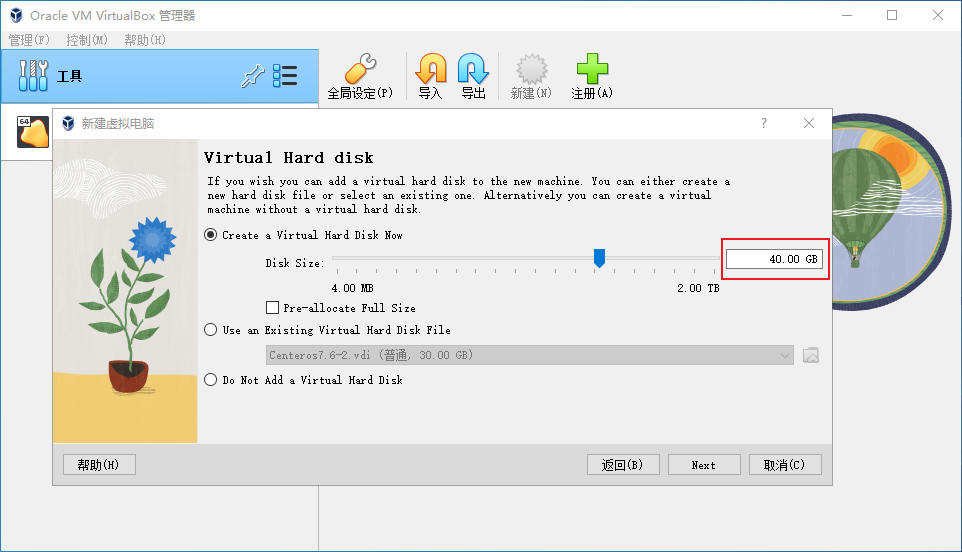

- 设置完成后确认安装信息如下。

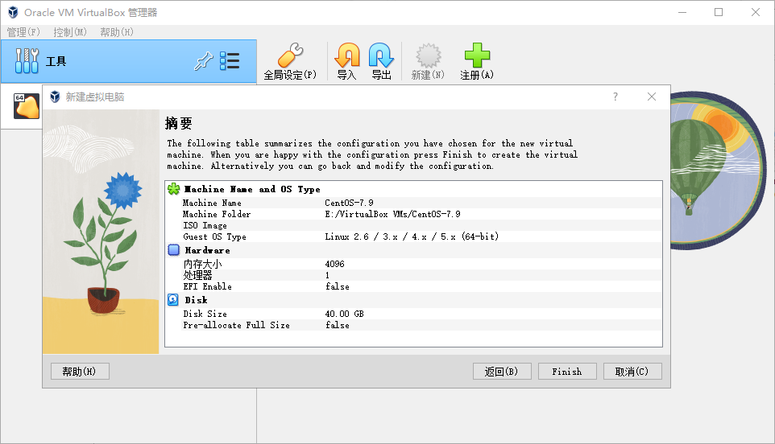

---

### ② VMWare

打开VMware虚拟机，**文件 → 新建虚拟机 → 自定义 → 下一步**。

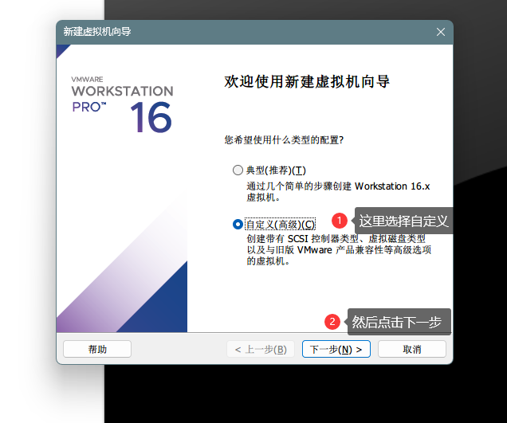

**硬盘兼容性**选择默认就可以，继续**下一步**。

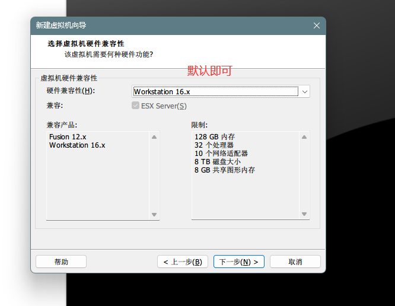

进入 **客户机操作系统** 选择 **稍后安装操作系统** （因为tfwf要在虚拟机安装完成之后，把不需要的硬件删除，所以选择稍后安装操作系统）。


选择客户端操作系统：**客户机操作系统 → Linux**→ 版本选 **CentOS 7 64位** → **下一步**，注意：版本一定要对应镜像文件版本。

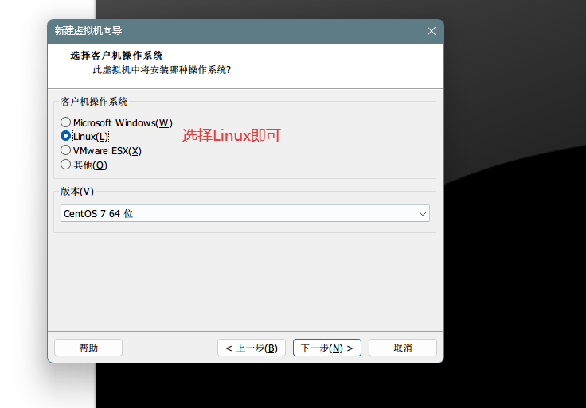

命名虚拟机，位置（G:\Document\Leo-test），这样可以在 **VM-Mmirrors**，文件夹放多个操作系统。

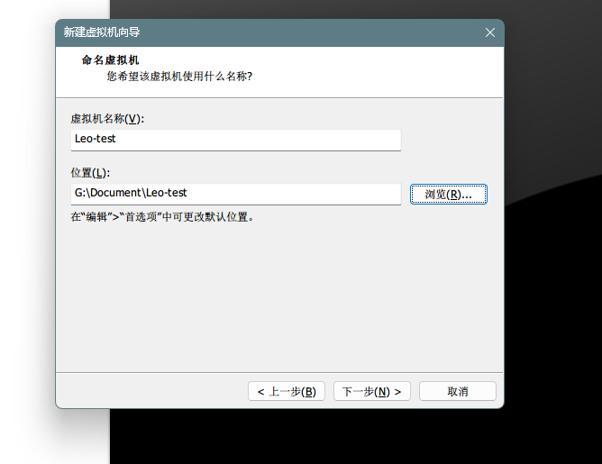


**处理器配置**，可以根据您的系统选择。这里大家可以打开自己的任务管理器查看自己的电脑的配置。

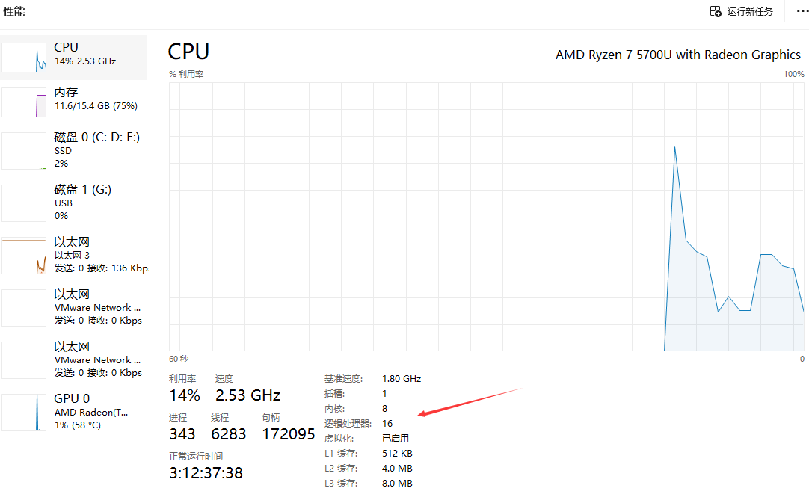

这里以笔者的电脑为例，8核16个处理器，这里虚拟机的**处理器的数量和每个处理器的核数** 相乘不可以超过自己电脑的逻辑处理器数。


笔者这里设置为4096也就是4个G，大家测试学习的话，其实两个G就够了。


网络类型 → NAT模式（可以使虚拟机与主机使用同一网络）


这里默认即可


磁盘容量一般20G就够了，因为笔者后面需要装的东西比较多，这里给了50G，大家适量给就可以了。


指定磁盘文件（.vmdk）文件


这样虚拟机差不多就准备好了，接下来删除一些不需要的硬件。


自定义硬件 → 移除 **USB控制器、声卡、打印机**（这样可以让虚拟器启动的快一点）。


至此，虚拟机中的硬件已经搭建完成。

---

## 四、CentOS系统安装

> CentOS（Community Enterprise Operating System）是Linux发行版之一，中文意思为社区企业操作系统。它是来自于商业版 Red Hat Enterprise Linux依照开放源代码规定释出的源代码所编译而成，因此具有高度稳定性且完全开源。本文将以CentOS 7.9为例来介绍Linux系统的安装。

这里我们将从阿里云的`开源镜像站`进行下载，网站地址为：https://mirrors.aliyun.com

这里我们选择的下载文件为`CentOS-7-x86_64-DVD-2009.iso`，下载地址：https://mirrors.aliyun.com/centos/7.9.2009/isos/x86_64/


**VirtualBox**：为虚拟机添加虚拟光盘，虚拟光盘指定为我们下载的ISO镜像文件：


配置网络（一定要先配NAT，再配Host-Only）

| 模式名称              | 特点                                                         |
| --------------------- | ------------------------------------------------------------ |
| 网络地址转换(NAT)     | 连接这个网络可以访问外部网络，但是外部网络不可访问虚拟机     |
| 桥接网卡              | 这个网络完全可以共享主机网络，主机网络发生变化时，也跟随变化，IP地址变动 |
| 仅主机(Host-Only)网络 | 这个网络也可以用来主机访问虚拟机以及虚拟机上web服务，但是虚拟机不可访问外网 |


点击启动运行虚拟机：


**VMWare**：点击 **CD/DVD（IDE）**


在连接处选择 **使用ISO映像文件 **选择CentOS 7 iso文件，确定。 

**开始安装虚拟机**，进入CentOS安装界面。


- 运行成功后，选择`Install CentOS 7`进行安装：


- 选择系统安装过程中的语言，建议选择`English`选项：


- 需要进行设置的部分示意图：


- 时区设置，地区选择`Asia`，城市选择`Shanghai`：


- 语言支持选择安装英文、简体中文两种语言安装包：


- 软件安装设置选择`Server with GUI`，同时选择如图三种附加环境：


- 磁盘分区设置，直接设置自动分区即可：


- 如果你想手动分区的话可以参考下，有时候虚拟机设置的内存较小，需要创建一个较大的`swap`分区：


- 按如图所示进行手动分区操作；


- 关于分区的几个目录的说明：
  - /：根分区；
  - swap：交换分区，可以当虚拟内存使用；
  - /boot：存储系统的引导信息和内核信息；
  - /usr：存储系统应用软件安装信息；
  - /var：存储系统日志信息。
- 网络设置，设置主机名称和进行网络激活操作：


- 单击`Begin Installation`进行安装：


- 安装过程中可以设置`root`用户的密码；


- 完成安装后重新启动即可进入系统，第一次启动需要同意协议并完成配置：


---

## 五、SSH客户端工具

Tabby是一款现代化的终端连接工具，开源并且跨平台，支持在Windows、MacOS、Linux系统下使用。Tabby在Github上已有20k+Star，可见它是一款非常流行的终端工具！


---

## 六、静态IP设置

### ① VirtualBox

在VirtualBox中配置IP地址网关和网段（IP地址的范围）


IPv4地址可以随便写


编辑IP配置文件 `vim /etc/sysconfig/network-scripts/ifcfg-enp0s3`，更改该ifcfg-enp0s3下的内容为 yes，如果在安装 CentOS 的时候就设置了网络，则可以忽略这一步。


保存文件并重启网络服务，重启网络的命令是 `systemctl restart network`

`ping www.baidu.com` 可以 ping 通，说明与外网已经连通

但是此时我们的 IP 任然是动态的 IP，我们需要在添加一个网卡，也就是网卡 2（配置Most-Only的）

编辑IP配置文件 `vim /etc/sysconfig/network-scripts/ifcfg-enp0s8`，更改该ifcfg-enp0s8下的内容为

- 第四行：BOOTPROTO=static
- 倒数第二行：ONBOOT=yes
- 倒数第一行：IPADDR=192.168.xx.xxx 备注：这里的IP地址为最小地址和最大地址之间的地址


然后在命令行使用`ifconfig` / `ip addr` 命令来获取IP地址。


---

### ② VMWare

配置固定IP需要2个大步骤：

1. 在VMware Workstation（或Fusion）中配置IP地址网关和网段（IP地址的范围）
2. 在Linux系统中手动修改配置文件，固定IP

首先让我们，先进行第一步，跟随图片进行操作


下面88.0可以任意的修改，这是一个网段，表示我们的IP地址的范围是192.168.88.0到192.168.88.254之间，但推荐使用88

子网掩码一定要确认是255.255.255.0


现在进行第二步，在Linux系统中修改固定IP

使用vim编辑 `/etc/sysconfig/network-scripts/ifcfg-ens33`（网卡的配置文件）文件，填入如下内容

dhcp是自动获取的意思

IPADDR只要是192.168.88.0到192.168.88.254之间都可以，这里的IP地址一定要和VMWare里面配置的ip一致

DNS1：域名解析的服务器这里设置为网关即可，VMWare会自动去做域名解析的


执行：`systemctl restart network` 重启网卡，执行ifconfig即可看到ip地址固定为192.168.88.130了

或者 `service network restart`

---

## 七、修改默认启动模式

如果不想默认启动图形化界面的话，可以修改默认的启动模式，因为图形化界面还是比较占用内存的，使用命令如下。

```
# 将默认级别修改为多用户文本模式
systemctl set-default multi-user.target
# 将默认级别修改为图形用户界面模式
systemctl set-default graphical.target
# 重启
reboot
```

修改启动模式后启动，可能会遇到网卡默认没有开启的情况，可以使用如下命令进行开启。

```
ifup enp0s3
```

---

## 八、VirtualBox虚拟机后台运行

启动虚拟机时，采用“无界面启动”；


如果界面已经启动了，我们想退出界面，但是不退出系统（系统上有服务在运行）

那就 顶部菜单-控制-分离式界面


---

## 九、更换 阿里云/清华大学 yum 软件源

阿里云参考：https://developer.aliyun.com/mirror/centos

清华参考：https://mirrors.tuna.tsinghua.edu.cn/help/centos/

阿里云（推荐）：

```bash
mv /etc/yum.repos.d/CentOS-Base.repo /etc/yum.repos.d/CentOS-Base.repo.backup
curl -o /etc/yum.repos.d/CentOS-Base.repo http://mirrors.aliyun.com/repo/Centos-7.repo
```

清华：

```bash
mv /etc/yum.repos.d/CentOS-Base.repo /etc/yum.repos.d/CentOS-Base.repo.bak
vi /etc/yum.repos.d/CentOS-Base.repo


# CentOS-Base.repo
#
# The mirror system uses the connecting IP address of the client and the
# update status of each mirror to pick mirrors that are updated to and
# geographically close to the client.  You should use this for CentOS updates
# unless you are manually picking other mirrors.
#
# If the mirrorlist= does not work for you, as a fall back you can try the
# remarked out baseurl= line instead.
#
#

[base]
name=CentOS-$releasever - Base
baseurl=https://mirrors.tuna.tsinghua.edu.cn/centos/$releasever/os/$basearch/
#mirrorlist=http://mirrorlist.centos.org/?release=$releasever&arch=$basearch&repo=os
gpgcheck=1
gpgkey=file:///etc/pki/rpm-gpg/RPM-GPG-KEY-CentOS-7

#released updates
[updates]
name=CentOS-$releasever - Updates
baseurl=https://mirrors.tuna.tsinghua.edu.cn/centos/$releasever/updates/$basearch/
#mirrorlist=http://mirrorlist.centos.org/?release=$releasever&arch=$basearch&repo=updates
gpgcheck=1
gpgkey=file:///etc/pki/rpm-gpg/RPM-GPG-KEY-CentOS-7

#additional packages that may be useful
[extras]
name=CentOS-$releasever - Extras
baseurl=https://mirrors.tuna.tsinghua.edu.cn/centos/$releasever/extras/$basearch/
#mirrorlist=http://mirrorlist.centos.org/?release=$releasever&arch=$basearch&repo=extras
gpgcheck=1
gpgkey=file:///etc/pki/rpm-gpg/RPM-GPG-KEY-CentOS-7

#additional packages that extend functionality of existing packages
[centosplus]
name=CentOS-$releasever - Plus
baseurl=https://mirrors.tuna.tsinghua.edu.cn/centos/$releasever/centosplus/$basearch/
#mirrorlist=http://mirrorlist.centos.org/?release=$releasever&arch=$basearch&repo=centosplus
gpgcheck=1
enabled=0
gpgkey=file:///etc/pki/rpm-gpg/RPM-GPG-KEY-CentOS-7
```

更新软件包缓存

```undefined
yum clean all
yum makecache
```

---

## 十、关闭防火墙

~~~bash
systemctl disable firewalld
systemctl stop firewalld
~~~

---

## 十一、复制虚拟机

### ① VirtualBox（同电脑、跨电脑）

#### 1.同一个virtualBox（同一台电脑）复制虚拟机

##### 右键复制

选中待复制的虚拟机，右键复制此虚拟机。

**注：** 待复制的虚拟机需处于关闭状态


设置新的虚拟机名称，并且为所有网卡重新生成MAC地址。


选择完全复制。


点击复制后，等待几分钟后即可完成。


复制ubuntu-server-1为新的ubuntu-server-2后如下图。


**注：**
新复制的虚拟机和老的虚拟机拥有相同的：

- hostname
- IP设置
- 登录用户名、密码
- 已安装的软件
- …

---

##### 修改虚拟机hostname

新的虚拟机被复制完成后，还需要修改新虚拟机的hostname和IP地址，避免和老的虚拟机发生IP地址冲突。
如下为修改hostname的相关命令，修改完成后可重启生效。

```bash
# 修改/etc/hostname内容为新的主机名，
# 如ubuntu-server-2
vim /etc/hostname

# 修改/etc/hosts，
# 修改如下图中红框中内容为新的主机名，如ubuntu-server-2
vim /etc/hosts

# 都修改完成后，记得重启虚拟机
reboot
12345678910
```


---

##### 修改虚拟机IP

修改新虚拟机的IP为同网段新的IP，避免与老的虚拟机发生IP地址冲突。

```bash
# 修改网络配置,
# 修改如下图中红框中内容为新的不冲突IP，
# 如从原192.168.3.101修改为192.168.3.102
vim /etc/netplan/00-installer-config.yaml
# 应用新的网络配置
sudo netplan apply
123456
```


---

#### 2.跨电脑复制

##### 拷贝.vdi文件

选中待复制的虚拟机，右键`在资源管理器中显示`，即可打开该虚拟机对应的存储目录。


**注：** 待复制的虚拟机需处于关闭状态
直接拷贝对应虚拟机存储目录中的.vdi文件到新电脑上。


---

##### 以拷贝的.vdi文件新建虚拟机

在新电脑上新建虚拟机，设置好内存后，
在设置虚拟硬盘这步，选择`使用已有的虚拟硬盘文件`，
可选择**右边的按钮（选择一个虚拟硬盘）**，

在弹出对话框后点击`注册`，
选中`已存在的vdi文件（即之前从其他电脑Virtualbox虚拟机文件夹里拷贝的.vdi文件）`进行注册，
（**注：** 可以将已存在的.vdi文件放在当前新建虚拟机的存储目录，便于统一管理）
然后即可在上一步中通过下拉列表选择对应的.vdi文件，
仅第一次添加时需要注册，添加完成后即出现在下拉列表中，
下拉列表中还同时包含当前VirtualBox之前创建的虚拟机vdi文件。

点击下一步即可完成虚拟机创建。

---

##### 修改网络配置

新创建完成的虚拟机需要根据当前虚拟机的环境修改相应网络设置，例如：

- 从`桥接网卡`模式迁移到`桥接网卡`模式，需修改网络IP
- 从`桥接网卡`模式迁移到`NAT + Host-only`模式，需修改VirtualBox网络网卡设置、修改网络IP

**注：** 关于网络的修改具体可参见我之前的博客：[VirtualBox安装ubuntu虚拟机 - 4. 虚拟机网络设置](https://blog.csdn.net/luo15242208310/article/details/121593870)

修改网络IP命令如下

```bash
# 修改网络配置
vim /etc/netplan/00-installer-config.yaml

# 重置网络
sudo netplan apply
12345
```

参考：
[virtualBox复制虚拟机 - 同电脑](https://blog.csdn.net/luoqinglong850102/article/details/81905501)
[virtualBox复制虚拟机 - 同电脑、跨电脑](https://www.cnblogs.com/zhaoyang-1989/p/6962527.html)

---

### ② VMWare

**选中.vmx文件和所有的.vmdk文件，添加到压缩文件
　　vmx是虚拟系统配置文件，而vmdk则是虚拟磁盘文件，它们都是VMware所支持的文件格式**
　　

**2、复制压缩文件到另一台电脑上，并解压**

**3、在另一台电脑上打开VMware
　　点击打开虚拟机
　　选择解压后的.vmx文件
　　开启此虚拟机
　　选择“ 我已经复制该虚拟机”**
　　


---

## 十二、VirtualBox快照创建

1、点击控制——>生成备份系统快照


2、添加快照名称和描述，方便以后还原


3、等待一会


4、备份完成后可在VirtualBox管理器中看到生成的备份


---

## 十三、VirtualBox虚拟机开机自启

首先在VirtualBox里面本身提供一个启动虚拟机的方式，直接利用VirtualBox安装目录下的VBoxManage.exe


VBoxManage.exe命令如下

VBoxManage.exe startvm ([uuid](https://so.csdn.net/so/search?q=uuid&spm=1001.2101.3001.7020))|(name)  [--type |gui|sdl|headless]

我现在有两台linux虚拟机，分别叫nginx_vb nginx_vb2

那么我想开机自启且不显示窗口，命令如下

D:\VirtualBox\VBoxManage startvm nginx_vb --type headless
D:\VirtualBox\VBoxManage startvm nginx_vb2 --type headless


在cmd窗口运行结果如下


接下来就是将这个命令写入bat脚本，并保存到win开机自启动目录下，这个目录是隐藏的，需要点击显示隐藏文件


英文目录路径如下

C:\ProgramData\Microsoft\Windows\Start Menu\Programs\StartUp，保存后即可，重启windows，能发现自动启动成功（并没有窗口，打开VirtualBox窗口，能看到两台Linux机器已经启动了）

---

## 十四、将Docker容器设为自启动和取消容器自启动

先熟悉下`--restart`参数

```bash
--restart参数=
	no
		默认策略，在容器退出时不重启容器
	on-failure
		在容器非正常退出时（退出状态非0），才会重启容器
	on-failure:3
		在容器非正常退出时重启容器，最多重启3次
	always
		在容器退出时总是重启容器
#开机自启
	unless-stopped
		在容器退出时总是重启容器，但是不考虑在Docker守护进程启动时就已经停止了的容器
# 一般推荐使用always参数
	--restart=always
```

将正在运行的容器设为自启动

```bash
# docker update --restart=always 容器名或容器ID
docker update --restart=always <CONTAINER ID>
# 例如将tomcat设为自启动
docker update --restart=always tomcat
```

将自启动的容器取消自启动

```bash
# docker update --restart=no 容器名或容器ID
docker update --restart=no <CONTAINER ID>
# 例如取消tomcat的自启动
docker update --restart=no tomcat
```


---

# 查看SpringBoot推荐的兼容的依赖版本

## 方法一

- 在项目中的父pom查看，就可以找到推荐的版本

  

---

## 方法二

https://docs.spring.io/spring-boot/docs/2.0.3.RELEASE/reference/htmlsingle/#appendix-dependency-versions
利用该网址，将其中的版本号处换成需要查询的版本号，即可在网页中搜索 你要查询的报名，即可找到用相应的依赖信息


---

# DeepLX

DeepL 被誉为全世界最精准的[机器翻译](https://so.csdn.net/so/search?q=机器翻译&spm=1001.2101.3001.7020)，比最接近他们的竞争对手[**准确三倍以上**](https://www.deepl.com/zh/whydeepl)

## 一、看看 DeepL 和 微软翻译 的对比 👇👇

三句英文:

```
Walking on eggshells during the software update.
Wang's VR game is a rollercoaster of emotions.
Caught between a rock and a hard drive with this coding dilemma
```

| DeepL                                       | 微软翻译                                   | 谷歌翻译                          |
| ------------------------------------------- | ------------------------------------------ | --------------------------------- |
| 在软件更新时提心吊胆                        | 在软件更新期间在蛋壳上行走                 | 软件更新期间如履薄冰。            |
| Wang 的 VR 游戏让人的情绪如过山车般起伏不定 | Wang的VR游戏是情绪的过山车                 | Wang 的 VR 游戏就像坐过山车一样。 |
| 编码难题让我左右为难                        | 夹在岩石和硬盘驱动器之间，陷入这种编码困境 | 陷入这种编码困境的岩石和硬盘之间  |

---

## 二、什么是DeepLX

**DeepLX** 是一个开源项目，它基于 DeepL 免费服务，将其转换为本地 API，提供给第三方程序使用，如浏览器插件: 沉浸式翻译

说人话就是: DeepL可以免费使用,但有限制,使用**DeepLX**可以无限制的调用DeepL API来翻译

你可能会问: 我直接使用DeepL不就行了,为什么要搞DeepLX？

因为DeepL服务器部署在海外,国内连接阻力大；DeepL的付费版不支持国内银行卡购买，而免费版又受到严格限制。

---

## 三、部署DeepLX

项目：https://github.com/OwO-Network/DeepLX

官网：https://deeplx.owo.network/

Docker、MacOS安装文档：https://deeplx.owo.network/install/

整合沉浸式翻译：https://deeplx.owo.network/integration/immersive-translate.html

腾讯云函数部署：https://juejin.cn/post/7342697016181047296、https://github.com/LegendLeo/deeplx-serverless


---

# 虚拟机使用宿主机的Clash

1、在 `/etc/systemd/system` 目录下创建 `docker.service.d` 目录

~~~sh
sudo mkdir -p /etc/systemd/system/docker.service.d
~~~

2、在该目录下创建 `http-proxy.conf` 文件

~~~sh
sudo touch /etc/systemd/system/docker.service.d/[http](https://so.csdn.net/so/search?q=http&spm=1001.2101.3001.7020)-proxy.conf
~~~

3、选用你最喜欢的编辑器，编辑该文件并添加下面的内容，这里使用 `vi/vim` 进行编辑。

~~~sh
sudo vim /etc/systemd/system/docker.service.d/http-proxy.conf
~~~

4、根据自身需要添加下面的内容并替换为实际的配置，一般只需要加 `HTTP_PROXY` 和 `HTTPS_PROXY`：

~~~
[Service]
Environment="HTTP_PROXY=http://proxy.example.com:8080/"
Environment="HTTPS_PROXY=http://proxy.example.com:8080/"
Environment="NO_PROXY=localhost,127.0.0.1,.example.com"
~~~

【注】`HTTP_PROXY` 用于代理访问 `http` 请求，`HTTPS_PROXY` 用于代理访问 `https` 请求，如果想某个 `IP`或`域名`**不走代理**则配置到 `NO_PROXY`中。

宿主机终端输入 `ipconfig` 获取到宿主机的局域网ip


Clash打开 `局域网连接（LAN）`，并且查看端口


因此我的配置文件就应该为

~~~
[Service]
Environment="HTTP_PROXY=http://172.23.167.247:7897/"
Environment="HTTPS_PROXY=http://172.23.167.247:7897/"
Environment="NO_PROXY=localhost,127.0.0.1,.example.com"
~~~

5、刷新更改并重新启动 `Docker`

~~~bash
sudo systemctl daemon-reload
sudo systemctl restart docker
~~~


---

# IDEA开启热部署

## 一、手动热部署

pom.xml文件内引入依赖

```xml
<dependency>
    <groupId>org.springframework.boot</groupId>
    <artifactId>spring-boot-devtools</artifactId>
    <optional>true</optional>
</dependency>
12345
```


构建比重启会快不少，如果不喜欢使用自动热部署的，可以使用此方法

---

## 二、自动热部署

pom.xml文件内引入依赖

```xml
<dependency>
    <groupId>org.springframework.boot</groupId>
    <artifactId>spring-boot-devtools</artifactId>
    <optional>true</optional>
</dependency>
12345
```

在设置里面将自动构建项目和并行编译独立模块这两个勾选


IDEA2022版本的注册表内没有compiler.automake.allow.when.app.running这个选项，需要在设置里的高级设置里开启


开启自动热部署后，修改业务代码，当IDEA失去焦点5秒钟，就会自动进行构建

---

## 三、热部署的范围控制

配置中默认不参与热部署的目录信息如下

- /META-INF/maven
- /META-INF/resources
- /resources
- /static
- /public
- /templates

以上目录中的文件如果发生变化，是不参与热部署的。如果想修改配置，可以通过application.yml文件进行设定哪些文件不参与热部署操作

```yaml
spring:
  devtools:
    restart:
      # 设置不参与热部署的文件或文件夹
      exclude: static/**,public/**,config/application.yml
```

---

## 四、关闭热部署

线上环境运行时是不可能使用热部署功能的，所以需要强制关闭此功能，通过配置可以关闭此功能。

```yaml
spring:
  devtools:
    restart:
      enabled: false
```

如果当心配置文件层级过多导致相符覆盖最终引起配置失效，可以提高配置的层级，在更高层级中配置关闭热部署。例如在启动容器前通过系统属性设置关闭热部署功能。

```java
@SpringBootApplication
public class SSMPApplication {
    public static void main(String[] args) {
        System.setProperty("spring.devtools.restart.enabled","false");
        SpringApplication.run(SSMPApplication.class);
    }
}
```


---

# JSON时间序列化与反序列化

- 若依：在属性上加 `@JsonFormat(pattern = "yyyy-MM-dd HH:mm:ss")`

- 苍穹外卖：

  JacksonObjectMapper.java

  ~~~java
  /**
   * 对象映射器:基于jackson将Java对象转为json，或者将json转为Java对象
   * 将JSON解析为Java对象的过程称为 [从JSON反序列化Java对象]
   * 从Java对象生成JSON的过程称为 [序列化Java对象到JSON]
   */
  public class JacksonObjectMapper extends ObjectMapper {
  
      public static final String DEFAULT_DATE_FORMAT = "yyyy-MM-dd";
      public static final String DEFAULT_DATE_TIME_FORMAT = "yyyy-MM-dd HH:mm:ss";
      public static final String DEFAULT_TIME_FORMAT = "HH:mm:ss";
  
      public JacksonObjectMapper() {
          super();
          //收到未知属性时不报异常
          this.configure(FAIL_ON_UNKNOWN_PROPERTIES, false);
  
          //反序列化时，属性不存在的兼容处理
          this.getDeserializationConfig().withoutFeatures(DeserializationFeature.FAIL_ON_UNKNOWN_PROPERTIES);
  
          SimpleModule simpleModule = new SimpleModule()
              .addDeserializer(LocalDateTime.class, new LocalDateTimeDeserializer(DateTimeFormatter.ofPattern(DEFAULT_DATE_TIME_FORMAT)))
              .addDeserializer(LocalDate.class, new LocalDateDeserializer(DateTimeFormatter.ofPattern(DEFAULT_DATE_FORMAT)))
              .addDeserializer(LocalTime.class, new LocalTimeDeserializer(DateTimeFormatter.ofPattern(DEFAULT_TIME_FORMAT)))
              .addSerializer(LocalDateTime.class, new LocalDateTimeSerializer(DateTimeFormatter.ofPattern(DEFAULT_DATE_TIME_FORMAT)))
              .addSerializer(LocalDate.class, new LocalDateSerializer(DateTimeFormatter.ofPattern(DEFAULT_DATE_FORMAT)))
              .addSerializer(LocalTime.class, new LocalTimeSerializer(DateTimeFormatter.ofPattern(DEFAULT_TIME_FORMAT)));
  
          //注册功能模块 例如，可以添加自定义序列化器和反序列化器
          this.registerModule(simpleModule);
      }
  }
  ~~~

  WebMvcConfiguration.java

  ~~~java
  public void extendMessageConverters(List<HttpMessageConverter<?>> converters) {
      log.info("扩展消息转换器...");
      //创建一个消息转换器对象
      MappingJackson2HttpMessageConverter converter = new MappingJackson2HttpMessageConverter();
      //需要为消息转换器设置一个对象转换器，对象转换器可以将Java对象序列化为json数据
      converter.setObjectMapper(new JacksonObjectMapper());
      //将自己的消息转化器加入容器中
      converters.add(0, converter);
  }
  ~~~

- 微人事：无createTime字段

- mall：

  后端无序列化，格式为 `2018-09-29T05:55:30.000+00:00`

  前端：

  ~~~jsx
  <el-table-column label="添加时间" width="160" align="center">
      <template slot-scope="scope">{{scope.row.createTime | formatDateTime}}</template>
  </el-table-column>
  
  export default {
      filters: {
          formatDateTime(time) {
              if (time == null || time === '') {
                  return 'N/A';
              }
              let date = new Date(time);
              return formatDate(date, 'yyyy-MM-dd hh:mm:ss')
          }
      },
  }
  ~~~

- 学成在线

  ~~~java
  @Configuration
  public class LocalDateTimeConfig {
      /*
       * 序列化内容
       *   LocalDateTime -> String
       * 服务端返回给客户端内容
       * */
      @Bean
      public LocalDateTimeSerializer localDateTimeSerializer() {
          return new LocalDateTimeSerializer(DateTimeFormatter.ofPattern("yyyy-MM-dd HH:mm:ss"));
      }
  
      /*
       * 反序列化内容
       *   String -> LocalDateTime
       * 客户端传入服务端数据
       * */
      @Bean
      public LocalDateTimeDeserializer localDateTimeDeserializer() {
          return new LocalDateTimeDeserializer(DateTimeFormatter.ofPattern("yyyy-MM-dd HH:mm:ss"));
      }
  
      // 配置
      @Bean
      public Jackson2ObjectMapperBuilderCustomizer jackson2ObjectMapperBuilderCustomizer() {
          return builder -> {
              builder.serializerByType(LocalDateTime.class, localDateTimeSerializer());
              builder.deserializerByType(LocalDateTime.class, localDateTimeDeserializer());
          };
      }
  }
  ~~~

  

---

# 插件

unplugin-vue-setup-extend-plus：让 vue 脚本设置语法支持 name 属性

`normalize.css`：CSS样式重置


----

# 官网

less：https://lesscss.org/


----

# 从 Vue 3 的项目模板学习 tsconfig 配置

前两天写了篇文章，喷 TypeScript 太过难用了，不过难用也得学啊，主要是因为我用过静态强类型语言，在项目规模变大的时候，确实对项目的质量把控是有帮助的，这可能就是后端[程序员](https://so.csdn.net/so/search?q=程序员&spm=1001.2101.3001.7020)学习前端的迷信吧。反正我认识一个资深的前端朋友，他就反感且他自己也不会选择 TypeScript，他说自己很有自信能写对，也知道自己在写些什么，好吧。

那么 TypeScript 为什么那么痛苦呢？我觉得根本原因还是 `javascript` 这个语言，本身是一个弱类型动态语言，原生就不支持类型之类的事情，而 TypeScript 又选择了不破坏它的核心，只是渐进式增补类型到代码里。所以，就处处要照顾原有的一些设定。

好吧好吧，书归正言，本文打算介绍 Vue 3 项目中，如果运用 TypeScript 的话，如何配置 `tsconfig.json`。上次我们已经从官方[脚手架](https://so.csdn.net/so/search?q=脚手架&spm=1001.2101.3001.7020)，创建了一个 Vue 3 + TypeScript 的项目，这个脚手架其实很有价值，比如，里面就提供了一套 `tsconfig` 的配置，通过学习这个配置，我们可以了解一些 TypeScript 在项目中的正确用法。

## 一、`tsconfig.json` 的作用

官网：https://www.typescriptlang.org/tsconfig/

我们在项目中使用 TypeScript 的时候，实际执行还是 `javascript`，所以要想执行，先需要编译，将代码进行转换：

```shell
tsc source.ts
```

这是处理单个代码文件的时候的做法，不过，一般我们项目里都有成百上千的源码文件，不可能一个一个去处理，这时候就需要用 `tsconfig.json` 告诉编译器，或者一些处理工具，如何处理 TypeScript 的问题。

通过此配置文件，我们可以告诉编译器，编译的选项，需要处理的文件集合，目标文件的目录等等。

```json
{
  "compilerOptions": {
    "target": "ES5",             // 目标语言的版本
    "module": "commonjs",        // 指定生成代码的模板标准
    "noImplicitAny": true,       // 不允许隐式的 any 类型
    "removeComments": true,      // 删除注释 
    "preserveConstEnums": true,  // 保留 const 和 enum 声明
    "sourceMap": true            // 生成目标文件的sourceMap文件
  },
  "files": [   // 指定待编译文件
    "./src/index.ts"  
  ]
}
```

这是一个典型的 `tsconfig.json`。

---

## 二、基本介绍

`tsconfig.json` 的顶层字段有：

- compileOnSave 行为开关
- compilerOptions 编译选项
- exclude 排除一些文件
- extends 继承一份配置
- files 文件列表
- include 包括的文件
- references 项目引用，配置可以切成多块来分别设置
- typeAcquisition 本项目中的自动类型检查，2.1 以上支持

最重要的是编译选项，常用的一些大概有：

```json
{
  // ...
  "compilerOptions": {
    "incremental": true, // TS编译器在第一次编译之后会生成一个存储编译信息的文件，第二次编译会在第一次的基础上进行增量编译，可以提高编译的速度
    "tsBuildInfoFile": "./buildFile", // 增量编译文件的存储位置
    "diagnostics": true, // 打印诊断信息 
    "target": "ES5", // 目标语言的版本
    "module": "CommonJS", // 生成代码的模板标准
    "outFile": "./app.js", // 将多个相互依赖的文件生成一个文件，可以用在AMD模块中，即开启时应设置"module": "AMD",
    "lib": ["DOM", "ES2015", "ScriptHost", "ES2019.Array"], // TS需要引用的库，即声明文件，es5 默认引用dom、es5、scripthost,如需要使用es的高级版本特性，通常都需要配置，如es8的数组新特性需要引入"ES2019.Array",
    "allowJS": true, // 允许编译器编译JS，JSX文件
    "checkJs": true, // 允许在JS文件中报错，通常与allowJS一起使用
    "outDir": "./dist", // 指定输出目录
    "rootDir": "./", // 指定输出文件目录(用于输出)，用于控制输出目录结构
    "declaration": true, // 生成声明文件，开启后会自动生成声明文件
    "declarationDir": "./file", // 指定生成声明文件存放目录
    "emitDeclarationOnly": true, // 只生成声明文件，而不会生成js文件
    "sourceMap": true, // 生成目标文件的sourceMap文件
    "inlineSourceMap": true, // 生成目标文件的inline SourceMap，inline SourceMap会包含在生成的js文件中
    "declarationMap": true, // 为声明文件生成sourceMap
    "typeRoots": [], // 声明文件目录，默认时node_modules/@types
    "types": [], // 加载的声明文件包
    "removeComments":true, // 删除注释 
    "noEmit": true, // 不输出文件,即编译后不会生成任何js文件
    "noEmitOnError": true, // 发送错误时不输出任何文件
    "noEmitHelpers": true, // 不生成helper函数，减小体积，需要额外安装，常配合importHelpers一起使用
    "importHelpers": true, // 通过tslib引入helper函数，文件必须是模块
    "downlevelIteration": true, // 降级遍历器实现，如果目标源是es3/5，那么遍历器会有降级的实现
    "strict": true, // 开启所有严格的类型检查
    "alwaysStrict": true, // 在代码中注入'use strict'
    "noImplicitAny": true, // 不允许隐式的any类型
    "strictNullChecks": true, // 不允许把null、undefined赋值给其他类型的变量
    "strictFunctionTypes": true, // 不允许函数参数双向协变
    "strictPropertyInitialization": true, // 类的实例属性必须初始化
    "strictBindCallApply": true, // 严格的bind/call/apply检查
    "noImplicitThis": true, // 不允许this有隐式的any类型
    "noUnusedLocals": true, // 检查只声明、未使用的局部变量(只提示不报错)
    "noUnusedParameters": true, // 检查未使用的函数参数(只提示不报错)
    "noFallthroughCasesInSwitch": true, // 防止switch语句贯穿(即如果没有break语句后面不会执行)
    "noImplicitReturns": true, //每个分支都会有返回值
    "esModuleInterop": true, // 允许export=导出，由import from 导入
    "allowUmdGlobalAccess": true, // 允许在模块中全局变量的方式访问umd模块
    "moduleResolution": "node", // 模块解析策略，ts默认用node的解析策略，即相对的方式导入
    "baseUrl": "./", // 解析非相对模块的基地址，默认是当前目录
    "paths": { // 路径映射，相对于baseUrl
      // 如使用jq时不想使用默认版本，而需要手动指定版本，可进行如下配置
      "jquery": ["node_modules/jquery/dist/jquery.min.js"]
    },
    "rootDirs": ["src","out"], // 将多个目录放在一个虚拟目录下，用于运行时，即编译后引入文件的位置可能发生变化，这也设置可以虚拟src和out在同一个目录下，不用再去改变路径也不会报错
    "listEmittedFiles": true, // 打印输出文件
    "listFiles": true// 打印编译的文件(包括引用的声明文件)
  }
}
```

----

## 三、[Vue 3](https://so.csdn.net/so/search?q=Vue 3&spm=1001.2101.3001.7020) 的 `tsconfig.json` 的结构分析

Vue 3 的 Web 项目有什么特点呢？代码会在多种不同的环境运行，也会有多种不同的编译需求。

从配置文件中，我们可以看到，Vue 3 的实现的 App，在线上需要在浏览器运转，但是在测试的时候，需要在命令行环境运转，上线时候不需要测试的代码，所以编译至少有两种需求。

此外，很多配置文件，比如 Vite 的，Vitest 的，都是在命令行运行的，也是用的 ts 作为代码载体，还需要进行一些语法检查，这就又是一套需求。


可以看到，脚手架项目里，提供了四个 `tsconfig.json` 文件，如上面解释的那样，每个需求，单独占一个配置文件。

这种结构给我们一种启示，在我们自己的项目里，如果运用了 TypeScript，也可以用这种方法来分拆配置，以提高编译的速度和体验。下面分别介绍一下每个配置文件。

---

### 1. 总配置 `tsconfig.json`

首先，我们来看一下总配置文件 `tsconfig.json` ：

```json
{
  "files": [],
  "references": [
    {
      "path": "./tsconfig.node.json"
    },
    {
      "path": "./tsconfig.app.json"
    },
    {
      "path": "./tsconfig.vitest.json"
    }
  ]
}
```

这个文件使用了 TypeScript 的 `references` 功能。“项目引用” 允许一个 TypeScript 项目以声明方式，依赖其他 TypeScript 项目。这在大型代码库中尤其有用，可以帮助组织和分隔代码到更小的、可管理的单元，并且还可以提高编译速度和编辑器响应速度。

`references` 官网：https://www.typescriptlang.org/tsconfig/#references

`files` 官网：https://www.typescriptlang.org/tsconfig/#files

这里的关键点是 `files`、`references` 两个属性：

- `files`: 在这个例子中，`files` 数组是空的。这意味着此配置文件本身不直接包含任何 TypeScript 文件。这是因为它作为一个顶层项目配置，用于引用其他的 TypeScript 配置文件，而不是直接处理文件。
- `references`: 这个属性包含了一个对象数组，每个对象指向一个不同的 `tsconfig` 文件。这表明当前项目依赖于这些子项目或配置。每个引用都通过 `path` 属性指定，指向一个子项目的 `tsconfig.json` 文件。
  - `./tsconfig.app.json` 是为前端应用配置的 TypeScript 设置。
  - `./tsconfig.vitest.json` 是为 Vitest 测试框架配置的 TypeScript 设置。
  - `./tsconfig.node.json` 是针对 Node.js 环境进行配置的 TypeScript 设置。

使用这种结构的主要好处包括：

- **代码隔离**：不同部分的代码可以有不同的编译设置，例如，前端代码和后端代码可能需要不同的 `target` 或 `lib` 设置。
- **构建优化**：通过只编译改动的项目，可以减少构建时间。TypeScript 可以更智能地处理依赖项，只重新编译那些需要更新的部分。
- **更好的代码组织**：对于大型项目，这种方法可以帮助更好地组织代码，将其分割成较小、更容易管理的部分。

总之，这种方式为大型和模块化的 TypeScript 项目提供了一个更清晰和更可维护的结构。

---

### 2. 测试 `tsconfig.app.json`

然后，我们来看看 `tsconfig.app.json` 的配置文件，这个 `app` 指的应该就是项目的主体代码，是一个 SPA（单页应用）所以也叫 App。

```json
{
  "extends": "@vue/tsconfig/tsconfig.dom.json",
  "include": ["src/**/*", "src/**/*.vue", "types/**/*.d.ts"],
  "exclude": ["src/**/__tests__/*"],
  "compilerOptions": {
    "composite": true,
    "tsBuildInfoFile": "./node_modules/.tmp/tsconfig.app.tsbuildinfo",
    "baseUrl": ".",
    "paths": {
      "@/*": ["./src/*"]
    }
  }
}
```

让我们逐个看看配置中的关键部分及其意义：

#### a. 继承基础配置

`extends` 官网：https://www.typescriptlang.org/tsconfig/#extends

- `"extends": "@vue/tsconfig/tsconfig.dom.json"`: 这表明该配置继承自一个预设的 TypeScript 配置，专为在 DOM 环境中运行的 Vue 应用程序设计。这个预设可能包含了一套推荐的编译器选项，适用于大多数 Vue 项目，如适当的 `lib` 选项（比如包含 `dom` 和其他浏览器环境的类型定义），以及为 Vue 文件和 DOM API 使用的最佳实践。

#### b. 包含和排除的文件

`include` 官网：https://www.typescriptlang.org/tsconfig/#include

`exclude` 官网：https://www.typescriptlang.org/tsconfig/#exclude

- `"include": ["src/**/*", "src/**/*.vue", "types/**/*.d.ts"]`: 指定了 TypeScript 编译器应该包含哪些文件。这里包括了项目的 `src` 目录下的所有文件（无论何种扩展名），所有 Vue 组件文件（`.vue`），以及 `types` 目录下的所有 TypeScript 声明文件（`.d.ts`）。这确保了项目中所有相关的文件都将被 TypeScript 处理。
- `"exclude": ["src/**/__tests__/*"]`: 排除了所有在 `__tests__` 目录下的文件，这通常是单元测试文件所在的地方。这样做可以防止测试文件被编译到生产构建中，同时也可能加快编译过程，因为测试文件不会被 TypeScript 处理。

#### c. 编译器选项

- `"composite": true`: 启用了项目的组合模式，这对于大型项目或者当你想要将项目分割成多个子项目时非常有用。它允许 TypeScript 项目引用其他 TypeScript 项目，便于代码的模块化和重用。

- `"tsBuildInfoFile": "./node_modules/.tmp/tsconfig.app.tsbuildinfo"`: 指定了 TypeScript 构建信息文件的存放位置。这个文件用于存储关于项目的增量编译信息，可以帮助 TypeScript 编译器快速地执行后续的编译，提高构建性能。

- `"baseUrl": "."`: 设置了模块解析的基准目录为项目的根目录。这是 `paths` 映射的基础。

  `baseUrl` 官网：https://www.typescriptlang.org/tsconfig/#baseUrl

- `"paths": {"@/*": ["./src/*"]}`: 提供了一个别名配置，允许在项目中使用 `@` 前缀来引用 `src` 目录下的文件。这是一种常见的做法，可以使得在项目中引用模块时的路径更简洁明了。

总结而言，这个 `tsconfig.app.json` 配置为前端 Vue 应用提供了一套合理的默认 TypeScript 编译设置，通过继承、文件包含/排除规则和编译器选项来优化开发和构建过程。

---

### 3. 测试 `tsconfig.vitest.json`

然后，我们看一下 `tsconfig.vitest.json` 的内容：

```json
{
  "extends": "./tsconfig.app.json",
  "exclude": [],
  "compilerOptions": {
    "composite": true,
    "lib": [],
    "types": ["node", "jsdom"]
  }
}
123456789
```

通过比较 `tsconfig.app.json` 和 `tsconfig.vitest.json` 的内容，我们可以明确地看到两者之间的区别，并理解为什么要将它们分开。下面是主要的区别及其潜在的考虑因素：

#### a. 继承的基础配置

- **tsconfig.app.json**: 这个文件继承自 `@vue/tsconfig/tsconfig.dom.json`，这表明它主要针对在浏览器环境下运行的 Vue 应用程序进行配置。它包含了适用于 DOM 环境的默认配置，比如对 DOM API 的类型检查支持。
- **tsconfig.vitest.json**: 这个文件则继承自 `tsconfig.app.json`，意味着它会沿用应用程序配置的所有设置，但同时它提供了一些特定的调整来适配测试环境。

#### b. 包含和排除的文件

- **tsconfig.app.json** 明确排除了 `src/**/__tests__/*` 目录，这意味着应用程序的编译过程会忽略测试文件。这有助于保持生产构建的清洁，确保测试代码不会被错误地包含在最终的构建中。
- **tsconfig.vitest.json** 移除了 `exclude` 配置，这表明在进行测试时，所有的文件包括测试文件都会被考虑。这是合理的，因为进行测试时，你会希望包括测试文件及其依赖。

#### c. 编译器选项

- **tsconfig.app.json** 中设置了 `composite` 为 `true` 并指定了 `tsBuildInfoFile` 路径，这是为了支持增量编译以提高构建性能。此外，它还配置了 `baseUrl` 和 `paths` 以支持模块的别名导入，这在大型项目中非常有用，可以简化模块引用的路径。
- **tsconfig.vitest.json** 同样设置了 `composite` 为 `true`，但它并没有覆盖 `tsBuildInfoFile` 的设置，这意味着测试构建也会使用相同的增量编译信息文件。不过，它添加了 `lib` 和 `types` 的设置：
  - `lib`: 虽然这里显示为空数组，但通常这个选项用于指定编译过程中包含的库文件。如果实际使用中没有指定，可能是因为它依赖于从 `tsconfig.app.json` 继承来的配置，或者是为了避免与继承的设置冲突。
  - `types`: 明确包括了 `node` 和 `jsdom` 类型定义。这是因为 Vitest 运行于 Node.js 环境中，并可能模拟 DOM 环境（通过 `jsdom`），这与浏览器环境下的应用程序开发有所不同。这种配置确保了在测试代码中可以正确地使用 Node.js 和 DOM 的类型定义。

#### d. 为什么分开？

分开这两个配置文件的主要原因是为了分别优化应用程序构建和测试环境。通过这种方式，可以确保生产构建不会包含测试代码，同时测试环境能够访问特定的类型定义和库，以模拟应用运行的环境。此外，这种分离还允许针对不同的环境使用不同的 TypeScript 编译选项，以最大化性能和效率。

---

### 4. 命令行环境 `tsconfig.node.json`

最后，是 `tsconfig.node.json` 配置文件：

```json
{
  "extends": "@tsconfig/node20/tsconfig.json",
  "include": [
    "vite.config.*",
    "vitest.config.*",
    "cypress.config.*",
    "nightwatch.conf.*",
    "playwright.config.*"
  ],
  "compilerOptions": {
    "composite": true,
    "noEmit": true,
    "tsBuildInfoFile": "./node_modules/.tmp/tsconfig.node.tsbuildinfo",

    "module": "ESNext",
    "moduleResolution": "Bundler",
    "types": ["node"]
  }
}
12345678910111213141516171819
```

这个 `tsconfig.node.json` 配置文件主要针对 Node.js 环境进行配置，并且它似乎专门用于工具和配置文件的 TypeScript 支持。让我们分解这个配置文件的关键部分来理解它的作用：

#### a. 继承的基础配置

- `"extends": "@tsconfig/node20/tsconfig.json"`: 这表示该配置文件继承自 `@tsconfig/node20` 的预设配置，这是一个针对 Node.js 20 的预设 TypeScript 配置。这样的预设配置提供了适合于特定 Node.js 版本的默认编译选项，比如适当的 `lib` 设置和其他编译器标志，以确保 TypeScript 代码能够兼容该 Node.js 版本。

#### b. 包含的文件

- `"include": [...]`: 通过这个设置，配置文件指定了一系列的工具配置文件（如 Vite、Vitest、Cypress、Nightwatch 和 Playwright 的配置文件），这些文件通常使用 JavaScript 或 TypeScript 编写。包含这些文件意味着 TypeScript 编译器会处理它们，以便进行类型检查和其他 TypeScript 特有的分析。

#### c. 编译器选项

- `"composite": true`: 这个选项启用了项目引用支持，使得该配置可以作为其他 TypeScript 项目的引用。这在大型项目中有助于模块化和代码组织。
- `"noEmit": true`: 这表示 TypeScript 编译器将执行类型检查但不输出 JavaScript 代码。这对于配置文件来说是理想的设置，因为你通常不需要将这些 TypeScript 编写的配置文件编译成 JavaScript，它们通常是直接由 Node.js 运行时或相应的工具直接解析执行的。
- `"tsBuildInfoFile": "./node_modules/.tmp/tsconfig.node.tsbuildinfo"`: 指定了增量编译信息文件的路径，这有助于加速连续的编译过程。
- `"module": "ESNext"`, `"moduleResolution": "Bundler"`: 这些设置指定了模块格式和模块解析策略。尽管 `noEmit` 为 `true`，这些设置仍对类型检查和编辑器支持有影响。
- `"types": ["node"]`: 明确包含了 `node` 类型声明，这对于编写 Node.js 环境下运行的配置文件是必要的，确保所有 Node.js 的 API 在类型检查时可用。

#### d. 工具配置文件的 TypeScript 支持

对于问及工具配置文件是否需要编译的部分，实际上，当配置文件以 TypeScript 编写时，确实需要一个过程来处理这些文件，以便工具能够理解和使用它们。不过，由于这里 `noEmit` 被设置为 `true`，这个过程更多是类型检查而非传统意义上的编译过程。在实际开发流程中，某些工具和框架支持直接执行 TypeScript 文件，或者开发者可能会使用其他方式（如 `ts-node`）来执行或转换这些 TypeScript 编写的配置文件。

#### e. `outDir` 的缺失

由于 `"noEmit": true` 禁止了文件输出，所以这个配置中不需要也没有指定 `outDir`。如果在其他场景中，TypeScript 代码需要被编译成 JavaScript，那么 `outDir` 配置项就会指定编译后的 JavaScript 文件应该存放的目录。

总结而言，这个 `tsconfig.node.json` 配置文件为 Node.js 环境下的工具和配置文件提供了 TypeScript 支持，主要用于类型检查而非代码编译。

---

## 四、可能的优化

看最上面的截图，我们看到项目的根目录下，就有了 4 个 `tsconfig.*` 的配置文件，这样让根目录显得文件很多很乱。这能不能优化呢？

了解了这个文件的结构后，显然，不难猜到，显然也是可以优化的，比如将所有的子配置文件都放入一个文件夹里，外面只保留一个总配置文件即可。

要整理项目根目录中并列放置的多个 `tsconfig` 文件，使目录显得更整洁，可以考虑将所有 TypeScript 配置文件移动到一个专门的目录中。这样不仅可以清理根目录，还能保持项目的配置结构清晰和有序。下面是如何实现这一点的步骤：

#### 1. 创建一个配置目录

首先，在项目的根目录下创建一个新的目录来存放所有 TypeScript 配置文件。通常，你可以命名这个目录为 `tsconfig` 或者 `config`，或者任何具有描述性且便于理解的名称。

例如，创建一个名为 `tsconfigs` 的目录：

```bash
mkdir tsconfigs
1
```

#### 2. 移动 TypeScript 配置文件

然后，将所有的 `tsconfig` 文件移动到你刚创建的目录中。确保调整这些文件的位置后，更新任何依赖这些文件路径的引用，比如在 `package.json` 中的脚本命令。

```bash
mv tsconfig.json tsconfig.app.json tsconfig.node.json tsconfig.vitest.json tsconfigs/
1
```

#### 3. 更新文件引用

如果这些配置文件之间存在相互引用（例如，通过 `extends` 属性继承另一个配置），你需要更新这些引用以反映新的路径。确保在引用路径中包含新的目录名。

例如，如果 `tsconfig.vitest.json` 继承了 `tsconfig.app.json`：

```json
// Before
{
  "extends": "./tsconfig.app.json"
}

// After
{
  "extends": "./tsconfigs/tsconfig.app.json"
}
123456789
```

#### 4. 更新项目中的其他引用

此外，如果你的项目中的其他工具或脚本引用了这些 `tsconfig` 文件（如构建脚本、IDE 配置等），记得更新这些引用路径。

例如，在 `package.json` 中使用特定的 `tsconfig` 文件进行构建或测试的命令也应该相应更新：

```json
// Before
"scripts": {
  "build": "tsc -p tsconfig.app.json",
  "test": "vitest --config tsconfig.vitest.json"
}

// After
"scripts": {
  "build": "tsc -p tsconfigs/tsconfig.app.json",
  "test": "vitest --config tsconfigs/tsconfig.vitest.json"
}
1234567891011
```

#### 5. 验证更改

在完成这些步骤后，确保运行项目的构建和测试命令来验证配置更改是否正确无误。如果遇到路径相关的错误，检查所有更新过的引用是否正确指向新的配置文件路径。

通过这种方式，你可以有效地组织和管理项目的 TypeScript 配置，使得根目录更加整洁，同时保持了配置的可访问性和可维护性。

## 总结

使用 TypeScript 的项目需要编译配置文件 `tsconfig.json`，本文详细介绍了配置文件的作用，关键的配置字段简介。以及利用 Vue 3 项目模板，当作案例，详细分析了 `tsconfig.json` 的用法和最佳实践。


----

# 解决vue3按需引入element-plus的组件而样式不显示的问题

## 一、问题

按照[官方文档的按需引入提示](https://element-plus.gitee.io/zh-CN/guide/quickstart.html#按需导入)后，运用官方组件仍然显示不出一些样式

[element-plus–Message 消息提示](https://element-plus.gitee.io/zh-CN/component/message.html#不同状态)

```javascript
<template>
  <el-button :plain="true" @click="open2">success</el-button>
  <el-button :plain="true" @click="open3">warning</el-button>
  <el-button :plain="true" @click="open1">message</el-button>
  <el-button :plain="true" @click="open4">error</el-button>
</template>

<script lang="ts" setup>
import { ElMessage } from 'element-plus'

const open1 = () => {
  ElMessage('this is a message.')
}
const open2 = () => {
  ElMessage({
    message: 'Congrats, this is a success message.',
    type: 'success',
  })
}
const open3 = () => {
  ElMessage({
    message: 'Warning, this is a warning message.',
    type: 'warning',
  })
}
const open4 = () => {
  ElMessage.error('Oops, this is a error message.')
}
</script>
1234567891011121314151617181920212223242526272829
```

预期样式：

实际样式


---

## 二、解决方法

1.去除单独引入`import { ElMessage } from 'element-plus`’

```javascript
<template>
  <el-button :plain="true" @click="open">success</el-button>
</template>

<script lang="ts" setup>
//解决方法：去掉引用
// import { ElMessage } from 'element-plus'

const open = () => {
  ElMessage({
    message: 'Congrats, this is a success message.',
    type: 'success',
  })
}
</script>

12345678910111213141516
```

2.进入**`tsconfig.app.json`**文件
在`"include"`中加入`"auto-imports.d.ts"`来解决message爆红出错问题


就可以啦！


----

# 在沉浸式翻译中使用 DeepLX

## 一、开启沉浸式翻译的 Beta 测试特性

在沉浸式翻译的设置界面，左下角的开发者设置中，打开 Beta 测试特性


---

## 二、开启 DeepLX 翻译服务

在 “翻译服务” 中，开启 DeepLX (Beta) 服务，并点击去修改


---

## 三、配置 DeepLX 翻译

在 API URL 中填入下方整理好的地址即可

> 逗号分隔代表了多个可选地址，可实现并发

```
https://api.deeplx.org/translate,https://deeplx.vercel.app/translate,https://deeplxpro.vercel.app/translate,https://deeplx.llleman.com/translate,https://translates.me/v2/translate,https://deeplx.papercar.top/translate,https://dlx.bitjss.com/translate,https://deeplx.ychinfo.com/translate,https://free-deepl.speedcow.top/translate,https://deeplx.keyrotate.com/translate,https://deepx.dumpit.top/translate,https://deepl.wuyongx.uk/translate,https://ghhosa.zzaning.com/translate,https://deeplx.he-sb.top/translate,https://deepl.aimoyu.tech/translate,https://deepl.tr1ck.cn/translate,https://translate.dftianyi.com/translate,https://deeplx.2077000.xyz:2087/translate
```

---

## 四、测试

点击测试服务，成功即可


---

# IDEA设置Transparent native-to-ascii conversion和properties文件的中文输出乱码

## 一、Transparent native-to-ascii conversion的位置

IDEA设置Transparent native-to-ascii conversion的位置：File->Settings->Editor->File Encodings->Default encoding for properties files：Transparent native-to-ascii conversion


---

## 二、勾选/不勾选Transparent native-to-ascii conversion的好坏

- 不勾选IDEA的配置`Transparent native-to-ascii conversion`时，在properties文件里写这种`sms.signName=Wu的Java小站`并用`@Value("${sms.signName}")`读取，会导致读出来的配置中文乱码问题。
- 勾选IDEA的配置`Transparent native-to-ascii conversion`时，在properties文件里写这种`sms.signName=Wu的Java小站`并用`@Value("${sms.signName}")`读取，就没有中文乱码问题，但是你的properties文件里存的实际上是ASCII编码，你用文本文件打开会看到ASCII码（中文乱码），用IDEA打开会看到中文，而上传到git上的时候，也会上传的是ASCII编码即中文乱码。
- 如果你的properties文件里有中文（注释、配置），勾选`Transparent native-to-ascii conversion`会导致你原先的中文都变成乱码，即使你取消勾选，这些中文乱码都变不回中文。所以勾选请谨慎。

---

## 三、最终结论-不勾选Transparent native-to-ascii conversion

不勾选IDEA的配置`Transparent native-to-ascii conversion`，可以在properties文件里写中文注释，但不要在配置文件里写这种中文配置`sms.signName=Wu的Java小站`并用`@Value("${sms.signName}")`读取。应该把包含中文的配置直接写在代码里。


---

# MySQL复合主键

## 一、前言

最近学习一点数据库的基本知识，被一个问题困惑了许久：主键是唯一的索引，那么为何一个表可以创建多个主键呢？

其实“主键是唯一的索引”这话有点歧义的。举个例子，我们在表中创建了一个ID字段，自动增长，并设为主键，这个是没有问题的，因为“主键是唯一的索引”，ID自动增长保证了唯一性，所以可以。

此时，我们再创建一个字段name，类型为varchar，也设置为主键，你会发现，在表的多行中你是可以填写相同的name值的，这岂不是有违“主键是唯一的索引”这句话么？

所以我才说“主键是唯一的索引”是有歧义的。应该是“当表中只有一个主键时，它是唯一的索引；当表中有多个主键时，称为复合主键，复合主键联合保证唯一索引”。

为什么自增长ID已经可以作为唯一标识的主键，为啥还需要复合主键呢。因为，并不是所有的表都要有ID这个字段啊哈哈，比如，我们建一个学生表，没有唯一能标识学生的ID，怎么办呢，学生的名字、年龄、班级都可能重复，无法使用单个字段来唯一标识，这时，我们可以将多个字段设置为主键，形成复合主键，这多个字段联合标识唯一性，其中，某几个主键字段值出现重复是没有问题的，只要不是有多条记录的所有主键值完全一样，就不算重复。

---

## 二、语法

~~~sql
create table tb_student
(
    id       int auto_increment,
    name     varchar(30) not null,
    sex      varchar(2),
    classid  int         not null,
    birthday date,
    PRIMARY KEY (id, classid)
);
~~~


---

# 什么时候需要 implements Serializable？

我们都有个惯性思维，就是实体类需要 implements Serializable 以序列化，序列化有两个作用：1、序列化就是将对象属性转变为二进制数据。2、在网络上进行传输。但是我发现有个项目中实体类并没有 implements Serializable，但是依然可以保存数据库，依然可以在网络上传输。于是在网上开始寻找结果，但是看了多个解答依然不能形成知识闭环。有的说是保存对象数据的，不需要实现序列化接口。有的说以非rpc调用的可以不实现序列化接口。貌似没看到我想要的。

直到我把每个属性类型点看看了一遍，破案了。因为Java大部分的数据类型都已经实现了可序列化接口。

所以 **要想存储到数据库必须实现序列化接口、要想网络传输必须实现序列化接口**，这句话是对的，只是有的时候我们没有在类上看到 implements Serializable 也可以完成这两类操作，是因为 这个类的所有属性类型都是 Java的基本类型+引用类型。（基本类型有对应的[包装类](https://so.csdn.net/so/search?q=包装类&spm=1001.2101.3001.7020)）这些类型都在内部实现了已经实现了 可序列化接口。在所有属性都是Java已经实现好可序列化的情况下类上可以不加 implements Serializable。

```java
class Person {
  String name; //String类型已经实现好了可序列化接口
  Integer age;//Integer类型已经实现好了可序列化接口
  List <Object> list; //List也实现了可序列化接口
}
```

好，那么什么情况下就必须要加implements Serializable？才能实现存数据库+网络传输？

　　答：**在一个类拥有自定义类型的情况下。**

　　例如

```java
class Person implements Serializable{
  String name;
  Pet pet; // 宠物
}
```

如果这样定义Person类，Pet属性是组合的其他定义类。那么就必须在类上声名implements Serializable才可以实现 数据存储+网络传输。

本项目采取：需要使用implements Serializable再使用。


---

# 更新用户信息（管理员操作）和更新个人信息（用户自主操作）应当分开实现

以下答案由deepseek回答，但我觉得回答的非常好，因此摘录下来。

1. **权限隔离原则**  

   - 管理员接口需要校验管理员权限（如`hasRole('ADMIN')`）
   - 个人接口需要校验用户身份（如`@PreAuthorize("principal.id == #userId")`）
   - *OWASP建议：对敏感操作实施最小权限原则[1]*

2. **请求参数差异**  

   - 管理员可能修改敏感字段（如角色、账户状态）

   - 用户只能修改非敏感字段（如昵称、头像）

   - 示例DTO：

     java

     ```java
     // 管理员DTO
     class AdminUserUpdateDTO {
         Long userId;
         String role;
         Boolean enabled;
         // 其他字段...
     }
     
     // 个人DTO
     class ProfileUpdateDTO {
         String nickname;
         String avatar;
         // 其他可修改字段...
     }
     ```


---

# Idea 的shift shift和ctrl shift f有什么区别

在 IntelliJ IDEA 中，`Shift` + `Shift` 和 `Ctrl` + `Shift` + `F` 是两个非常有用但功能[不同的](https://so.csdn.net/so/search?q=不同的&spm=1001.2101.3001.7020)快捷键：

#### 1. `Shift` + `Shift`：搜索 Everywhere

- **功能**：这个快捷键启动了 “Search Everywhere” 功能。它允许你在一个统一的界面中搜索几乎任何东西，包括文件、动作（commands）、类、符号、设置选项等。
- **用途**：当你不确定某个特定元素的位置，或者想要快速访问项目、文件、工具窗口、菜单命令等时，这个功能非常有用。
- **搜索范围**：这个搜索功能几乎涵盖了整个 IDE 的内容，包括项目代码、菜单项、工具窗口、设置和更多。

#### 2. `Ctrl` + `Shift` + `F`：Find in Files

- **功能**：这个快捷键触发了 “Find in Files” 功能。它用于在整个项目中或指定的目录、文件中搜索特定的文本或代码片段。
- **用途**：当你需要查找特定的文本字符串、代码片段或者进行全局搜索替换时，这个功能非常有用。
- **搜索范围**：这个搜索主要针对项目中的文件内容。你可以指定搜索范围（整个项目、当前目录、指定范围等）和其他搜索条件（如大小写敏感、正则表达式等）。

#### 总结

- **`Shift` + `Shift`（Search Everywhere）**：更广泛的搜索，包括文件、动作、设置等。
- **`Ctrl` + `Shift` + `F`（Find in Files）**：专注于项目文件内容的文本搜索。

这两个功能都是 IntelliJ IDEA 提供的强大工具，可以极大地提高你的开发效率。根据你的具体需要，你可以灵活使用它们来加快查找和导航的速度。


---

# IDEA设置everywhere

双击shift--用于全局搜索文件,不是很常用,非常鸡肋.

一般搜索需要的是全局搜索内容,Ctrl + shift + f 键

在进行shift键中英文切换时,总是触发全局搜索文件的框,所以想着把这个快捷键禁用.

在keymap里面把所有快捷键找了一遍,没找到--双击shift

终于查资料看到解决方案了.

## 一、先禁用双击键

在setting-->高级设置-->搜索double


---

## 二、再修改search everywhere 的快捷键


即可解决问题!!!!


---

# OncePerRequestFilter

`OncePerRequestFilter` 实现了 `Filter` 接口，但是两者有什么区别呢？

其实源码中正真的关系是这样的:

```java
OncePerRequestFilter extends GenericFilterBean implements Filter{}
```

在使用上方法上：

`MyFilter implement Filter` 的类，要重写 `doFilter(****)` 方法。将所有的业务逻辑都写到里面去。

`OncePerRequestFilter` 实现了 Filter 并且已经重写了 `doFilter(****)`，

```java
@Override
public final void doFilter(ServletRequest request, ServletResponse response, FilterChain filterChain)
    throws ServletException, IOException {
    // 好几个 if...else if... else 的逻辑判断，这里就省略了。

    //最后调用了这个方法。
    doFilterInternal(httpRequest, httpResponse, filterChain);
}

//  这是个抽象方法。
protected abstract void doFilterInternal(
HttpServletRequest request, HttpServletResponse response, FilterChain filterChain)
    throws ServletException, IOException;
```

所以 `MyFilter extends OncePerRequestFilter` 只需要重写`doFilterInternal(****)`, 将过滤的业务逻辑写到这里面就可以了。

在目的上：

`Filter` 已经可以实现请求过滤了，那为何还要有 `OncePerRequestFilter`？后者比前者先进在哪了，或者有什么特殊之处？

查到的资料上说：

- 请求发向 servlet 时会被 Filter 拦截，如果 servlet 将请求转发给另一个 servlet，请求发向第二个 servlet 时，依旧会被相同的 Filter 拦截。结果就是一个请求被同一个 Filter 拦截了两次。

- `OncePerRequestFilter` 一个请求只被过滤器拦截一次。请求转发不会第二次触发过滤器。
1234

实际测试结果：

```
`MyFilter implement Filter` 请求转发不会二次触发过滤器，重定向会触发过滤器。
`MyFilter extends OncePerRequestFilter` 请求转发不会二次触发过滤器，重定向会触发过滤器。
```


---

# 什么是 Bearer Token

Bearer Token 是一种用于身份验证的访问令牌，它授权持有者（Bearer）访问资源的权限。当你向服务器发送请求时，你可以在请求头中携带 `Bearer Token`，服务器会根据这个 Token 来验证你的身份并授权你所请求的操作。
## 一、Bearer Token 的工作原理

当用户成功登录后，服务器会生成一个`Bearer Token`并返回给客户端，客户端随后在发起请求时，会在 HTTP 头部包含这个 Token。`Bearer Token` 在请求头中以 Bearer 关键字加上令牌本身的形式发送，格式通常为`Authorization: Bearer <token>`。服务器接收到请求后，会检查请求头中的 Authorization 字段，如果它以 Bearer 关键字开头，服务器就会提取出后面的令牌，并使用令牌来验证请求的合法性和授权级别，确认无误后提供请求的资源。

```
+-----------------------------+         +-----------------------------+
|                             |         |                             |
|         用户登录             |         |   服务器生成 Bearer Token    |
|                             |         |                             |
+-----------------------------+         +--------------+--------------+
             |                                         |
             v                                         v
+-----------------------------+         +--------------+--------------+
|                             |         |                             |
|                             |         |                             |
|        客户端发起请求        +--------->   Bearer Token 发送给客户端  |
|                             |         |                             |
|                             |         |                             |
+-----------------------------+         +--------------+--------------+
                                                       |
                                                       v
                                        +--------------+--------------+
                                        |                             |
                                        |                             |
                                        |     客户端发起请求并携带      |
                                        |       Bearer Token          |
                                        |                             |
                                        |                             |
                                        +--------------+--------------+
                                                       |
                                                       v
                                        +--------------+--------------+
                                        |                             |
                                        |                             |
                                        |     服务器接收请求并验证      |
                                        |         Bearer Token        |
                                        |                             |
                                        |                             |
                                        +--------------+--------------+
                                                       |
                                                       v
                                        +--------------+--------------+
                                        |                             |
                                        |                             |
                                        |  服务器返回资源给客户端       |
                                        |                             |
                                        |                             |
                                        +--------------+--------------+
```

---

## 二、客户端如何使用 Bearer Token？

在发送请求时，将其携带在请求头（Header）的 Authorization 字段中，其字段值为 Bearer 关键字加上令牌本身，以下以 JavaScript 的 Axios 库为例：

```js
const axios = require('axios')

const url = 'https://api.example.com/data' // 替换为你要访问的 API 地址
const token = 'your_bearer_token' // 替换为你的 Bearer Token

axios
  .get(url, {
    headers: {
      // highlight-next-line
      Authorization: 'Bearer ' + token,
    },
  })
  .then(function (response) {
    console.log('请求成功:', response.data)
  })
  .catch(function (error) {
    console.error('请求失败:', error)
  })
```


# ----------------