# CentOS7安装最新Git

## 一、YUM安装

### 删除旧的git

```powershell
sudo yum -y remove git
sudo yum -y remove git-*
```

### 添加端点 CentOS/RHEL 7 存储库

在 CentOS/RHEL 7 上安装最新版本 Git 的最快方法是从 End Point 存储库。

```powershell
sudo yum -y install https://packages.endpointdev.com/rhel/7/os/x86_64/endpoint-repo.x86_64.rpm
```

添加存储库后，[安装 Git](https://so.csdn.net/so/search?q=安装 Git&spm=1001.2101.3001.7020) 2.x：

```powershell
sudo yum install git
```

按 **y** 键接受安装，然后在 CentOS 7 上安装 git。

```powershell
....
Transaction Summary
======================================================================================================================================================================================================
Install  1 Package (+33 Dependent packages)

Total download size: 25 M
Installed size: 82 M
Is this ok [y/d/N]: y
```

安装 `git2u-all` 软件包后检查 `git` 版本

```powershell
$ git --version
git version 2.41.0
```

经确认，当前的 Git 版本是 `2.x.y`

---

## 二、源代码安装

在这种方法中，您的任务是从源代码构建 `git`。安装需要的依赖包：

```powershell
sudo yum -y remove git*
sudo yum -y install epel-release
sudo yum -y groupinstall "Development Tools"
sudo yum -y install wget perl-CPAN gettext-devel perl-devel  openssl-devel  zlib-devel curl-devel expat-devel  getopt asciidoc xmlto docbook2X
sudo ln -s /usr/bin/db2x_docbook2texi /usr/bin/docbook2x-texi
```

下载并安装最新的git：

```powershell
sudo yum -y install wget curl
export VER="v2.41.0"
wget https://github.com/git/git/archive/${VER}.tar.gz
tar -xvf ${VER}.tar.gz
rm -f ${VER}.tar.gz
cd git-*
make configure
sudo ./configure --prefix=/usr
sudo make
sudo make install
```

检查系统上安装的新版本 `git`

```powershell
$ git --version
git version 2.41.0
```

您现在应该在 CentOS 7 服务器上安装了最新版本的 Git 2.x。


----

# 使用轻量应用服务器搭建图床

## 一、在宝塔上安装Nginx

首先安装宝塔：https://www.bt.cn/new/download.html


然后在宝塔中安装Nginx


---

## 二、创建图床网站

我们需要通过Nginx设置一个网站，用来展示我们的图片，因为我们刚刚已经通过宝塔安装Nginx，所以在这再设置一个网站：


我们这里设置的图床网站地址为：`/www/wwwroot/elitecode`：默认创建的文件没有用可以删掉


---

## 三、服务器创建Git用户

首先，我们看看我们事先有没有创建Git用户，输入命令：

~~~bash
cat /etc/passwd|grep -v nologin|grep -v halt|grep -v shutdown|awk -F":" '{ print $1"|"$3"|"$4 }'|more
~~~


创建`git`用户：

~~~bash
adduser git
~~~

修改git的密码：

~~~bash
passwd git
~~~

然后两次输入git的密码确认后查看git是否添加成功

~~~bash
cd /home && ls -al
~~~


---

## 四、服务器创建图床仓库

切换为git用户

~~~bash
su - git
~~~

初始化叫 `elitecode.git` 的仓库

~~~bash
sudo git init --bare elitecode.git
~~~

看见 `Initialized empty Git repository in /home/git/elitecode.git/` 说明仓库创建成功

此时会多一个项目文件夹：


输入以下命令，为git用户赋予权限

~~~bash
chown -R git:git elitecode.git
~~~

进入项目文件夹查看初始化的内容：


这个时候，我们`图床仓库`就创建好了。

---

## 五、设置hooks

我们设置一下hooks，用于每次本地仓库推送到云端时，自动用最新版本图床图片覆盖至Nginx网站下。我们刚刚Nginx创建的图床网站地址：`/www/wwwroot/elitecode`，所以：

~~~bash
# （当前在项目文件夹内）进入hooks文件夹内
cd hooks
# 创建并编辑钩子
vim post-receive
~~~

敲入：

- `--work-tree`：填Nginx网站地址。
- `--git-dir`：填图床仓库地址。

~~~bash
#!/bin/bash
git --work-tree=/www/wwwroot/elitecode --git-dir=/home/git/elitecode.git checkout -f
~~~

之后提取按，赋予**执行权**：

~~~bash
chmod +x post-receive
~~~

---

## 六、同步本地仓库

刚刚我们已经创建了`图床仓库`，本地也需要安装Git。这里不再赘述。在安装好后，克隆仓库到本地

~~~bash
git clone git@server-IP:/home/git/elitecode.git
~~~

其中，`server-IP`为你服务器的IP或域名：


之后，本地就出现这个仓库了：


---

## 七、使用图床

之后，我们对本地仓库加入图片：


之后，我们在终端内操作：

服务器：

~~~bash
chmod 777 /www/wwwroot/elitecode
~~~

本地：

~~~git
# 添加所有文件
git add 
# 创建commit
git commit -m "init".
# 推送到服务器主分支
git push origin HEAD
~~~

---

## 八、创建SSH Key

~~~bash
ssh-keygen -t rsa -C "youremail@example.com"  
~~~

补充：ssh-keygen -t rsa -b 4096 -C "邮箱"：这条命令的目的是为了让本地机器ssh登录远程机器上的GitHub账户无需输入密码。

> ssh-keygen（基于密匙的安全验证）：需要依靠密钥进行安全验证，必须为自己创建一对密钥，并把公用密钥放在需要访问的服务器上。
> -t 即指定密钥的类型。密钥的类型有两种，一种是RSA，一种是DSA。
> -b 指定密钥长度。对于RSA密钥，最小要求768位，默认是2048位。命令中的4096指的是RSA密钥长度为4096位。DSA密钥必须恰好是1024位(FIPS 186-2 标准的要求)。
> -C 表示要提供一个新注释，用于识别这个密钥。“”里面不一定非要填邮箱，可以是任何内容，邮箱仅仅是识别用的key。

如果一切顺利的话，可以在用户主目录里找到.ssh目录，里面有id_rsa和id_rsa.pub两个文件，这两个就是SSH Key的秘钥对，id_rsa是私钥，不能泄露出去，id_rsa.pub是公钥，可以放心地告诉任何人。

---

## 九、Git服务器打开RSA认证

然后就可以去Git服务器上添加你的公钥用来验证你的信息了。在Git服务器上首先需要将/etc/ssh/sshd_config中将RSA认证打开，即：

~~~asp
1.RSAAuthentication yes     
2.PubkeyAuthentication yes     
3.AuthorizedKeysFile  .ssh/authorized_keys
~~~

这里我们可以看到公钥存放在.ssh/authorized_keys文件中。所以我们在/home/git下创建.ssh目录，然后创建authorized_keys文件，并将刚生成的公钥导入进去。

然后再次clone的时候，或者是之后push的时候，就不需要再输入密码了：

~~~bash
cd /home/git
mkdir .ssh
vim authorized_keys
~~~


---

## 十、设置git用户不允许Shell登录

为了安全性，一般都禁止

```bash
vi /etc/passwd
```

 按i进入编辑模式，在最后一行将git用户修改成以下配置

```bash
git:x:1000:1000::/home/git:/usr/bin/git-shell
```

按ESC退出插入模式，输入 “:wq” 保存并且退出vi模式 

---

## 十一、启动CDN加速

但是，这样很危险⚠️：

- **容易暴露服务器IP**
- 加载缓慢

所以，我们需要套上CDN加速。

我们进入CDN控制台，选择`域名管理-添加域名`：


在添加域名时，如果该域名需校验，在域名下方会提示需验证域名归属权，单击**验证方法**；


验证方法中，默认为 DNS 解析验证。 使用 DNS 解析验证的方式，需要您前往该域名的解析服务商，在主域名下添加一个主机记录值为`_cdnauth`的 TXT 记录。


在添加域名后，进入第三步：配置 CNAME 中，在 CNAME 信息内，复制当前域名的 CNAME 值；


前往 [云解析控制台](https://console.cloud.tencent.com/cns)，找到对应的域名，单击**解析**按钮；


**注意：**同一区域不能同时有 CNAME 记录和A记录，如加速域名已经有A记录，则需将A记录切换为 CNAME 记录。

单击**保存**后，即可完成 CNAME 配置。

即可开启CDN，并可以在CDN控制台看到效果：


检测一下域名对应IP，可以看到是CDN节点服务器IP，而不是我们轻量应用服务器的IP：


注意⚠️：

- CDN可能会有延迟，最长需要72小时才可以全球缓存刷新
- 注意配置图片防盗链，避免流量被恶意脚本消耗殆尽

---

## 十二、CNAME

### 1、如何验证 CNAME 是否生效

1. 在配置完成 CNAME 后，您可以在添加域名的第三步中，单击验证 CNAME 状态，查看当前域名 CNAME 是否生效，如果生效状态显示为已生效，则当前 CNAME 解析已正确生效，域名已启动 CDN 加速，如果当前生效状态未生效，需检查当前是否已完成 CNAME 配置，如果确认当前 CNAME 已正确配置，可能是当前解析生效延迟问题，您也可以选择用第3种方式进行验证。




2. 您可以在控制台的域名管理列表内查看，如果域名的 CNAME 解析已有正确解析提示，表示当前 CDN 域名加速已生效。如果有两条 CNAME 解析的情况下，其中一条生效即可。




3. 您也可以使用 nslookup 或 dig 命令来查看当前域名的解析生效状态。如果您的系统为 Windows 系统，在 Window 系统中打开 cmd 运行程序，以域名`www.test.com`为例，您可以在 cmd 内运行：`nslookup -qt=cname www.test.com`，根据运行的解析结果内，可以查看该域名的 CNAME 信息，如果与腾讯云 CDN 提供的 CNAME 地址一致，即当前 CDN 加速已生效。


如果您的系统为 Mac 系统或 Linux 系统，可以使用 dig 命令进行验证，以域名`www.test.com`为例，您可以在终端内运行命令：`dig www.test.com`，根据运行的解析结果内，可以查看该域名的 CNAME 信息，如果与腾讯云 CDN 提供的 CNAME 地址一致，即当前的 CDN 加速已生效。


---

### 2、常见问题

#### 域名的 CNAME 已经修改，为什么控制台上还显示未生效？

新增的 CNAME 配置将实时生效，如果是修改 CNAME 配置，根据所设置的 TTL 时长生效时间不一（默认为600s，即10分钟）。如果您已确定完成了正确的 CNAME 配置，可忽略控制台内提示。

#### `example.com`的域名接入后，`www.example.com`有加速效果吗？

没有，`example.com`和`www.example.com`分别属于两个域名，需要在控制台上全部接入才会有 CDN 加速效果。

#### CNAME 域名可以当访问域名使用吗？

不可以，CNAME 域名为腾讯云 CDN 分配给每个域名的专属加速地址，不可以直接作为访问域名使用，需要用户将接入的业务域名 CNAME 到该地址上，访问用户的业务域名，即可有 CDN 加速效果。


---

# Logback

## 一、框架介绍

`Logback` 是基于 `slf4j` 的日志规范实现的框架，性能比之前使用的 `log4j` 要好

官方网站：https://logback.qos.ch/index.html

`logback` 主要分为三个技术模块

- `logback-core`：该模块为其他两个模块提供基础代码，必须有
- `logback-classic`：完整实现了slf4j API的模块。
- `logback-access`：与Tomcat 和 Jetty 等Servlet容器集成，以提供HTTP方法日志功能。

由于`logback` 是一个基于 `slf4j` 的日志框架， `slf4j` 是规范，规范中都是接口，因此需要导入


----

## 二、使用步骤

导入logback依赖

~~~xml
<dependency>
    <groupId>ch.qos.logback</groupId>
    <artifactId>logback-classic</artifactId>
    <version>1.5.6</version>
    <scope>test</scope>
</dependency>
~~~

把配置文件粘贴到resource文件夹下

* 在代码中获取日志对象

  ~~~java
  //getLogger()参数是类对象，类对象就是当前类的字节码文件对象
  //这个日志对象用了修饰符：private static final
  //static：在整个项目中，log日志是唯一的，共享的
  //final：获取完一次后，不想让别人去修改了
  //注意导包导的是slf4j的包
  private static final Logger LOGGER = LoggerFactory.getLogger("类对象");
  ~~~

* 调用方法打印日志

  ~~~java
  //手动写日志
  LOGGER.info("### 执行调用成功了...");
  ~~~

---

## 三、配置文件

Logback日志系统的特性都是通过核心配置文件logback.xml控制的。

在这个里面可以规定日志怎么输出，输出到哪。

**Logback日志输出位置、格式设置**

- 通过logback.xml中的 `<appender>` 标签可以设置输出位置和日志信息的详细格式。
- 通常可以设置两个日志输出位置：控制台、系统文件中

`<pattern>%d{yyyy-MM-dd HH:mm:ss.SSS} [%-100level]  %c [%thread] : %msg%n</pattern>`：-100表示从左显示5个字符宽度

日志级别有 `TRACE, DEBUG, INFO, WARN, ERROR`，最常用的就是 `DEBUG, INFO`，但是最长的是5个字母，因此一般就写5


```xml
<?xml version="1.0" encoding="UTF-8"?>
<!-- 日志级别从低到高分为TRACE < DEBUG < INFO < WARN < ERROR < FATAL，如果设置为WARN，则低于WARN的信息都不会输出 -->
<!-- scan:当此属性设置为true时，配置文件如果发生改变，将会被重新加载，默认值为true -->
<!-- scanPeriod:设置监测配置文件是否有修改的时间间隔，如果没有给出时间单位，默认单位是毫秒。当scan为true时，此属性生效。默认的时间间隔为1分钟。 -->
<!-- debug:当此属性设置为true时，将打印出logback内部日志信息，实时查看logback运行状态。默认值为false。 -->
<configuration scan="true" scanPeriod="10 seconds" debug="false">
    <!-- 设置日志上下文的名称 -->
    <contextName>logback</contextName>
    <!-- property标签用于定义变量：name的值是变量的名称，value的值时变量定义的值。通过定义的值会被插入到logger上下文中。定义变量后，可以使“${}”来使用变量。 -->
    <property name="log.path" value="log"/>
    <!--
        pattern：展示的格式
        %black(%contextName-)：上下文名称，黑色字体
        %red(%d{yyyy-MM-dd HH:mm:ss})：日期，红色字体，格式为年-月-日 时:分:秒
        %green([%thread])：线程名，绿色字体，包含在方括号内
        %highlight(%-5level)：日志级别，高亮显示，左对齐，占5个字符宽度
        %boldMagenta(%logger{36})：日志记录器名称，显示最多36个字符，粗体洋红色
        -：分隔符
        %gray(%msg%n)：日志消息，灰色字体，后跟换行符
        []：如果加上，那么打印出来就有括号，如果不写，那么打印出来就没有括号
    -->
    <property name="console_log_pattern"
              value="%black(%contextName-) %red(%d{yyyy-MM-dd HH:mm:ss}) %green([%thread]) %highlight(%-5level) %boldMagenta(%logger{36}) - %gray(%msg%n)"/>
    <!-- SpringBoot默认的日志格式 -->
    <property name="console_log_springboot_pattern"
              value="%black(%d{yyyy-MM-dd HH:mm:ss.SSS}) %green(%5p) %magenta(${PID:- }) %white(---) %black([%15.15t]) %cyan(%-40.40logger{39}) %black(:) %m%n"/>
    <property name="charset" value="UTF-8"/>
    <!--
        输出到控制台
        name：表示输出位置，后面的class表示哪个类来完成的往控制台输出的工作，即谁去输出的。
	    我们可以按住ctrl不松，点击ConsoleAppender，就可以跳转到这个类了，但是这个类具体怎么做的不需要我们操心，我们只需要知道是它做的就行了。
    -->
    <appender name="console" class="ch.qos.logback.core.ConsoleAppender">
        <!--此日志appender是为开发使用，只配置最底级别（ThresholdFilter），控制台输出的日志级别是大于或等于此级别的日志信息-->
        <!-- 例如：如果此处配置了INFO级别，则后面其他位置即使配置了DEBUG级别的日志，也不会被输出 -->
        <filter class="ch.qos.logback.classic.filter.ThresholdFilter">
            <level>DEBUG</level>
        </filter>
        <encoder>
            <!-- pattern：展示的格式 -->
            <pattern>${console_log_springboot_pattern}</pattern>
        </encoder>
    </appender>

    <!--
        输出到文件，只记录INFO级别信息
        name设置为info_file：表示当前的设置是跟文件相关的，只记录INFO级别信息，后面的class表示是那个类完成的往文件输出的工作
    -->
    <appender name="info_file" class="ch.qos.logback.core.rolling.RollingFileAppender">
        <!--指定日志文件拆分和压缩规则-->
        <rollingPolicy class="ch.qos.logback.core.rolling.TimeBasedRollingPolicy">
            <!--
                fileNamePattern：指定日志文件的命名模式
                ${log.path}：日志文件的路径变量
                /roll_info/：日志文件存储的子目录
                logback.%d{yyyy-MM-dd}.log：日志文件名，包含日期格式（年-月-日）；其中的日期格式决定了滚动的时间间隔，这里代表每天生成一个新的日志文件
                如果fileNamePattern 指定为 C:/code/itheima-data2-%d{yyyy-MMdd}.log%i.gz 表示：

            -->
            <fileNamePattern>${log.path}/roll_info/logback.%d{yyyy-MM-dd}.log</fileNamePattern>
            <!--如果格式为压缩包，那么需要指定文件拆分大小-->
            <!-- <maxFileSize>1MB</maxFileSize> -->
        </rollingPolicy>
        <!--指定日志文件拆分和压缩规则-->
        <rollingPolicy
                class="ch.qos.logback.core.rolling.SizeAndTimeBasedRollingPolicy">
            <!--通过指定压缩文件名称，来确定分割文件方式-->
            <!--
                 路径: 日志文件存储在 C:/code/ 目录下。
                 文件名: log-info-%d{yyyy-MMdd}.log，其中 %d{yyyy-MMdd} 表示按年和月-日格式生成新的日志文件。
                 序号: %i 表示在同一天内如果日志文件需要滚动（例如超出最大文件大小限制），会增加一个序号。
                 压缩: .gz 表示日志文件会被压缩成 gzip 格式。
            -->
            <fileNamePattern>${log.path}/info/log-info-%d{yyyy-MMdd}.log%i.gz</fileNamePattern>
            <!--文件拆分大小-->
            <maxFileSize>1MB</maxFileSize>
        </rollingPolicy>
        <encoder>
            <pattern>${console_log_pattern}</pattern>
            <charset>${charset}</charset>
        </encoder>
        <!-- 日志记录器的滚动策略，按日期，按大小记录 -->
        <rollingPolicy class="ch.qos.logback.core.rolling.TimeBasedRollingPolicy">
            <!-- 每天日志归档路径以及格式 -->
            <fileNamePattern>${log.path}/info/log-info-%d{yyyy-MM-dd}.%i.log</fileNamePattern>
            <timeBasedFileNamingAndTriggeringPolicy class="ch.qos.logback.core.rolling.SizeAndTimeBasedFNATP">
                <maxFileSize>100MB</maxFileSize>
            </timeBasedFileNamingAndTriggeringPolicy>
            <!--日志文件保留天数-->
            <maxHistory>15</maxHistory>
        </rollingPolicy>
        <!-- 如果超过10MB就删除 -->
        <triggeringPolicy class="ch.qos.logback.core.rolling.SizeBasedTriggeringPolicy">
            <maxFileSize>10MB</maxFileSize>
        </triggeringPolicy>
        <!-- 此日志文件只记录info级别的 -->
        <filter class="ch.qos.logback.classic.filter.LevelFilter">
            <level>INFO</level>
            <onMatch>ACCEPT</onMatch>
            <onMismatch>DENY</onMismatch>
        </filter>
    </appender>
    <!--输出到文件,只记录WARN级别信息-->
    <appender name="warn_file" class="ch.qos.logback.core.rolling.RollingFileAppender">
    </appender>
    <!--输出到文件,只记录ERROR级别信息-->
    <appender name="error_file" class="ch.qos.logback.core.rolling.RollingFileAppender">
    </appender>

    <!--
    root节点是必选节点，用来指定最基础的日志输出级别，只有一个level属性
    level:用来设置打印级别，大小写无关：TRACE, DEBUG, INFO, WARN, ERROR, ALL 和 OFF，默认是DEBUG。所有未单独配置的日志记录器都会使用这个级别。
    <root>可以包含零个或多个<appender-ref>元素，标识这个输出位置将会被<root>节点的 level 属性所设置的日志级别控制。即：console、info_file、warn_file、error_file）会根据 <root> 节点的日志级别来决定哪些日志信息被输出。
    换句话说，任何低于 INFO 级别的日志（如 DEBUG、TRACE）都不会被输出到这些位置。
    -->
    <root level="info">
        <appender-ref ref="console"/>
        <appender-ref ref="info_file"/>
        <appender-ref ref="warn_file"/>
        <appender-ref ref="error_file"/>
    </root>

    <!--
        <logger>用来设置某一个包或者具体的某一个类的日志打印级别、以及指定<appender>。
        <logger>仅有一个name属性，
        一个可选的level和一个可选的additivity属性。
        name:用来指定受此logger约束的某一个包或者具体的某一个类。
        level:用来设置打印级别，大小写无关：TRACE, DEBUG, INFO, WARN, ERROR, ALL 和 OFF，
              如果未设置此属性，那么当前logger将会继承上级的级别。
                    包层次结构: 日志记录器遵循 Java 包的层次结构。例如，com.example.service 的上级是 com.example，再上级是 com。
                    根记录器: 如果没有更具体的父级配置，则 <root> 记录器是所有日志记录器的最终上级。
        additivity:是否向上级logger传递打印信息,默认是true，此时可能会造成重复打印，因此建议设置为false
    -->
    <!-- 使用mybatis的时候，sql语句是debug下才会打印，而这里我们只配置了info，所以想要查看sql语句的话，有以下两种操作：
         第一种把<root level="INFO">改成<root level="DEBUG">这样就会打印sql，不过这样日志那边会出现很多其他消息
         第二种就是单独给mapper下目录配置DEBUG模式，代码如下，这样配置sql语句会打印，其他还是正常DEBUG级别：
    -->
    <!--可以输出项目中的debug日志，包括mybatis的sql日志-->
    <logger name="cn.luoyan.elitecode.mapper" level="DEBUG" additivity="false">
        <appender-ref ref="console"/>
        <appender-ref ref="info_file"/>
    </logger>

    <!-- 如果多环境开发可以用springProfile -->
    <!--开发环境:打印控制台-->
    <springProfile name="dev">
        <!--可以输出项目中的debug日志，包括mybatis的sql日志-->
        <logger name="com.hyh.logback.web" level="DEBUG">
            <appender-ref ref="console"/>
        </logger>

        <root level="INFO">
            <appender-ref ref="console"/>
        </root>
    </springProfile>
</configuration>
```

----

## 四、日志级别

为什么要有日志级别？因为我们会根据不同的情况来选择不同的日志级别进行输出。

TRACE太小了，一般不会用到它的，我们从第二个开始看。

`DEBUGB` 表示在调试的时候要用到。

`INFO` 表示要记录一些用户的信息，就要用到它。

`WARN` 表示代码中出现一些警告的时候，要用到它。

`ERROR` 代码出错了就要用到这个。

用到最多的是 `DEBUG、INFO`

```
TRACE < DEBUG < INFO < WARN < ERROR
```

作用：用于控制系统中哪些日志级别是可以输出的，只输出级别不低于设定级别的日志信息。

还有两个特殊的：

​	ALL：输出所有日志

​	OFF：关闭所有日志

如下，如果写的是INFO，表示只输出级别不低于设定级别的日志信息，即大于等于自己（INFO、WARN、ERROR）

但一般这里写 `ALL` 就行了，表示打印所有

~~~xml
<root level="INFO">
    <appender-ref ref="CONSOLE"/>
    <appender-ref ref="FILE" />
</root>
~~~

PS：在写的时候大写小写都是可以的，因为在写的时候是忽略大小写的。

---

## 五、标签介绍

### 1）`configuration`

如前所述，如果在 class path中找到 logback-test.xml 或 logback.xml 的文件，则 logback 将尝试使用文件进行自我配置。这是一个等效于我们刚刚由 BasicConfigurator 建立的配置文件 明显。

配置文件的最基本结构可以描述为 `<configuration>` 元素，包含零个或多个 `<appender>` 元素，后跟零个或多个 `<logger>` 元素，后跟最多一个 `<root>` 元素。下图说明了此基本结构。


---

### 2）`<property>`

变量可以在配置文件本身中一次定义一个，也可以从外部属性文件或外部资源批发加载。由于历史原因，用于定义变量的 XML 元素是 `<property>`，尽管在 logback 1.0.7 及更高版本中，元素 `<variable> ` 可以互换使用。

---

### 3）`<appender>`

附加程序配置了 `<appender>` 元素，它接受两个强制属性 name 和 class。 这 name 属性指定 appender 的名称，而 class 属性指定要实例化的 appender 类的完全限定名称。`<appender>` 元素可以包含零个或一个 `<layout>` 元素、零个或多个 `<encoder>` 元素和零个或多个 `<filter>` 元素。除了这三个公共元素之外，`<appender>` 元素可以包含与 appender 类的 JavaBean 属性相对应的任意数量的元素。无缝支持给定 logback 组件的任何属性是 Joran 的主要优势之一，如后面的章节所述。这下图说明了常见结构。请注意，下图中未显示对属性的支持。


`<layout>` 元素采用必需的 class 属性，指定要实例化的布局类的完全限定名称。与 `<appender>` 元素一样， `<layout>` 可能包含与布局实例的属性对应的其他元素。由于这是一种常见的情况，如果布局类是 PatternLayout，那么可以省略 class 属性，就像默认类映射所指定的那样规则。

`<encoder>` 元素采用必需的类属性，该属性指定要实例化的编码器类的完全限定名称。由于这是一种常见的情况，如果 encoder 类是 PatternLayoutEncoder，那么可以省略 class 属性，就像默认类映射所指定的那样规则。

案例：

~~~xml
<configuration>

  <appender name="FILE" class="ch.qos.logback.core.FileAppender">
    <file>myApp.log</file>

    <encoder>
      <pattern>%date %level [%thread] %logger{10} [%file:%line] -%kvp- %msg%n</pattern>
    </encoder>
  </appender>

  <appender name="STDOUT" class="ch.qos.logback.core.ConsoleAppender">
    <encoder>
      <pattern>%kvp %msg%n</pattern>
    </encoder>
  </appender>

  <root level="debug">
    <appender-ref ref="FILE" />
    <appender-ref ref="STDOUT" />
  </root>
</configuration>
~~~

这个配置脚本定义了两个 appender，分别是 FILE 和 STDOUT。

- **FILE appender**：将日志记录到名为 `myApp.log` 的文件中。这个 appender 使用 `PatternLayoutEncoder` 进行编码，输出的信息包括日期、日志级别、线程名、Logger 名称、文件名和行号、键值对（kvp）、日志消息以及换行符。
- **STDOUT appender**：将日志输出到控制台。它的编码器只输出日志消息字符串和换行符。

在 `<root>` 元素中，日志级别被设置为 `debug`，并且引用了两个 appender：FILE 和 STDOUT。这意味着所有日志都会同时写入文件和控制台。

这些 appenders 通过在 `<appender-ref>` 元素中按名称引用，附加到根 Logger 上。注意，每个 appender 都有自己的编码器。编码器通常不设计为多个 appender 共享。布局也是如此。因此，Logback 配置文件不提供任何语法手段来共享编码器或布局。

---

### 4）PatternLayoutEncoder

`PatternLayoutEncoder` 是 Logback 中用于格式化日志输出的组件。它通过指定的模式字符串（pattern）来定义日志消息的格式。每个模式包含特定的转换符，用于插入不同的日志信息，如日期、日志级别、线程名等。

常用转换符：

- `%date`：日志事件的时间和日期。
- `%level`：日志级别（如 DEBUG、INFO）。
- `%thread`：线程名称。
- `%logger`：Logger 名称。
- `%file`：日志请求所在的文件名。
- `%line`：日志请求所在的行号。
- `%msg`：日志消息。
- `%n`：换行符。

通过这些转换符，用户可以自定义日志的输出格式，使其符合特定需求。

---

### 5）配置 `Logger` 或 `<logger>` 元素

Logger 是通过 `<logger>` 元素配置的。一个 `<logger>` 元素必须包含一个名称属性（name），可以选择包含一个级别属性（level）和一个可选的可加性属性（additivity），其值可以是 true 或 false。级别属性的值可以是大小写不敏感的字符串：TRACE、DEBUG、INFO、WARN、ERROR、ALL 或 OFF。特殊的大小写不敏感值 INHERITED 或其同义词 NULL 会强制 Logger 从其层次结构的上级继承级别。如果你设置了 Logger 的级别，后来决定应该继承其级别，这会很有用。

例如

~~~xml
<!-- 系统模块日志级别控制  -->
<logger name="com.ruoyi" level="info" />
<!-- Spring日志级别控制  -->
<logger name="org.springframework" level="warn" />
<!--系统用户操作日志-->
<logger name="sys-user" level="info">
    <appender-ref ref="sys-user"/>
</logger>
~~~

这两个 `<logger>` 标签的效果是为特定的 Java 包设置日志级别：

1. **`<logger name="com.ruoyi" level="info" />`**：

   - 将 `com.ruoyi` 包及其子包的日志级别设置为 `INFO`。
   - 这意味着只有 `INFO` 级别及以上的日志（INFO、WARN、ERROR）会被记录。

2. **`<logger name="org.springframework" level="warn" />`**：

   - 将 `org.springframework` 包及其子包的日志级别设置为 `WARN`。
   - 这意味着只有 `WARN` 级别及以上的日志（WARN、ERROR）会被记录。

3. **`<logger name="sys-user" level="info">`**：

   - 定义了一个 Logger，专门用于处理与 `sys-user` 相关的日志。

   - 该 Logger 的日志级别设置为 `INFO`，意味着它会记录 `INFO` 级别及以上的日志（INFO、WARN、ERROR）。

   - **`<appender-ref ref="sys-user"/>`**：

     - 将名为 `sys-user` 的 appender 附加到这个 Logger。

     - 这个 appender 负责处理 `sys-user` Logger 生成的日志，例如将日志写入特定文件或输出到其他目标。

     - 当代码中使用 `Logger` 的名称为 `sys-user` 时，这个配置会被触发。

       例如：`Logger logger = LoggerFactory.getLogger("sys-user");`

----

### 6）`<root>`

`<root>` 元素用于配置根 Logger。它支持一个属性，即 `level` 属性。由于可加性标志不适用于根 Logger，所以不允许其他属性。此外，因为根 Logger 已经命名为 "ROOT"，所以也不允许使用 `name` 属性。`level` 属性的值可以是大小写不敏感的字符串：TRACE、DEBUG、INFO、WARN、ERROR、ALL 或 OFF。注意，根 Logger 的级别不能设置为 INHERITED 或 NULL。

例如：

~~~xml
<!--系统操作日志-->
<root level="info">
    <appender-ref ref="file_info" />
    <appender-ref ref="file_error" />
</root>
~~~

这个配置定义了根 Logger 的行为：

1. **`<root level="info">`**：
   - 设置根 Logger 的日志级别为 `INFO`。
   - 这意味着只有 `INFO` 级别及以上（INFO、WARN、ERROR）的日志会被记录。
2. **`<appender-ref ref="file_info" />`**：
   - 将名为 `file_info` 的 appender 附加到根 Logger。
   - `file_info` appender 负责处理符合条件的日志消息的输出，通常是写入文件。
3. **`<appender-ref ref="file_error" />`**：
   - 将名为 `file_error` 的 appender 也附加到根 Logger。
   - `file_error` appender 通常用于处理错误级别的日志，可能记录到另一个文件或其他输出目标。

整体效果：

- 所有 `INFO` 级别及以上的日志会通过 `file_info` 和 `file_error` 两个 appender 处理。
- 这两个 appender 可以将不同级别的日志输出到不同的目标，便于日志管理和分析。


---

# SpringBoot整合Logback日志框架

## 一、引入

SpringBoot使用 [Commons Logging](https://commons.apache.org/logging) 进行所有内部日志的记录，但默认配置也提供了对常用日志的支持，如 [Java Util Logging](https://docs.oracle.com/javase/8/docs/api//java/util/logging/package-summary.html)，[Log4J2](https://logging.apache.org/log4j/2.x/)，和[Logback](https://logback.qos.ch/). 每种logger都可以通过配置使用控制台或文件输出日志内容。

Logback 是log4j框架的作者开发的新一代日志框架，它效率更高、能够适应诸多的运行环境，同时天然支持SLF4J。

假设你使用starter启动创建SpringBoot应用，则默认已经导入了spring-boot-starter-logging的依赖，相继也就导入了logback所需要的依赖。


---

## 二、默认日志格式

当我们启动SpringBoot应用时，控制台将会显示INFO级别的日志输出。

在图中，Logger（日志记录器）是负责记录日志信息的组件。Logger 名是日志记录器的唯一标识符，用于区分不同源的日志信息。具体示例如下：

- `c.h.l.SpringBootLogbackApplication`
- `e.DevToolsPropertyDefaultsPostProcessor`

这些Logger名通常包括包名和类名，通过这种命名方式，可以很容易地辨别日志的来源。


可以看到，输出内容如下：

- 日期和时间，精确到毫秒级别。
- 日志级别：INFO，【日志级别默认从高到低：ERROR，WARN，INFO，DEBUG，TRACE】。
- 进程ID
- 分隔符：来标识实际日志消息的开始。
- 线程名：用方括号括起来(在控制台输出时可能被截断)。
- 日志记录器名称:这通常是源类名称(通常缩写)。
- 日志信息

PS：logback是没有FATAL级别的，它对应的就是ERROR。

---

## 三、控制台输出

默认的日志配置就是将日志信息**显示到控制台**，默认情况下，**将会显示INFO级别以上**的日志信息。你还可以通过使用`--debug`标志启动debug模式。

```shell
java -jar myapp.jar --debug
```

使用IDEA操作可以编辑Program arguments：--debug。

在application.properties中配置debug=true同样也可以将日志级别调整到DEBUG。

---

## 四、文件输出

默认情况下，SpringBoot的日志只会输出到控制台，如果你还想输出到文件中，你需要配置`logging.file.name`和`logging.file.path`两个属性。

下面这个表格展示如何组合使用`logging.*`来达到理想的效果：

| `logging.file.name` | `logging.file.path` | Example  | Description                               |
| :------------------ | :------------------ | :------- | :---------------------------------------- |
| *(none)*            | *(none)*            |          | 只会输出到控制台                          |
| 指定文件            | *(none)*            | `my.log` | 写入指定的日志文件在当前项目目录下        |
| *(none)*            | 指定目录            | `log`    | 在当前项目下的log目录，写入spring.log文件 |

日志文件达到10 MB时会触发滚动策略【切分】，默认情况下会记录INFO以上级别的信息。 可以使用`logging.file.max-size`属性更改大小限制。 除非已设置`logging.file.max-history`属性，否则默认情况下**将保留最近7天的轮转日志文件**。 可以使用`logging.file.total-size-cap`限制日志归档文件的总大小。 当日志归档的总大小超过该阈值时，将删除备份。 要在应用程序启动时强制清除日志存档，请使用`logging.file.clean-history-on-start`属性。

---

## 五、日志级别

可以使用logging.level设置所有受支持的日志记录器的级别。

```properties
logging:
  level:
    root: warn
```

这里是用的root级别，即项目的所有日志，我们也可以使用package级别，即指定包下使用相应的日志级别，这里我们可以改动root还是INFO级别，将指定包下的日志级别设置为其它级别

```yml
logging:
  level:
    root: info
    com.fastech.framework: warn
    com.fastech.framework.mqtt.service: debug
    org.apache.hadoop.util.Shell: OFF
    org.mongodb.driver.*: OFF
    org.apache.zookeeper.ZooKeeper: OFF
```

---

## 六、日志组

使用logging.group能够将相关的logger组合在一起统一管理日志级别等配置。使用方法如下：

假设定义了group为tomcat：

```properties
logging.group.tomcat=org.apache.catalina, org.apache.coyote, org.apache.tomcat
```

一旦这样定义之后，就可以仅仅通过一行配置，完成相关三个logger的级别配置：

```properties
logging.level.tomcat=TRACE
```

SpringBoot预定义了两个开箱即用的日志组：

| Name | Loggers                                                      |
| :--- | :----------------------------------------------------------- |
| web  | `org.springframework.core.codec`, `org.springframework.http`, `org.springframework.web`, `org.springframework.boot.actuate.endpoint.web`, `org.springframework.boot.web.servlet.ServletContextInitializerBeans` |
| sql  | `org.springframework.jdbc.core`, `org.hibernate.SQL`, `org.jooq.tools.LoggerListener` |

```properties
# pre-defined
logging.level.web=debug
logging.level.sql=debug
```

----

## 七、自定义日志格式

在application.yml中添加

```yaml
logging:
  pattern:
    console: "%clr(%d{MM-dd HH:mm:ss.SSS}){faint} %clr(${server.name} ${LOG_LEVEL_PATTERN}) %clr(${PID:- }){magenta} %clr([%5.5t]){faint} %clr(%-20.20logger{39} %5.5line){cyan} %clr(:){faint} %m%n${LOG_EXCEPTION_CONVERSION_WORD:%wEx}}"
    file: "%clr(%d{MM-dd HH:mm:ss.SSS}){faint} %clr(${server.name} ${LOG_LEVEL_PATTERN:-%5p}) %clr(${PID:- }){magenta} %clr([%5.5t]){faint} %clr(%-20.20{39} %5.5line){cyan} %clr(:){faint} %m%n${LOG_EXCEPTION_CONVERSION_WORD:%wEx}}"
1234
```

**logging.pattern.console**

该属性用于定制日志控制台输出格式。

**logging.pattern.file**

该属性用于定制日志文件输出格式。

上述配置的编码中，对应符号的含义如下

```xml
%d{HH:mm:ss.SSS}——日志输出时间
%thread——输出日志的进程名字，这在Web应用以及异步任务处理中很有用
%-5level——日志级别，并且使用5个字符靠左对齐
%logger- ——日志输出者的名字
%msg——日志消息
%n——平台的换行符
123456
```

---

## 八、自定义log配置

由于日志服务一般都在ApplicationContext创建前就初始化了，它并不是必须通过Spring的配置文件控制。因此通过系统属性和传统的Spring Boot外部配置文件依然可以很好的支持日志控制和管理。

Spring Boot默认使用LogBack日志系统，你可以根据你的日志系统，按照下面表格的定义规则，选择定义对应的日志配置：

| Logging System          | Customization                                                |
| :---------------------- | :----------------------------------------------------------- |
| Logback                 | `logback-spring.xml`, `logback-spring.groovy`, `logback.xml`, or `logback.groovy` |
| Log4j2                  | `log4j2-spring.xml` or `log4j2.xml`                          |
| JDK (Java Util Logging) | `logging.properties`                                         |

SpringBoot官方推荐使用带有`-spring`的文件名作为配置，如`logback-spring.xml`而不是`logback.xml`。

这样命名的好处在于：因为标准的`logback.xml`配置文件加载得太早，所以不能在其中使用扩展，需要使用`logback-spring.xml`。

> 当然上面是默认的命名规则，如果你想自定义xml的名称，自定义路径，可以通过logging.config属性配置：`logging.config=classpath:logging-config.xml`

---

## 九、logback-spring.xml自定义

接下来分享一份配置十分详细的logback.xml配置，参照注释，应该就能够掌握xml的定义。

```xml
<?xml version="1.0" encoding="UTF-8"?>
<!-- 日志级别从低到高分为TRACE < DEBUG < INFO < WARN < ERROR < FATAL，如果设置为WARN，则低于WARN的信息都不会输出 -->
<!-- scan:当此属性设置为true时，配置文件如果发生改变，将会被重新加载，默认值为true -->
<!-- scanPeriod:设置监测配置文件是否有修改的时间间隔，如果没有给出时间单位，默认单位是毫秒。当scan为true时，此属性生效。默认的时间间隔为1分钟。 -->
<!-- debug:当此属性设置为true时，将打印出logback内部日志信息，实时查看logback运行状态。默认值为false。 -->
<configuration scan="true" scanPeriod="10 seconds" debug="false">
    <!-- 设置日志上下文的名称 -->
    <contextName>logback</contextName>
    <!-- property标签用于定义变量：name的值是变量的名称，value的值时变量定义的值。通过定义的值会被插入到logger上下文中。定义变量后，可以使“${}”来使用变量。 -->
    <property name="log.path" value="log"/>
    <!--
        pattern：展示的格式
        %black(%contextName-)：上下文名称，黑色字体
        %red(%d{yyyy-MM-dd HH:mm:ss})：日期，红色字体，格式为年-月-日 时:分:秒
        %green([%thread])：线程名，绿色字体，包含在方括号内
        %highlight(%-5level)：日志级别，高亮显示，左对齐，占5个字符宽度
        %boldMagenta(%logger{36})：日志记录器名称，显示最多36个字符，粗体洋红色
        -：分隔符
        %gray(%msg%n)：日志消息，灰色字体，后跟换行符
        []：如果加上，那么打印出来就有括号，如果不写，那么打印出来就没有括号
    -->
    <property name="console_log_pattern"
              value="%black(%contextName-) %red(%d{yyyy-MM-dd HH:mm:ss}) %green([%thread]) %highlight(%-5level) %boldMagenta(%logger{36}) - %gray(%msg%n)"/>
    <!-- SpringBoot默认的日志格式 -->
    <property name="console_log_springboot_pattern"
              value="%black(%d{yyyy-MM-dd HH:mm:ss.SSS}) %green(%5p) %magenta(${PID:- }) %white(---) %black([%15.15t]) %cyan(%-40.40logger{39}) %black(:) %m%n"/>
    <property name="charset" value="UTF-8"/>
    <!--
        输出到控制台
        name：表示输出位置，后面的class表示哪个类来完成的往控制台输出的工作，即谁去输出的。
	    我们可以按住ctrl不松，点击ConsoleAppender，就可以跳转到这个类了，但是这个类具体怎么做的不需要我们操心，我们只需要知道是它做的就行了。
    -->
    <appender name="console" class="ch.qos.logback.core.ConsoleAppender">
        <!--此日志appender是为开发使用，只配置最底级别（ThresholdFilter），控制台输出的日志级别是大于或等于此级别的日志信息-->
        <!-- 例如：如果此处配置了INFO级别，则后面其他位置即使配置了DEBUG级别的日志，也不会被输出 -->
        <filter class="ch.qos.logback.classic.filter.ThresholdFilter">
            <level>DEBUG</level>
        </filter>
        <encoder>
            <!-- pattern：展示的格式 -->
            <pattern>${console_log_springboot_pattern}</pattern>
        </encoder>
    </appender>

    <!--
        输出到文件，只记录INFO级别信息
        name设置为info_file：表示当前的设置是跟文件相关的，只记录INFO级别信息，后面的class表示是那个类完成的往文件输出的工作
    -->
    <appender name="info_file" class="ch.qos.logback.core.rolling.RollingFileAppender">
        <!--指定日志文件拆分和压缩规则-->
        <rollingPolicy class="ch.qos.logback.core.rolling.TimeBasedRollingPolicy">
            <!--
                fileNamePattern：指定日志文件的命名模式
                ${log.path}：日志文件的路径变量
                /roll_info/：日志文件存储的子目录
                logback.%d{yyyy-MM-dd}.log：日志文件名，包含日期格式（年-月-日）；其中的日期格式决定了滚动的时间间隔，这里代表每天生成一个新的日志文件
                如果fileNamePattern 指定为 C:/code/itheima-data2-%d{yyyy-MMdd}.log%i.gz 表示：

            -->
            <fileNamePattern>${log.path}/roll_info/logback.%d{yyyy-MM-dd}.log</fileNamePattern>
            <!--如果格式为压缩包，那么需要指定文件拆分大小-->
            <!-- <maxFileSize>1MB</maxFileSize> -->
        </rollingPolicy>
        <!--指定日志文件拆分和压缩规则-->
        <rollingPolicy
                class="ch.qos.logback.core.rolling.SizeAndTimeBasedRollingPolicy">
            <!--通过指定压缩文件名称，来确定分割文件方式-->
            <!--
                 路径: 日志文件存储在 C:/code/ 目录下。
                 文件名: log-info-%d{yyyy-MMdd}.log，其中 %d{yyyy-MMdd} 表示按年和月-日格式生成新的日志文件。
                 序号: %i 表示在同一天内如果日志文件需要滚动（例如超出最大文件大小限制），会增加一个序号。
                 压缩: .gz 表示日志文件会被压缩成 gzip 格式。
            -->
            <fileNamePattern>${log.path}/info/log-info-%d{yyyy-MMdd}.log%i.gz</fileNamePattern>
            <!--文件拆分大小-->
            <maxFileSize>1MB</maxFileSize>
        </rollingPolicy>
        <encoder>
            <pattern>${console_log_pattern}</pattern>
            <charset>${charset}</charset>
        </encoder>
        <!-- 日志记录器的滚动策略，按日期，按大小记录 -->
        <rollingPolicy class="ch.qos.logback.core.rolling.TimeBasedRollingPolicy">
            <!-- 每天日志归档路径以及格式 -->
            <fileNamePattern>${log.path}/info/log-info-%d{yyyy-MM-dd}.%i.log</fileNamePattern>
            <timeBasedFileNamingAndTriggeringPolicy class="ch.qos.logback.core.rolling.SizeAndTimeBasedFNATP">
                <maxFileSize>100MB</maxFileSize>
            </timeBasedFileNamingAndTriggeringPolicy>
            <!--日志文件保留天数-->
            <maxHistory>15</maxHistory>
        </rollingPolicy>
        <!-- 如果超过10MB就删除 -->
        <triggeringPolicy class="ch.qos.logback.core.rolling.SizeBasedTriggeringPolicy">
            <maxFileSize>10MB</maxFileSize>
        </triggeringPolicy>
        <!-- 此日志文件只记录info级别的 -->
        <filter class="ch.qos.logback.classic.filter.LevelFilter">
            <level>INFO</level>
            <onMatch>ACCEPT</onMatch>
            <onMismatch>DENY</onMismatch>
        </filter>
    </appender>
    <!--输出到文件,只记录WARN级别信息-->
    <appender name="warn_file" class="ch.qos.logback.core.rolling.RollingFileAppender">
    </appender>
    <!--输出到文件,只记录ERROR级别信息-->
    <appender name="error_file" class="ch.qos.logback.core.rolling.RollingFileAppender">
    </appender>

    <!--
    root节点是必选节点，用来指定最基础的日志输出级别，只有一个level属性
    level:用来设置打印级别，大小写无关：TRACE, DEBUG, INFO, WARN, ERROR, ALL 和 OFF，默认是DEBUG。所有未单独配置的日志记录器都会使用这个级别。
    <root>可以包含零个或多个<appender-ref>元素，标识这个输出位置将会被<root>节点的 level 属性所设置的日志级别控制。即：console、info_file、warn_file、error_file）会根据 <root> 节点的日志级别来决定哪些日志信息被输出。
    换句话说，任何低于 INFO 级别的日志（如 DEBUG、TRACE）都不会被输出到这些位置。
    -->
    <root level="info">
        <appender-ref ref="console"/>
        <appender-ref ref="info_file"/>
        <appender-ref ref="warn_file"/>
        <appender-ref ref="error_file"/>
    </root>

    <!--
        <logger>用来设置某一个包或者具体的某一个类的日志打印级别、以及指定<appender>。
        <logger>仅有一个name属性，
        一个可选的level和一个可选的additivity属性。
        name:用来指定受此logger约束的某一个包或者具体的某一个类。
        level:用来设置打印级别，大小写无关：TRACE, DEBUG, INFO, WARN, ERROR, ALL 和 OFF，
              如果未设置此属性，那么当前logger将会继承上级的级别。
                    包层次结构: 日志记录器遵循 Java 包的层次结构。例如，com.example.service 的上级是 com.example，再上级是 com。
                    根记录器: 如果没有更具体的父级配置，则 <root> 记录器是所有日志记录器的最终上级。
        additivity:是否向上级logger传递打印信息,默认是true，此时可能会造成重复打印，因此建议设置为false
    -->
    <!-- 使用mybatis的时候，sql语句是debug下才会打印，而这里我们只配置了info，所以想要查看sql语句的话，有以下两种操作：
         第一种把<root level="INFO">改成<root level="DEBUG">这样就会打印sql，不过这样日志那边会出现很多其他消息
         第二种就是单独给mapper下目录配置DEBUG模式，代码如下，这样配置sql语句会打印，其他还是正常DEBUG级别：
    -->
    <!--可以输出项目中的debug日志，包括mybatis的sql日志-->
    <logger name="cn.luoyan.elitecode.mapper" level="DEBUG" additivity="false">
        <appender-ref ref="console"/>
        <appender-ref ref="info_file"/>
    </logger>

    <!-- 如果多环境开发可以用springProfile -->
    <!--开发环境:打印控制台-->
    <springProfile name="dev">
        <!--可以输出项目中的debug日志，包括mybatis的sql日志-->
        <logger name="com.hyh.logback.web" level="DEBUG">
            <appender-ref ref="console"/>
        </logger>

        <root level="INFO">
            <appender-ref ref="console"/>
        </root>
    </springProfile>
</configuration>
```

最终的效果，会在项目路径下生成日志文件：`/log/info/log-info-2020-11-01.0.log`，并且日志文件的策略也在xml中定义。

控制台打印信息，如下图所示：


---

# 使用IDEA查看Maven依赖关系

## 一、查看

在要分析的模块的 **pom.xml** 上 `单击右键 ——> Show Diagram ——> Project Modules`

- **Show Diagram...**: 可能会打开一个完整的窗口或界面来显示图表，快捷键是 `Ctrl+Alt+Shift+U`。
- **Show Diagram Popup...**: 可能会以弹出窗口的形式显示图表，快捷键是 `Ctrl+Alt+U`。
- **Show Local Changes as UML**: 以UML（统一建模语言）格式显示本地更改，快捷键是 `Ctrl+Alt+Shift+D`。


依赖关系如下


---

## 二、设置

但是这个图很乱很杂，我们需要对它进行调整

`鼠标右击 ——> Layout ——> Orthoganal ——> Hierachic Groups`

- **Compact**：紧凑布局，将图表中的元素尽量靠近排列，以减少图表占用的空间。
- **Hierarchic Groups**：层次化分组布局，根据层次结构对元素进行分组和排列，通常用于表示结构化的数据。
- **Hierarchic**：层次化布局，以层次结构排列元素，适合展示有上下级关系的内容。
- **Orthogonal Groups**：正交分组布局，以直角线连接分组的元素，保持清晰的结构。
- **Series Parallel**：串并联布局，适用于表示串联和并联关系的图表。
- **Channel**：通道布局，将元素排列在通道中，适合表示流程或数据流动的情况。

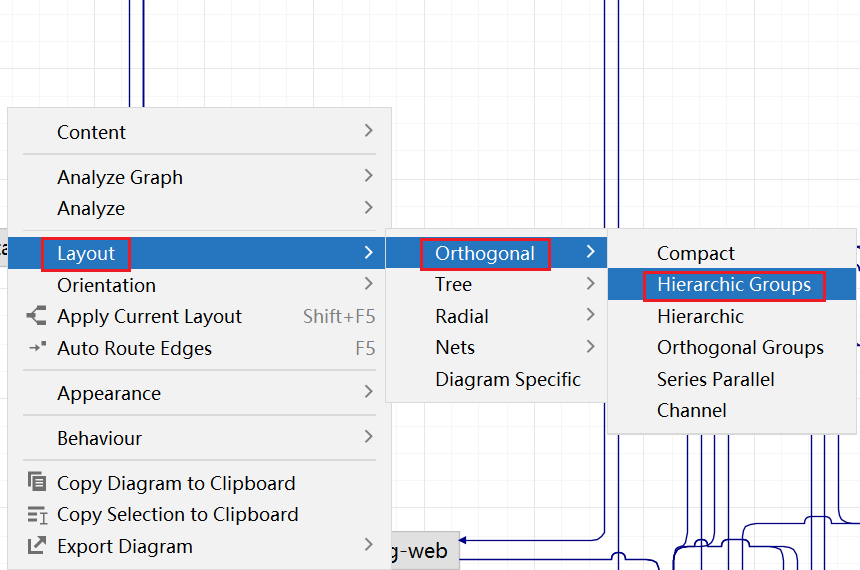

`鼠标右击 ——> Appearance ——> Show Bridges`，点击后会消失桥梁


`鼠标右击 ——> Appearance ——> Merge Edges`，`By Sources` 和 `By Targets` 都要取消勾选


`鼠标右击 ——> Appearance ——> Edge Shape ——> Straight Polyline`，使拐角圆滑变为直接

- **Arc**：使用圆弧形状的连线，使连接更加圆滑。
- **Bezier**：使用贝塞尔曲线，使连线呈现出流畅的曲线形状，适合需要柔和转折的连接。
- **Quad Curve**：使用二次曲线连接，提供一种平滑的曲线效果。
- **Spline**：使用样条曲线，使连线更自然和流畅，适合复杂的曲线连接。
- **Straight Polyline（Polyline：折线）**：使用直线折线连接，连线由多个直线段组成，适合需要明确路径的连接。
- **Smoothed Polyline**：使用平滑的折线连接，直线段之间的转折点更圆滑。


最后点击工具栏中的 `Apply Current Layout` 图标，它会帮助你根据当前你选择的布局重新排列


此时展现的图标就非常有条理


---

## 三、依赖排除

图中的红色实线就算是冲突的，可以入上图那样，右键，排除，他就自动在pom文件里面给exclud啦。


还有一种是虚线的红线，这种虚线，告诉你同一个jar都在哪里被多次引用了。


---

## 四、快捷方式

<kbd>ctrl + f</kbd> 可以查找jar包


点击工具栏中的 `Actual Size` 可以将图标调整到合适大小


Windows电脑按 <kbd>alt</kbd> 就可以使用放大镜


---

# MyBatis自定义JSON类型处理器

## 一、使用场景

|         实体类          |                 数据库                  |
| :---------------------: | :-------------------------------------: |
|     `List<String>`      |           `["user", "admin"]`           |
| `List<List<List<ADT>>>` | `{"ADT":[[{"BookingCode":["N","N"]}]]}` |

复杂的Bean的定义如下（包含泛型）

```java
@Data
public class ADT {
    private List<String> BookingCode;
}

@Data
public class Price {
    private List<List<ADT>> ADT;
}
```

---

## 二、实现步骤

**UserMapper.xml**

~~~xml

<resultMap id="UserResult" type="User">
    <result property="userRole" column="user_role" typeHandler="cn.luoyan.elitecode.common.utils.JSONTypeHandler"/>
</resultMap>

<insert id="insertUser" useGeneratedKeys="true" keyProperty="userId">
insert into user(
<if test="userRole != null and userRole != ''">user_role,</if>
)
values(
<!-- PS：这里typeHandler无需用引号包围 -->
<if test="userRole != null and userRole != ''">
    #{userRole, typeHandler=cn.luoyan.elitecode.common.utils.JacksonTypeHandler},
</if>
)
</insert>
~~~

**添加类型处理器**

~~~java
package cn.luoyan.elitecode.common.utils;

import cn.hutool.core.lang.TypeReference;
import cn.hutool.json.JSONUtil;
import org.apache.commons.lang3.StringUtils;
import org.apache.ibatis.type.BaseTypeHandler;
import org.apache.ibatis.type.JdbcType;

import java.sql.CallableStatement;
import java.sql.PreparedStatement;
import java.sql.ResultSet;
import java.sql.SQLException;
import java.util.List;

public class JacksonTypeHandler<T> extends BaseTypeHandler<T> {

    private Class<T> type;

    public JacksonTypeHandler(Class<T> type) {
        this.type = type;
    }

    /**
     * 将非空参数设置到 PreparedStatement 中的指定位置
     *
     * @param preparedStatement 要设置参数的 PreparedStatement 对象
     * @param i                 参数的位置索引，从 1 开始
     * @param parameter         要设置的参数值，类型为 String
     * @param jdbcType          参数的 JDBC 类型，用于正确转换 Java 类型到数据库类型
     * @throws SQLException 如果设置参数时发生 SQL 异常
     */
    @Override
    public void setNonNullParameter(PreparedStatement preparedStatement, int i, T parameter, JdbcType jdbcType) throws SQLException {
        preparedStatement.setString(i, this.toJSON(parameter));
    }

    /**
     * 从 ResultSet 中获取指定列名的可为空结果
     *
     * @param resultSet  要从中获取结果的 ResultSet 对象
     * @param columnName 列名
     * @return 指定列名的结果，如果为空则返回 null
     * @throws SQLException 如果获取结果时发生 SQL 异常
     */
    @Override
    public T getNullableResult(ResultSet resultSet, String columnName) throws SQLException {
        String json = resultSet.getString(columnName);
        return StringUtils.isEmpty(json) ? null : this.parse(json);
    }

    /**
     * 从 ResultSet 中获取指定列索引的可为空结果
     *
     * @param resultSet   要从中获取结果的 ResultSet 对象
     * @param columnIndex 列的索引，从 1 开始
     * @return 指定列索引的结果，如果为空则返回 null
     * @throws SQLException 如果获取结果时发生 SQL 异常
     */
    @Override
    public T getNullableResult(ResultSet resultSet, int columnIndex) throws SQLException {
        String json = resultSet.getString(columnIndex);
        return StringUtils.isEmpty(json) ? null : this.parse(json);
    }

    /**
     * 从 CallableStatement 中获取指定列索引的可为空结果
     *
     * @param callableStatement 要从中获取结果的 CallableStatement 对象
     * @param columnIndex       列的索引，从 1 开始
     * @return 指定列索引的结果，如果为空则返回 null
     * @throws SQLException 如果获取结果时发生 SQL 异常
     */
    @Override
    public T getNullableResult(CallableStatement callableStatement, int columnIndex) throws SQLException {
        String json = callableStatement.getString(columnIndex);
        return StringUtils.isEmpty(json) ? null : this.parse(json);
    }

    /**
     * 字符串转JSON
     * @param parameter
     * @return
     */
    private String toJSON(T parameter) {
        return JSONUtil.toJsonStr(parameter);
    }

    /**
     * JSON转字符串
     * @param json
     * @return
     */
    private T parse(String json) {
        // 使用 TypeReference 来保留完整的泛型信息，避免因类型擦除导致的问题
        return JSONUtil.toBean(json, new TypeReference<T>() {}, false);
    }
}
~~~

---

## 三、为什么使用 `JSONUtil.toBean(json, new TypeReference<T>() {}, false)` 而不是直接使用 `JSONUtil.toBean(json, type)`？

**1）`JSONUtil.toBean(json, type)`**

这个方法主要用于将 JSON 对象转换为指定的 Java 类型。它的局限性在于：

- 它接受一个 `Class` 对象作为参数，这个 `Class` 对象在运行时不包含泛型信息。
- 由于 Java 的类型擦除机制，`List.class` 在运行时只代表原始的 `List` 类型，不包含元素类型信息。
- 对于 `["user", "admin"]` 这样的 JSON 数组，该方法无法正确识别元素应该是什么类型。
- 结果可能是一个包含 `Object` 类型元素的 `List`，而不是 `String` 类型。

示例：

```java
String json = "[\"user\", \"admin\"]";
List<String> list = JSONUtil.toBean(json, List.class); // 这不会正确工作
```


**2）`JSONUtil.toBean(json, new TypeReference<T>() {}, false)`**

这个方法更加灵活，能够处理复杂的泛型类型：

- Hutool 的 `TypeReference` 是一个抽象类，通过创建匿名内部类的方式来捕获完整的泛型类型信息。
- 当你使用 `new TypeReference<List<String>>() {}` 时，Hutool 可以通过反射获取到完整的泛型类型信息，包括元素类型。
- 这使得 Hutool 能够正确地将 JSON 数组中的元素解析为 `String` 类型。

示例：

```java
String json = "[\"user\", \"admin\"]";
List<String> list = JSONUtil.toBean(json, new TypeReference<List<String>>() {}, false); // 这可以正确工作
```


---

# 使用轻量应用服务器搭建图床（整合Typora、PicGo版）

## 一、在Nginx配置静态资源映射

我们需要通过Nginx设置一个网站，用来展示我们的图片，因为我们刚刚已经通过宝塔安装Nginx，所以在这再设置一个网站：


我们这里设置的图床网站地址为：`/www/wwwroot/elitecode`：默认创建的文件没有用可以删掉


---

## 二、提供API接口

编写API接口

~~~java
package cn.luoyan.elitecode.controller;

import cn.luoyan.elitecode.common.AjaxResult;
import cn.luoyan.elitecode.common.constant.HttpStatus;
import org.springframework.beans.factory.annotation.Value;
import org.springframework.web.bind.annotation.PostMapping;
import org.springframework.web.bind.annotation.RequestMapping;
import org.springframework.web.bind.annotation.RestController;
import org.springframework.web.multipart.MultipartFile;

import java.io.File;
import java.io.IOException;
import java.nio.file.Paths;
import java.time.Instant;
import java.time.ZoneId;
import java.time.format.DateTimeFormatter;
import java.util.UUID;

/**
 * 文件接口
 */
@RestController
@RequestMapping("/file")
public class ImageUploadController {

    @Value("${file.upload.path}")
    private String uploadPath;
    @Value("${file.upload.subdirectory}")
    private String uploadSubdirectory;

    @Value("${file.access.url}")
    private String accessURL;
    @Value("${file.access.subdirectory}")
    private String accessSubdirectory;

    //上传图片
    @PostMapping("/upload")
    public AjaxResult<String> uploadImg(MultipartFile uploadFile) {
        if (uploadFile.isEmpty()) {
            return AjaxResult.error(HttpStatus.PARAMS_ERROR, "请选择文件");
        }
        // 按月份存储，获取存储目录
        String dir = DateTimeFormatter.ofPattern("yyyy-MM").format(Instant.now().atZone(ZoneId.of("Asia/Shanghai")));
        File targetLocation = Paths.get(uploadPath, uploadSubdirectory, dir).toFile();
        if (!targetLocation.exists()) {
            targetLocation.mkdirs();
        }
        // 获取上传图片名称
        String originalFilename = uploadFile.getOriginalFilename();
        // 获取文件扩展名
        String extName = originalFilename.substring(originalFilename.lastIndexOf("."));
        // 拼接的图片路径，使用UUID命名避免文件发生覆盖
        String newFileName = UUID.randomUUID().toString() + extName;
        File filePath = new File(targetLocation, newFileName);
        //上传图片
        try {
            uploadFile.transferTo(filePath);
        } catch (IllegalStateException e) {
            e.printStackTrace();
        } catch (IOException e) {
            e.printStackTrace();
        }
        //返回图片访问url
        return AjaxResult.success(accessURL + "/" + accessSubdirectory + "/" + dir + "/" + newFileName);
    }
}
~~~

application.yml

~~~yml
# 文件相关配置
file:
  upload:
    # 文件上传的根路径
    path: /www/wwwroot/elitecode
    # 文件存储的子目录
    subdirectory: cos
  access:
    # 文件访问的基础URL
    url: https://pic.luo-yan.cn
    # 文件访问URL的子路径
    subdirectory: cos
~~~

---

## 三、配置反向代理


---

## 四、修改SpringBoot文件上传默认单个文件最大大小

application.yml

~~~yml
# Spring配置
spring:
  servlet:
    multipart:
      #配置单个文件最大上传大小
      max-file-size: 10MB
      #配置单个请求最大上传大小(一次请求可以上传多个文件，多个文件的总大小不能超过100M，通过集合上传)
      max-request-size: 100MB
~~~

---

## 五、测试

这里使用postman测试

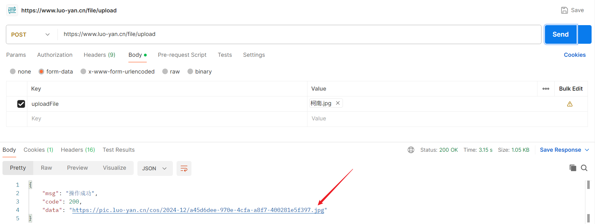

点开返回的图像地址，可以发现图片上传成功


---

## 六、整合PicGo

插件官网：https://github.com/yuki-xin/picgo-plugin-web-uploader

下载好release后导入PicGo即可

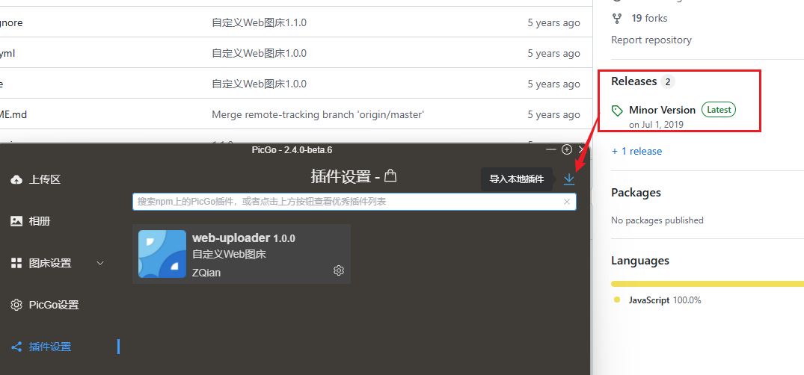

新建自定义Web图床


图床配置

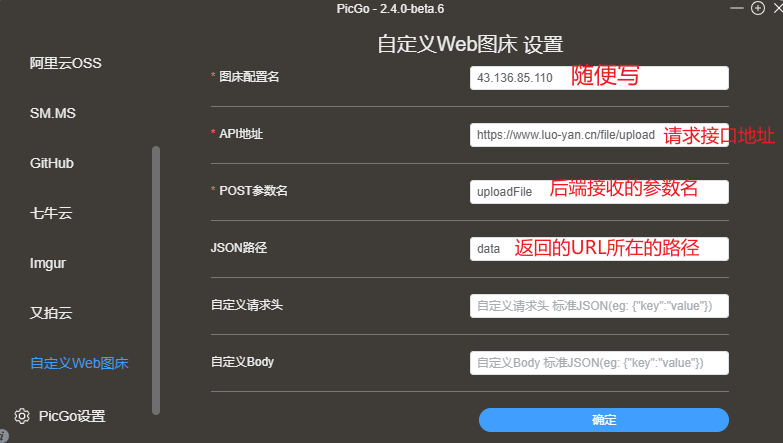

---

## 七、整合Typora

在Typora的偏好设置中进行如图设置即可


随便复制一张图片到md文件，可以看见上传成功，并在md文件中成功显示图片


---

## 八、踩坑

最开始我的API返回的URL并没有封装成对象，而是直接返回一个字符串

~~~java
//上传图片
@PostMapping("/upload")
public String uploadImg(MultipartFile uploadFile) {
    ....
    //返回图片访问url
    return accessURL + "/" + accessSubdirectory + "/" + dir + "/" + newFileName;
}
~~~

当我在md文件中进行测试时，它所显示的格式如下图，多了一个双引号，导致图片无法正确显示

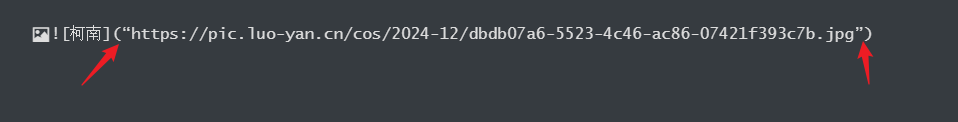

解决办法：将返回的URL封装成JSON对象，此时Typora即可正确解析格式


---

# 简历

中文字体：微软雅黑

英文字体：Segoe UI


表格垂直居中：


调整表格的段后距离：

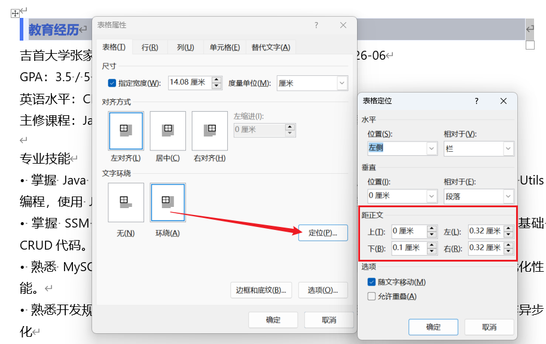

表格使用格式刷

调整文字间距


图片与文字对齐：选中图片所在的段落

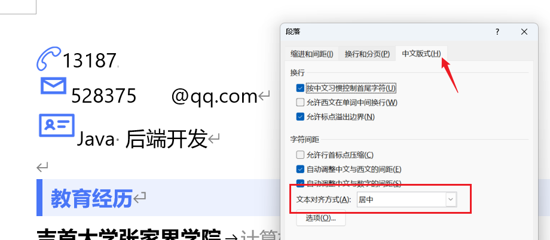


---

# MyBatis XML时间范围查询

方式一：使用实体字符

~~~xml
<if test="updateTime != null">and update_time &lt;= #{updateTime}</if>
~~~

方式二：

~~~xml
<if test="createTime != null">and createTime between #{startTime} and #{endTime}</if>
~~~


---

# MySQL JSON函数

PS：阅读MySQL官方文档真的很考验英语水平哈哈哈o(╥﹏╥)o

祝明天四六级的小伙伴过过过~

官网：https://dev.mysql.com/doc/refman/8.4/en/json-function-reference.html

下面展示我遇到的两种情况，以后遇到会继续补充

## 一、搜索JOSN值的函数

官方文档：https://dev.mysql.com/doc/refman/8.4/en/json-search-functions.html#function_json-contains

格式：

~~~sql
JSON_CONTAINS(target*, candidate[, path])
~~~

通过返回 1 或 0  来指示给定的候选 JSON 文档是否包含在目标 JSON 文档中。

要仅检查路径上是否存在任何数据，请使用 `JSON_CONTAINS_PATH()`。

以下规则定义了包含关系：

1. 当且仅当候选标量和目标标量可比较且相等时，候选标量才包含在目标标量中。两个标量值可比较的条件是它们具有相同的 JSON_TYPE() 类型，但 INTEGER 和 DECIMAL 类型的值也可以互相比较。
2. 当且仅当候选数组中的每个元素都包含在目标数组的某个元素中时，候选数组才包含在目标数组中。
3. 当且仅当候选非数组包含在目标数组的某个元素中时，候选非数组才包含在目标数组中。
4. 当且仅当候选对象中的每个键在目标对象中都有相同名称的键，并且与候选键关联的值包含在与目标键关联的值中时，候选对象才包含在目标对象中。

使用场景：

需求：后端存储 `user_roles字段` 为JSON数组，我想筛选有哪些用户具有某个角色

~~~sql
select * FROM user where JSON_CONTAINS(user_roles, '"admin"');
~~~

效果如下：

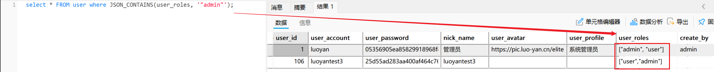

xml

~~~xml
<if test="userRole != null and userRole != ''">and JSON_CONTAINS(user_role, JSON_QUOTE(#{userRole}))</if>
~~~

---

## 二、筛选JSON里面的字段

官网文档：https://dev.mysql.com/doc/refman/8.4/en/json-search-functions.html#function_json-extract

格式：

~~~sql
JSON_EXTRACT(json_doc, path[, path] ...)
~~~

从 JSON 文档中返回数据，数据由路径参数匹配的文档部分选出。如果任何参数为 NULL 或没有路径在文档中找到值，则返回 NULL。如果 json_doc 参数不是有效的 JSON 文档，或者任何路径参数不是有效的路径表达式，则会出现错误。

返回值由路径参数匹配的所有值组成。如果这些参数可能返回多个值，匹配的值会自动包装成一个数组，顺序与生成它们的路径相对应。否则，返回值是单个匹配的值。

使用场景：

需求：写出mapper xml文件，我想要查找sys_data表中data字段，其中data字段是一个JSON，图二中的map参数，需要让JSON中的key与map中的key相等并且value也相等的数据，图三为sys_data表结构，请拿map中存储'key1'->'1'举例

~~~xml
<select id="shit" resultType="com.example.SysData">
    SELECT *
    FROM sys_data
    WHERE docuId = #{docuId}
    <if test="map != null and map.size() > 0">
        <foreach item="value" index="key" collection="map">
            AND JSON_EXTRACT(data, CONCAT('$.', #{key})) = #{value}
        </foreach>
    </if>
</select>
~~~

1. `index`属性的作用：
   - 在遍历集合时，`index`属性表示当前遍历到的元素的索引或键。
   - 对于List或数组，它代表元素的索引（从0开始）。
   - 对于Map，它代表当前元素的键（key）。
2. `item="value"` 表示我们将Map的值赋值给变量"value"。
3. JSON_EXTRACT 是一个MySQL函数，用于从JSON格式的数据中提取特定的值。这个函数在处理JSON数据时非常有用，特别是当你需要查询或操作存储在数据库中的JSON字段时。让我详细解释一下：
   1. 基本用法： JSON_EXTRACT(json_doc, path)
      - json_doc：JSON文档或JSON格式的字符串
      - path：用于指定要提取的值的路径
   2. 路径语法：
      - '$'表示整个JSON文档
      - '$.key'用于访问顶层的key
      - '$[0]'用于访问数组的第一个元素
      - '$.key1.key2'用于访问嵌套的JSON对象

---

## 三、将字符串作为 JSON 值引用

格式：

~~~sql
JSON_QUOTE(string)
~~~

将字符串作为 JSON 值引用，通过用双引号包裹并转义内部引号和其他字符，然后将结果作为 utf8mb4 字符串返回。如果参数为 NULL，则返回 NULL。

此函数通常用于生成有效的 JSON 字符串字面量，以包含在 JSON 文档中。

某些特殊字符根据表 14.23 “JSON_UNQUOTE() 特殊字符转义序列”中的转义序列用反斜杠转义。


---

# 使用Excel做待办列表

选中E2:E~(底)，【数据】→【数据验证】，允许【序列】，序列来源为：R,S

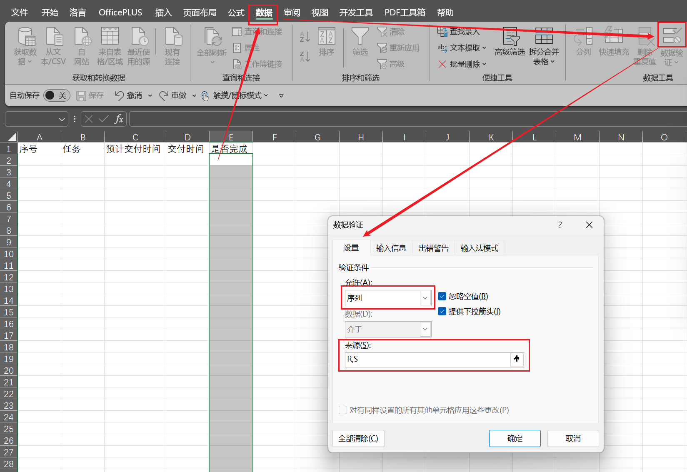

将F2:F12单元格区域的字体设置为Wingdings 2。

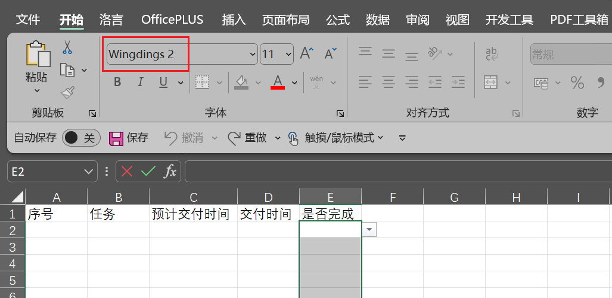

设置完成后，可在F列单击下拉菜单，选择R时，单元格显示为带方框的√号，表示当前事项已完成。选择S时，单元格显示为带方框的×号，表示当前事项尚未完成。

选中A2:E~(底)单元格区域，【开始】选项卡→【条件格式】→【新建规则】

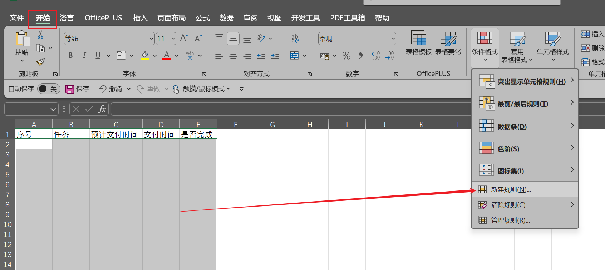

选择【使用公式确定要设置格式的单元格】。

在公式编辑框中输入以下公式，单击【格式】按钮，设置一种填充颜色：
`=$E2="R"`

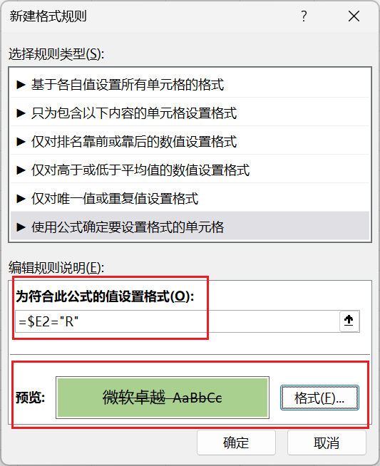

测试：


---

# MyBatis参数计算

## 一、问题

前端传入参数，PageRequest.java

~~~java
/**
 * 当前页号
 */
private int current = 1;

/**
 * 页面大小
 */
private int pageSize = 10;
~~~

xml文件

~~~xml
limit #{(current - 1) * pageSize}, #{pageSize}
~~~

报错

~~~
org.mybatis.spring.MyBatisSystemException: nested exception is org.apache.ibatis.builder.BuilderException: Parsing error in {(current - 1) * pageSize} in position 14
~~~

---

## 二、解决办法

### ① 法一

PageRequest.java 新增属性

~~~java
/**
 * 分页起始索引（默认为0）
 */
private int offset = 0;
~~~

Controller中进行动态计算

~~~java
pageRequest.setOffset((pageRequest.getCurrent() - 1) * pageRequest.getPageSize());
~~~

xml

~~~xml
limit #{offset}, #{pageSize}
~~~

---

### ② `<bind>` 标签

官方文档：https://mybatis.org/mybatis-3/zh_CN/dynamic-sql.html#bind-1

~~~xml
<select id="selectUserList" resultMap="UserResult">
    <bind name="offset" value="(current - 1) * pageSize" />
    select
    <include refid="selectUserVo"/>
    from
    user
    <where>
        <if test="userId != null and userId != 0">and user_id=#{userId}</if>
        <if test="userAccount != null and userAccount != ''">and user_account like '%${userAccount}%'</if>
        <if test="nickName != null and nickName != ''">and nick_name like '%#{nickName}%'</if>
        <if test="userRole != null and userRole != ''">and JSON_CONTAINS(user_roles, JSON_QUOTE(#{userRole}))</if>
        <if test="createBy != null and createBy != ''">and create_by like '%#{createBy}%'</if>
        <if test="updateBy != null and updateBy != ''">and update_by like '%#{updateBy}%'</if>
        <if test="startTime != null and endTime != null">and create_time between #{startTime} and #{endTime}</if>
    </where>
    <if test="sortField != null and sortField != ''">
        ORDER BY #{sortField}, #{sortOrder}
    </if>
    limit #{offset}, #{pageSize}
</select>
~~~

---

### ③ 使用 `$` 字符串拼接

xml

~~~xml
limit ${(current - 1) * pageSize}, #{pageSize}
~~~


---

# 【MyBatis】原来 `${}` 和 `#{}` 藏有这么多坑！

## 一、引入

众所周知，MyBatis获取参数值的两种方式：`${}` 和 `#{}`；`${}` 的本质就是字符串拼接，`#{}` 的本质就是占位符赋值。

`${}` 使用字符串拼接的方式拼接sql，若为字符串类型或日期类型的字段进行赋值时，需要手动加单引号；但是 `#{}` 使用占位符赋值的方式拼接sql，此时为字符串类型或日期类型的字段进行赋值时，可以自动添加单引号。

接下来考考大家，下面 `？` 的地方应该填 `$` 还是 `#`？（下面参数均为String类型）

~~~xml
select * from t_user where username like '%？{username}%'
~~~

~~~java
select * from t_user where username like "%"？{username}"%"
~~~

~~~xml
<if test="orderByList != null and orderByList.size() != 0">
    ORDER BY
    <foreach collection="orderByList" separator="," item="orderByItem">
        ？{orderByItem}
    </foreach>
</if>
~~~

---

## 二、解释

第一个案例应为 `$`，解释：

由于我们使用的是模糊查询，`%#{username}%` 需要写在一对单引号中，单引号在mysql中表示的是一个字符串；当我们用 `#{}` 时，并且在执行时，`?` 会代替 `#{}` 的时候，`?` 就存在了 `#{}` 里面，这个时候就会把 `?` 当做字符串的一部分，因此应该使用 `${}` 进行字符串拼接

~~~xml
select * from t_user where username like '%${username}%'
~~~

---

第二个案例应为 `#`，解释：

~~~xml
select * from t_user where username like "%"#{username}"%"
~~~

假设传入的参数 `username` 的值是 `john`，使用占位符后的 SQL 语句：

~~~java
SELECT * FROM t_user WHERE username LIKE "%john%"
~~~

在这种情况下，`#{username}` 会直接被替换为参数值，而不加引号。

因此，替换后是 `"%john%"`，而不是 `"%""%john%""%"`。

---

第三个案例应为 `$`，

~~~java
<if test="orderByList != null and orderByList.size() != 0">
    ORDER BY
    <foreach collection="orderByList" separator="," item="orderByItem">
        ${orderByItem}
    </foreach>
</if>
~~~

这是因为如果使用 `#{}`，那么在SQL解析的时候会加上单引号，假设传入的值为 `create_time desc, userId desc`，那么SQL解析后的结果就为

~~~xml
ORDER BY 'create_time desc, userId desc'
~~~

此时排序是不生效的，因此需要使用 `${}` 让它不自动加单引号

~~~xml
ORDER BY create_time desc, userId desc
~~~


# ----------------