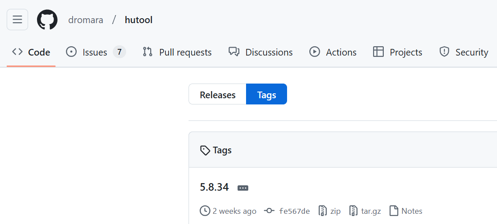

# 项目搭建（后端）

- [x] 创建Maven项目

- [x] 搭建SpringBoot工程，使用2.7.2版本

- [x] 库表设计

  - [x] 用户表
  - [x] 题目表
  - [x] 题库表
  - [x] 题目关联表

- [x] 使用CDN和轻量应用服务器搭建个人图床

  - [x] 搭建宝塔
  - [x] 静态网址绑定
  - [x] 搭建git
  - [x] 启动CDN加速
  - [x] 编写教程

- [x] 连接数据库

- [x] 整合Druid

- [x] 整合Knife4j：https://doc.xiaominfo.com/docs/quick-start

- [x] 封装自定义异常类

- [x] 全局异常处理器

- [x] 通用返回类

- [x] 规划后端项目目录

- [x] 分层领域模型包规划：创建用户DTO、VO

- [x] MyBatis别名配置

- [x] 解决跨域

- [x] 修改selectUserByUserAccountAndUserPassword为selectUserByUserAccount，原因：不仅仅是用户登录要用到selectUserByUserAccount，用户注册也需要用到

- [x] 将日志打印修改为自定义xml文件，同时修改MyBatis日志打印工具为Logback

- [x] 实体类角色字段类型修改为List，修改XML文件使数据库字段String-JSON类型与实体类字段List类型进行转换（自写JSON类型处理器）

- [x] 数据库设置默认值好还是在代码中编写好？
  参考博客：https://www.navicat.com.cn/company/aboutus/blog/369-mysql-

- [x] 搜索提交规范中每一个规范英文代表什么

- [x] 搭建服务器图床，目的：能够使用PicGo上传

- [ ] 整理task，将已完成的任务移到后面，重新规划需要完成的任务

- [ ] 学习Excel，将task抽取为：开发进度.xlsx

  代办列表：https://www.excelhome.net/5296.html、https://zhuanlan.zhihu.com/p/215262754

- [ ] 坚持写工作周报
  参考：https://blog.csdn.net/qq_39609151/article/details/83780540

- [ ] 学习Excel数据验证、函数

- [x] 包名从cn.luoyan.elitecode改为cn.elitecode

- [ ] 补充Swagger注解

- [x] 校验规范修改（不为空和查询数据库应该合并成一个方法）

- [ ] 抽取Register、LoginController

- [x] 删除Common3工具类，只使用hutool工具类

- [ ] 新增日志模块

- [ ] 操作日志

- [x] 分模块开发

  - [x] （写博客）使用IDEA查看模块之间的依赖关系：https://blog.csdn.net/qq_27579471/article/details/121557639

- [ ] 抽取BaseEntity（参考若依）

- [ ] 分离出 `ec-security` 模块，参考mall项目

- [ ] HttpStates需要更细划分


---

## 登录

- [ ] 记录登录信息，参考若依

  ~~~java
  /**
   * 记录登录信息
   *
   * @param userId 用户ID
   */
  public void recordLoginInfo(Long userId)
  {
      SysUser sysUser = new SysUser();
      sysUser.setUserId(userId);
      sysUser.setLoginIp(IpUtils.getIpAddr());
      sysUser.setLoginDate(DateUtils.getNowDate());
      userService.updateUserProfile(sysUser);
  }
  ~~~

- [x] 优化登录接口，返回tokenHead、token


---

## 用户模块

- [x] 注册

- [x] 登录

- [x] 注销

- [x] 分页获取用户数据

- [x] 新增用户

- [x] 批量删除用户

- [x] 增加逻辑删除（del_flag）

- [x] 更新个人信息接口

- [x] 根据id更新用户信息

- [x] 更新个人信息头像

  若依：/avatar

  微人事：/hr/userface

- [x] 获取个人信息接口

- [x] 使用ThreadLocal记录当前线程的用户id

- [x] 制作个人简历，参考老鱼简历、超级简历

- [ ] 重置密码

  微人事：/hr/pass

  若依：/updatePwd、/resetPwd

- [ ] 忘记密码

- [ ] 将用户表中的角色字段抽取出来，做成用户表，然后新建 `用户-角色关联表`

- [ ] controller层校验全部改为JSR-303校验


---

## 题目表

- [ ] 增删改查


---

## 题库表

- [ ] 增删改查


---

## 题目题库关联表

- [ ] 增删改查


---

# 项目搭建（前端）

- [x] 初始化Vue3
- [x] 创建路由
- [ ] 自己写默认样式(@/assets/styles/index.less)
- [x] 封装axios实例、api
- [x] 配置axios拦截器
- [x] 配置axios响应拦截器中的失败回调
- [ ] 使用**NProgress**搭建轻量级的页面加载进度条（参考若依，在全局路由守卫中）
- [x] 配置环境变量（`.env.xxx文件`）
  - axios url
- [ ] form表单数据一并改为使用ref，此时接口参数可以直接 `...loginRef.value`
- [ ] 一切await改为 `then…catch…`，方便异常处理
- [ ] 阅读完“从 Vue 3 的项目模板学习 tsconfig 配置”并附加上官网网址
- [x] 登录注册页面加上背景
- [ ] 配置eslint
- [ ] 配置prettier
- [ ] 配置stylelint（scss）
- [ ] 配置husky
- [ ] 配置commitlint
- [ ] 配置环境变量
- [ ] SVG图标设置

- [x] 退出登录
---

## 登录

- [x] 样式编写
- [x] 表单校验
- [ ] 重置表单
- [ ] 表单校验
- [x] 表单校验
- [x] 登录成功跳转到主页
- [ ] 记住密码
- [x] 登录按钮增加loading：登录、登录中...（参考若依）
- [ ] 动态加载和管理 SVG 图标
- [x] 搭建Pnia
- [x] 获取用户信息放到Pinia
- [x] 按enter可登录
- [x] 登录成功
  - [x] 将login抽取到pinia中的actions中
  - [x] 编写路由守卫（permission.ts）
  - [x] 获取用户信息并放到pinia中
  - [x] axios拦截器：添加header（Authorization）


---

## 注册

- [x] 样式编写
- [x] 跳转登录页
- [x] 编写注册api
- [x] 表单校验
- [x] 按enter可注册
- [x] 注册按钮：注册、注册中...
---

## 布局

- [x] 样式编写

- [ ] 像若依（AppMain.vue）一样加一个过度

  ~~~html
  <router-view v-slot="{ Component, route }">
    <transition name="fade-transform" mode="out-in">
      <keep-alive :include="tagsViewStore.cachedViews">
        <component v-if="!route.meta.link" :is="Component" :key="route.path"/>
      </keep-alive>
    </transition>
  </router-view>
  ~~~

- [ ] 使用keepalive缓存router-view

- [ ] 自写`<sidebar class="sidebar-container"></sidebar>`，参考mall

  ~~~html
  <div class="app-wrapper" :class="classObj">
    <sidebar class="sidebar-container"></sidebar>
    <div class="main-container">
      <navbar></navbar>
      <app-main></app-main>
    </div>
  </div>
  ~~~

- [ ] 实现个人中心、退出登录跳转

- [ ] 抽离Navbar

- [x] 配置404路由


---


- [x] 初始化NextJS工程

- [x] 引入AntDesign组件库

- [x] 通用布局

- [ ] 登录 / 注册页面

- [x] 生产环境和本地环境配置：https://nextjs.org/docs/app/building-your-application/configuring/environment-variables

  


---

# 待测试

- [ ] 获取个人信息接口


----

# 上线

- [ ] 上线项目，增加Knife4j账号密码配置
- [ ] `elite-code.cn` 域名购买
- [ ] 域名备案
- [x] 网站图标更换
- [ ] SEO 全方位解决方案：https://juejin.cn/post/7241813423460581435
- [ ] 学习PS，学会用PS抠图
- [ ] 学习搭建DNS服务器，并编写博客


----

# 框架

- [x] 使用SpringSecurity改写
- [ ] 学若依
  - [ ] 手动写字符串格式化类StrFormatter


----

# 文件管理

- [ ] mall：minio
- [ ] vhr：fastdfs（分布式文件管理系统）


----

# 思考

- [ ] 校验写在Controller还是Service好？

  因为就算写在Controller，Service方法也有可能对外暴露一个rpc协议的接口，由其他程序来调用。

- [ ] Mac安装Docker

- [ ] 使用Docker部署EC

- [ ] 


----

# git

- [x] Commit message（提交说明）规范

  阿里云的回答：https://zhuanlan.zhihu.com/p/182553920

- [x] tag复习

- [ ] Git整合分支的两种方法——合并(git merge)与变基(git rebase)的区别

  参考文章：https://blog.csdn.net/wpw2000/article/details/115890784


---

# GitHub

- [ ] github中的release是如何产生的（和tag的联系？）

  

  文章：

  https://gitwebcn.com/49979.html

  https://docs.github.com/zh/repositories/releasing-projects-on-github/managing-releases-in-a-repository

- [ ] Issue 提问的正确方式

  教程：https://blog.csdn.net/cool99781/article/details/105821546

  提问规范：https://github.com/ReadingPapers/Report/issues/2

- [ ] 了解GitHub导航栏中每一个按钮的作用和使用

  

- [ ] 在 Git 提交信息中使用 Emoji（参考Git笔记）

- [ ] 美化github文件图标（参考Git笔记）

- [ ] 如何做出炫酷的REDME？

- [ ] github上有项目可以命令行上传文件到百度网盘，可以尝试服务器写个shell脚本定期备份图片到百度网盘

- [ ] 开源项目批量修改Markdown笔记中的链接

- [ ] 管理个人资料自述文件，文章：https://docs.github.com/zh/account-and-profile/setting-up-and-managing-your-github-profile/customizing-your-profile/managing-your-profile-readme

- [ ] 贪吃蛇动画：

  文章：https://www.14k.top/blog/github-contribution-grid-snake、https://zhuanlan.zhihu.com/p/415688871

  Github：https://github.com/Platane/snk

- [ ] Github-Readme-Stats

  GitHub：https://github.com/anuraghazra/github-readme-stats
  
- [ ] 申请LICENSE


---

# README

mall：https://github.com/macrozheng/mall

微人事：https://github.com/lenve/vhr

vue-next-admin：https://github.com/lyt-Top/vue-next-admin

系统架构图、业务架构图：参考mall's README


---

# 安全

- [ ] 账号、密码不存在改为：账号或密码不存在

- [ ] 整合 SpringSecurity

  SpringSecurity入门：

  https://mp.weixin.qq.com/s?__biz=MzI1NDY0MTkzNQ==&mid=2247486003&idx=1&sn=7cea98049764fa7d8f7dbe05472d2e02&scene=21#wechat_redirect

  https://zhuanlan.zhihu.com/p/365513384（强推）

  - [x] SpringSecurity整合JWT

  - [x] 了解Bearer Token：https://docs.apifox.com/5734558m0

  - [ ] 认证失败处理类

  - [ ] 添加Logout filter

    ~~~java
    // 添加CORS filter
    .addFilterBefore(corsFilter, JwtAuthenticationTokenFilter.class)
    .addFilterBefore(corsFilter, LogoutFilter.class)
    ~~~

  - [ ] 封装JwtTokenUtil


---

# Redis

- [ ] JWT存UserDetails应该改为存token（参考若依项目）
- [ ] 


----

# 学习类

- [x] JDBC回顾

- [x] ServerSocket回顾

- [ ] JavaWeb回顾

- [ ] SSM回顾

  前端

- [x] TS回顾

- [x] React回顾

- [x] 学习SpringSecurity

- [ ] 重学Promise

- [ ] git

  - [x] 复习
  - [ ] 整理git笔记
  - [ ] 学习git的游戏：https://learngitbranching.js.org/?locale=zh_CN
  - [ ] merge、rebase：
    - [ ] https://www.cnblogs.com/FraserYu/p/11192840.html
    - [ ] https://blog.csdn.net/the_power/article/details/104651772/
    - [ ] https://blog.csdn.net/wangdawei_/article/details/131669124
    - [ ] http://blog.csdn.net/weixin_42310154/article/details/119004977
    - [ ] IDEA使用rebase：https://blog.csdn.net/weixin_42812986/article/details/109260696
  - [ ] git diff学习：https://blog.csdn.net/qq_39505245/article/details/119899171
  - [ ] reflog学习
  - [ ] cherry-pick学习：https://blog.csdn.net/muzidigbig/article/details/122321393
  - [ ] HEAD~和HEAD^的作用和区别：https://blog.csdn.net/albertsh/article/details/106448035
  - [ ] 上传git笔记博客
  - [ ] fetch和pull的区别：https://zhuanlan.zhihu.com/p/123370920
  
- [ ] 学习scss：https://juejin.cn/post/7055101823442485255

- [ ] 学习对象ts写法

- [ ] Maven不同版本有什么区别？


---

# 官方文档

- [ ] ESLint
  - [ ] 已弃用配置文件：https://eslint.org/docs/latest/use/configure/configuration-files-deprecated
  - [ ] 扁平化配置文件：https://eslint.org/docs/latest/use/configure/configuration-files
  - [ ] 规则严重性：https://eslint.org/docs/latest/use/configure/rules#rule-severity


---

# 其他

- [ ] Mac安装centos：https://www.jianshu.com/p/5f66c7e5d364
- [ ] 学会搭建gitlab
- [ ] macos用户，在外置磁盘中装一个用户，并将微信、QQ安装在此用户下
- [ ] 环境使用手册
  - [ ] Maven环境搭建
  - [ ] Git环境搭建
  - [ ] WebStorm配置
  - [ ] NVM安装
  - [ ] 安装虚拟机软件
  - [ ] 安装CentOS7
  - [ ] 安装Docker


---

# 扩展设计

1）如果要实现会员功能，可以对表进行如下扩展：

1. 给 userRole 字段新增枚举值 `vip`，表示会员用户，可根据该值判断用户权限
2. 新增会员过期时间字段，可用于记录会员有效期
3. 新增会员兑换码字段，可用于记录会员的开通方式
4. 新增会员编号字段，可便于定位用户并提供额外服务，并增加会员归属感

对应的 SQL 如下：

```sql
vipExpireTime datetime     null comment '会员过期时间',
vipCode       varchar(128) null comment '会员兑换码',
vipNumber     bigint       null comment '会员编号'
```

2）如果要实现用户邀请功能，可以对表进行如下扩展：

1. 新增 shareCode 分享码字段，用于记录每个用户的唯一邀请标识，可拼接到邀请网址后面，比如 https://mianshiya.com/?shareCode=xxx
2. 新增 inviteUser 字段，用于记录该用户被哪个用户邀请了，可通过这个字段查询某用户邀请的用户列表。

对应的 SQL 如下：

```sql
shareCode     varchar(20)  DEFAULT NULL COMMENT '分享码',
inviteUser    bigint       DEFAULT NULL COMMENT '邀请用户 id'
```

---

1）如果要实现题库审核功能，可以对表进行如下扩展：

1. 新增审核状态字段，用枚举值表示待审核、通过和拒绝
2. 新增审核信息字段，用于记录未过审的原因等
3. 新增审核人 id 字段，便于审计操作。比如出现了违规内容过审的情况，可以追责到审核人。
4. 新增审核时间字段，也是便于审计。

对应的 SQL 如下：

```sql
reviewStatus  int      default 0  not null comment '状态：0-待审核, 1-通过, 2-拒绝',
reviewMessage varchar(512)        null comment '审核信息',
reviewerId    bigint              null comment '审核人 id',
reviewTime    datetime            null comment '审核时间'
```

2）如果要实现题库排序功能，可以新增整型的优先级字段，并且根据该字段排序。

该字段还可以用于快速实现题库精选和置顶功能，精选就是优先级比较高的内容，置顶就是优先级最高的内容，比如优先级 = 1000 的题库表示精选，优先级 = 10000 的题库表示置顶。

对应的 SQL 如下：

```sql
priority  int  default 0  not null comment '优先级'
```

3）如果要实现题库浏览功能，可以新增题库浏览数字段，每次进入题目详情页时该字段的值 +1，还可以根据该字段对题库进行排序。

对应的 SQL 如下：

```sql
viewNum  int  default 0  not null comment '浏览量'
```

如果要实现用户浏览数（同一个用户浏览数最多 +1），还需要额外的题库浏览记录表。


----

# 需求文档

| 项目名称                                       | 下载地址                                                     | 标签         |
| ---------------------------------------------- | ------------------------------------------------------------ | ------------ |
| 人事管理系统需求文档                           | 链接：https://pan.baidu.com/s/1AFgBrymHhI4BECZHYfWHug 提取码：uzrg | 【ERP】      |
| 大通ERP系统需求规格说明书V3.0                  | 链接：https://pan.baidu.com/s/1bax2USj7EkXcgL5nmde9Ow 提取码：2hvz | 【ERP】      |
| ERP需求分析                                    | 链接：https://pan.baidu.com/s/13vu96etHV-ic6WReg_0kOA 提取码：c6ub | 【ERP】      |
| 通天物流管理项目需求文档                       | 链接：https://pan.baidu.com/s/1a2_3D-GE9PmJmNCeJNubsA 提取码：xztf | 【物流】     |
| 华润物流配送系统需求文档                       | 链接：https://pan.baidu.com/s/1lsLCU3eqMGwfWLQd7ExaKg 提取码：d1sn | 【物流】     |
| 中外运物流配送系统需求文档                     | 链接：https://pan.baidu.com/s/1f7pWsGCNHKy3H9gnNB8SCQ 提取码：ly4w | 【物流】     |
| 闵行国际物流中心仓储管理系统需求文档           | 链接：https://pan.baidu.com/s/1omQANJVKhtZL3TvSFhoefg 提取码：48v7 | 【物流】     |
| 粤通物流系统设计说明书                         | 链接：https://pan.baidu.com/s/1RvORJTuoAjhjjxAuIKqFGA 提取码：nlas | 【物流】     |
| 物流指南App项目需求文档                        | 链接：https://pan.baidu.com/s/1Vhpvo2N0BcrFDMFB2KyJhw 提取码：q383 | 【物流】     |
| 在线考试系统需求说明书                         | 链接：https://pan.baidu.com/s/1P9U29Mbz8u6dOhxCmxzKQA 提取码：ssk8 | 【教育】     |
| 家校通系统需求文档                             | 链接：https://pan.baidu.com/s/1YyTRL4pZZD987NJfrL7JjA 提取码：odo4 | 【教育】     |
| 中山大学医院管理系统需求文档                   | 链接：https://pan.baidu.com/s/1BZuLiMjtWpsgrhDQj5tCDA 提取码：8m46 | 【医疗】     |
| ICU管理系统需求文档                            | 链接：https://pan.baidu.com/s/1jGZw_qKCfZrvzYWFhQxn9w 提取码：j0oz | 【医疗】     |
| X邦住院医生工作站需求文档                      | 链接：https://pan.baidu.com/s/1S3Nc_-KrpgOERDCWaoT5sQ 提取码：r9tm | 【医疗】     |
| 楚雄州人民医院信息化建设一体化集成系统需求文档 | 链接：https://pan.baidu.com/s/10cEEEtXIVsVwyKYSooUSiw 提取码：pzqi | 【医疗】     |
| 佛山区域卫生信息平台与区域电子病历需求文档     | 链接：https://pan.baidu.com/s/1ogpedXfAvWDIxaufppkzfA 提取码：wwup | 【医疗】     |
| 佛山区域医院信息系统                           | 链接：https://pan.baidu.com/s/13o7HF8XCWvk0YIypCeJSuA 提取码：xk23 | 【医疗】     |
| 合理用药监测系统需求文档                       | 链接：https://pan.baidu.com/s/12zP7u-LjHTrRCOVc1-J3RQ 提取码：4nd9 | 【医疗】     |
| 连锁药店进、销、存流程体系                     | 链接：https://pan.baidu.com/s/1iH__CjwW6bhQm9BjppScwg 提取码：7rmj | 【医疗】     |
| 临床检验信息系统软件需求文档                   | 链接：https://pan.baidu.com/s/1sJ4yFPbkM4Nylg-H_kvXyw 提取码：uds1 | 【医疗】     |
| 门诊医生工作站软件需求文档                     | 链接：https://pan.baidu.com/s/1FrKZOxq5PsjQpnk0cCfQqQ 提取码：5q2j | 【医疗】     |
| 统一维护管理平台软件需求文档                   | 链接：https://pan.baidu.com/s/1iac0rRus6QHpmLYhChRKCA 提取码：umbg | 【医疗】     |
| 医学影像系统PACS、RIS软件需求文档              | 链接：https://pan.baidu.com/s/1v861ilZCkr5Hlszs6ADqwQ 提取码：bbga | 【医疗】     |
| 医院his系统需求文档                            | 链接：https://pan.baidu.com/s/1CRNCaMSVER5S9u2cf539Cg 提取码：cel5 | 【医疗】     |
| 医院科研教学管理系统需求文档                   | 链接：https://pan.baidu.com/s/1tw6ax84B4XcdhO8V4POsNg 提取码：ohzo | 【医疗】     |
| 婴儿防盗系统需求文档                           | 链接：https://pan.baidu.com/s/1To2MyxckIKdqb-oFLoSvsA 提取码：wo2i | 【医疗】     |
| 预防保健管理系统软件需求文档                   | 链接：https://pan.baidu.com/s/1UN8ya0puygmcRp2MnIrOsw 提取码：5dbw | 【医疗】     |
| 预约挂号系统设计文档                           | 链接：https://pan.baidu.com/s/1eFSPDZlQvwul3fp4-51GVw 提取码：qh6s | 【医疗】     |
| 中联医院客户关系管理系统                       | 链接：https://pan.baidu.com/s/1kYhoVOtySZrfjPVNV97jEQ 提取码：6ey6 | 【医疗】     |
| 住院护士站软件需求文档                         | 链接：https://pan.baidu.com/s/1SE5WZ8594N4nM6Y1GjfzrQ 提取码：sgj9 | 【医疗】     |
| 住院结算信息系统软件需求文档                   | 链接：https://pan.baidu.com/s/1X_a_lfDtK40e84rh3EGj7w 提取码：5oh2 | 【医疗】     |
| 锦东地产物业管理系统需求分析                   | 链接：https://pan.baidu.com/s/1ERbJ9kiu3xh-D3FePhnPUQ 提取码：bsdr | 【物业】     |
| CrmSky客户关系管理系统需求文档                 | 链接：https://pan.baidu.com/s/1W9PaUp09YBNqikDqKRMKyw 提取码：jz6f | 【CRM】      |
| 江苏淮微CRM系统需求文档                        | 链接：https://pan.baidu.com/s/1aO0oWS2nEd3sV3hXoSJZgw 提取码：esqq | 【CRM】      |
| 客户关系管理系统需求文档                       | 链接：https://pan.baidu.com/s/17kIfQ4k3zWka6NvERqqlZw 提取码：oa02 | 【CRM】      |
| MyOffice办公自动化系统需求文档                 | 链接：https://pan.baidu.com/s/1LgeUhfU5UFiAVoT_3OuJCg 提取码：6fs6 | 【OA】       |
| OA项目需求文档                                 | 链接：https://pan.baidu.com/s/1nebyPiCmdf7Y87RYJFpcbQ 提取码：cu1a | 【OA】       |
| 展德光电进销存系统需求文档                     | 链接：https://pan.baidu.com/s/1EP1VYXcOhAxHI5vtvzEFqg 提取码：7dab | 【进销存】   |
| 进销存软件需求说明书（含表设计清单）           | 链接：https://pan.baidu.com/s/12-lMsLp2BECx0IR2KbeMAw 提取码：9p0c | 【进销存】   |
| CHGM民生银行计费系统需求文档                   | 链接：https://pan.baidu.com/s/1GvXLIKk3zPtyTr13z_ISyg 提取码：qz2o | 【银行】     |
| 民生银行业务活动管理系统需求文档               | 链接：https://pan.baidu.com/s/1UeD1CWBU_BiPH9zK-LSg7Q 提取码：vma5 | 【银行】     |
| 制衣业MRP系统需求说明书                        | 链接：https://pan.baidu.com/s/19HQA3Nvsq2CnbwavbdwFkg 提取码：y6yt | 【MRP】      |
| 差旅管理系统需求文档                           | 链接：https://pan.baidu.com/s/1af0DoCFvOBxTRW1ugD0e3w 提取码：8804 | 【差旅报销】 |
| 电信客户计费系统需求说明书                     | 链接：https://pan.baidu.com/s/1aGbA6fQivkno0bSUhaBFCg 提取码：5dtv | 【计费系统】 |
| 房产中介需求规格书                             | 链接：https://pan.baidu.com/s/1P8NPxj8SdptpNHJWfDAG5Q 提取码：y8uf | 【房产】     |
| 黄金珠宝首饰CS单据管理系统                     | 链接：https://pan.baidu.com/s/1EIuBcUGeKXP-8ffzDYGS7Q 提取码：7mz3 | 【单据】     |
| 芯片WMS管理系统需求文档                        | 链接：https://pan.baidu.com/s/1RsujMAz80OPh36vkC65Cow 提取码：zkoz | 【WMS】      |
| 荆艺供应链管理系统需求文档                     | 链接：https://pan.baidu.com/s/1aqksrVN_B_7O0s00FyoxXQ 提取码：j1hk | 【SCM】      |
| 国家电力检测中心项目需求文档                   | 链接：https://pan.baidu.com/s/1cgZMHVvritbvfZTBNreSJQ 提取码：idzn | 【电力】     |
| 保险项目系统需求文档                           | 链接：https://pan.baidu.com/s/10p3tkUqp8CwO8_ZlnZvtRQ 提取码：hw9r | 【保险】     |
| 百威美食尚餐饮管理系统需求文档                 | 链接：https://pan.baidu.com/s/1YTEXycQJjtdWQPuFnqLKiQ 提取码：iyu2 | 【餐饮】     |
| 智慧社区综合管控系统建设方案                   | 链接：https://pan.baidu.com/s/15bMbHsXks62sB16_CKHMSA 提取码：cym5 | 【其他】     |
| 生产计划执行系统需求分析说明书                 | 链接：https://pan.baidu.com/s/1AQuPk82RKCofeJy5V6uPfg 提取码：hetj | 【其他】     |


