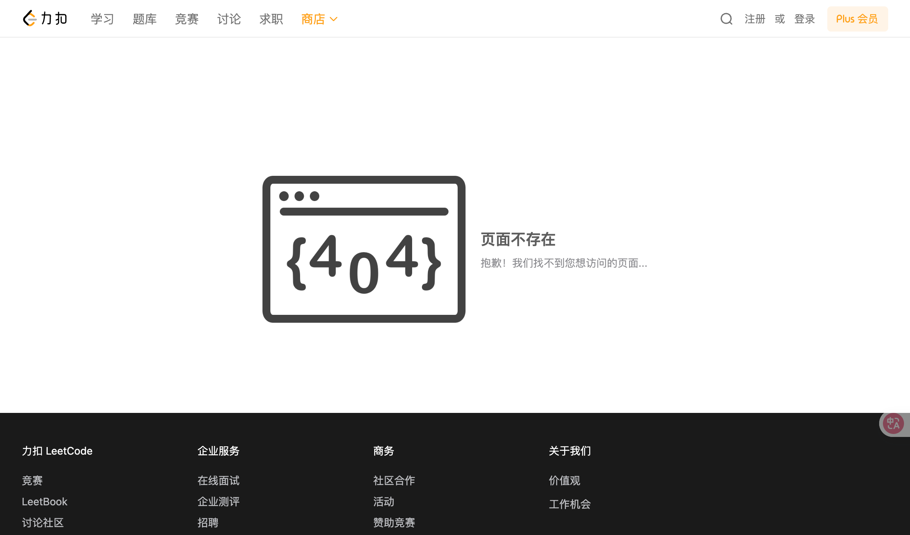

# 改进

- [x] 模块重新划分

  - 父项目的pom文件新建一个模块 `ec-dependencies`，使用maven bom管理项目依赖

  - 学习：flatten-maven-plugin，使用 flatten-maven-plugin 进行统一版本管理

  - 新建模块 `ec-framework`，用于实现 `Elite-Code` 项目的封装

    每个组件，包含两部分：

    1. `core` 包：组件的核心封装，拓展相关的功能。
    2. `config` 包：组件的 Spring Boot 自动配置。

    

    - 封装 `ec-spring-boot-starter-redis`
    - 封装 `ec-spring-boot-starter-security`
    - 封装 `ec-spring-boot-starter-web`

  - `module` 模块：

    每个模块包含两个 Maven Module，分别是：

    | Maven Module              | 作用                               |
    | ------------------------- | ---------------------------------- |
    | `yudao-module-xxx-api`    | 提供给其它模块的 API 定义          |
    | `yudao-module-xxx-server` | 模块的功能的具体实现（服务提供者） |

    - 基础架构模块 `ec-module-infra`
    - 会员模块 `ec-module-member`
    - 权限管理新建一个模块 `ec-module-system` 
    - 题目系统新建一个模块 `ec-module-question`
    
  - `dto` 更改为：VO 提供给 HTTP Controller（前端），DTO 提供给 RPC API（服务之间）。 然后出入参通过 Req 请求、Resp 响应标记。 这样，一眼就能看出，这个类是在哪一层传递进来的。

  - 拆掉 `ec-web`、`ec-service`、`ec-model`

  - dataobject下类名全部改为 `xxxDO`

  - 添加表前缀，并且所有关联表表名后面新增relation，并且缩写也包含relation，例如：`ums_admin_role_relation`

    - 表名
    - （relation）：mapper层名字
    - mapper xml文件中使用的表名

  - 删除 `elitecode-ui` 前端

  - 编写controller、service、mapper层的方法命名规范，并在对应的类中将方法命名修改过来（统一）

    - 实体类后缀为DO

- [x] controller包下分为admin和app

  建包参考下图

  

- [x] 将 `Elite-Code` 项目名更改为 `elite-code`

- [x] 模块命名按照模块名区分，例如 `ec-module-system`，那么表的前缀就是 `system`；`ec-module_member` 的表前缀就是 `member`。

- [x] 新建表 `member_user`

  对于管理系统来说，管理员是它的用户，也就是项目中的 `system_users` 表

  而对于题目、商城、论坛、博客等前台系统来说，会员是它的用户，也就是会员中心的 `member_user` 表。

  

  - [x] 新建 `ec-module-memeber` 模块
  
  管理员（admin）
  
  - [x] 改
  - [x] 根据分页条件查询会员信息
  - [x] 根据id获取会员信息
  
  用户前台（app）
  
  - [x] 根据手机号+密码登录
  
  - [ ] 根据手机号验证码登录
  
- [ ] `system_users` 表新增 `sex` 字段

- [ ] `BeanUtils.copyProperties` 全部改成使用 `MapStruct` 实现对象与对象之间的转换

  引入依赖

  PS：一定要在 `maven-compiler-plugin` 插件中，声明 `mapstruct-processor` 为 JSR 269 的 Java 注解处理器。

  ~~~xml
  <dependencies>
      <dependency>
          <groupId>org.mapstruct</groupId>
          <artifactId>mapstruct</artifactId>
          <version>${mapstruct.version}</version>
      </dependency>
  </dependencies>
  
  <build>
      <plugins>
          <plugin>
              <groupId>org.apache.maven.plugins</groupId>
              <artifactId>maven-compiler-plugin</artifactId>
              <version>3.8.1</version>
              <configuration>
                  <source>${java.version}</source>
                  <target>${java.version}</target>
                  <annotationProcessorPaths>
                      <path>
                          <groupId>org.mapstruct</groupId>
                          <artifactId>mapstruct-processor</artifactId>
                          <version>${mapstruct.version}</version>
                      </path>
                  </annotationProcessorPaths>
              </configuration>
          </plugin>
      </plugins>
  </build>
  ~~~

  创建 [UserConvert](https://github.com/YunaiV/SpringBoot-Labs/blob/master/lab-55/lab-55-mapstruct-demo/src/main/java/cn/iocoder/springboot/lab55/mapstructdemo/convert/UserConvert.java) 接口，作为 User 相关 Bean 的转换器。代码如下：

  ~~~java
  @Mapper // <1>
  public interface UserConvert {
  
      UserConvert INSTANCE = Mappers.getMapper(UserConvert.class); // <2>
  
      UserBO convert(UserDO userDO); // <3>
  
  }
  ~~~

  `<1>` 处，添加 [`@Mapper`](https://github.com/mapstruct/mapstruct/blob/master/core/src/main/java/org/mapstruct/Mapper.java) 注解，声明它是一个 MapStruct Mapper 映射器。

  `<2>` 处，通过调用 [Mappers](https://github.com/mapstruct/mapstruct/blob/master/core/src/main/java/org/mapstruct/factory/Mappers.java) 的 `#getMapper(Class<T> clazz)` 方法，获得 MapStruct 帮我们**自动生成的 UserConvert 实现类**的对象。

  `<3>` 处，定义 `#convert(UserDO userDO)` 方法，声明 UserDO 转换成 UserBO。后续，在我们每次编译该项目时，在如下目录可以看到自动生成的 UserConvert 实现类，可以用于 Debug 调试噢：

  

  使用：

  ~~~java
  UserBO userBO = UserConvert.INSTANCE.convert(userDO);
  ~~~

- [ ] 学习：使用 `spring-boot-starter-actuator` 在debug界面可以看见所有mapping

  ~~~xml
  <dependency>
      <groupId>org.springframework.boot</groupId>
      <artifactId>spring-boot-starter-actuator</artifactId>
  </dependency>
  ~~~

- [ ] pom文件所有都加上 `<description>` 用来描述该模块的作用

  ~~~xml
  <name>${project.artifactId}</name>
  <description>
      demo 模块，主要实现 XXX
  </description>
  ~~~

- [ ] 思考后端业务校验是否完整？手机号、账号、邮箱是否唯一？是否要校验大小、长度？

- [ ] 根据角色查询用户，传入的是否应该为角色的id值？

  
  
- [ ] 删除用户/角色时，需要同删除资源关联

- [ ] 参考yudao项目，将每个校验抽取成方法

  ~~~java
  // 校验正确性
  validateUserExists(id);
  validateEmailUnique(id, reqVO.getEmail());
  validateMobileUnique(id, reqVO.getMobile());
  ~~~

- [ ] 学习OpenAPI3和Knife4j：https://juejin.cn/post/7345070627107504180

  - @Api不再使用tags属性，而是直接使用value属性，并删除description属性

- [ ] 学习 `@AutoConfiguration`，并使用该注解优化项目

- [ ] 后端：统一URL前缀；前端：同后端修改请求路径

- [ ] 是否可以使用mysql自动更新？`onupdate current_timestamp`

- [ ] 去掉所有自定义异常，使用全局错误码改编

  ~~~java
  @Data
  public class ErrorCode {
  
      /**
       * 错误码
       */
      private final Integer code;
      /**
       * 错误提示
       */
      private final String msg;
  
      public ErrorCode(Integer code, String message) {
          this.code = code;
          this.msg = message;
      }
  
  }
  ~~~

- [ ] 创建时间、更新时间等时间字段，将Data接收更改为LocalDateTime接收（参考yudao项目）

  学习SpringMVC接收时间数据（String—>Data）如何不加 `@DateTimeFormat(pattern = "yyyy-MM-dd HH:mm:ss")`

  根据开始时间查询修改为

  ~~~java
  @ApiModelProperty(value = "创建时间")
  private Date[] createTime;
  ~~~

- [ ] 除了 `create_by`、`create_time`、`update_by`、`update_time`、`del_flag` 外，是否要加上 `del_time(删除时间)`？


----

# 项目搭建（后端）

- [x] 创建Maven项目
- [x] 搭建SpringBoot工程，使用2.7.2版本
- [x] 库表设计

  - [x] 用户表
  - [x] 题目表
  - [x] 题库表
  - [x] 题目关联表
- [x] 使用CDN和轻量应用服务器搭建个人图床

  - [x] 搭建宝塔
  - [x] 静态网址绑定
  - [x] 搭建git
  - [x] 启动CDN加速
  - [x] 编写教程
- [x] 连接数据库
- [x] 整合Druid
- [x] 整合Knife4j：https://doc.xiaominfo.com/docs/quick-start
- [x] 封装自定义异常类
- [x] 全局异常处理器
- [x] 通用返回类
- [x] 规划后端项目目录
- [x] 分层领域模型包规划：创建用户DTO、VO
- [x] MyBatis别名配置
- [x] 解决跨域
- [x] 修改selectUserByUserAccountAndUserPassword为selectUserByUserAccount，原因：不仅仅是用户登录要用到selectUserByUserAccount，用户注册也需要用到
- [x] 将日志打印修改为自定义xml文件，同时修改MyBatis日志打印工具为Logback
- [x] 实体类角色字段类型修改为List，修改XML文件使数据库字段String-JSON类型与实体类字段List类型进行转换（自写JSON类型处理器）
- [x] 数据库设置默认值好还是在代码中编写好？
  参考博客：https://www.navicat.com.cn/company/aboutus/blog/369-mysql-
- [x] 搜索提交规范中每一个规范英文代表什么
- [x] 搭建服务器图床，目的：能够使用PicGo上传
- [x] 包名从cn.luoyan.elitecode改为cn.elitecode
- [x] 补充Swagger注解
- [x] 校验规范修改（不为空和查询数据库应该合并成一个方法）
- [x] 删除Common3工具类，只使用hutool工具类
- [ ] 新增日志模块
- [ ] 操作日志
- [x] 分模块开发

  - [x] （写博客）使用IDEA查看模块之间的依赖关系：https://blog.csdn.net/qq_27579471/article/details/121557639
- [ ] 抽取BaseEntity（参考若依）
- [ ] 分离出 `ec-security` 模块，参考mall项目
- [ ] HttpStates需要更细划分
- [ ] 封装JWTUtils工具类
- [x] 格式化所有建表语句，并ai给出几条初始化语句
- [ ] 区分业务数据库、系统数据库
- [ ] 所有关联语句写全，不要写到关联表就不写了
- [ ] 若 `roleDO` 是禁止的，根据角色ID查询菜单信息就应该查询不出来该菜单
- [ ] 所有JSON转换更改使用FastJson2工具
- [ ] 常量引入的地方都不要加类前缀
- [ ] 什么表才需要加 `del_flag`？加了 `del_flag` 的表查询记得添加 `del_flag = 0`
- [ ] user service层#updateUser `updateReqVO.setPassword(null); // 特殊：此处不更新密码`


---

## 登录

- [ ] 记录登录信息，参考若依

  User表新增字段

  ~~~sql
  login_ip          varchar(128)    default ''                 comment '最后登录IP',
  login_date        datetime                                   comment '最后登录时间',
  ~~~

  LoginUser新增字段

  ~~~java
  /**
   * 登录时间
   */
  private Long loginTime;
  ~~~

  JwtTokenUtil#refreshToken中记录登录时间

  ~~~java
  loginUser.setLoginTime(System.currentTimeMillis());
  ~~~

  

  LoginService#login

  ~~~java
  AsyncManager.me().execute(AsyncFactory.recordLogininfor(username, Constants.LOGIN_SUCCESS, MessageUtils.message("userDO.login.success")));
  ~~~

  AsyncFactory#recordLoginInfo

  ~~~java
  /**
   * 记录登录信息
   *
   * @param userId 用户ID
   */
  public void recordLoginInfo(Long userId)
  {
      SysUser sysUser = new SysUser();
      sysUser.setUserId(userId);
      sysUser.setLoginIp(IpUtils.getIpAddr());
      sysUser.setLoginDate(DateUtils.getNowDate());
      userService.updateUserProfile(sysUser);
  }
  ~~~

- [x] 优化登录接口，返回tokenHead、token

- [ ] LoginController：获取路由信息

  - [x] RouterVO

    ~~~java
    package com.ruoyi.system.domain.vo;
    
    import com.fasterxml.jackson.annotation.JsonInclude;
    import java.util.List;
    
    /**
     * 路由配置信息
     * 
     * @author ruoyi
     */
    @JsonInclude(JsonInclude.Include.NON_EMPTY)
    public class RouterVo
    {
        /**
         * 路由名字
         */
        private String name;
    
        /**
         * 路由地址
         */
        private String path;
    
        /**
         * 重定向地址，当设置 noRedirect 的时候该路由在面包屑导航中不可被点击
         */
        private String redirect;
    
        /**
         * 组件地址
         */
        private String component;
    
        /**
         * 其他元素
         */
        private MetaVo meta;
    
        /**
         * 子路由
         */
        private List<RouterVo> children;
    }
    ~~~

  - [x] MetaVo

    ~~~java
    package com.ruoyi.system.domain.vo;
    
    import com.ruoyi.common.utils.StringUtils;
    
    /**
     * 路由显示信息
     * 
     * @author ruoyi
     */
    public class MetaVo
    {
        /**
         * 设置该路由在侧边栏和面包屑中展示的名字
         */
        private String title;
    
        /**
         * i设置该路由的图标，对应路径src/assets/icons/svg
         */
        private String icon;
        
        /**
         * 是否隐藏路由，当设置 true 的时候该路由不会再侧边栏出现
         */
        private boolean hidden;
    
        /**
         * 路由参数：如 {"id": 1, "name": "ry"}
         */
        private String query;
    
        /**
         * 当你一个路由下面的 children 声明的路由大于1个时，自动会变成嵌套的模式--如组件页面
         */
        private Boolean alwaysShow;
    
        /**
         * 设置为true，则不会被 <keep-alive>缓存
         */
        private boolean noCache;
    
        /**
         * 内链地址（http(s)://开头）
         */
        private String link;
    }
    ~~~

  - [x] LoiginController

    ~~~java
    /**
     * 获取路由信息
     * 
     * @return 路由信息
     */
    @GetMapping("getRouters")
    public AjaxResult getRouters()
    {
        Long userId = SecurityUtils.getUserId();
        List<SysMenu> menus = menuService.selectMenuTreeByUserId(userId);
        return AjaxResult.success(menuService.buildMenus(menus));
    }
    ~~~

  - [x] MenuService

    ~~~java
    /**
     * 构建前端路由所需要的菜单
     * 
     * @param menus 菜单列表
     * @return 路由列表
     */
    public List<RouterVo> buildMenus(List<SysMenu> menus);
    ~~~

  - [ ] MenuServiceImpl

    ~~~java
    /**
     * 构建前端路由所需要的菜单
     * 
     * @param menus 菜单列表
     * @return 路由列表
     */
    @Override
    public List<RouterVo> buildMenus(List<SysMenu> menus)
    {
        List<RouterVo> routers = new LinkedList<RouterVo>();
        for (SysMenu menu : menus)
        {
            RouterVo router = new RouterVo();
            router.setHidden("1".equals(menuDO.getVisible()));
            router.setName(getRouteName(menuDO));
            router.setPath(getRouterPath(menuDO));
            router.setComponent(getComponent(menuDO));
            router.setQuery(menuDO.getQuery());
            router.setMeta(new MetaVo(menuDO.getMenuName(), menuDO.getIcon(), StringUtils.equals("1", menuDO.getIsCache()), menuDO.getPath()));
            List<SysMenu> cMenus = menuDO.getChildren();
            if (StringUtils.isNotEmpty(cMenus) && UserConstants.TYPE_DIR.equals(menuDO.getMenuType()))
            {
                router.setAlwaysShow(true);
                router.setRedirect("noRedirect");
                router.setChildren(buildMenus(cMenus));
            }
            else if (isMenuFrame(menuDO))
            {
                router.setMeta(null);
                List<RouterVo> childrenList = new ArrayList<RouterVo>();
                RouterVo children = new RouterVo();
                children.setPath(menuDO.getPath());
                children.setComponent(menuDO.getComponent());
                children.setName(getRouteName(menuDO.getRouteName(), menuDO.getPath()));
                children.setMeta(new MetaVo(menuDO.getMenuName(), menuDO.getIcon(), StringUtils.equals("1", menuDO.getIsCache()), menuDO.getPath()));
                children.setQuery(menuDO.getQuery());
                childrenList.add(children);
                router.setChildren(childrenList);
            }
            else if (menuDO.getParentId().intValue() == 0 && isInnerLink(menuDO))
            {
                router.setMeta(new MetaVo(menuDO.getMenuName(), menuDO.getIcon()));
                router.setPath("/");
                List<RouterVo> childrenList = new ArrayList<RouterVo>();
                RouterVo children = new RouterVo();
                String routerPath = innerLinkReplaceEach(menuDO.getPath());
                children.setPath(routerPath);
                children.setComponent(UserConstants.INNER_LINK);
                children.setName(getRouteName(menuDO.getRouteName(), routerPath));
                children.setMeta(new MetaVo(menuDO.getMenuName(), menuDO.getIcon(), menuDO.getPath()));
                childrenList.add(children);
                router.setChildren(childrenList);
            }
            routers.add(router);
        }
        return routers;
    }
    ~~~

  - [ ] 获取路由名称

    ~~~java
    /**
     * 获取路由名称
     * 
     * @param menuDO 菜单信息
     * @return 路由名称
     */
    public String getRouteName(SysMenu menuDO)
    {
        // 非外链并且是一级目录（类型为目录）
        if (isMenuFrame(menuDO))
        {
            return StringUtils.EMPTY;
        }
        return getRouteName(menuDO.getRouteName(), menuDO.getPath());
    }
    /**
     * 获取路由名称，如没有配置路由名称则取路由地址
     * 
     * @param routerName 路由名称
     * @param path 路由地址
     * @return 路由名称（驼峰格式）
     */
    public String getRouteName(String name, String path)
    {
        String routerName = StringUtils.isNotEmpty(name) ? name : path;
        return StringUtils.capitalize(routerName);
    }
    ~~~

  - [ ] 获取路由地址

    ~~~java
    /**
     * 获取路由地址
     * 
     * @param menuDO 菜单信息
     * @return 路由地址
     */
    public String getRouterPath(SysMenu menuDO)
    {
        String routerPath = menuDO.getPath();
        // 内链打开外网方式
        if (menuDO.getParentId().intValue() != 0 && isInnerLink(menuDO))
        {
            routerPath = innerLinkReplaceEach(routerPath);
        }
        // 非外链并且是一级目录（类型为目录）
        if (0 == menuDO.getParentId().intValue() && UserConstants.TYPE_DIR.equals(menuDO.getMenuType())
                && UserConstants.NO_FRAME.equals(menuDO.getIsFrame()))
        {
            routerPath = "/" + menuDO.getPath();
        }
        // 非外链并且是一级目录（类型为菜单）
        else if (isMenuFrame(menuDO))
        {
            routerPath = "/";
        }
        return routerPath;
    }
    
    /**
     * 是否为内链组件
     * 
     * @param menuDO 菜单信息
     * @return 结果
     */
    public boolean isInnerLink(SysMenu menuDO)
    {
        return menuDO.getIsFrame().equals(UserConstants.NO_FRAME) && StringUtils.ishttp(menuDO.getPath());
    }
    
    /**
     * 内链域名特殊字符替换
     * 
     * @return 替换后的内链域名
     */
    public String innerLinkReplaceEach(String path)
    {
        return StringUtils.replaceEach(path, new String[] { Constants.HTTP, Constants.HTTPS, Constants.WWW, ".", ":" },
                new String[] { "", "", "", "/", "/" });
    }
    
    /**
     * 是否为菜单内部跳转
     * 
     * @param menuDO 菜单信息
     * @return 结果
     */
    public boolean isMenuFrame(SysMenu menuDO)
    {
        return menuDO.getParentId().intValue() == 0 && UserConstants.TYPE_MENU.equals(menuDO.getMenuType())
                && menuDO.getIsFrame().equals(UserConstants.NO_FRAME);
    }
    ~~~

    

  - [ ] 前端

    - [ ] src/permission.ts

      ~~~ts
      import router from './router'
      import { ElMessage } from 'element-plus'
      import NProgress from 'nprogress'
      import 'nprogress/nprogress.css'
      import { getToken } from '@/utils/auth'
      import { isHttp, isPathMatch } from '@/utils/validate'
      import { isRelogin } from '@/utils/request'
      import useUserStore from '@/store/modules/userDO'
      import useSettingsStore from '@/store/modules/settings'
      import usePermissionStore from '@/store/modules/permission'
      
      NProgress.configure({ showSpinner: false })
      
      const whiteList = ['/login', '/register']
      
      const isWhiteList = (path) => {
        return whiteList.some(pattern => isPathMatch(pattern, path))
      }
      
      router.beforeEach((to, from, next) => {
        NProgress.start()
        if (getToken()) {
          // 1、设置标题的语句放到验证权限后的里面
          to.meta.title && useSettingsStore().setTitle(to.meta.title)
          /* has token*/
          if (to.path === '/login') {
            next({ path: '/' })
            // 2、if current page is dashboard will not trigger	afterEach hook, so manually handle it
            NProgress.done()
          } else if (isWhiteList(to.path)) {
            next()
          } else {
            // 3、若权限没有拉取完毕，才需要重新获取用户信息
            if (useUserStore().roles.length === 0) {
              isRelogin.show = true
              // 判断当前用户是否已拉取完user_info信息
              useUserStore().getInfo().then(() => {
                isRelogin.show = false
                usePermissionStore().generateRoutes().then(accessRoutes => {
                  // 根据roles权限生成可访问的路由表
                  accessRoutes.forEach(route => {
                    if (!isHttp(route.path)) {
                      router.addRoute(route) // 动态添加可访问路由表
                    }
                  })
                  next({ ...to, replace: true }) // hack方法 确保addRoutes已完成
                })
              }).catch(err => {
                useUserStore().logOut().then(() => {
                  ElMessage.error(err)
                  next({ path: '/' })
                })
              })
            } else {
              next()
            }
          }
        } else {
          // 没有token
          if (isWhiteList(to.path)) {
            // 在免登录白名单，直接进入
            next()
          } else {
            next(`/login?redirect=${to.fullPath}`) // 否则全部重定向到登录页
            NProgress.done()
          }
        }
      })
      
      router.afterEach(() => {
        NProgress.done()
      })
      ~~~

    - [ ] layout/components/AppMain.vue

      ~~~vue
      <template>
        <section class="app-main">
          <router-view v-slot="{ Component, route }">
            <transition name="fade-transform" mode="out-in">
              <!-- 1、添加keep-alive缓存 -->
              <keep-alive :include="tagsViewStore.cachedViews">
      		  <!-- 2、在没有link的时候才进行组件渲染 -->
                <component v-if="!route.meta.link" :is="Component" :key="route.path"/>
              </keep-alive>
            </transition>
          </router-view>
          <!-- 3、有link直接进行iframe展示 -->
          <iframe-toggle />
        </section>
      </template>
      
      <script setup>
      import iframeToggle from "./IframeToggle/index"
      import useTagsViewStore from '@/store/modules/tagsView'
      
      const route = useRoute()
      const tagsViewStore = useTagsViewStore()
      
      onMounted(() => {
        addIframe()
      })
      
      watch((route) => {
        addIframe()
      })
      
      function addIframe() {
        if (route.meta.link) {
          useTagsViewStore().addIframeView(route)
        }
      }
      </script>
      ~~~

    - [ ] layout/compoennts/IframeToggle/index.vue

      ~~~vue
      <template>
        <inner-link
          v-for="(item, index) in tagsViewStore.iframeViews"
          :key="item.path"
          :iframeId="'iframe' + index"
          v-show="route.path === item.path"
          :src="iframeUrl(item.meta.link, item.query)"
        ></inner-link>
      </template>
      
      <script setup>
      import InnerLink from "../InnerLink/index";
      import useTagsViewStore from "@/store/modules/tagsView";
      
      const route = useRoute();
      const tagsViewStore = useTagsViewStore();
      
      function iframeUrl(url, query) {
        if (Object.keys(query).length > 0) {
          let params = Object.keys(query).map((key) => key + "=" + query[key]).join("&");
          return url + "?" + params;
        }
        return url;
      }
      </script>
      ~~~

    - [ ] layout/components/InnerLink/index.vue

      ~~~vue
      <template>
        <div :style="'height:' + height">
          <iframe
            :id="iframeId"
            style="width: 100%; height: 100%"
            :src="src"
            frameborder="no"
          ></iframe>
        </div>
      </template>
      
      <script setup>
      const props = defineProps({
        src: {
          type: String,
          default: "/"
        },
        iframeId: {
          type: String
        }
      });
      
      const height = ref(document.documentElement.clientHeight - 94.5 + "px");
      </script>
      ~~~

    - [ ] layout/components/Sidebar/index.vue

      ~~~vue
      <template>
        <div :class="{ 'has-logo': showLogo }" class="sidebar-container">
          <logo v-if="showLogo" :collapse="isCollapse" />
          <el-scrollbar wrap-class="scrollbar-wrapper">
            <el-menuDO
              :default-active="activeMenu"
              :collapse="isCollapse"
              :background-color="getMenuBackground"
              :text-color="getMenuTextColor"
              :unique-opened="true"
              :active-text-color="theme"
              :collapse-transition="false"
              mode="vertical"
              :class="sideTheme"
            >
              <sidebar-item
                v-for="(route, index) in sidebarRouters"
                :key="route.path + index"
                :item="route"
                :base-path="route.path"
              />
            </el-menuDO>
          </el-scrollbar>
        </div>
      </template>
      ~~~

    - [ ] layout/Sidebar/SidebarItem.vue

      ~~~vue
      <template>
        <div v-if="!item.hidden">
          <template v-if="hasOneShowingChild(item.children, item) && (!onlyOneChild.children || onlyOneChild.noShowingChildren) && !item.alwaysShow">
            <app-link v-if="onlyOneChild.meta" :to="resolvePath(onlyOneChild.path, onlyOneChild.query)">
              <el-menuDO-item :index="resolvePath(onlyOneChild.path)" :class="{ 'submenu-title-noDropdown': !isNest }">
                <svg-icon :icon-class="onlyOneChild.meta.icon || (item.meta && item.meta.icon)"/>
                <template #title><span class="menuDO-title" :title="hasTitle(onlyOneChild.meta.title)">{{ onlyOneChild.meta.title }}</span></template>
              </el-menuDO-item>
            </app-link>
          </template>
      
          <el-sub-menuDO v-else ref="subMenu" :index="resolvePath(item.path)" teleported>
            <template v-if="item.meta" #title>
              <svg-icon :icon-class="item.meta && item.meta.icon" />
              <span class="menuDO-title" :title="hasTitle(item.meta.title)">{{ item.meta.title }}</span>
            </template>
      
            <sidebar-item
              v-for="(child, index) in item.children"
              :key="child.path + index"
              :is-nest="true"
              :item="child"
              :base-path="resolvePath(child.path)"
              class="nest-menuDO"
            />
          </el-sub-menuDO>
        </div>
      </template>
      
      <script setup>
      import {isExternal} from '@/utils/validate'
      import AppLink from './Link'
      import {getNormalPath} from '@/utils/ruoyi'
      
      const props = defineProps({
        // route object
        item: {
          type: Object,
          required: true
        },
        isNest: {
          type: Boolean,
          default: false
        },
        basePath: {
          type: String,
          default: ''
        }
      })
      
      const onlyOneChild = ref({});
      
      function hasOneShowingChild(children = [], parent) {
        if (!children) {
          children = [];
        }
        const showingChildren = children.filter(item => {
          if (item.hidden) {
            return false
          }
          onlyOneChild.value = item
          return true
        })
      
        // When there is only one child router, the child router is displayed by default
        if (showingChildren.length === 1) {
          return true
        }
      
        // Show parent if there are no child router to display
        if (showingChildren.length === 0) {
          onlyOneChild.value = { ...parent, path: '', noShowingChildren: true }
          return true
        }
      
        return false
      };
      
      function resolvePath(routePath, routeQuery) {getNormalPath(props.basePath + '/' + routePath))
        debugger
        if (isExternal(routePath)) {
          return routePath
        }
        if (isExternal(props.basePath)) {
          return props.basePath
        }
        if (routeQuery) {
          let query = JSON.parse(routeQuery);
          return { path: getNormalPath(props.basePath + '/' + routePath), query: query }
        }
        return getNormalPath(props.basePath + '/' + routePath)
      }
      
      function hasTitle(title){
        if (title.length > 5) {
          return title;
        } else {
          return "";
        }
      }
      </script>
      ~~~


---

## 用户模块

- [x] 注册

- [x] 登录

- [x] 注销

- [x] 分页获取用户数据

- [x] 新增用户

- [x] 批量删除用户

- [x] 增加逻辑删除（del_flag）

- [x] 更新个人信息接口

- [x] 根据id更新用户信息

- [x] 更新个人信息头像

  若依：/avatar

  微人事：/hr/userface

- [x] 获取个人信息接口

- [x] 使用ThreadLocal记录当前线程的用户id

- [x] 制作个人简历，参考老鱼简历、超级简历

- [ ] 重置密码(UserInfoController)

  微人事：/hr/pass

  若依：/updatePwd、/resetPwd

- [ ] 忘记密码

- [x] controller层校验全部使用JSR-303

- [x] 抽取

  - [x] 抽取LoginControler（login、getInfo、getRouters）
- [x] 将 `生成BCryptPasswordEncoder密码` 抽取成 `SecurityUtils` 中的 `encryptPassword`
  - [x] 抽取UserInfoController（个人信息的改查、头像上传）
- [x] 上面每一步 —— 前端同步（api、ts类型文件抽取）


---

## UserController

- [ ] 用户分页查询时查询角色
- [ ] 


---

## 题目表

- [x] 使用MyBatisX插件生成实体类、Service、ServiceImpl、Mapper、XML文件（题目表、题库表、题目题库关联表）
- [x] 增删改查
- [x] 新增题目的时候应选择题库
  - [x] 题目实体类新增题库字段 `List<Problemset>  problemsets`
    - [x] XML添加problemsets属性，并编写resultMap
  - [x] 将题库id、题库列表单独提取出来
  - [x] 新增题目题库关联
  - [x] 题目实体类新增标签字段 `List<Tag> tagDOList`
    - [x] XML添加 `tagDOList` 属性，并编写 resultMap
  - [x] 将标签id、标签列表单独提取出来
  - [x] 新增/修改题目DTO中添加 `List<Long> tagIds`
- [x] 更新题目
  - [x] 选择题库：先删除题目与题库全部关联、再新增题目与题库关联
  - [x] 选择标签：先删除题目与标签全部关联、再新增题目与标签关联
- [x] 删除题目

  - [x] 删除题目与题库关联

  - [x] 删除题目与标签关联
- [x] 增、删、改添加 `@Transition` 事务注解
- [x] 题目批量管理
  - [x] 【管理员】批量删除题目


---

## 题库表

- [x] 增删改查
- [ ] 上传封面功能(新增题库和删除题库)
- [x] 分页查询所属题库的题目（联表查询）
  - [x] 不要忘记 `del_flag = '0'`
  - [x] 可以根据题目标题、内容模糊查询
- [ ] 批量
  - [ ] 【管理员】批量向题库添加题目
  - [ ] 【管理员】批量从题库移除题目
- [ ] 删除题库时，如果题库中有题目，则无法删除


---

## 题目题库关联表

- [x] 增删改查
  - [x] 根据 题目id 删除题目和题库关联（删除所有题目所关联的题库）
  - [x] 根据 题目id列表 批量删除题目和题库关联
  - [x] 批量新增题目题库信息


---

## 标签表

- [x] 增删改查
- [ ] 删除标签时，如果标签有关联题目，则无法删除


---

## 其它

- [ ] 所有新增、更新注意标题、内容的长度

- [x] 不能为空的属性Swagger注解上加上 `required=true`

- [x] 所有分页查询添加根据创建者、更新者、创建时间区域查询

- [x] id、createBy、updateBy条件应为 `id != null and id != 0`，并且 `=` 两边加上空格

- [x] sql有where条件就不要用  `<where>` 了

- [x] 所有分页查询：去掉根据id查询

- [x] 模糊查询全部改为用contact连接

- [x] xml文件不使用include

- [x] 去掉所有result判断

- [ ] 编写表

  - [ ] 题目_wiki

  - [ ] 面试

  - [ ] 题目表新增type类型，为 算法题 还是 面试题

    新增题库时题库名要唯一（type类型相同的情况下）

    可以写一个category和problemset的关联表

  - [ ] 题目页面分为：题目、wiki、题解

  - [ ] wiki应根据标签查找，设置sort字段，可以根据sort字段进行排序

  - [ ] 新建 `数据结构`，然后里面存储的时每一种结构对应的文章（就是标签）
  
  - [ ] 包装类
  
  - [ ] 注解
  
- [ ] 更新时间需要我们自己维护

- [ ] 新增时检查名字唯一

- [ ] 删除题库/标签/角色时

  - [ ] 若角色绑定了题目/题目/用户，那么删除失败

- [ ] `count(*)` 全部改为 `count(1)`

- [ ] 有sort字段的记得order by排序

- [ ] role角色表新增角色名称字段（role_name），角色字符串（role_key）


---

## 文件管理

- [x] 使用Minio实现文件上传


---

## 验证码

- [ ] LoginService.java#login

  ~~~java
  public String login(String username, String password, String code, String uuid)
  {
      // 验证码校验
      validateCaptcha(username, code, uuid);
  ~~~

  ~~~java
  /**
       * 校验验证码
       * 
       * @param username 用户名
       * @param code 验证码
       * @param uuid 唯一标识
       * @return 结果
       */
  public void validateCaptcha(String username, String code, String uuid)
  {
      boolean captchaEnabled = configService.selectCaptchaEnabled();
      if (captchaEnabled)
      {
          String verifyKey = CacheConstants.CAPTCHA_CODE_KEY + StringUtils.nvl(uuid, "");
          String captcha = redisCache.getCacheObject(verifyKey);
          if (captcha == null)
          {
              AsyncManager.me().execute(AsyncFactory.recordLogininfor(username, Constants.LOGIN_FAIL, MessageUtils.message("userDO.jcaptcha.expire")));
              throw new CaptchaExpireException();
          }
          redisCache.deleteObject(verifyKey);
          if (!code.equalsIgnoreCase(captcha))
          {
              AsyncManager.me().execute(AsyncFactory.recordLogininfor(username, Constants.LOGIN_FAIL, MessageUtils.message("userDO.jcaptcha.error")));
              throw new CaptchaException();
          }
      }
  }
  ~~~

  ~~~java
  /**
   * 获取验证码开关
   * 
   * @return true开启，false关闭
   */
  @Override
  public boolean selectCaptchaEnabled()
  {
      String captchaEnabled = selectConfigByKey("sys.account.captchaEnabled");
      if (StringUtils.isEmpty(captchaEnabled))
      {
          return true;
      }
      return Convert.toBool(captchaEnabled);
  }
  ~~~


---

## 禁用账号

- [ ] UmsAdminServiceImpl#（mall）

  ~~~java
  if(!userDetails.isEnabled()){
      Asserts.fail("帐号已被禁用");
  }
  ~~~


---

## Redis

- [x] 整合Redis

  在pom.xml中新增Redis相关依赖

  ```xml
  <!--redis依赖配置-->
  <dependency>
    <groupId>org.springframework.boot</groupId>
    <artifactId>spring-boot-starter-data-redis</artifactId>
  </dependency>
  ```

  (application-dev)在spring节点下添加Redis的配置

  ```yaml
  redis:
      host: localhost # Redis服务器地址
      database: 0 # Redis数据库索引（默认为0）
      port: 6379 # Redis服务器连接端口
      password: 12345678 # Redis服务器连接密码（默认为空）
      lettuce:
        pool:
          max-active: 8 # 连接池最大连接数（使用负值表示没有限制）
          max-wait: -1ms # 连接池最大阻塞等待时间（使用负值表示没有限制）
          max-idle: 8 # 连接池中的最大空闲连接
          min-idle: 0 # 连接池中的最小空闲连接
      timeout: 3000ms # 连接超时时间（毫秒）
  ```

  RedisConfig

  ~~~java
  package cn.elitecode.common.config;
  
  import org.springframework.context.annotation.Bean;
  import org.springframework.context.annotation.Configuration;
  import org.springframework.data.redis.connection.RedisConnectionFactory;
  import org.springframework.data.redis.core.RedisTemplate;
  import org.springframework.data.redis.serializer.StringRedisSerializer;
  
  /**
   * redis配置
   */
  @Configuration
  public class RedisConfig {
  
      @Bean
      public RedisTemplate<String, Object> redisTemplate(RedisConnectionFactory redisConnectionFactory) {
          RedisTemplate<String, Object> redisTemplate = new RedisTemplate<>();
          redisTemplate.setConnectionFactory(redisConnectionFactory);
  
          // 使用StringRedisSerializer序列化和反序列化redis的key值
          redisTemplate.setKeySerializer(new StringRedisSerializer());
          // 使用自定义的JsonRedisSerializer序列化和反序列化redis的value值
          redisTemplate.setValueSerializer(new JsonRedisSerializer<Object>(Object.class));
          return redisTemplate;
      }
  
  }
  
  ~~~

  JsonRedisSerializer

  ~~~java
  package cn.elitecode.common.config;
  
  import cn.hutool.json.JSONUtil;
  import org.springframework.data.redis.serializer.RedisSerializer;
  import org.springframework.data.redis.serializer.SerializationException;
  
  /**
   * redis使用hutool中的工具序列化
   * @param <T>
   */
  public class JsonRedisSerializer<T> implements RedisSerializer<T> {
  
      private Class<T> clazz;
  
      public JsonRedisSerializer(Class<T> clazz) {
          this.clazz = clazz;
      }
  
      @Override
      public byte[] serialize(T o) throws SerializationException {
          if (o == null) {
              return new byte[0];
          }
          return JSONUtil.toJsonStr(o).getBytes();
      }
  
      @Override
      public T deserialize(byte[] bytes) throws SerializationException {
          if (bytes == null || bytes.length == 0) {
              return null;
          }
          return JSONUtil.toBean(new String(bytes), clazz);
      }
  }
  
  ~~~

- [x] JWT存UserDetails应该改为存token（参考若依项目）

  LoginUser新增1个字段

  ~~~java
  /**
   * 过期时间
   */
  private Long expireTime;
  ~~~

  LoginController#login

  ~~~java
  @ApiOperation(value = "用户登录")
  @PostMapping("/login")
  private CommonResult<LoginUserVO> login(@Validated @RequestBody UserLoginDTO userLoginDTO) {
      String tokenHead = JWTProperties.getTokenHead();
      String token = loginService.login(userLoginDTO.getUsername(), userLoginDTO.getPassword());
      LoginUserVO loginUserVO = new LoginUserVO(tokenHead, token);
      return CommonResult.success(loginUserVO);
  }
  ~~~

  LoginServiceImpl

  ~~~java
  package cn.elitecode.service.impl;
  
  import cn.elitecode.common.exception.userDO.UserPasswordNotMatchException;
  import cn.elitecode.common.utils.JwtTokenUtil;
  import cn.elitecode.framework.common.enums.HttpStatus;
  import cn.elitecode.framework.security.core.LoginUser;
  import cn.elitecode.module.service.auth.LoginService;
  import org.springframework.beans.factory.annotation.Autowired;
  import org.springframework.security.authentication.UsernamePasswordAuthenticationToken;
  import org.springframework.security.core.context.SecurityContextHolder;
  import org.springframework.security.core.userdetails.UserDetailsService;
  import org.springframework.security.crypto.password.PasswordEncoder;
  import org.springframework.stereotype.Service;
  
  @Service
  public class LoginServiceImpl implements LoginService {
  
      @Autowired
      private PasswordEncoder passwordEncoder;
      @Autowired
      private UserDetailsService userDetailsService;
      @Autowired
      private JwtTokenUtil jwtTokenUtil;
  
      @Override
      public String login(String username, String userPassword) {
          LoginUser loginUser = (LoginUser) userDetailsService.loadUserByUsername(username);
          if (!passwordEncoder.matches(userPassword, loginUser.getPassword())) {
              throw new UserPasswordNotMatchException(HttpStatus.PARAMS_ERROR, "账号或密码错误");
          }
          UsernamePasswordAuthenticationToken authenticationToken = new UsernamePasswordAuthenticationToken(loginUser, null, loginUser.getAuthorities());
          SecurityContextHolder.getContext().setAuthentication(authenticationToken);
          String token = jwtTokenUtil.createToken(loginUser);
          return token;
      }
  
  }
  
  ~~~

  JwtAuthenticationTokenFilter

  ~~~java
  package com.ruoyi.framework.security.filter;
  
  import java.io.IOException;
  import javax.servlet.FilterChain;
  import javax.servlet.ServletException;
  import javax.servlet.http.HttpServletRequest;
  import javax.servlet.http.HttpServletResponse;
  import org.springframework.beans.factory.annotation.Autowired;
  import org.springframework.security.authentication.UsernamePasswordAuthenticationToken;
  import org.springframework.security.core.context.SecurityContextHolder;
  import org.springframework.security.web.authentication.WebAuthenticationDetailsSource;
  import org.springframework.stereotype.Component;
  import org.springframework.web.filter.OncePerRequestFilter;
  import com.ruoyi.common.core.domain.model.LoginUser;
  import com.ruoyi.common.utils.SecurityUtils;
  import com.ruoyi.common.utils.StringUtils;
  import com.ruoyi.framework.web.service.TokenService;
  
  /**
   * token过滤器 验证token有效性
   * 
   * @author ruoyi
   */
  @Component
  public class JwtAuthenticationTokenFilter extends OncePerRequestFilter
  {
      @Autowired
      private TokenService tokenService;
  
      @Override
      protected void doFilterInternal(HttpServletRequest request, HttpServletResponse response, FilterChain chain)
              throws ServletException, IOException
      {
          LoginUser loginUser = tokenService.getLoginUser(request);
          if (StringUtils.isNotNull(loginUser) && StringUtils.isNull(SecurityUtils.getAuthentication()))
          {
              tokenService.verifyToken(loginUser);
              UsernamePasswordAuthenticationToken authenticationToken = new UsernamePasswordAuthenticationToken(loginUser, null, loginUser.getAuthorities());
              authenticationToken.setDetails(new WebAuthenticationDetailsSource().buildDetails(request));
              SecurityContextHolder.getContext().setAuthentication(authenticationToken);
          }
          chain.doFilter(request, response);
      }
  }
  ~~~

  TokenService

  ~~~java
  protected static final long MILLIS_SECOND = 1000;
  
      protected static final long MILLIS_MINUTE = 60 * MILLIS_SECOND;
  
      private static final Long MILLIS_MINUTE_TEN = 20 * 60 * 1000L;
  
      @Autowired
      private RedisCache redisCache;
  
      /**
       * 获取用户身份信息
       *
       * @return 用户信息
       */
      public LoginUser getLoginUser(HttpServletRequest request)
      {
          // 获取请求携带的令牌
          String token = getToken(request);
          if (StringUtils.isNotEmpty(token))
          {
              try
              {
                  Claims claims = parseToken(token);
                  // 解析对应的权限以及用户信息
                  String uuid = (String) claims.get(Constants.LOGIN_USER_KEY);
                  String userKey = getTokenKey(uuid);
                  LoginUser userDO = redisCache.getCacheObject(userKey);
                  return userDO;
              }
              catch (Exception e)
              {
                  log.error("获取用户信息异常'{}'", e.getMessage());
              }
          }
          return null;
      }
  
      /**
       * 验证令牌有效期，相差不足20分钟，自动刷新缓存
       *
       * @param loginUser
       * @return 令牌
       */
      public void verifyToken(LoginUser loginUser)
      {
          long expireTime = loginUser.getExpireTime();
          long currentTime = System.currentTimeMillis();
          if (expireTime - currentTime <= MILLIS_MINUTE_TEN)
          {
              refreshToken(loginUser);
          }
      }
  
      /**
       * 刷新令牌有效期
       *
       * @param loginUser 登录信息
       */
      public void refreshToken(LoginUser loginUser)
      {
          loginUser.setLoginTime(System.currentTimeMillis());
          loginUser.setExpireTime(loginUser.getLoginTime() + expireTime * MILLIS_MINUTE);
          // 根据uuid将loginUser缓存
          String userKey = getTokenKey(loginUser.getToken());
          redisCache.setCacheObject(userKey, loginUser, expireTime, TimeUnit.MINUTES);
      }
  
  
  ~~~

- [x] SpringSecurity配置类中：`.logout(logout -> logout.logoutUrl("/logout").logoutSuccessHandler(logoutSuccessHandler))`，LogoutSuccessHandlerImpl实现类需要清空redis缓存数据

  ~~~java
  package com.ruoyi.framework.security.handle;
  
  import java.io.IOException;
  import javax.servlet.ServletException;
  import javax.servlet.http.HttpServletRequest;
  import javax.servlet.http.HttpServletResponse;
  import org.springframework.beans.factory.annotation.Autowired;
  import org.springframework.context.annotation.Configuration;
  import org.springframework.security.core.Authentication;
  import org.springframework.security.web.authentication.logout.LogoutSuccessHandler;
  import com.alibaba.fastjson2.JSON;
  import com.ruoyi.common.constant.Constants;
  import com.ruoyi.common.core.domain.AjaxResult;
  import com.ruoyi.common.core.domain.model.LoginUser;
  import com.ruoyi.common.utils.MessageUtils;
  import com.ruoyi.common.utils.ServletUtils;
  import com.ruoyi.common.utils.StringUtils;
  import com.ruoyi.framework.manager.AsyncManager;
  import com.ruoyi.framework.manager.factory.AsyncFactory;
  import com.ruoyi.framework.web.service.TokenService;
  
  /**
   * 自定义退出处理类 返回成功
   * 
   * @author ruoyi
   */
  @Configuration
  public class LogoutSuccessHandlerImpl implements LogoutSuccessHandler
  {
      @Autowired
      private TokenService tokenService;
  
      /**
       * 退出处理
       * 
       * @return
       */
      @Override
      public void onLogoutSuccess(HttpServletRequest request, HttpServletResponse response, Authentication authentication)
              throws IOException, ServletException
      {
          LoginUser loginUser = tokenService.getLoginUser(request);
          if (StringUtils.isNotNull(loginUser))
          {
              String userName = loginUser.getUsername();
              // 删除用户缓存记录
              tokenService.delLoginUser(loginUser.getToken());
              // 记录用户退出日志
              AsyncManager.me().execute(AsyncFactory.recordLogininfor(userName, Constants.LOGOUT, MessageUtils.message("userDO.logout.success")));
          }
          ServletUtils.renderString(response, JSON.toJSONString(AjaxResult.success(MessageUtils.message("userDO.logout.success"))));
      }
  }
  
  ~~~

- [ ] 限流脚本

  RedisConfig

  ~~~java
  @Bean
  @SuppressWarnings(value = { "unchecked", "rawtypes" })
  public RedisTemplate<Object, Object> redisTemplate(RedisConnectionFactory connectionFactory)
  {
      RedisTemplate<Object, Object> template = new RedisTemplate<>();
      template.setConnectionFactory(connectionFactory);
  
      FastJson2JsonRedisSerializer serializer = new FastJson2JsonRedisSerializer(Object.class);
  
      // 使用StringRedisSerializer来序列化和反序列化redis的key值
      template.setKeySerializer(new StringRedisSerializer());
      template.setValueSerializer(serializer);
  
      // Hash的key也采用StringRedisSerializer的序列化方式
      template.setHashKeySerializer(new StringRedisSerializer());
      template.setHashValueSerializer(serializer);
  
      template.afterPropertiesSet();
      return template;
  }
  ~~~

- [ ] 字典管理缓存

  使用`SYS_DICT_KEY`常量来管理字典数据的 Redis 缓存。

  ```java
  // RuoYi-Vue/ruoyi-common/src/main/java/com/ruoyi/common/constant/CacheConstants.java
  public class CacheConstants {
      public static final String SYS_DICT_KEY = "sys_dict:";
  }
  ```

- [ ] 防重提交缓存

  在`SameUrlDataInterceptor`类中，使用 Redis 缓存请求信息，判断是否为重复提交。

  ```java
  // RuoYi-Vue/ruoyi-framework/src/main/java/com/ruoyi/framework/interceptor/impl/SameUrlDataInterceptor.java
  @Component
  public class SameUrlDataInterceptor extends RepeatSubmitInterceptor {
      @Autowired
      private RedisCache redisCache;
  
      @Override
      public boolean isRepeatSubmit(HttpServletRequest request, RepeatSubmit annotation) {
          // ...
          String cacheRepeatKey = CacheConstants.REPEAT_SUBMIT_KEY + url + submitKey;
          Object sessionObj = redisCache.getCacheObject(cacheRepeatKey);
          if (sessionObj != null) {
              // ...
          }
          Map<String, Object> cacheMap = new HashMap<String, Object>();
          cacheMap.put(url, nowDataMap);
          redisCache.setCacheObject(cacheRepeatKey, cacheMap, annotation.interval(), TimeUnit.MILLISECONDS);
          return false;
      }
  }
  ```

- [ ] 登录账户密码错误次数缓存

  使用`PWD_ERR_CNT_KEY`常量来管理登录账户密码错误次数的 Redis 缓存。

  ```java
  // RuoYi-Vue/ruoyi-common/src/main/java/com/ruoyi/common/constant/CacheConstants.java
  public class CacheConstants {
      public static final String PWD_ERR_CNT_KEY = "pwd_err_cnt:";
  }
  ```


---

## Elasticsearch

### 一、实现

- [x] 整合Elasticsearch

  在pom.xml中添加相关依赖

  ~~~xml
  <!--Elasticsearch相关依赖-->
  <dependency>
      <groupId>org.springframework.boot</groupId>
      <artifactId>spring-boot-starter-data-elasticsearch</artifactId>artifactId>
  </dependency>
  ~~~

  修改application.yml文件，在spring节点下添加Elasticsearch相关配置

  ~~~yaml
  data:
    elasticsearch:
      repositories:
        enabled: true
  elasticsearch:
    uris: http://localhost:9200
  ~~~

- [x] 实现题目搜索

  添加题目文档对象QuestionSearchDTO

  不需要中文分词的字段设置成 `@Field(type = FieldType.Keyword)` 类型，需要中文分词的设置成 `@Field(analyzer = "ik_max_word",type = FieldType.Text)` 类型。

  ~~~java
  package cn.elitecode.model.dto.elasticsearch;
  
  import cn.elitecode.module.dal.dataobject.problemset.ProblemsetDOet;
  import cn.elitecode.module.dal.dataobject.tag.TagDOag;
  import io.swagger.annotations.ApiModelProperty;
  import org.springframework.data.annotation.Id;
  import org.springframework.data.elasticsearch.annotations.Document;
  import org.springframework.data.elasticsearch.annotations.Field;
  import org.springframework.data.elasticsearch.annotations.FieldType;
  import java.util.Date;
  import java.util.List;
  
  /**
   * questionDO(题目表) | 实体类
   */
  @Document(indexName = "questionDO")
  public class QuestionSearchDTO {
  
      @ApiModelProperty("用户ID，主键")
      @Id
      private Long id;
  
      @ApiModelProperty("标题")
      @Field(analyzer = "ik_max_word", type = FieldType.Text)
      private String title;
  
      @ApiModelProperty("内容")
      @Field(analyzer = "ik_max_word", type = FieldType.Text)
      private String content;
  
      @ApiModelProperty("推荐答案")
      @Field(analyzer = "ik_max_word", type = FieldType.Text)
      private String answer;
  
      @ApiModelProperty("删除标志（0代表存在，2代表删除）")
      @Field(type = FieldType.Keyword)
      private String delFlag;
  
      @ApiModelProperty("创建者")
      @Field(type = FieldType.Long)
      private Long createBy;
  
      @ApiModelProperty("创建时间")
      @Field(type = FieldType.Date)
      private Date createTime;
  
      @ApiModelProperty("更新者")
      @Field(type = FieldType.Long)
      private Long updateBy;
  
      @ApiModelProperty("编辑时间")
      @Field(type = FieldType.Date)
      private Date updateTime;
  
      @ApiModelProperty("题库对象列表")
      @Field(type = FieldType.Nested)
      List<Problemset> problemsetDOList;
  
      @ApiModelProperty("标签对象列表")
      @Field(type = FieldType.Nested)
      List<Tag> tagDOList;
  
      public QuestionSearchDTO() {
      }
  
      public QuestionSearchDTO(Long id, String title, String content, String answer, String delFlag, Long createBy, Date createTime, Long updateBy, Date updateTime, List<Problemset> problemsetDOList, List<Tag> tagDOList) {
          this.id = id;
          this.title = title;
          this.content = content;
          this.answer = answer;
          this.delFlag = delFlag;
          this.createBy = createBy;
          this.createTime = createTime;
          this.updateBy = updateBy;
          this.updateTime = updateTime;
          this.problemsetDOList = problemsetDOList;
          this.tagDOList = tagDOList;
      }
  
      /**
       * 获取
       * @return id
       */
      public Long getId() {
          return id;
      }
  
      /**
       * 设置
       * @param id
       */
      public void setId(Long id) {
          this.id = id;
      }
  
      /**
       * 获取
       * @return title
       */
      public String getTitle() {
          return title;
      }
  
      /**
       * 设置
       * @param title
       */
      public void setTitle(String title) {
          this.title = title;
      }
  
      /**
       * 获取
       * @return content
       */
      public String getContent() {
          return content;
      }
  
      /**
       * 设置
       * @param content
       */
      public void setContent(String content) {
          this.content = content;
      }
  
      /**
       * 获取
       * @return answer
       */
      public String getAnswer() {
          return answer;
      }
  
      /**
       * 设置
       * @param answer
       */
      public void setAnswer(String answer) {
          this.answer = answer;
      }
  
      /**
       * 获取
       * @return delFlag
       */
      public String getDelFlag() {
          return delFlag;
      }
  
      /**
       * 设置
       * @param delFlag
       */
      public void setDelFlag(String delFlag) {
          this.delFlag = delFlag;
      }
  
      /**
       * 获取
       * @return createBy
       */
      public Long getCreateBy() {
          return createBy;
      }
  
      /**
       * 设置
       * @param createBy
       */
      public void setCreateBy(Long createBy) {
          this.createBy = createBy;
      }
  
      /**
       * 获取
       * @return createTime
       */
      public Date getCreateTime() {
          return createTime;
      }
  
      /**
       * 设置
       * @param createTime
       */
      public void setCreateTime(Date createTime) {
          this.createTime = createTime;
      }
  
      /**
       * 获取
       * @return updateBy
       */
      public Long getUpdateBy() {
          return updateBy;
      }
  
      /**
       * 设置
       * @param updateBy
       */
      public void setUpdateBy(Long updateBy) {
          this.updateBy = updateBy;
      }
  
      /**
       * 获取
       * @return updateTime
       */
      public Date getUpdateTime() {
          return updateTime;
      }
  
      /**
       * 设置
       * @param updateTime
       */
      public void setUpdateTime(Date updateTime) {
          this.updateTime = updateTime;
      }
  
      /**
       * 获取
       * @return problemsetDOList
       */
      public List<Problemset> getProblemsetList() {
          return problemsetDOList;
      }
  
      /**
       * 设置
       * @param problemsetDOList
       */
      public void setProblemsetList(List<Problemset> problemsetDOList) {
          this.problemsetDOList = problemsetDOList;
      }
  
      /**
       * 获取
       * @return tags
       */
      public List<Tag> getTagList() {
          return tagDOList;
      }
  
      /**
       * 设置
       * @param tagDOList
       */
      public void setTagList(List<Tag> tagDOList) {
          this.tagDOList = tagDOList;
      }
  
      public String toString() {
          return "Question{id = " + id + ", title = " + title + ", content = " + content + ", answer = " + answer + ", delFlag = " + delFlag + ", createBy = " + createBy + ", createTime = " + createTime + ", updateBy = " + updateBy + ", updateTime = " + updateTime + ", problemsetDOList = " + problemsetDOList + ", tags = " + tagDOList + "}";
      }
  }
  ~~~

  继承ElasticsearchRepository接口，这样就拥有了一些基本的Elasticsearch数据操作方法，同时定义了一个衍生查询方法

  ~~~java
  package cn.elitecode.mapper;
  
  import cn.elitecode.model.dto.elasticsearch.QuestionSearchDTO;
  import org.springframework.data.elasticsearch.repository.ElasticsearchRepository;
  
  public interface EsQuestionMapper extends ElasticsearchRepository<QuestionSearchDTO, String> {
  }
  ~~~

  导入单元测试依赖

  ~~~xml
  <!-- 单元测试 -->
  <dependency>
      <groupId>org.springframework.boot</groupId>
      <artifactId>spring-boot-starter-test</artifactId>
      <scope>test</scope>
  </dependency>
  ~~~

  添加测试类

  ~~~java
  package cn.elitecode;
  
  import cn.elitecode.mapper.EsQuestionMapper;
  import cn.elitecode.mapper.QuestionMapper;
  import cn.elitecode.model.dto.elasticsearch.QuestionSearchDTO;
  import cn.elitecode.module.dal.dataobject.question.QuestionDOon;
  import org.junit.jupiter.api.Test;
  import org.springframework.beans.BeanUtils;
  import org.springframework.beans.factory.annotation.Autowired;
  import org.springframework.boot.test.context.SpringBootTest;
  import java.util.List;
  import java.util.stream.Collectors;
  
  @SpringBootTest
  public class EliteCodeApplicationTests {
  
      @Autowired
      private QuestionMapper questionMapper;
      @Autowired
      private EsQuestionMapper esQuestionMapper;
  
      /**
       * 将MySql中的数据全部存入ES
       */
      @Test
      public void testImportAllMySqlToES() {
          List<Question> allQuestionDOList = questionMapper.getAllQuestionList();
          esQuestionMapper.saveAll(allQuestionDOList.stream().map(item -> {
              QuestionSearchDTO questionSearchDTO = new QuestionSearchDTO();
              BeanUtils.copyProperties(item, questionSearchDTO);
              return questionSearchDTO;
          }).collect(Collectors.toList()));
      }
  }
  ~~~

  application-dev.yml

  ~~~yaml
  elitecode:
    search:
      mode: elasticsearch
  ~~~

  SearchModeEnum.java

  ~~~java
  package cn.elitecode.enums;
  
  /**
   * 搜索模式枚举类
   */
  public enum SearchModeEnum {
      MYSQL("mysql", "questionServiceImpl"),
      ELASTICSEARCH("elasticsearch", "esQuestionServiceImpl");
  
      private SearchModeEnum(String mode, String strategy) {
          this.mode = mode;
          this.strategy = strategy;
      }
  
      private final String mode;
      private final String strategy;
  
      public static String getStrategy(String mode) {
          for (SearchModeEnum searchModeEnum : SearchModeEnum.values()) {
              if (searchModeEnum.mode.equals(mode)) {
                  return searchModeEnum.strategy;
              }
          }
          return null;
      }
  }
  ~~~

  SearchStrategyContext.java

  ~~~java
  package cn.elitecode.strategy.context;
  
  import cn.elitecode.framework.common.pojo.CommonPage;
  import cn.elitecode.enums.SearchModeEnum;
  import cn.elitecode.model.dto.questionDO.QuestionQueryDTO;
  import cn.elitecode.model.dto.elasticsearch.QuestionSearchDTO;
  import cn.elitecode.strategy.SearchStrategy;
  import org.springframework.beans.factory.annotation.Autowired;
  import org.springframework.beans.factory.annotation.Value;
  import org.springframework.stereotype.Service;
  import java.util.Map;
  
  @Service
  public class SearchStrategyContext {
  
      @Value("${elitecode.search.mode}")
      private String mode;
  
      @Autowired
      private Map<String, SearchStrategy> searchStrategyMap;
  
      public CommonPage<QuestionSearchDTO> executeSearchStrategy(QuestionQueryDTO questionQueryDTO) {
          return searchStrategyMap.get(SearchModeEnum.getStrategy(mode)).selectQuestionList(questionQueryDTO);
      }
  }
  
  ~~~

  使用多态实现mysql、elasticsearch搜索模式切换

  ~~~java
  package cn.elitecode.strategy;
  
  import cn.elitecode.framework.common.pojo.CommonPage;
  import cn.elitecode.model.dto.questionDO.QuestionQueryDTO;
  import cn.elitecode.model.dto.elasticsearch.QuestionSearchDTO;
  
  public interface SearchStrategy {
  
      /**
       * 根据分页条件获取题目信息
       * @param questionQueryDTO
       * @return
       */
      CommonPage<QuestionSearchDTO> selectQuestionList(QuestionQueryDTO questionQueryDTO);
  }
  ~~~

  删除QuestionService中的selectQuestionList方法，并定义MySqlSearchStrategyImpl.java

  ~~~java
  package cn.elitecode.service.impl;
  
  import cn.elitecode.framework.common.pojo.CommonPage;
  import cn.elitecode.mapper.QuestionMapper;
  import cn.elitecode.model.dto.questionDO.QuestionQueryDTO;
  import cn.elitecode.module.dal.dataobject.question.QuestionDOon;
  import cn.elitecode.model.dto.elasticsearch.QuestionSearchDTO;
  import cn.elitecode.strategy.SearchStrategy;
  import org.springframework.beans.BeanUtils;
  import org.springframework.beans.factory.annotation.Autowired;
  import org.springframework.stereotype.Service;
  import java.util.List;
  
  @Service
  public class MySqlSearchStrategyImpl implements SearchStrategy {
  
      @Autowired
      private QuestionMapper questionMapper;
  
      @Override
      public CommonPage<QuestionSearchDTO> selectQuestionList(QuestionQueryDTO questionQueryDTO) {
          if (questionQueryDTO.getCurrent() != null && questionQueryDTO.getPageSize() != null) {
              questionQueryDTO.setCurrent((questionQueryDTO.getCurrent() - 1) * questionQueryDTO.getPageSize());
          }
          List<Question> questionDOList = questionMapper.selectQuestionList(questionQueryDTO);
          Long total = questionMapper.getQuestionTotal(questionQueryDTO);
          List<QuestionSearchDTO> result = questionDOList.stream().map(item -> {
              QuestionSearchDTO questionSearchDTO = new QuestionSearchDTO();
              BeanUtils.copyProperties(item, questionSearchDTO);
              return questionSearchDTO;
          }).toList();
          CommonPage<QuestionSearchDTO> page = new CommonPage<>(total, result);
          return page;
      }
  
  }
  ~~~

  EsQuestionServiceImpl.java

  ~~~java
  package cn.elitecode.service.impl;
  
  import cn.elitecode.framework.common.pojo.CommonPage;
  import cn.elitecode.model.dto.questionDO.QuestionQueryDTO;
  import cn.elitecode.model.dto.elasticsearch.QuestionSearchDTO;
  import cn.elitecode.strategy.SearchStrategy;
  import cn.hutool.core.util.StrUtil;
  import org.elasticsearch.index.query.BoolQueryBuilder;
  import org.elasticsearch.index.query.QueryBuilders;
  import org.springframework.beans.factory.annotation.Autowired;
  import org.springframework.data.domain.PageRequest;
  import org.springframework.data.domain.Sort;
  import org.springframework.data.elasticsearch.core.ElasticsearchRestTemplate;
  import org.springframework.data.elasticsearch.core.SearchHits;
  import org.springframework.data.elasticsearch.core.query.NativeSearchQueryBuilder;
  import org.springframework.stereotype.Service;
  import java.util.ArrayList;
  import java.util.List;
  import java.util.stream.Collectors;
  
  @Service
  public class EsQuestionServiceImpl implements SearchStrategy {
  
      @Autowired
      private ElasticsearchRestTemplate elasticsearchRestTemplate;
  
      @Override
      public CommonPage<QuestionSearchDTO> selectQuestionList(QuestionQueryDTO questionQueryDTO) {
          PageRequest pageRequest = getPageRequest(questionQueryDTO);
          String title = questionQueryDTO.getTitle();
          CommonPage<QuestionSearchDTO> questionCommonPage = search(buildQuery(title, pageRequest));
          return questionCommonPage;
      }
  
      /**
       * 构建查询条件
       * @param title
       * @param pageRequest
       * @return
       */
      private NativeSearchQueryBuilder buildQuery(String title, PageRequest pageRequest) {
          NativeSearchQueryBuilder nativeSearchQueryBuilder = new NativeSearchQueryBuilder();
          BoolQueryBuilder boolQueryBuilder = QueryBuilders.boolQuery();
          if (StrUtil.isNotEmpty(title)) {
              boolQueryBuilder.must(QueryBuilders.matchQuery("title", title));
          }
          boolQueryBuilder.must(QueryBuilders.matchQuery("delFlag", 0));
          nativeSearchQueryBuilder.withQuery(boolQueryBuilder);
          nativeSearchQueryBuilder.withPageable(pageRequest);
          return nativeSearchQueryBuilder;
      }
  
      /**
       * 查询并处理查询结果
       * @param nativeSearchQueryBuilder
       * @return
       */
      private CommonPage<QuestionSearchDTO> search(NativeSearchQueryBuilder nativeSearchQueryBuilder) {
          SearchHits<QuestionSearchDTO> search = elasticsearchRestTemplate.search(nativeSearchQueryBuilder.build(), QuestionSearchDTO.class);
          List<QuestionSearchDTO> questionDOList = search.getSearchHits().stream().map(item -> item.getContent()).collect(Collectors.toList());
          long total = search.getTotalHits();
          CommonPage<QuestionSearchDTO> questionCommonPage = new CommonPage<>(total, questionDOList);
          return questionCommonPage;
      }
  
      /**
       * 自定义的PageRequest转换成Spring的PageRequest
       * @param questionQueryDTO
       * @return
       */
      private PageRequest getPageRequest(QuestionQueryDTO questionQueryDTO) {
          int current = questionQueryDTO.getCurrent() - 1;
          int pageSize = questionQueryDTO.getPageSize();
          List<String> sortFieldPair = questionQueryDTO.getSortFieldPair();
          List<Sort.Order> orders = new ArrayList<>();
          if (sortFieldPair != null && sortFieldPair.size() > 0) {
              for (String sortField : sortFieldPair) {
                  String[] split = sortField.split("\\s");
                  if (split.length == 2) {
                      Sort.Direction direction = Sort.Direction.DESC;
                      if ("asc".equalsIgnoreCase(split[1])) {
                          direction = Sort.Direction.ASC;
                      }
                      orders.add(new Sort.Order(direction, split[0]));
                  }
              }
          }
          PageRequest pageRequest = PageRequest.of(current, pageSize, Sort.by(orders));
          return pageRequest;
      }
  }
  ~~~

---

### 二、参考项目

#### xboot

application.yml

~~~yml
xboot:
  logRecord:
  es: false
~~~

EsLog

~~~java
package cn.exrick.xboot.core.entity.elasticsearch;

import cn.exrick.xboot.core.common.constant.CommonConstant;
import cn.exrick.xboot.core.common.utils.ObjectUtil;
import cn.exrick.xboot.core.common.utils.SnowFlakeUtil;
import com.fasterxml.jackson.annotation.JsonFormat;
import io.swagger.annotations.ApiModelProperty;
import lombok.Data;
import org.springframework.data.elasticsearch.annotations.DateFormat;
import org.springframework.data.elasticsearch.annotations.Document;
import org.springframework.data.elasticsearch.annotations.Field;
import org.springframework.data.elasticsearch.annotations.FieldType;

import javax.persistence.Id;
import java.io.Serializable;
import java.util.Date;
import java.util.Map;


/**
 * Elasticsearch文档实体类
 * @author Exrickx
 */
@Data
@Document(indexName = "log", replicas = 0, refreshInterval = "1m")
public class EsLog implements Serializable {

    private static final long serialVersionUID = 1L;

    @Id
    @ApiModelProperty(value = "唯一标识")
    private String id = SnowFlakeUtil.nextId().toString();

    @ApiModelProperty(value = "创建者")
    private String createBy;

    @JsonFormat(timezone = "GMT+8", pattern = "yyyy-MM-dd HH:mm:ss")
    @ApiModelProperty(value = "创建时间")
    @Field(type = FieldType.Date, index = false, format = DateFormat.custom, pattern = "yyyy-MM-dd HH:mm:ss")
    private Date createTime = new Date();

    @ApiModelProperty(value = "时间戳 查询时间范围时使用")
    private Long timeMillis = System.currentTimeMillis();

    @ApiModelProperty(value = "更新者")
    private String updateBy;

    @ApiModelProperty(value = "删除标志 默认0")
    private Integer delFlag = CommonConstant.STATUS_NORMAL;

    @ApiModelProperty(value = "方法操作名称")
    private String name;

    @ApiModelProperty(value = "日志类型 0登陆日志 1操作日志")
    private Integer logType;

    @ApiModelProperty(value = "请求路径")
    private String requestUrl;

    @ApiModelProperty(value = "请求类型")
    private String requestType;

    @ApiModelProperty(value = "请求参数")
    private String requestParam;

    @ApiModelProperty(value = "请求用户")
    private String username;

    @ApiModelProperty(value = "ip")
    private String ip;

    @ApiModelProperty(value = "ip信息")
    private String ipInfo;

    @ApiModelProperty(value = "设备信息")
    private String device;

    @ApiModelProperty(value = "花费时间")
    private Integer costTime;

    /**
     * 转换请求参数为Json
     * @param paramMap
     */
    public void setMapToParams(Map<String, String[]> paramMap) {

        this.requestParam = ObjectUtil.mapToString(paramMap);
    }
}
~~~

LogController

~~~java
package cn.exrick.xboot.base.controller.manage;

import cn.exrick.xboot.core.common.utils.PageUtil;
import cn.exrick.xboot.core.common.utils.ResultUtil;
import cn.exrick.xboot.core.common.vo.PageVo;
import cn.exrick.xboot.core.common.vo.Result;
import cn.exrick.xboot.core.common.vo.SearchVo;
import cn.exrick.xboot.core.entity.Log;
import cn.exrick.xboot.core.entity.elasticsearch.EsLog;
import cn.exrick.xboot.core.service.LogService;
import cn.exrick.xboot.core.service.elasticsearch.EsLogService;
import io.swagger.annotations.Api;
import io.swagger.annotations.ApiOperation;
import lombok.extern.slf4j.Slf4j;
import org.springframework.beans.factory.annotation.Autowired;
import org.springframework.beans.factory.annotation.Value;
import org.springframework.data.domain.Page;
import org.springframework.transaction.annotation.Transactional;
import org.springframework.web.bind.annotation.RequestMapping;
import org.springframework.web.bind.annotation.RequestMethod;
import org.springframework.web.bind.annotation.RequestParam;
import org.springframework.web.bind.annotation.RestController;


/**
 * @author Exrickx
 */
@Slf4j
@RestController
@Api(tags = "日志管理接口")
@RequestMapping("/xboot/log")
@Transactional
public class LogController {

    @Value("${xboot.logRecord.es:false}")
    private Boolean esRecord;

    @Autowired
    private EsLogService esLogService;

    @Autowired
    private LogService logService;

    @RequestMapping(value = "/getAllByPage", method = RequestMethod.GET)
    @ApiOperation(value = "分页获取全部")
    public Result<Object> getAllByPage(@RequestParam(required = false) Integer type,
                                       @RequestParam String key,
                                       SearchVo searchVo,
                                       PageVo pageVo) {

        if (esRecord) {
            // 支持排序的字段
            if (!"costTime".equals(pageVo.getSort())) {
                pageVo.setSort("timeMillis");
            }
            Page<EsLog> es = esLogService.findByCondition(type, key, searchVo, PageUtil.initPage(pageVo));
            return ResultUtil.data(es);
        } else {
            Page<Log> log = logService.findByConfition(type, key, searchVo, PageUtil.initPage(pageVo));
            return ResultUtil.data(log);
        }
    }

    @RequestMapping(value = "/delByIds", method = RequestMethod.POST)
    @ApiOperation(value = "批量删除")
    public Result<Object> delByIds(@RequestParam String[] ids) {

        for (String id : ids) {
            if (esRecord) {
                esLogService.deleteLog(id);
            } else {
                logService.delete(id);
            }
        }
        return ResultUtil.success("删除成功");
    }

    @RequestMapping(value = "/delAll", method = RequestMethod.POST)
    @ApiOperation(value = "全部删除")
    public Result<Object> delAll() {

        if (esRecord) {
            esLogService.deleteAll();
        } else {
            logService.deleteAll();
        }
        return ResultUtil.success("删除成功");
    }
}
~~~

EsLogDao

~~~java
package cn.exrick.xboot.core.dao.elasticsearch;

import cn.exrick.xboot.core.entity.elasticsearch.EsLog;
import org.springframework.data.domain.Page;
import org.springframework.data.domain.Pageable;
import org.springframework.data.elasticsearch.repository.ElasticsearchRepository;


/**
 * @author Exrickx
 */
public interface EsLogDao extends ElasticsearchRepository<EsLog, String> {

    /**
     * 通过类型获取
     * @param type
     * @param pageable
     * @return
     */
    Page<EsLog> findByLogType(Integer type, Pageable pageable);
}
~~~

LogServiceImpl

~~~java
package cn.exrick.xboot.core.serviceimpl;

import cn.exrick.xboot.core.common.vo.SearchVo;
import cn.exrick.xboot.core.dao.LogDao;
import cn.exrick.xboot.core.entity.Log;
import cn.exrick.xboot.core.service.LogService;
import cn.hutool.core.date.DateUtil;
import cn.hutool.core.util.StrUtil;
import lombok.extern.slf4j.Slf4j;
import org.springframework.beans.factory.annotation.Autowired;
import org.springframework.data.domain.Page;
import org.springframework.data.domain.Pageable;
import org.springframework.data.jpa.domain.Specification;
import org.springframework.lang.Nullable;
import org.springframework.stereotype.Service;
import org.springframework.transaction.annotation.Transactional;

import javax.persistence.criteria.*;
import java.util.ArrayList;
import java.util.Date;
import java.util.List;

/**
 * 日志接口实现
 * @author Exrickx
 */
@Slf4j
@Service
@Transactional
public class LogServiceImpl implements LogService {

    @Autowired
    private LogDao logDao;

    @Override
    public LogDao getRepository() {
        return logDao;
    }

    @Override
    public Page<Log> findByConfition(Integer type, String key, SearchVo searchVo, Pageable pageable) {

        return logDao.findAll(new Specification<Log>() {
            @Nullable
            @Override
            public Predicate toPredicate(Root<Log> root, CriteriaQuery<?> cq, CriteriaBuilder cb) {

                Path<String> nameField = root.get("name");
                Path<String> requestUrlField = root.get("requestUrl");
                Path<String> requestTypeField = root.get("requestType");
                Path<String> requestParamField = root.get("requestParam");
                Path<String> usernameField = root.get("username");
                Path<String> ipField = root.get("ip");
                Path<String> ipInfoField = root.get("ipInfo");
                Path<String> deviceField = root.get("device");
                Path<Integer> logTypeField = root.get("logType");
                Path<Date> createTimeField = root.get("createTime");

                List<Predicate> list = new ArrayList<Predicate>();

                // 类型
                if (type != null) {
                    list.add(cb.equal(logTypeField, type));
                }

                // 模糊搜素
                if (StrUtil.isNotBlank(key)) {
                    Predicate p1 = cb.like(requestUrlField, '%' + key + '%');
                    Predicate p2 = cb.like(requestTypeField, '%' + key + '%');
                    Predicate p3 = cb.like(requestParamField, '%' + key + '%');
                    Predicate p4 = cb.like(usernameField, '%' + key + '%');
                    Predicate p5 = cb.like(ipField, '%' + key + '%');
                    Predicate p6 = cb.like(ipInfoField, '%' + key + '%');
                    Predicate p7 = cb.like(nameField, '%' + key + '%');
                    Predicate p8 = cb.like(deviceField, '%' + key + '%');
                    list.add(cb.or(p1, p2, p3, p4, p5, p6, p7, p8));
                }

                // 创建时间
                if (StrUtil.isNotBlank(searchVo.getStartDate()) && StrUtil.isNotBlank(searchVo.getEndDate())) {
                    Date start = DateUtil.parse(searchVo.getStartDate());
                    Date end = DateUtil.parse(searchVo.getEndDate());
                    list.add(cb.between(createTimeField, start, DateUtil.endOfDay(end)));
                }

                Predicate[] arr = new Predicate[list.size()];
                cq.where(list.toArray(arr));
                return null;
            }
        }, pageable);
    }

    @Override
    public void deleteAll() {

        logDao.deleteAll();
    }
}

~~~

EsLogServiceImpl

~~~java
package cn.exrick.xboot.core.serviceimpl.elasticsearch;

import cn.exrick.xboot.core.common.vo.SearchVo;
import cn.exrick.xboot.core.dao.elasticsearch.EsLogDao;
import cn.exrick.xboot.core.entity.elasticsearch.EsLog;
import cn.exrick.xboot.core.service.elasticsearch.EsLogService;
import cn.hutool.core.date.DateUtil;
import cn.hutool.core.util.StrUtil;
import lombok.extern.slf4j.Slf4j;
import org.elasticsearch.index.query.QueryBuilder;
import org.elasticsearch.index.query.QueryBuilders;
import org.springframework.beans.factory.annotation.Autowired;
import org.springframework.data.domain.Page;
import org.springframework.data.domain.Pageable;
import org.springframework.stereotype.Service;
import org.springframework.transaction.annotation.Transactional;

/**
 * @author Exrickx
 */
@Service
@Transactional
@Slf4j
public class EsLogServiceImpl implements EsLogService {

    /**
     * 可选
     */
    @Autowired(required = false)
    private EsLogDao logDao;

    @Override
    public EsLog saveLog(EsLog esLog) {

        return logDao.save(esLog);
    }

    @Override
    public void deleteLog(String id) {

        logDao.deleteById(id);
    }

    @Override
    public void deleteAll() {

        logDao.deleteAll();
    }

    @Override
    public Page<EsLog> findByCondition(Integer type, String key, SearchVo searchVo, Pageable pageable) {

        if (type == null && StrUtil.isBlank(key) && StrUtil.isBlank(searchVo.getStartDate())) {
            // 无过滤条件获取全部
            return logDao.findAll(pageable);
        } else if (type != null && StrUtil.isBlank(key) && StrUtil.isBlank(searchVo.getStartDate())) {
            // 仅有type
            return logDao.findByLogType(type, pageable);
        }

        QueryBuilder qb;

        QueryBuilder qb0 = QueryBuilders.termQuery("logType", type);
        QueryBuilder qb1 = QueryBuilders.multiMatchQuery(key, "name", "requestUrl", "requestType", "requestParam", "username", "ip", "ipInfo", "device");
        // 在有type条件下
        if (StrUtil.isNotBlank(key) && StrUtil.isBlank(searchVo.getStartDate()) && StrUtil.isBlank(searchVo.getEndDate())) {
            // 仅有key
            qb = QueryBuilders.boolQuery().must(qb0).must(qb1);
        } else if (StrUtil.isBlank(key) && StrUtil.isNotBlank(searchVo.getStartDate()) && StrUtil.isNotBlank(searchVo.getEndDate())) {
            // 仅有时间范围
            Long start = DateUtil.parse(searchVo.getStartDate()).getTime();
            Long end = DateUtil.endOfDay(DateUtil.parse(searchVo.getEndDate())).getTime();
            QueryBuilder qb2 = QueryBuilders.rangeQuery("timeMillis").gte(start).lte(end);
            qb = QueryBuilders.boolQuery().must(qb0).must(qb2);
        } else {
            // 两者都有
            Long start = DateUtil.parse(searchVo.getStartDate()).getTime();
            Long end = DateUtil.endOfDay(DateUtil.parse(searchVo.getEndDate())).getTime();
            QueryBuilder qb2 = QueryBuilders.rangeQuery("timeMillis").gte(start).lte(end);
            qb = QueryBuilders.boolQuery().must(qb0).must(qb1).must(qb2);
        }

        // 多字段搜索
        return logDao.search(qb, pageable);
    }
}

~~~

---

#### mall4j

将数据库中的数据同步到 Elasticsearch 中，可以使用定时任务或者监听数据库变更事件来实现。例如，在 `yami - shop-admin` 模块中创建一个定时任务来同步数据：

```java
import com.yami.shop.bean.model.Product;
import com.yami.shop.service.ProductService;
import org.elasticsearch.action.index.IndexRequest;
import org.elasticsearch.client.RequestOptions;
import org.elasticsearch.client.RestHighLevelClient;
import org.elasticsearch.common.xcontent.XContentType;
import org.springframework.beans.factory.annotation.Autowired;
import org.springframework.scheduling.annotation.Scheduled;
import org.springframework.stereotype.Component;

import java.io.IOException;
import java.util.List;

@Component
public class DataSyncTask {

    @Autowired
    private ProductService productService;

    @Autowired
    private RestHighLevelClient elasticsearchClient;

    @Scheduled(fixedRate = 3600000) // 每小时同步一次
    public void syncData() throws IOException {
        List<Product> products = productService.getAllProducts();
        for (Product product : products) {
            IndexRequest indexRequest = new IndexRequest("products");
            indexRequest.id(product.getProdId().toString());
            indexRequest.source("{\"prodName\":\"" + product.getProdName() + "\"}", XContentType.JSON);
            elasticsearchClient.index(indexRequest, RequestOptions.DEFAULT);
        }
    }
}
```

---

#### aurora

在`aurora-springboot`项目的pom.xml文件中添加 Elasticsearch 依赖：

```xml
<dependency>
    <groupId>org.springframework.boot</groupId>
    <artifactId>spring-boot-starter-data-elasticsearch</artifactId>
</dependency>
```

在application-prod.yml中配置 Elasticsearch 的连接信息：

```yaml
spring:
  elasticsearch:
    rest:
      uris: http://es的ip:9200
```

定义数据

在`ArticleSearchDTO`类中定义了 Elasticsearch 的文档结构：

```java
package com.aurora.model.dto;

import lombok.AllArgsConstructor;
import lombok.Builder;
import lombok.Data;
import lombok.NoArgsConstructor;
import org.springframework.data.annotation.Id;
import org.springframework.data.elasticsearch.annotations.Document;
import org.springframework.data.elasticsearch.annotations.Field;
import org.springframework.data.elasticsearch.annotations.FieldType;

@Data
@Builder
@AllArgsConstructor
@NoArgsConstructor
@Document(indexName = "article")
public class ArticleSearchDTO {

    @Id
    private Integer id;

    @Field(type = FieldType.Text, analyzer = "ik_max_word")
    private String articleTitle;

    @Field(type = FieldType.Text, analyzer = "ik_max_word")
    private String articleContent;

    @Field(type = FieldType.Integer)
    private Integer isDelete;

    @Field(type = FieldType.Integer)
    private Integer status;

}
```

创建`ElasticsearchMapper`接口继承`ElasticsearchRepository`，用于操作 Elasticsearch：

```java
package com.aurora.mapper;

import com.aurora.model.dto.ArticleSearchDTO;
import org.springframework.data.elasticsearch.repository.ElasticsearchRepository;
import org.springframework.stereotype.Repository;

@Repository
public interface ElasticsearchMapper extends ElasticsearchRepository<ArticleSearchDTO,Integer> {

}
```

实现搜索策略

定义`SearchStrategy`接口

~~~java
package com.aurora.strategy;

import com.aurora.model.dto.ArticleSearchDTO;

import java.util.List;

public interface SearchStrategy {

    List<ArticleSearchDTO> searchArticle(String keywords);

}
~~~

实现`EsSearchStrategyImpl`类，用于在 Elasticsearch 中搜索文章：

```java
package com.aurora.strategy.impl;

import com.aurora.model.dto.ArticleSearchDTO;
import com.aurora.strategy.SearchStrategy;
import com.baomidou.mybatisplus.core.toolkit.CollectionUtils;
import com.baomidou.mybatisplus.core.toolkit.StringUtils;
import lombok.extern.log4j.Log4j2;
import org.elasticsearch.index.query.BoolQueryBuilder;
import org.elasticsearch.index.query.QueryBuilders;
import org.elasticsearch.search.fetch.subphase.highlight.HighlightBuilder;
import org.springframework.beans.factory.annotation.Autowired;
import org.springframework.data.elasticsearch.core.ElasticsearchRestTemplate;
import org.springframework.data.elasticsearch.core.SearchHits;
import org.springframework.data.elasticsearch.core.query.NativeSearchQueryBuilder;
import org.springframework.stereotype.Service;

import java.util.ArrayList;
import java.util.List;
import java.util.stream.Collectors;

import static com.aurora.constant.CommonConstant.*;
import static com.aurora.enums.ArticleStatusEnum.PUBLIC;

@Log4j2
@Service("esSearchStrategyImpl")
public class EsSearchStrategyImpl implements SearchStrategy {

    @Autowired
    private ElasticsearchRestTemplate elasticsearchRestTemplate;

    @Override
    public List<ArticleSearchDTO> searchArticle(String keywords) {
        if (StringUtils.isBlank(keywords)) {
            return new ArrayList<>();
        }
        return search(buildQuery(keywords));
    }

    private NativeSearchQueryBuilder buildQuery(String keywords) {
        NativeSearchQueryBuilder nativeSearchQueryBuilder = new NativeSearchQueryBuilder();
        BoolQueryBuilder boolQueryBuilder = QueryBuilders.boolQuery();
        boolQueryBuilder.must(QueryBuilders.boolQuery().should(QueryBuilders.matchQuery("articleTitle", keywords))
                        .should(QueryBuilders.matchQuery("articleContent", keywords)))
                .must(QueryBuilders.termQuery("isDelete", FALSE))
                .must(QueryBuilders.termQuery("status", PUBLIC.getStatus()));
        nativeSearchQueryBuilder.withQuery(boolQueryBuilder);
        return nativeSearchQueryBuilder;
    }

    private List<ArticleSearchDTO> search(NativeSearchQueryBuilder nativeSearchQueryBuilder) {
        HighlightBuilder.Field titleField = new HighlightBuilder.Field("articleTitle");
        titleField.preTags(PRE_TAG);
        titleField.postTags(POST_TAG);
        HighlightBuilder.Field contentField = new HighlightBuilder.Field("articleContent");
        contentField.preTags(PRE_TAG);
        contentField.postTags(POST_TAG);
        contentField.fragmentSize(50);
        nativeSearchQueryBuilder.withHighlightFields(titleField, contentField);
        try {
            SearchHits<ArticleSearchDTO> search = elasticsearchRestTemplate.search(nativeSearchQueryBuilder.build(), ArticleSearchDTO.class);
            return search.getSearchHits().stream().map(hit -> {
                ArticleSearchDTO article = hit.getContent();
                List<String> titleHighLightList = hit.getHighlightFields().get("articleTitle");
                if (CollectionUtils.isNotEmpty(titleHighLightList)) {
                    article.setArticleTitle(titleHighLightList.get(0));
                }
                List<String> contentHighLightList = hit.getHighlightFields().get("articleContent");
                if (CollectionUtils.isNotEmpty(contentHighLightList)) {
                    article.setArticleContent(contentHighLightList.get(contentHighLightList.size() - 1));
                }
                return article;
            }).collect(Collectors.toList());
        } catch (Exception e) {
            log.error(e.getMessage());
        }
        return new ArrayList<>();
    }

}
```

yaml

~~~yaml
search:
  mode: elasticsearch
~~~

搜索策略上下文

通过`SearchStrategyContext`类根据配置的搜索模式选择相应的搜索策略：

```java
package com.aurora.strategy.context;

import com.aurora.model.dto.ArticleSearchDTO;
import com.aurora.strategy.SearchStrategy;
import org.springframework.beans.factory.annotation.Autowired;
import org.springframework.beans.factory.annotation.Value;
import org.springframework.stereotype.Service;

import java.util.List;
import java.util.Map;

import static com.aurora.enums.SearchModeEnum.getStrategy;

@Service
public class SearchStrategyContext {

    @Value("${search.mode}")
    private String searchMode;

    @Autowired
    private Map<String, SearchStrategy> searchStrategyMap;

    public List<ArticleSearchDTO> executeSearchStrategy(String keywords) {
        return searchStrategyMap.get(getStrategy(searchMode)).searchArticle(keywords);
    }
}
```

SearchModeEnum

~~~java
package com.aurora.enums;

import lombok.AllArgsConstructor;
import lombok.Getter;

@Getter
@AllArgsConstructor
public enum SearchModeEnum {

    MYSQL("mysql", "mySqlSearchStrategyImpl"),

    ELASTICSEARCH("elasticsearch", "esSearchStrategyImpl");

    private final String mode;

    private final String strategy;

    public static String getStrategy(String mode) {
        for (SearchModeEnum value : SearchModeEnum.values()) {
            if (value.getMode().equals(mode)) {
                return value.getStrategy();
            }
        }
        return null;
    }

}
~~~

EsSearchStrategyImpl

~~~java
package com.aurora.strategy.impl;

import com.aurora.model.dto.ArticleSearchDTO;
import com.aurora.strategy.SearchStrategy;
import com.baomidou.mybatisplus.core.toolkit.CollectionUtils;
import com.baomidou.mybatisplus.core.toolkit.StringUtils;
import lombok.extern.log4j.Log4j2;
import org.elasticsearch.index.query.BoolQueryBuilder;
import org.elasticsearch.index.query.QueryBuilders;
import org.elasticsearch.search.fetch.subphase.highlight.HighlightBuilder;
import org.springframework.beans.factory.annotation.Autowired;
import org.springframework.data.elasticsearch.core.ElasticsearchRestTemplate;
import org.springframework.data.elasticsearch.core.SearchHits;
import org.springframework.data.elasticsearch.core.query.NativeSearchQueryBuilder;
import org.springframework.stereotype.Service;
import java.util.ArrayList;
import java.util.List;
import java.util.stream.Collectors;

import static com.aurora.constant.CommonConstant.*;
import static com.aurora.enums.ArticleStatusEnum.PUBLIC;

@Log4j2
@Service("esSearchStrategyImpl")
public class EsSearchStrategyImpl implements SearchStrategy {

    @Autowired
    private ElasticsearchRestTemplate elasticsearchRestTemplate;

    @Override
    public List<ArticleSearchDTO> searchArticle(String keywords) {
        if (StringUtils.isBlank(keywords)) {
            return new ArrayList<>();
        }
        return search(buildQuery(keywords));
    }

    private NativeSearchQueryBuilder buildQuery(String keywords) {
        NativeSearchQueryBuilder nativeSearchQueryBuilder = new NativeSearchQueryBuilder();
        BoolQueryBuilder boolQueryBuilder = QueryBuilders.boolQuery();
        boolQueryBuilder.must(
                QueryBuilders.boolQuery()
                        .should(QueryBuilders.matchQuery("articleTitle", keywords))
                        .should(QueryBuilders.matchQuery("articleContent", keywords))
                )
                .must(QueryBuilders.termQuery("isDelete", FALSE))
                .must(QueryBuilders.termQuery("status", PUBLIC.getStatus()));
        nativeSearchQueryBuilder.withQuery(boolQueryBuilder);
        return nativeSearchQueryBuilder;
    }

    private List<ArticleSearchDTO> search(NativeSearchQueryBuilder nativeSearchQueryBuilder) {
        HighlightBuilder.Field titleField = new HighlightBuilder.Field("articleTitle");
        titleField.preTags(PRE_TAG);
        titleField.postTags(POST_TAG);
        HighlightBuilder.Field contentField = new HighlightBuilder.Field("articleContent");
        contentField.preTags(PRE_TAG);
        contentField.postTags(POST_TAG);
        contentField.fragmentSize(50);
        nativeSearchQueryBuilder.withHighlightFields(titleField, contentField);
        try {
            SearchHits<ArticleSearchDTO> search = elasticsearchRestTemplate.search(nativeSearchQueryBuilder.build(), ArticleSearchDTO.class);
            return search.getSearchHits().stream().map(hit -> {
                ArticleSearchDTO article = hit.getContent();
                List<String> titleHighLightList = hit.getHighlightFields().get("articleTitle");
                if (CollectionUtils.isNotEmpty(titleHighLightList)) {
                    article.setArticleTitle(titleHighLightList.get(0));
                }
                List<String> contentHighLightList = hit.getHighlightFields().get("articleContent");
                if (CollectionUtils.isNotEmpty(contentHighLightList)) {
                    article.setArticleContent(contentHighLightList.get(contentHighLightList.size() - 1));
                }
                return article;
            }).collect(Collectors.toList());
        } catch (Exception e) {
            log.error(e.getMessage());
        }
        return new ArrayList<>();
    }

}
~~~

MySqlSearchStrategyImpl

~~~java
package com.aurora.strategy.impl;

import com.aurora.entity.Article;
import com.aurora.mapper.ArticleMapper;
import com.aurora.model.dto.ArticleSearchDTO;
import com.aurora.strategy.SearchStrategy;
import com.baomidou.mybatisplus.core.conditions.query.LambdaQueryWrapper;
import com.baomidou.mybatisplus.core.toolkit.StringUtils;
import org.springframework.beans.factory.annotation.Autowired;
import org.springframework.stereotype.Service;

import java.util.ArrayList;
import java.util.List;
import java.util.Objects;
import java.util.stream.Collectors;

import static com.aurora.constant.CommonConstant.*;
import static com.aurora.enums.ArticleStatusEnum.PUBLIC;

@Service("mySqlSearchStrategyImpl")
public class MySqlSearchStrategyImpl implements SearchStrategy {

    @Autowired
    private ArticleMapper articleMapper;

    @Override
    public List<ArticleSearchDTO> searchArticle(String keywords) {
        if (StringUtils.isBlank(keywords)) {
            return new ArrayList<>();
        }
        List<Article> articles = articleMapper.selectList(new LambdaQueryWrapper<Article>()
                .eq(Article::getIsDelete, FALSE)
                .eq(Article::getStatus, PUBLIC.getStatus())
                .and(i -> i.like(Article::getArticleTitle, keywords)
                        .or()
                        .like(Article::getArticleContent, keywords)));
        return articles.stream().map(item -> {
                    boolean isLowerCase = true;
                    String articleContent = item.getArticleContent();
                    int contentIndex = item.getArticleContent().indexOf(keywords.toLowerCase());
                    if (contentIndex == -1) {
                        contentIndex = item.getArticleContent().indexOf(keywords.toUpperCase());
                        if (contentIndex != -1) {
                            isLowerCase = false;
                        }
                    }
                    if (contentIndex != -1) {
                        int preIndex = contentIndex > 15 ? contentIndex - 15 : 0;
                        String preText = item.getArticleContent().substring(preIndex, contentIndex);
                        int last = contentIndex + keywords.length();
                        int postLength = item.getArticleContent().length() - last;
                        int postIndex = postLength > 35 ? last + 35 : last + postLength;
                        String postText = item.getArticleContent().substring(contentIndex, postIndex);
                        if (isLowerCase) {
                            articleContent = (preText + postText).replaceAll(keywords.toLowerCase(), PRE_TAG + keywords.toLowerCase() + POST_TAG);
                        } else {
                            articleContent = (preText + postText).replaceAll(keywords.toUpperCase(), PRE_TAG + keywords.toUpperCase() + POST_TAG);
                        }
                    } else {
                        return null;
                    }
                    isLowerCase = true;
                    int titleIndex = item.getArticleTitle().indexOf(keywords.toLowerCase());
                    if (titleIndex == -1) {
                        titleIndex = item.getArticleTitle().indexOf(keywords.toUpperCase());
                        if (titleIndex != -1) {
                            isLowerCase = false;
                        }
                    }
                    String articleTitle;
                    if (isLowerCase) {
                        articleTitle = item.getArticleTitle().replaceAll(keywords.toLowerCase(), PRE_TAG + keywords.toLowerCase() + POST_TAG);
                    } else {
                        articleTitle = item.getArticleTitle().replaceAll(keywords.toUpperCase(), PRE_TAG + keywords.toUpperCase() + POST_TAG);
                    }
                    return ArticleSearchDTO.builder()
                            .id(item.getId())
                            .articleTitle(articleTitle)
                            .articleContent(articleContent)
                            .build();
                }).filter(Objects::nonNull)
                .collect(Collectors.toList());
    }

}
~~~

前端搜索交互

在`aurora-vue`项目的SearchModel.vue组件中实现了前端搜索交互逻辑，用户输入关键词后调用后端接口进行搜索：

```javascript
const searchKeywords = (e: any) => {
    let curIndex = ++index
    if (e.target.value !== '') {
        let params = {
            keywords: e.target.value
        }
        api.searchArticles(params).then(({ data }) => {
            if (curIndex < index) {
                return
            }
            searchResults.value = data.data
            if (searchResults.value.length > 0) {
                resetIndex(searchResults.value.length)
                isEmpty.value = false
            } else {
                isEmpty.value = true
            }
        })
    } else {
        if (curIndex < index) {
            return
        }
        isEmpty.value = false
        searchResults.value = []
        resetIndex(recentResults.value.length)
    }
}
```

---

## 三、优化

- [ ] 使用maxwell将MySQL中的数据同步到ES

  通过`MaxWellConsumer`类监听 RabbitMQ 消息，实现数据库与 Elasticsearch 的数据同步：

  ```java
  package com.aurora.consumer;
  
  import com.alibaba.fastjson.JSON;
  import com.aurora.model.dto.ArticleSearchDTO;
  import com.aurora.model.dto.MaxwellDataDTO;
  import com.aurora.entity.Article;
  import com.aurora.mapper.ElasticsearchMapper;
  import com.aurora.util.BeanCopyUtil;
  import org.springframework.amqp.rabbit.annotation.RabbitHandler;
  import org.springframework.amqp.rabbit.annotation.RabbitListener;
  import org.springframework.beans.factory.annotation.Autowired;
  import org.springframework.stereotype.Component;
  import static com.aurora.constant.RabbitMQConstant.MAXWELL_QUEUE;
  
  @Component
  @RabbitListener(queues = MAXWELL_QUEUE)
  public class MaxWellConsumer {
  
      @Autowired
      private ElasticsearchMapper elasticsearchMapper;
  
      @RabbitHandler
      public void process(byte[] data) {
          MaxwellDataDTO maxwellDataDTO = JSON.parseObject(new String(data), MaxwellDataDTO.class);
          Article article = JSON.parseObject(JSON.toJSONString(maxwellDataDTO.getData()), Article.class);
          switch (maxwellDataDTO.getType()) {
              case "insert":
              case "update":
                  elasticsearchMapper.save(BeanCopyUtil.copyObject(article, ArticleSearchDTO.class));
                  break;
              case "delete":
                  elasticsearchMapper.deleteById(article.getId());
                  break;
              default:
                  break;
          }
      }
  }
  ```

  


---

# 项目搭建（前端）

- [x] 初始化Vue3

- [x] 创建路由

- [ ] 自己写默认样式(@/assets/styles/index.less)

- [x] 封装axios实例、api

- [x] 配置axios拦截器

- [x] 配置axios响应拦截器中的失败回调

- [x] 使用**NProgress**搭建轻量级的页面加载进度条（参考若依，在全局路由守卫中）

- [x] 配置环境变量（`.env.xxx文件`）
  - axios url
  
- [x] form表单数据一并改为使用ref，此时接口参数可以直接 `...loginRef.value`

- [ ] 一切await改为 `then…catch…`，方便异常处理

- [ ] 阅读完“从 Vue 3 的项目模板学习 tsconfig 配置”并附加上官网网址

- [x] 登录注册页面加上背景

- [ ] 配置eslint

- [ ] 配置prettier

- [ ] 配置stylelint（scss）

- [ ] 配置husky

- [ ] 配置commitlint

- [x] 配置环境变量

- [x] SVG图标设置

- [ ] axios拦截器：根据状态码不同弹出对应的信息

- [x] 退出登录

- [x] 检查每个组件是否有自己的名字

- [x] 检查每个store是否有ts类型

- [x] 退出登录时再重新登陆应该是退出登录时的页面

  - [x] 退出登录时携带redirect query参数
  - [x] 登录时往query参数上调
  
- [ ] 每个路由添加 `alwaysShow` 配置项


---

## 登录

- [x] 样式编写

- [x] 表单校验

- [x] 登录成功跳转到主页

- [ ] 记住密码，使用 `npm i js-cookie`

- [x] 登录按钮增加loading：登录、登录中...（参考若依）

- [x] 搭建Pnia

- [x] 获取用户信息放到Pinia

- [x] 按enter可登录

- [x] 登录成功
  - [x] 将login抽取到pinia中的actions中
  - [x] 编写路由守卫（permission.ts）
  - [x] 获取用户信息并放到pinia中
  - [x] axios拦截器：添加header（Authorization）
  
- [x] 密码框的小眼睛（text和password类型的切换），参考mall

  ~~~js
  showPwd() {
    if (this.pwdType === 'password') {
      this.pwdType = ''
    } else {
      this.pwdType = 'password'
    }
  },
  ~~~

- [ ] 给登录注册页面加一个白色的背景图

- [ ] 登陆成功给用户一个提醒

- [ ] login api 需执行该请求不需要token验证（isTToken

  store/module/userDO.ts

  ~~~js
  // 登录方法
  export function login(username, password, code, uuid) {
    const data = {
      username,
      password,
      code,
      uuid
    }
    return request({
      url: '/login',
      headers: {
        isToken: false,
        repeatSubmit: false
      },
      method: 'post',
      data: data
    })
  }
  ~~~

  utils/request.ts

  ~~~ts
  // request拦截器
  service.interceptors.request.use(config => {
    // 是否需要设置 token
    const isToken = (config.headers || {}).isToken === false
    // 是否需要防止数据重复提交
    const isRepeatSubmit = (config.headers || {}).repeatSubmit === false
    if (getToken() && !isToken) {
      config.headers['Authorization'] = 'Bearer ' + getToken() // 让每个请求携带自定义token 请根据实际情况自行修改
    }
  ~~~

- [ ] 防止重复提交

  PS：后端也需要防止重复提交

  login.ts
  
  ~~~ts
  // 登录方法
  export function login(username, password, code, uuid) {
    const data = {
      username,
      password,
      code,
      uuid
    }
    return request({
      url: '/login',
      headers: {
        isToken: false,
        repeatSubmit: false
      },
      method: 'post',
      data: data
    })
  }
  ~~~

  request.ts
  
  ~~~ts
  // request拦截器
  service.interceptors.request.use(config => {
    // 是否需要设置 token
    const isToken = (config.headers || {}).isToken === false
    // 是否需要防止数据重复提交
    const isRepeatSubmit = (config.headers || {}).repeatSubmit === false
    if (getToken() && !isToken) {
      config.headers['Authorization'] = 'Bearer ' + getToken() // 让每个请求携带自定义token 请根据实际情况自行修改
    }
    // get请求映射params参数
    if (config.method === 'get' && config.params) {
      let url = config.url + '?' + tansParams(config.params);
      url = url.slice(0, -1);
      config.params = {};
      config.url = url;
    }
    if (!isRepeatSubmit && (config.method === 'post' || config.method === 'put')) {
      const requestObj = {
        url: config.url,
        data: typeof config.data === 'object' ? JSON.stringify(config.data) : config.data,
        time: new Date().getTime()
      }
      const requestSize = Object.keys(JSON.stringify(requestObj)).length; // 请求数据大小
      const limitSize = 5 * 1024 * 1024; // 限制存放数据5M
      if (requestSize >= limitSize) {
        console.warn(`[${config.url}]: ` + '请求数据大小超出允许的5M限制，无法进行防重复提交验证。')
        return config;
      }
      const sessionObj = cache.session.getJSON('sessionObj')
      if (sessionObj === undefined || sessionObj === null || sessionObj === '') {
        cache.session.setJSON('sessionObj', requestObj)
      } else {
        const s_url = sessionObj.url;                // 请求地址
        const s_data = sessionObj.data;              // 请求数据
        const s_time = sessionObj.time;              // 请求时间
        const interval = 1000;                       // 间隔时间(ms)，小于此时间视为重复提交
        if (s_data === requestObj.data && requestObj.time - s_time < interval && s_url === requestObj.url) {
          const message = '数据正在处理，请勿重复提交';
          console.warn(`[${s_url}]: ` + message)
          return Promise.reject(new Error(message))
        } else {
          cache.session.setJSON('sessionObj', requestObj)
        }
      }
    }
    return config
  }, error => {
      console.log(error)
      Promise.reject(error)
  })
  ~~~


其它

- [ ] 查询用户后（UserDetails中）

  - [ ] 检查用户是否已经被停用

- [ ] 黑名单功能

  ~~~java
  // IP黑名单校验
  String blackStr = configService.selectConfigByKey("sys.login.blackIPList");
  if (IpUtils.isMatchedIp(blackStr, IpUtils.getIpAddr()))
  {
      AsyncManager.me().execute(AsyncFactory.recordLogininfor(username, Constants.LOGIN_FAIL, MessageUtils.message("login.blocked")));
      throw new BlackListException();
  }
  ~~~

- [ ] 密码重试次数功能实现

  PasswordService.java#{validate}

  ~~~java
  Integer retryCount = redisCache.getCacheObject(getCacheKey(username));
  
  if (retryCount == null)
  {
      retryCount = 0;
  }
  
  if (retryCount >= Integer.valueOf(maxRetryCount).intValue())
  {
      throw new UserPasswordRetryLimitExceedException(maxRetryCount, lockTime);
  }
  
  if (!matches(userDO, password))
  {
      retryCount = retryCount + 1;
  ~~~

  


---

## 注册

- [x] 样式编写
- [x] 跳转登录页
- [x] 编写注册api
- [x] 表单校验
- [x] 按enter可注册
- [x] 注册按钮：注册、注册中...


---

## 布局

- [x] 样式编写

- [x] 像若依（AppMain.vue）一样加一个过度

  - [x] 抽取 `<router-view />` 为组件 `AppMain.vue`

  - [x] 添加过渡动画：https://router.vuejs.org/guide/advanced/transitions.html

    ~~~html
    <router-view v-slot="{ Component, route }">
      <transition name="fade-transform" mode="out-in">
        <keep-alive :include="tagsViewStore.cachedViews">
          <component v-if="!route.meta.link" :is="Component" :key="route.path"/>
        </keep-alive>
      </transition>
    </router-view>
    ~~~

  - [x] 将过渡动画写成transition.sass，然后在index.sass中引入

    ~~~scss
    .fade-enter-active,
    .fade-leave-active {
      transition: opacity 0.28s;
    }
    
    .fade-enter-to,
    .fade-leave-from {
      opacity: 0;
    }
    ~~~

- [ ] 使用keepalive缓存router-view

- [ ] 自写`<sidebar class="sidebar-container"></sidebar>`，参考mall

  ~~~html
  <div class="app-wrapper" :class="classObj">
    <sidebar class="sidebar-container"></sidebar>
    <div class="main-container">
      <navbar></navbar>
      <app-main></app-main>
    </div>
  </div>
  ~~~

- [ ] 个人中心

- [x] 根据路由加载页面标题

  permission.ts

  ~~~ts
  to.meta.title && useSettingsStore().setTitle(to.meta.title)
  ~~~

- [x] 配置404路由

- [ ] 自写404页面

  参考力扣

  

  

- [ ] 路由设置滚动行为

  官网：https://router.vuejs.org/guide/advanced/scroll-behavior.html#Scroll-Behavior

  博客：https://juejin.cn/post/7416539641929646115

  ~~~js
  scrollBehavior(to, from, savedPosition) {
    if (savedPosition) {
      return savedPosition
    }
    return { top: 0 }
  },
  ~~~

- [ ] 配置滚动条样式

  ~~~scss
  //滚动条外观设置
  ::-webkit-scrollbar {
      width: 10px;
  }
  
  ::-webkit-scrollbar-track {
      // 滚动条背景图
      background: $base-menuDO-background;
  }
  
  // 滚动条中的小条子配置
  ::-webkit-scrollbar-thumb{
      width: 10px;
      background-color: yellowgreen;
      border-radius: 10px;
  }
  ~~~
  
- [ ] 消除底部白色条

- [x] 根据路由动态生成菜单（递归组件一定要起名字）

  - [x] 封装permission store

  - [x] 给每个路由设置meta属性，例如title

  - [x] 外链功能

    ~~~html
    <a v-else-if="child.path.startsWith('http')" v-bind:href="child.path" target="_blank" :key="child.name">
      <el-menuDO-item :index="item.path+'/'+child.path">
        <svg-icon v-if="child.meta&&child.meta.icon" :icon-class="child.meta.icon"></svg-icon>
        <span v-if="child.meta&&child.meta.title" slot="title">{{child.meta.title}}</span>
      </el-menuDO-item>
    </a>
    ~~~

- [x] 给头像那块加上小手（pointer）

- [x] 封装settings仓库

  - [x] 主题色
  - [x] 动态切换网页标题

- [ ] app-main样式根据Navbar计算

  ~~~css
  .app-main {
    /* 50= navbar  50  */
    min-height: calc(100vh - 50px);
    width: 100%;
    position: relative;
    overflow: hidden;
  }
  ~~~

- [x] 抽取 navbar 样式

- [x] 抽取路由全为一集组件：App.vue中不存放 `router-view`，而是直接写 `<Layout />`

  登录、注册也应该在Layout布局下，就算没登录也能看见题目，只不过不能提交题目


---

## 题库页面

- [ ] 查询题库列表的时候添加loading
- [ ] 


---

## 题目页面

- [ ] 题目内容和答案改用Markdown展示

  推荐MD编辑器：https://github.com/pd4d10/bytemd

- [ ] 


---

# RABC

## 1

- [x] 新建role、user_role、menu、role_menu

- [ ] 记录用户登录信息

- [ ] 完善LoginUser

  ~~~java
  /**
   * 权限列表
   */
  private Set<String> permissions;
  ~~~

- [ ] loadUserByUsername方法返回的用户信息应该携带权限信息

  ~~~java
  return new LoginUser(userDO.getUserId(), userDO.getDeptId(), userDO, permissionService.getMenuPermission(userDO));
  ~~~

- [ ] 获取菜单数据权限

  PermissionService.java

  ~~~java
  public Set<String> getMenuPermission(SysUser userDO)
  {
      // 多个角色可能会有相同的菜单权限，因此这里使用Set集合
      Set<String> perms = new HashSet<String>();
      // 管理员拥有所有权限
      if (userDO.isAdmin())
      {
          perms.add("*:*:*"); // 将所有权限添加到集合中
      }
      else
      {
          List<SysRole> roles = userDO.getRoles();
          if (!CollectionUtils.isEmpty(roles))
          {
              // 多角色设置permissions属性，以便数据权限匹配权限
              for (SysRole roleDO : roles)
              {
                  if (StringUtils.equals(roleDO.getStatus(), UserConstants.ROLE_NORMAL))
                  {
                      Set<String> rolePerms = menuService.selectMenuPermsByRoleId(roleDO.getRoleId());
                      roleDO.setPermissions(rolePerms);
                      perms.addAll(rolePerms);
                  }
              }
          }
          else
          {
              perms.addAll(menuService.selectMenuPermsByUserId(userDO.getUserId()));
          }
      }
      return perms;
  }
  ~~~

- [ ] 后端完善 `/getInfo` 请求方法

  ~~~java
  /**
   * 获取用户信息
   * 
   * @return 用户信息
   */
  @GetMapping("getInfo")
  public AjaxResult getInfo()
  {
      LoginUser loginUser = SecurityUtils.getLoginUser();
      SysUser userDO = loginUser.getUser();
      // 角色集合
      Set<String> roles = permissionService.getRolePermission(userDO);
      // 权限集合
      Set<String> permissions = permissionService.getMenuPermission(userDO);
      if (!loginUser.getPermissions().equals(permissions))
      {
          loginUser.setPermissions(permissions);
          tokenService.refreshToken(loginUser);
      }
      AjaxResult ajax = AjaxResult.success();
      ajax.put("userDO", userDO);
      ajax.put("roles", roles);
      ajax.put("permissions", permissions);
      return ajax;
  }
  ~~~

- [ ] 实现permissionService#getLoginUser

  ~~~java
  /**
   * 获取角色数据权限
   * 
   * @param userDO 用户信息
   * @return 角色权限信息
   */
  public Set<String> getRolePermission(SysUser userDO)
  {
      Set<String> roles = new HashSet<String>();
      // 管理员拥有所有权限
      if (userDO.isAdmin())
      {
          roles.add("admin");
      }
      else
      {
          // 非管理员用户，通过用户ID查询其角色权限，并添加到集合中
          roles.addAll(roleService.selectRolePermissionByUserId(userDO.getUserId()));
      }
      return roles;
  }
  ~~~

- [ ] 实现RoleServiceImpl#selectRolePermissionByUserId

  ~~~java
  /**
   * 根据用户ID查询权限
   * 
   * @param userId 用户ID
   * @return 权限列表
   */
  @Override
  public Set<String> selectRolePermissionByUserId(Long userId)
  {
      List<SysRole> perms = roleMapper.selectRolePermissionByUserId(userId);
      Set<String> permsSet = new HashSet<>();
      for (SysRole perm : perms)
      {
          if (StringUtils.isNotNull(perm))
          {
              // 一般情况下一个角色只有一个角色字符串，但也不排除多个的
              permsSet.addAll(Arrays.asList(perm.getRoleKey().trim().split(",")));
          }
      }
      return permsSet;
  }
  ~~~

- [ ] 编写selectRolePermissionByUserId SQL语句（RoleMapper）

  ~~~xml
  <select id="selectRolePermissionByUserId" parameterType="Long" resultMap="SysRoleResult">
    <include refid="selectRoleVo"/>
    WHERE r.del_flag = '0' and ur.user_id = #{userId}
  </select>
  ~~~

  

- [ ] userStore#getInfo存储权限

  ~~~ts
  if (res.roles && res.roles.length > 0) { // 验证返回的roles是否是一个非空数组
    this.roles = res.roles
    this.permissions = res.permissions
  } else {
    this.roles = ['ROLE_DEFAULT']
  }
  ~~~

- [ ] 获取完用户信息后，应根据权限动态加载菜单（permission.ts）

  ~~~ts
  // 判断当前用户是否已拉取完user_info信息
  useUserStore().getInfo().then(() => {
    isRelogin.show = false
    usePermissionStore().generateRoutes().then(accessRoutes => {
      // 根据roles权限生成可访问的路由表
      accessRoutes.forEach(route => {
        if (!isHttp(route.path)) {
          router.addRoute(route) // 动态添加可访问路由表
        }
      })
      next({ ...to, replace: true }) // hack方法 确保addRoutes已完成
    })
  }).catch(err => {
    useUserStore().logOut().then(() => {
      ElMessage.error(err)
      next({ path: '/' })
    })
  })
  ~~~

---

### 角色表

- [x] 增删改查
- [x] 新增用户时应选择角色
  - [x] 用户实体类新增角色字段 `List<Role> roleDOList;`
  - [x] 新增用户DTO新增角色字段 `List<Long> roleIds;`
  - [x] XML增加roleList属性，并编写resultMap
  - [x] 将角色id、角色列表单独提取出来
  - [x] 新增用户角色关联
- [x] 更新用户
  - [x] 选择角色：先删除用户与角色关联、再新增用户与角色关联
- [x] 删除角色时
  - [x] 若角色绑定了用户，那么删除失败
- [x] 删除用户时
  - [x] 删除用户与角色关联
- [x] 增、删、改添加 `@Transition` 事务注解

---

## 用户角色关联表

- [x] 增删改查

---

## 菜单表

- [x] 增删改查

- [x] 新增角色时应选择绑定的菜单

  - [x] 新增/更新角色DTO新增字段 `List<Long> menuIds`
  - [x] 新增角色菜单关联

- [x] 树状菜单 `/menuDO/roleMenuTreeselect/{roleId}`，返回 `menuDOList`

  - [x] Role实体类新增字段（mapper `selectMenuListByRoleId` 实现父子联动）

    ~~~java
    /** 菜单树选择项是否关联显示（ 0：父子不互相关联显示 1：父子互相关联显示） */
    private boolean menuCheckStrictly;
    ~~~

  - [x] Menu实体类新增 `private List<SysMenu> children = new ArrayList<SysMenu>();`

- [x] 更新角色

  - [x] 选择菜单：先删除角色与菜单关联、再新增角色与菜单关联

- [x] 删除角色时

  - [x] 删除角色与菜单关联

- [x] 增、删、改添加 `@Transition` 事务注解

---

## 角色菜单关联表

- [x] 增删改查

---

## 资源管理

- [x] 编写 `resource`、`reource_category`、`system_role_resource_relation` 表结构

- [x] 使用MyBatisX插件生成实体类、Service、Mapper

- [ ] 编写 `resourceDO`、`reource_category`、`system_role_resource_relation` 对应的增删改查接口

  resourceDO

  - [x] 新增后台资源
  - [x] 批量删除后台资源
  - [x] 修改后台资源
  - [x] 根据分页条件查询后台资源
  - [x] 根据id查询后台资源
  - [x] 查询所有后台资源

  reource_category

  - [x] 新增后台资源分类
  - [x] 删除后台资源分类
  - [x] 修改后台资源分类
  - [x] 查询所有后台资源分类

  system_role_resource_relation

  - [ ] 前端页面单写一个 `分配权限` 按钮

    

  - [x] RoleController新增

    - [x] 获取角色相关资源（`/listResource/{releId}`，get）
    - [x] 给角色分配资源 （`/alocateResource`，post）

- [x] 将 安全路径白名单 配置到yml文件中

- [x] 创建一个DynamicAuthorizationManager类来实现动态权限逻辑；

  PS：`AuthorizationManager` 导的是 `authorization` 包下的

  ~~~java
  /**
   * 动态鉴权管理器，用于判断是否有资源的访问权限
   * Created by macro on 2023/11/3.
   */
  public class DynamicAuthorizationManager implements AuthorizationManager<RequestAuthorizationContext> {
  
      @Autowired
      private DynamicSecurityMetadataSource securityDataSource;
      @Autowired
      private IgnoreUrlsConfig ignoreUrlsConfig;
  
      @Override
      public void verify(Supplier<Authentication> authentication, RequestAuthorizationContext object) {
          AuthorizationManager.super.verify(authentication, object);
      }
  
      @Override
      public AuthorizationDecision check(Supplier<Authentication> authentication, RequestAuthorizationContext requestAuthorizationContext) {
          HttpServletRequest request = requestAuthorizationContext.getRequest();
          String path = request.getRequestURI();
          PathMatcher pathMatcher = new AntPathMatcher();
          //白名单路径直接放行
          List<String> ignoreUrls = ignoreUrlsConfig.getUrls();
          for (String ignoreUrl : ignoreUrls) {
              if (pathMatcher.match(ignoreUrl, path)) {
                  return new AuthorizationDecision(true);
              }
          }
          //对应跨域的预检请求直接放行
          if(request.getMethod().equals(HttpMethod.OPTIONS.name())){
              return new AuthorizationDecision(true);
          }
          //权限校验逻辑
          List<ConfigAttribute> configAttributeList = securityDataSource.getConfigAttributesWithPath(path);
          List<String> needAuthorities = configAttributeList.stream()
                  .map(ConfigAttribute::getAttribute)
                  .collect(Collectors.toList());
          Authentication currentAuth = authentication.get();
          //判定是否已经实现登录认证
          if(currentAuth.isAuthenticated()){
              Collection<? extends GrantedAuthority> grantedAuthorities = currentAuth.getAuthorities();
              List<? extends GrantedAuthority> hasAuth = grantedAuthorities.stream()
                      .filter(item -> needAuthorities.contains(item.getAuthority()))
                      .collect(Collectors.toList());
              if(CollUtil.isNotEmpty(hasAuth)){
                  return new AuthorizationDecision(true);
              }else{
                  return new AuthorizationDecision(false);
              }
          }else{
              return new AuthorizationDecision(false);
          }
      }
  }
  ~~~

- [x] DynamicSecurityMetadataSource

  ~~~java
  package com.macro.mall.security.component;
  
  import cn.hutool.core.util.URLUtil;
  import org.springframework.beans.factory.annotation.Autowired;
  import org.springframework.security.access.ConfigAttribute;
  import org.springframework.security.web.FilterInvocation;
  import org.springframework.security.web.access.intercept.FilterInvocationSecurityMetadataSource;
  import org.springframework.util.AntPathMatcher;
  import org.springframework.util.PathMatcher;
  
  import jakarta.annotation.PostConstruct;
  import java.util.*;
  
  /**
   * 动态权限数据源，用于获取动态权限规则
   * Created by macro on 2020/2/7.
   */
  public class DynamicSecurityMetadataSource implements FilterInvocationSecurityMetadataSource {
  
      private static Map<String, ConfigAttribute> configAttributeMap = null;
      @Autowired
      private DynamicSecurityService dynamicSecurityService;
  
      @PostConstruct
      public void loadDataSource() {
          configAttributeMap = dynamicSecurityService.loadDataSource();
      }
  
      public void clearDataSource() {
          configAttributeMap.clear();
          configAttributeMap = null;
      }
  
      @Override
      public Collection<ConfigAttribute> getAttributes(Object o) throws IllegalArgumentException {
          //获取当前访问的路径
          String url = ((FilterInvocation) o).getRequestUrl();
          String path = URLUtil.getPath(url);
          return getConfigAttributesWithPath(path);
      }
  
      //根据当前访问的路径获取对应权限
      public List<ConfigAttribute> getConfigAttributesWithPath(String path) {
          if (configAttributeMap == null) this.loadDataSource();
          List<ConfigAttribute>  configAttributes = new ArrayList<>();
          PathMatcher pathMatcher = new AntPathMatcher();
          Iterator<String> iterator = configAttributeMap.keySet().iterator();
          //获取访问该路径所需资源
          while (iterator.hasNext()) {
              String pattern = iterator.next();
              if (pathMatcher.match(pattern, path)) {
                  configAttributes.add(configAttributeMap.get(pattern));
              }
          }
          // 未设置操作请求权限，返回空集合
          return configAttributes;
      }
  
      @Override
      public Collection<ConfigAttribute> getAllConfigAttributes() {
          return null;
      }
  
      @Override
      public boolean supports(Class<?> aClass) {
          return true;
      }
  
  }
  ~~~

- [x] DynamicSecurityService

  ~~~java
  package com.macro.mall.security.component;
  
  import org.springframework.security.access.ConfigAttribute;
  
  import java.util.Map;
  
  /**
   * 动态权限相关业务接口
   * Created by macro on 2020/2/7.
   */
  public interface DynamicSecurityService {
      /**
       * 加载资源ANT通配符和资源对应MAP
       */
      Map<String, ConfigAttribute> loadDataSource();
  }
  ~~~

- [x] SecurityConfig

  ~~~java
  package com.macro.mall.config;
  
  import com.macro.mall.model.UmsResource;
  import com.macro.mall.security.component.DynamicSecurityService;
  import com.macro.mall.service.UmsAdminService;
  import com.macro.mall.service.UmsResourceService;
  import org.springframework.beans.factory.annotation.Autowired;
  import org.springframework.context.annotation.Bean;
  import org.springframework.context.annotation.Configuration;
  import org.springframework.security.access.ConfigAttribute;
  import org.springframework.security.core.userdetails.UserDetailsService;
  
  import java.util.List;
  import java.util.Map;
  import java.util.concurrent.ConcurrentHashMap;
  
  /**
   * mall-security模块相关配置
   * Created by macro on 2019/11/9.
   */
  @Configuration
  public class MallSecurityConfig {
  
      @Autowired
      private UmsAdminService adminService;
      @Autowired
      private UmsResourceService resourceService;
  
      @Bean
      public UserDetailsService userDetailsService() {
          //获取登录用户信息
          return username -> adminService.loadUserByUsername(username);
      }
  
      @Bean
      public DynamicSecurityService dynamicSecurityService() {
          return new DynamicSecurityService() {
              @Override
              public Map<String, ConfigAttribute> loadDataSource() {
                  Map<String, ConfigAttribute> map = new ConcurrentHashMap<>();
                  List<UmsResource> resourceList = resourceService.listAll();
                  for (UmsResource resource : resourceList) {
                      map.put(resource.getUrl(), new org.springframework.security.access.SecurityConfig(resourceDO.getId() + ":" + resourceDO.getName()));
                  }
                  return map;
              }
          };
      }
  }
  ~~~

- [x] SecurityConfig

  ~~~java
  @ConditionalOnBean(name = "dynamicSecurityService")
  @Bean
  public DynamicSecurityMetadataSource dynamicSecurityMetadataSource() {
      return new DynamicSecurityMetadataSource();
  }
  
  @ConditionalOnBean(name = "dynamicSecurityService")
  @Bean
  public DynamicAuthorizationManager dynamicAuthorizationManager() {
      return new DynamicAuthorizationManager();
  }
  ~~~

- [x] 然后在SecurityConfig中使用函数式编程来配置SecurityFilterChain，使用的方法和类和之前基本一致，只是成了函数式编程的方式而已。

  ~~~java
  /**
   * SpringSecurity相关配置，仅用于配置SecurityFilterChain
   * Created by macro on 2019/11/5.
   */
  @Configuration
  @EnableWebSecurity
  public class SecurityConfig {
  
      @Autowired
      private IgnoreUrlsConfig ignoreUrlsConfig;
      @Autowired
      private RestfulAccessDeniedHandler restfulAccessDeniedHandler;
      @Autowired
      private RestAuthenticationEntryPoint restAuthenticationEntryPoint;
      @Autowired
      private JwtAuthenticationTokenFilter jwtAuthenticationTokenFilter;
      @Autowired(required = false)
      private DynamicAuthorizationManager dynamicAuthorizationManager;
  
      @Bean
      SecurityFilterChain filterChain(HttpSecurity httpSecurity) throws Exception {
          httpSecurity.authorizeHttpRequests(registry -> {
              //不需要保护的资源路径允许访问
              for (String url : ignoreUrlsConfig.getUrls()) {
                  registry.requestMatchers(url).permitAll();
              }
              //允许跨域请求的OPTIONS请求
              registry.requestMatchers(HttpMethod.OPTIONS).permitAll();
              //任何请求需要身份认证
          })
          //任何请求需要身份认证
          .authorizeHttpRequests(registry-> registry.anyRequest()
              //有动态权限配置时添加动态权限管理器
              .access(dynamicAuthorizationManager==null? AuthenticatedAuthorizationManager.authenticated():dynamicAuthorizationManager)
          )
          //关闭跨站请求防护
          .csrf(AbstractHttpConfigurer::disable)
          //修改Session生成策略为无状态会话
          .sessionManagement(configurer -> configurer.sessionCreationPolicy(SessionCreationPolicy.STATELESS))
          //自定义权限拒绝处理类
          .exceptionHandling(configurer -> configurer.accessDeniedHandler(restfulAccessDeniedHandler).authenticationEntryPoint(restAuthenticationEntryPoint))
          //自定义权限拦截器JWT过滤器
          .addFilterBefore(jwtAuthenticationTokenFilter, UsernamePasswordAuthenticationFilter.class);
          return httpSecurity.build();
      }
  
  }
  ~~~

- [x] 新增 `ECSecurityConfig` 类，将 `UserDetailsServiceImpl`、`DynamicSecurityServiceImpl`、`DynamicAuthenticationManager`、`DynamicSecurityMetadataSource`全部封装到此处


---

# 按钮的显示与隐藏

- 若依：`v-hasPer`、`v-hasRole`


---

# 数据字典

## 一、实现

- [x] 设计表结构（system_dict_type、system_dict_date）
- [x] 使用MyBatisX生成do、service、mapper
- [x] 编写 字典类型 接口
  - 新增字典类型 √
  - 批量删除字典类型 √
  - 修改字典类型 √
  - 分页查询字典类型 √
  - 根据id查询字典类型 √
- [x] 编写 字典数据 接口
  - 新增字典数据 √
  - 批量删除字典数据 √
  - 修改字典数据 √
  - 获取全部字典数据列表 √
  - 获取字典类型的分页列表 √
  - 根据id查询字典数据 √

---

## 二、优化

- [ ] 使用wsCache缓存

- [ ] system_data_data这两个字段

  ~~~sql
  css_class        varchar(100)    default null               comment '样式属性（其他样式扩展）',
  list_class       varchar(100)    default null               comment '表格回显样式',
  ~~~

  


---

# 菜单权限

- [ ] 给每个路由加上name属性

- [ ] 动态生成路由表（permission.ts）

  ~~~ts
  usePermissionStore().generateRoutes().then(accessRoutes => {
  // 根据roles权限生成可访问的路由表
  accessRoutes.forEach(route => {
    if (!isHttp(route.path)) {
      router.addRoute(route) // 动态添加可访问路由表
    }
  })
  next({ ...to, replace: true }) // hack方法 确保addRoutes已完成
  })
  ~~~

- [ ] 后端：LoginController

  ~~~java
  /**
   * 获取路由信息
   * 
   * @return 路由信息
   */
  @GetMapping("getRouters")
  public AjaxResult getRouters()
  {
      Long userId = SecurityUtils.getUserId();
      List<SysMenu> menus = menuService.selectMenuTreeByUserId(userId);
      // 构建前端路由列表格式
      return AjaxResult.success(menuService.buildMenus(menus));
  }
  ~~~


前端：

- [ ] 拆分路由（静态路由、动态路由、任意路由(指向404)）
- [ ] 


---

# 待测试

- [x] 获取个人信息接口


----

# 上线

- [ ] 上线项目，增加Knife4j账号密码配置
- [ ] `elite-code.cn` 域名购买
- [ ] 域名备案
- [x] 网站图标更换
- [ ] SEO 全方位解决方案：https://juejin.cn/post/7241813423460581435
- [ ] 学习PS，学会用PS抠图
- [ ] 学习搭建DNS服务器，并编写博客


---

# 部署

## 一、准备

- [x] 复习Doker、Docker Compose
- [ ] Nginx
  - 阅读笔记中的Nginx使用教程
  - 阅读mall的Nginx使用教程
- [ ] 阅读mall使用Jetkins实现自动化部署

---

## 二、基于Docker部署

像mysql等容器的docker安装这里就不再赘述，这里主要讲解的是：使用Maven插件为SpringBoot应用构建Docker镜像。

### 1）Docker Registry 2.0搭建

```bash
docker run -d -p 5000:5000 --restart=always --name registry2 registry:2
```

如果遇到镜像下载不下来的情况，需要修改 /etc/docker/daemon.json 文件并添加上 registry-mirrors 键值，然后重启docker服务：

```json
{
  "registry-mirrors": ["https://registry.docker-cn.com"]
}
```

---

### 2）Docker开启远程API

#### ① 用vim编辑器修改docker.service文件

```bash
vi /usr/lib/systemd/system/docker.service
```

需要修改的部分：

```bash
ExecStart=/usr/bin/dockerd -H fd:// --containerd=/run/containerd/containerd.sock
```

修改后的部分：

```bash
ExecStart=/usr/bin/dockerd -H tcp://0.0.0.0:2375 -H unix://var/run/docker.sock
```

---

#### ② 让Docker支持http上传镜像

```bash
echo '{ "insecure-registries":["192.168.3.101:5000"] }' > /etc/docker/daemon.json
```

---

#### ③ 修改配置后需要使用如下命令使配置生效

```bash
systemctl daemon-reload
```

----

#### ④ 重新启动Docker服务

```bash
systemctl stop docker
systemctl start docker
```

---

#### ⑤ 开启防火墙的Docker构建端口

```bash
firewall-cmd --zone=public --add-port=2375/tcp --permanent
firewall-cmd --reload
```

---

### 3）使用Maven构建Docker镜像

该代码是在mall-tiny-02的基础上修改的。

#### ① 在应用的pom.xml文件中添加docker-maven-plugin的依赖

```xml
<plugin>
    <groupId>io.fabric8</groupId>
    <artifactId>docker-maven-plugin</artifactId>
    <version>${docker.maven.plugin.version}</version>
        <executions>
            <!--如果想在项目打包时构建镜像添加-->
            <execution>
                <id>build-image</id>
                <phase>package</phase>
                <goals>
                    <goal>build</goal>
                </goals>
            </execution>
        </executions>
    <configuration>
        <!-- Docker 远程管理地址-->
        <dockerHost>${docker.host}</dockerHost>
        <images>
            <image>
                <!--定义镜像名称-->
                <name>mall/${project.name}:${project.version}</name>
                <!--定义镜像构建行为-->
                <build>
                    <!--定义基础镜像-->
                    <from>openjdk:17</from>
                    <args>
                        <JAR_FILE>${project.build.finalName}.jar</JAR_FILE>
                    </args>
                    <!--定义哪些文件拷贝到容器中-->
                    <assembly>
                        <!--定义拷贝到容器的目录-->
                        <targetDir>/</targetDir>
                        <!--只拷贝生成的jar包-->
                        <descriptorRef>artifact</descriptorRef>
                    </assembly>
                    <!--定义容器启动命令-->
                    <entryPoint>["java", "-jar","-Dspring.profiles.active=prod","/${project.build.finalName}.jar"]</entryPoint>
                    <!--定义维护者-->
                    <maintainer>macrozheng</maintainer>
                </build>
            </image>
        </images>
    </configuration>
</plugin>
```

---

#### ② 修改application.yml，将localhost改为db

可以把docker中的容器看作独立的虚拟机，mall-tiny-docker访问localhost自然会访问不到mysql，docker容器之间可以通过指定好的服务名称db进行访问，至于db这个名称可以在运行mall-tiny-docker容器的时候指定。

```yaml
spring:
  datasource:
    druid:
      driver-class-name: com.mysql.cj.jdbc.Driver
      url: jdbc:mysql://db:3306/elite-code?useUnicode=true&characterEncoding=utf8&zeroDateTimeBehavior=convertToNull&useSSL=true&serverTimezone=GMT%2B8
      username: root
      password: 123456
```

---

### 4）使用IDEA打包项目并构建镜像

注意：依赖的基础镜像需要先行下载，否则会出现构建镜像超时的情况，比如我本地并没有openjdk:17的镜像，就需要先把镜像pull下来，再用maven插件进行构建。

执行maven的package命令:


构建成功:


镜像仓库已有该镜像：


---

### 5）运行elitecode-docker项目

#### ① 启动mysql服务

使用docker命令启动：

```bash
docker run -p 3306:3306 --name mysql \
-v /mydata/mysql/log:/var/log/mysql \
-v /mydata/mysql/data:/var/lib/mysql \
-v /mydata/mysql/conf:/etc/mysql \
-e MYSQL_ROOT_PASSWORD=root  \
-d mysql:8.0
```

进入运行mysql的docker容器：

```bash
docker exec -it mysql /bin/bash
```

使用mysql命令打开客户端：

```bash
mysql -uroot -proot --default-character-set=utf8
```


修改root帐号的权限，使得任何ip都能访问：

```bash
grant all privileges on *.* to 'root'@'%'
```


创建elite-code数据库：

```bash
create database `elite-code` character set utf8
```

将[elitecode.sql](https://github.com/macrozheng/mall-learning/blob/master/document/sql/mall.sql)文件拷贝到mysql容器的/目录下：

```bash
docker cp /mydata/elitecode.sql mysql:/
```

将sql文件导入到数据库：

```bash
use `elite-code`;
source /elitecode.sql;
```


---

#### ② 启动elitecode-docker应用服务

使用docker命令启动（--link表示应用可以用db这个域名访问mysql服务）：

```bash
docker run -p 8901:8901 --name elitecode-docker \
--link mysql:db \
--link minio:minio \
--link es-test:es \
--link redis:redis \
-v /etc/localtime:/etc/localtime \
-v /elitecode/elitecode-docker/logs:/var/logs \
-d elitecode/ec-web:1.0-SNAPSHOT
```


---

## 四、基于Docker Compose部署

docker-compose-env.yml

~~~yaml
version: '3.8'

services:
  mysql:
    image: mysql:8
    container_name: ec-mysql
    command: mysqld --character-set-server=utf8mb4 --collation-server=utf8mb4_unicode_ci
    restart: unless-stopped
    tty: true
    ports:
      - "3306:3306"
    environment:
      - 'TZ="Asia/Shanghai"'
      - "MYSQL_DATABASE=${MYSQL_DATABASE:-elite-code}"
      - "MYSQL_ROOT_PASSWORD=${MYSQL_ROOT_PASSWORD:-123456qqq.}"
    volumes:
      - /elitecode/mysql/data:/var/lib/mysql # 数据文件目录挂载
      - /elitecode/mysql/conf:/etc/mysql/conf.d # 配置文件目录挂载
      - /elitecode/mysql/log:/var/log/mysql # 日志文件目录挂载
      - /elitecode/sql/mysql/EliteCode.sql:/docker-entrypoint-initdb.d/EliteCode.sql:ro

  redis:
    container_name: ec-redis
    image: redis:7
    restart: unless-stopped
    ports:
      - "6379:6379"
    volumes:
      - /elitecode/redis/data:/data
    healthcheck: # 添加 Redis 的健康检查
      test: ["CMD", "redis-cli", "ping"]
      interval: 5s
      timeout: 3s
      retries: 5
      start_period: 5s # 给 Redis 几秒钟时间启动

  elasticsearch:
    image: elasticsearch:7.12.1
    container_name: ec-elasticsearch
    environment:
      - "TZ=Asia/Shanghai" # 配置程序默认时区为上海（中国标准时间）
      - "cluster.name=elasticsearch" #设置集群名称为elasticsearch
      - "discovery.type=single-node" #以单一节点模式启动
      - "ES_JAVA_OPTS=-Xms512m -Xmx1024m" #设置es使用的jvm内存大小
    volumes:
      - /elitecode/elasticsearch/data:/usr/share/elasticsearch/data # 数据文件目录挂载
      - /elitecode/elasticsearch/plugins:/usr/share/elasticsearch/plugins # 插件文件目录挂载
    ports:
      - "9200:9200"
      - "9300:9300"

  kibana:
    image: kibana:7.12.1
    container_name: ec-kibana
    depends_on:
      - elasticsearch # kibana在elasticsearch启动之后再启动
    environment:
      - 'TZ="Asia/Shanghai"'
      - "elasticsearch.hosts=http://elasticsearch:9200" # 设置访问elasticsearch的地址
    ports:
      - "5601:5601"

  minio:
    image: minio/minio
    container_name: ec-minio
    command: server /data --console-address ":9001" # 指定数据目录及console运行端口启动
    volumes:
      - /elitecode/minio/data:/data # 数据目录挂载
    environment:
      - 'TZ="Asia/Shanghai"'
      - "MINIO_ROOT_USER=minioadmin"
      - "MINIO_ROOT_PASSWORD=123456qqq."
    ports:
      - "9090:9000"
      - "9001:9001"
~~~

docker-compose-app.yml

~~~yaml
version: '3.8'

services:
  ec-web:
    image: elitecode/ec-web:1.0-SNAPSHOT
    container_name: ec-web
    ports:
      - "8901:8901"
    volumes:
      - /elitecode/app/ec-web/logs:/var/logs
    external_links:
      - ec-mysql:mysql
      - ec-redis:redis
      - ec-elasticsearch:elasticsearch
      - ec-minio:minio
~~~

---

## 五、使用Jetkins实现自动化部署


----

# 框架

- [x] 使用SpringSecurity改写
- [ ] 学若依
  - [ ] 手动写字符串格式化类StrFormatter


----

# 文件管理

- [ ] mall：minio
- [ ] vhr：fastdfs（分布式文件管理系统）


----

# 思考

- [ ] 校验写在Controller还是Service好？

  因为就算写在Controller，Service方法也有可能对外暴露一个rpc协议的接口，由其他程序来调用。

- [ ] Mac安装Docker

- [ ] 使用Docker部署EC

- [ ] 


----

# git

- [x] Commit message（提交说明）规范

  阿里云的回答：https://zhuanlan.zhihu.com/p/182553920

- [x] tag复习

- [ ] Git整合分支的两种方法——合并(git merge)与变基(git rebase)的区别

  参考文章：https://blog.csdn.net/wpw2000/article/details/115890784


---

# GitHub

- [ ] github中的release是如何产生的（和tag的联系？）

  

  文章：

  https://gitwebcn.com/49979.html

  https://docs.github.com/zh/repositories/releasing-projects-on-github/managing-releases-in-a-repository

- [ ] Issue 提问的正确方式

  教程：https://blog.csdn.net/cool99781/article/details/105821546

  提问规范：https://github.com/ReadingPapers/Report/issues/2

- [ ] 了解GitHub导航栏中每一个按钮的作用和使用

  

- [ ] 在 Git 提交信息中使用 Emoji（参考Git笔记）

- [ ] 美化github文件图标（参考Git笔记）

- [ ] 如何做出炫酷的REDME？

- [ ] github上有项目可以命令行上传文件到百度网盘，可以尝试服务器写个shell脚本定期备份图片到百度网盘

- [ ] 开源项目批量修改Markdown笔记中的链接

- [ ] 管理个人资料自述文件，文章：https://docs.github.com/zh/account-and-profile/setting-up-and-managing-your-github-profile/customizing-your-profile/managing-your-profile-readme

- [ ] 贪吃蛇动画：

  文章：https://www.14k.top/blog/github-contribution-grid-snake、https://zhuanlan.zhihu.com/p/415688871

  Github：https://github.com/Platane/snk

- [ ] Github-Readme-Stats

  GitHub：https://github.com/anuraghazra/github-readme-stats
  
- [ ] 申请LICENSE


---

# README

mall：https://github.com/macrozheng/mall

微人事：https://github.com/lenve/vhr

vue-next-admin：https://github.com/lyt-Top/vue-next-admin

系统架构图、业务架构图：参考mall's README


---

# 安全

- [ ] 账号、密码不存在改为：账号或密码不存在

- [ ] 整合 SpringSecurity

  SpringSecurity入门：

  https://mp.weixin.qq.com/s?__biz=MzI1NDY0MTkzNQ==&mid=2247486003&idx=1&sn=7cea98049764fa7d8f7dbe05472d2e02&scene=21#wechat_redirect

  https://zhuanlan.zhihu.com/p/365513384（强推）

  - [x] SpringSecurity整合JWT
  
- [x] 了解Bearer Token：https://docs.apifox.com/5734558m0
  - [ ] 认证失败处理类
  
- [ ] 封装JwtTokenUtil
  - [ ] 数据库升级为RBAC

- [x] 将logout请求方法封装到SpringSecurity中

  ~~~java
  // 添加Logout filter
  .logout(logout -> logout.logoutUrl("/logout").logoutSuccessHandler(logoutSuccessHandler))
  ~~~
  
- [ ] 设置用户代理信息

  TokenService.java

  ~~~java
  public String createToken(LoginUser loginUser)
  {
      String token = IdUtils.fastUUID();
      loginUser.setToken(token);
      setUserAgent(loginUser);
      refreshToken(loginUser);
  
      Map<String, Object> claims = new HashMap<>();
      claims.put(Constants.LOGIN_USER_KEY, token);
      return createToken(claims);
  }
  ~~~

- [ ] 整合oAuth2

  - https://blog.csdn.net/m0_64469199/article/details/130477346
  
- [ ] 实现细粒度查询（目前项目好像还没用到。。。）

- [ ] 将系统用户（userDO）和成员（member区分开来）


----

# 学习类

- [x] JDBC回顾

- [x] ServerSocket回顾

- [ ] JavaWeb回顾

- [ ] SSM回顾

  前端

- [x] TS回顾

- [x] React回顾

- [x] 学习SpringSecurity

- [ ] 重学Promise

- [ ] git

  - [x] 复习
  - [ ] 整理git笔记
  - [ ] 廖雪峰Git学习官网：https://liaoxuefeng.com/books/git/introduction/index.html
  - [ ] 学习git的游戏：https://learngitbranching.js.org/?locale=zh_CN
  - [ ] merge、rebase：
    - [ ] https://www.cnblogs.com/FraserYu/p/11192840.html
    - [ ] https://blog.csdn.net/the_power/article/details/104651772/
    - [ ] https://blog.csdn.net/wangdawei_/article/details/131669124
    - [ ] http://blog.csdn.net/weixin_42310154/article/details/119004977
    - [ ] IDEA使用rebase：https://blog.csdn.net/weixin_42812986/article/details/109260696
  - [ ] git diff学习：https://blog.csdn.net/qq_39505245/article/details/119899171
  - [ ] reflog学习
  - [ ] cherry-pick学习：https://blog.csdn.net/muzidigbig/article/details/122321393
  - [ ] HEAD~和HEAD^的作用和区别：https://blog.csdn.net/albertsh/article/details/106448035
  - [ ] 上传git笔记博客
  - [ ] fetch和pull的区别：https://zhuanlan.zhihu.com/p/123370920
  
- [x] 学习scss：https://juejin.cn/post/7055101823442485255

- [ ] 学习对象ts写法

- [ ] Maven不同版本有什么区别？

- [ ] CSS currentColor 变量的使用

  - [ ] https://www.cnblogs.com/Wayou/p/css-currentColor.html
  - [ ] https://www.zhangxinxu.com/wordpress/2014/10/currentcolor-css3-powerful-css-keyword/
  - [ ] https://developer.mozilla.org/en-US/docs/Web/CSS/color_value#currentcolor_keyword
  
- [ ] 深入学习TS：https://jkchao.github.io/typescript-book-chinese/

  ~~~ts
  declare module 'axios' {
    export interface AxiosInstance {
      <T = any>(config: AxiosRequestConfig): Promise<T>;
      request<T = any> (config: AxiosRequestConfig): Promise<T>;
      get<T = any>(url: string, config?: AxiosRequestConfig): Promise<T>;
      delete<T = any>(url: string, config?: AxiosRequestConfig): Promise<T>;
      head<T = any>(url: string, config?: AxiosRequestConfig): Promise<T>;
      post<T = any>(url: string, data?: any, config?: AxiosRequestConfig): Promise<T>;
      put<T = any>(url: string, data?: any, config?: AxiosRequestConfig): Promise<T>;
      patch<T = any>(url: string, data?: any, config?: AxiosRequestConfig): Promise<T>;
    }
  }
  ~~~

- [ ] 重新听JVM

- [ ] 学成在线：学到第五章 —— 网关认证

- [ ] 重学SpringCloud

- [ ] docker-compose json语法：https://www.cnblogs.com/zoe-zyq/p/15391746.html

- [x] 学习minio

- [x] 黑马回顾

  - [x] 流
  - [x] 文件流
  - [x] 日期
  - [x] 方法引用

- [ ] 尚硅谷

  - [x] 函数式接口
  
  - [ ] 文件流
  
  - [ ] 日期
  
  - [x] 枚举类
  
  - [x] 单元测试
  
  - [ ] 泛型
  
  - [x] `ArrayList` 为什么用 `List` 接收？


---

# 官方文档

- [ ] ESLint
  - [ ] 已弃用配置文件：https://eslint.org/docs/latest/use/configure/configuration-files-deprecated
  - [ ] 扁平化配置文件：https://eslint.org/docs/latest/use/configure/configuration-files
  - [ ] 规则严重性：https://eslint.org/docs/latest/use/configure/rules#rule-severity


Vue

- 动态组件：https://vuejs.org/guide/essentials/component-basics.html#dynamic-components


Vue-Router

- 滚动行为：https://router.vuejs.org/guide/advanced/scroll-behavior.html#Scroll-Behavior
- Vue可重复参数：https://router.vuejs.org/guide/essentials/route-matching-syntax.html#Repeatable-params


---

# 其他

- [ ] Mac安装centos：https://www.jianshu.com/p/5f66c7e5d364
- [ ] 学会搭建gitlab
- [x] macos用户，在外置磁盘中装一个用户，并将微信、QQ安装在此用户下
- [ ] 启动类加上菩萨保佑


---

# 扩展设计

## 用户

1）如果要实现会员功能，可以对表进行如下扩展：

1. 给 userRole 字段新增枚举值 `vip`，表示会员用户，可根据该值判断用户权限
2. 新增会员过期时间字段，可用于记录会员有效期
3. 新增会员兑换码字段，可用于记录会员的开通方式
4. 新增会员编号字段，可便于定位用户并提供额外服务，并增加会员归属感

对应的 SQL 如下：

```sql
vipExpireTime datetime     null comment '会员过期时间',
vipCode       varchar(128) null comment '会员兑换码',
vipNumber     bigint       null comment '会员编号'
```

2）如果要实现用户邀请功能，可以对表进行如下扩展：

1. 新增 shareCode 分享码字段，用于记录每个用户的唯一邀请标识，可拼接到邀请网址后面，比如 https://mianshiya.com/?shareCode=xxx
2. 新增 inviteUser 字段，用于记录该用户被哪个用户邀请了，可通过这个字段查询某用户邀请的用户列表。

对应的 SQL 如下：

```sql
shareCode     varchar(20)  DEFAULT NULL COMMENT '分享码',
inviteUser    bigint       DEFAULT NULL COMMENT '邀请用户 id'
```

---

## 题库

1）如果要实现题库审核功能，可以对表进行如下扩展：

1. 新增审核状态字段，用枚举值表示待审核、通过和拒绝
2. 新增审核信息字段，用于记录未过审的原因等
3. 新增审核人 id 字段，便于审计操作。比如出现了违规内容过审的情况，可以追责到审核人。
4. 新增审核时间字段，也是便于审计。

对应的 SQL 如下：

```sql
reviewStatus  int      default 0  not null comment '状态：0-待审核, 1-通过, 2-拒绝',
reviewMessage varchar(512)        null comment '审核信息',
reviewerId    bigint              null comment '审核人 id',
reviewTime    datetime            null comment '审核时间'
```

2）如果要实现题库排序功能，可以新增整型的优先级字段，并且根据该字段排序。

该字段还可以用于快速实现题库精选和置顶功能，精选就是优先级比较高的内容，置顶就是优先级最高的内容，比如优先级 = 1000 的题库表示精选，优先级 = 10000 的题库表示置顶。

对应的 SQL 如下：

```sql
priority  int  default 0  not null comment '优先级'
```

3）如果要实现题库浏览功能，可以新增题库浏览数字段，每次进入题目详情页时该字段的值 +1，还可以根据该字段对题库进行排序。

对应的 SQL 如下：

```sql
viewNum  int  default 0  not null comment '浏览量'
```

如果要实现用户浏览数（同一个用户浏览数最多 +1），还需要额外的题库浏览记录表。

---

## 题目

题目表有很多可以扩展的方法，下面举一些例子。

1）如果要实现题目审核功能，可以参考上述题库审核功能，新增 4 个字段即可：

```sql
reviewStatus  int      default 0  not null comment '状态：0-待审核, 1-通过, 2-拒绝',
reviewMessage varchar(512)        null comment '审核信息',
reviewerId    bigint              null comment '审核人 id',
reviewTime    datetime            null comment '审核时间'
```

2）可能有很多评价题目的指标，比如浏览数、点赞数、收藏数，参考字段如下：

```sql
viewNum       int      default 0    not null comment '浏览量',
thumbNum      int      default 0    not null comment '点赞数',
favourNum     int      default 0    not null comment '收藏数'
```

3）如果要实现题目排序、精选和置顶功能，可以参考上述题库表的设计，新增整型的优先级字段，并且根据该字段排序。对应的 SQL 如下：

```sql
priority  int  default 0  not null comment '优先级'
```

4）如果题目是从其他网站或途径获取到的，担心有版权风险，可以增加题目来源字段。最简单的实现方式就是直接存来源名称：

```sql
source   varchar(512)  null comment '题目来源'
```

5）如果想设置部分题目仅会员可见，可以给题目表加上一个 “是否仅会员可见” 的字段，本质上是个布尔类型，用 1 表示仅会员可见。参考 SQL 如下：

```sql
needVip  tinyint  default 0  not null comment '仅会员可见（1 表示仅会员可见）'
```

---

## 题库题目

1）如果要对题库内的题目进行排序，可以增加题目顺序字段（整型）。对应的 SQL 如下：

```sql
questionOrder  int  default 0  not null comment '题目顺序（题号）'
```

需要注意，如果要实现任意移动题目顺序的功能，可能每次要更新多条记录的顺序，比较影响性能。如果追求更高性能的话，可以先在内存中计算出要变更的题目顺序，以减少更新的记录数。比如将第 100 题移动到第 98 题，只需要修改最后几条记录的顺序，不影响前面的题目。


----

# 需求文档

| 项目名称                                       | 下载地址                                                     | 标签         |
| ---------------------------------------------- | ------------------------------------------------------------ | ------------ |
| 人事管理系统需求文档                           | 链接：https://pan.baidu.com/s/1AFgBrymHhI4BECZHYfWHug 提取码：uzrg | 【ERP】      |
| 大通ERP系统需求规格说明书V3.0                  | 链接：https://pan.baidu.com/s/1bax2USj7EkXcgL5nmde9Ow 提取码：2hvz | 【ERP】      |
| ERP需求分析                                    | 链接：https://pan.baidu.com/s/13vu96etHV-ic6WReg_0kOA 提取码：c6ub | 【ERP】      |
| 通天物流管理项目需求文档                       | 链接：https://pan.baidu.com/s/1a2_3D-GE9PmJmNCeJNubsA 提取码：xztf | 【物流】     |
| 华润物流配送系统需求文档                       | 链接：https://pan.baidu.com/s/1lsLCU3eqMGwfWLQd7ExaKg 提取码：d1sn | 【物流】     |
| 中外运物流配送系统需求文档                     | 链接：https://pan.baidu.com/s/1f7pWsGCNHKy3H9gnNB8SCQ 提取码：ly4w | 【物流】     |
| 闵行国际物流中心仓储管理系统需求文档           | 链接：https://pan.baidu.com/s/1omQANJVKhtZL3TvSFhoefg 提取码：48v7 | 【物流】     |
| 粤通物流系统设计说明书                         | 链接：https://pan.baidu.com/s/1RvORJTuoAjhjjxAuIKqFGA 提取码：nlas | 【物流】     |
| 物流指南App项目需求文档                        | 链接：https://pan.baidu.com/s/1Vhpvo2N0BcrFDMFB2KyJhw 提取码：q383 | 【物流】     |
| 在线考试系统需求说明书                         | 链接：https://pan.baidu.com/s/1P9U29Mbz8u6dOhxCmxzKQA 提取码：ssk8 | 【教育】     |
| 家校通系统需求文档                             | 链接：https://pan.baidu.com/s/1YyTRL4pZZD987NJfrL7JjA 提取码：odo4 | 【教育】     |
| 中山大学医院管理系统需求文档                   | 链接：https://pan.baidu.com/s/1BZuLiMjtWpsgrhDQj5tCDA 提取码：8m46 | 【医疗】     |
| ICU管理系统需求文档                            | 链接：https://pan.baidu.com/s/1jGZw_qKCfZrvzYWFhQxn9w 提取码：j0oz | 【医疗】     |
| X邦住院医生工作站需求文档                      | 链接：https://pan.baidu.com/s/1S3Nc_-KrpgOERDCWaoT5sQ 提取码：r9tm | 【医疗】     |
| 楚雄州人民医院信息化建设一体化集成系统需求文档 | 链接：https://pan.baidu.com/s/10cEEEtXIVsVwyKYSooUSiw 提取码：pzqi | 【医疗】     |
| 佛山区域卫生信息平台与区域电子病历需求文档     | 链接：https://pan.baidu.com/s/1ogpedXfAvWDIxaufppkzfA 提取码：wwup | 【医疗】     |
| 佛山区域医院信息系统                           | 链接：https://pan.baidu.com/s/13o7HF8XCWvk0YIypCeJSuA 提取码：xk23 | 【医疗】     |
| 合理用药监测系统需求文档                       | 链接：https://pan.baidu.com/s/12zP7u-LjHTrRCOVc1-J3RQ 提取码：4nd9 | 【医疗】     |
| 连锁药店进、销、存流程体系                     | 链接：https://pan.baidu.com/s/1iH__CjwW6bhQm9BjppScwg 提取码：7rmj | 【医疗】     |
| 临床检验信息系统软件需求文档                   | 链接：https://pan.baidu.com/s/1sJ4yFPbkM4Nylg-H_kvXyw 提取码：uds1 | 【医疗】     |
| 门诊医生工作站软件需求文档                     | 链接：https://pan.baidu.com/s/1FrKZOxq5PsjQpnk0cCfQqQ 提取码：5q2j | 【医疗】     |
| 统一维护管理平台软件需求文档                   | 链接：https://pan.baidu.com/s/1iac0rRus6QHpmLYhChRKCA 提取码：umbg | 【医疗】     |
| 医学影像系统PACS、RIS软件需求文档              | 链接：https://pan.baidu.com/s/1v861ilZCkr5Hlszs6ADqwQ 提取码：bbga | 【医疗】     |
| 医院his系统需求文档                            | 链接：https://pan.baidu.com/s/1CRNCaMSVER5S9u2cf539Cg 提取码：cel5 | 【医疗】     |
| 医院科研教学管理系统需求文档                   | 链接：https://pan.baidu.com/s/1tw6ax84B4XcdhO8V4POsNg 提取码：ohzo | 【医疗】     |
| 婴儿防盗系统需求文档                           | 链接：https://pan.baidu.com/s/1To2MyxckIKdqb-oFLoSvsA 提取码：wo2i | 【医疗】     |
| 预防保健管理系统软件需求文档                   | 链接：https://pan.baidu.com/s/1UN8ya0puygmcRp2MnIrOsw 提取码：5dbw | 【医疗】     |
| 预约挂号系统设计文档                           | 链接：https://pan.baidu.com/s/1eFSPDZlQvwul3fp4-51GVw 提取码：qh6s | 【医疗】     |
| 中联医院客户关系管理系统                       | 链接：https://pan.baidu.com/s/1kYhoVOtySZrfjPVNV97jEQ 提取码：6ey6 | 【医疗】     |
| 住院护士站软件需求文档                         | 链接：https://pan.baidu.com/s/1SE5WZ8594N4nM6Y1GjfzrQ 提取码：sgj9 | 【医疗】     |
| 住院结算信息系统软件需求文档                   | 链接：https://pan.baidu.com/s/1X_a_lfDtK40e84rh3EGj7w 提取码：5oh2 | 【医疗】     |
| 锦东地产物业管理系统需求分析                   | 链接：https://pan.baidu.com/s/1ERbJ9kiu3xh-D3FePhnPUQ 提取码：bsdr | 【物业】     |
| CrmSky客户关系管理系统需求文档                 | 链接：https://pan.baidu.com/s/1W9PaUp09YBNqikDqKRMKyw 提取码：jz6f | 【CRM】      |
| 江苏淮微CRM系统需求文档                        | 链接：https://pan.baidu.com/s/1aO0oWS2nEd3sV3hXoSJZgw 提取码：esqq | 【CRM】      |
| 客户关系管理系统需求文档                       | 链接：https://pan.baidu.com/s/17kIfQ4k3zWka6NvERqqlZw 提取码：oa02 | 【CRM】      |
| MyOffice办公自动化系统需求文档                 | 链接：https://pan.baidu.com/s/1LgeUhfU5UFiAVoT_3OuJCg 提取码：6fs6 | 【OA】       |
| OA项目需求文档                                 | 链接：https://pan.baidu.com/s/1nebyPiCmdf7Y87RYJFpcbQ 提取码：cu1a | 【OA】       |
| 展德光电进销存系统需求文档                     | 链接：https://pan.baidu.com/s/1EP1VYXcOhAxHI5vtvzEFqg 提取码：7dab | 【进销存】   |
| 进销存软件需求说明书（含表设计清单）           | 链接：https://pan.baidu.com/s/12-lMsLp2BECx0IR2KbeMAw 提取码：9p0c | 【进销存】   |
| CHGM民生银行计费系统需求文档                   | 链接：https://pan.baidu.com/s/1GvXLIKk3zPtyTr13z_ISyg 提取码：qz2o | 【银行】     |
| 民生银行业务活动管理系统需求文档               | 链接：https://pan.baidu.com/s/1UeD1CWBU_BiPH9zK-LSg7Q 提取码：vma5 | 【银行】     |
| 制衣业MRP系统需求说明书                        | 链接：https://pan.baidu.com/s/19HQA3Nvsq2CnbwavbdwFkg 提取码：y6yt | 【MRP】      |
| 差旅管理系统需求文档                           | 链接：https://pan.baidu.com/s/1af0DoCFvOBxTRW1ugD0e3w 提取码：8804 | 【差旅报销】 |
| 电信客户计费系统需求说明书                     | 链接：https://pan.baidu.com/s/1aGbA6fQivkno0bSUhaBFCg 提取码：5dtv | 【计费系统】 |
| 房产中介需求规格书                             | 链接：https://pan.baidu.com/s/1P8NPxj8SdptpNHJWfDAG5Q 提取码：y8uf | 【房产】     |
| 黄金珠宝首饰CS单据管理系统                     | 链接：https://pan.baidu.com/s/1EIuBcUGeKXP-8ffzDYGS7Q 提取码：7mz3 | 【单据】     |
| 芯片WMS管理系统需求文档                        | 链接：https://pan.baidu.com/s/1RsujMAz80OPh36vkC65Cow 提取码：zkoz | 【WMS】      |
| 荆艺供应链管理系统需求文档                     | 链接：https://pan.baidu.com/s/1aqksrVN_B_7O0s00FyoxXQ 提取码：j1hk | 【SCM】      |
| 国家电力检测中心项目需求文档                   | 链接：https://pan.baidu.com/s/1cgZMHVvritbvfZTBNreSJQ 提取码：idzn | 【电力】     |
| 保险项目系统需求文档                           | 链接：https://pan.baidu.com/s/10p3tkUqp8CwO8_ZlnZvtRQ 提取码：hw9r | 【保险】     |
| 百威美食尚餐饮管理系统需求文档                 | 链接：https://pan.baidu.com/s/1YTEXycQJjtdWQPuFnqLKiQ 提取码：iyu2 | 【餐饮】     |
| 智慧社区综合管控系统建设方案                   | 链接：https://pan.baidu.com/s/15bMbHsXks62sB16_CKHMSA 提取码：cym5 | 【其他】     |
| 生产计划执行系统需求分析说明书                 | 链接：https://pan.baidu.com/s/1AQuPk82RKCofeJy5V6uPfg 提取码：hetj | 【其他】     |


---

# NextJS（考虑中...）

- [x] 初始化NextJS工程

- [x] 引入AntDesign组件库

- [x] 通用布局

- [ ] 登录 / 注册页面

- [x] 生产环境和本地环境配置：https://nextjs.org/docs/app/building-your-application/configuring/environment-variables

  

---

# Docs

- [ ] 整理task，将已完成的任务移到后面，重新规划需要完成的任务

- [ ] 学习Excel，将task抽取为：开发进度.xlsx

  代办列表：https://www.excelhome.net/5296.html、https://zhuanlan.zhihu.com/p/215262754

- [ ] 坚持写工作周报
  参考：https://blog.csdn.net/qq_39609151/article/details/83780540

- [ ] 学习Excel数据验证、函数

- [ ] 环境使用手册

  - [ ] Maven环境搭建
  - [ ] Git环境搭建
  - [ ] WebStorm配置
  - [ ] NVM安装
  - [ ] 安装虚拟机软件
  - [ ] 安装CentOS7
  - [ ] 安装Docker


---

# 微服务

- [ ] 升级微服务的时候，git创建一个tag

- [ ] 学习单体架构如何升级到微服务

  - 可以参考鱼皮的OJ项目

  - 依赖是否有变化？例如SpringSecurity

    ~~~xml
    <dependency>
        <groupId>org.springframework.cloud</groupId>
        <artifactId>spring-cloud-starter-security</artifactId>
    </dependency>
    ~~~

- [ ] 整合oAuth2（详细阅读学成在线的第五章）

  ~~~xml
  <dependency>
      <groupId>org.springframework.cloud</groupId>
      <artifactId>spring-cloud-starter-oauth2</artifactId>
  </dependency>
  ~~~

- [ ] 


---

# 工具

- [ ] MD编辑器：https://bytemd.js.org/#installation


---

# 容易遗忘的地方

- 自己写xml忘记加上 `del_flag = '0'`
- 写了导航守卫（permission.ts），结果忘记在main.ts引入，我还疑惑了很久为什么没生效。。。


