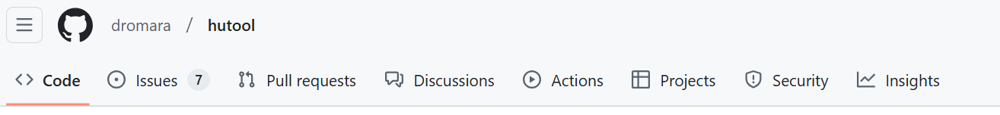

# 项目搭建（后端）

- [x] 创建Maven项目

- [x] 搭建SpringBoot工程，使用2.7.2版本

- [ ] 库表设计

  - [x] 用户表
  - [ ] 题目表
  - [ ] 题库表
  - [ ] 题目关联表

- [x] 使用CDN和轻量应用服务器搭建个人图床

  - [x] 搭建宝塔
  - [x] 静态网址绑定
  - [x] 搭建git
  - [x] 启动CDN加速
  - [x] 编写教程

- [x] 连接数据库

- [x] 整合Druid

- [x] 整合Knife4j：https://doc.xiaominfo.com/docs/quick-start

- [x] 封装自定义异常类

- [x] 全局异常处理器

- [x] 通用返回类

- [x] 规划后端项目目录

- [x] 分层领域模型包规划：创建用户DTO、VO

- [x] MyBatis别名配置

- [x] 解决跨域

- [x] 修改selectUserByUserAccountAndUserPassword为selectUserByUserAccount，原因：不仅仅是用户登录要用到selectUserByUserAccount，用户注册也需要用到

- [x] 将日志打印修改为自定义xml文件，同时修改MyBatis日志打印工具为Logback

- [x] 实体类角色字段类型修改为List，修改XML文件使数据库字段String-JSON类型与实体类字段List类型进行转换（自写JSON类型处理器）

- [x] 数据库设置默认值好还是在代码中编写好？
  参考博客：https://www.navicat.com.cn/company/aboutus/blog/369-mysql-

- [x] 搜索提交规范中每一个规范英文代表什么

- [x] 搭建服务器图床，目的：能够使用PicGo上传

- [ ] 整理task，将已完成的任务移到后面，重新规划需要完成的任务

- [ ] 学习Excel，将task抽取为：开发进度.xlsx

  代办列表：https://www.excelhome.net/5296.html、https://zhuanlan.zhihu.com/p/215262754

- [ ] 坚持写工作周报
  参考：https://blog.csdn.net/qq_39609151/article/details/83780540

- [ ] 学习Excel数据验证、函数

- [x] 包名从cn.luoyan.elitecode改为cn.elitecode

- [ ] 补充Swagger注解

- [x] 校验规范修改（不为空和查询数据库应该合并成一个方法）

- [ ] 抽取Register、LoginController

- [x] 删除Common3工具类，只使用hutool工具类

- [ ] 新增日志模块

- [ ] 整合 SpringSecurity

- [ ] 操作日志

- [x] 分模块开发

  - [ ] （写博客）使用IDEA查看模块之间的依赖关系：https://blog.csdn.net/qq_27579471/article/details/121557639

- [ ] SpringSecurity整合JWT

---

# 项目搭建（前端）

- [x] 初始化Vue3
- [x] 创建路由
- [ ] 自己写默认样式(@/assets/styles/index.less)
- [ ] 封装axios

## 登录

- [ ] 
- [ ] 样式编写
- [ ] 表单校验
- [ ] 登录成功跳转到主页
- [ ] 记住密码
- [ ] 登录按钮增加loading（参考若依）
- [ ] 动态加载和管理 SVG 图标

---

## 注册

- [x] 样式编写
- [x] 跳转登录页

---

- [x] 初始化NextJS工程

- [x] 引入AntDesign组件库

- [x] 通用布局

- [ ] 登录 / 注册页面

- [x] 生产环境和本地环境配置：https://nextjs.org/docs/app/building-your-application/configuring/environment-variables

  

----

# 用户模块

## 【后端】

- [x] 注册

- [x] 登录

- [x] 注销

- [x] 分页获取用户数据

- [x] 新增用户

- [x] 批量删除用户

- [x] 增加逻辑删除（del_flag）

- [ ] 更新个人信息

- [x] 根据id更新用户信息

- [x] 更新个人信息头像

  若依：/avatar

  微人事：/hr/userface

- [ ] 修改

- [ ] 获取个人信息

- [x] 使用ThreadLocal记录当前线程的用户id

- [x] 制作个人简历，参考老鱼简历、超级简历

- [ ] 重置密码

  微人事：/hr/pass

  若依：/updatePwd、/resetPwd

- [ ] 忘记密码

- [ ] 将用户表中的角色字段抽取出来，做成用户表，然后新建 `用户-角色关联表`

---

## 【前端】

---

# 题目题库模块

## 【后端】

- [ ] 题目表
- [ ] 题库表
- [ ] 题目关联表

---

## 【前端】

----

# 上线

- [ ] 上线项目，增加Knife4j账号密码配置
- [ ] `elite-code.cn` 域名购买
- [ ] 域名备案
- [x] 网站图标更换
- [ ] SEO 全方位解决方案：https://juejin.cn/post/7241813423460581435
- [ ] 学习PS，学会用PS抠图

----

# 其他

框架

- [ ] 使用SpringSecurity改写
- [ ] 学若依
  - 手动写字符串格式化类StrFormatter

文件管理

- [ ] mall：minio
- [ ] vhr：fastdfs（分布式文件管理系统）

----

# 思考

- [ ] 校验写在Controller还是Service好？

  因为就算写在Controller，Service方法也有可能对外暴露一个rpc协议的接口，由其他程序来调用。

- [ ] 

----

# git

- [x] Commit message（提交说明）规范

  阿里云的回答：https://zhuanlan.zhihu.com/p/182553920

- [x] tag复习

- [ ] Git整合分支的两种方法——合并(git merge)与变基(git rebase)的区别

  参考文章：https://blog.csdn.net/wpw2000/article/details/115890784

---

# GitHub

- [ ] github中的release是如何产生的（和tag的联系？）

  

  文章：

  https://gitwebcn.com/49979.html

  https://docs.github.com/zh/repositories/releasing-projects-on-github/managing-releases-in-a-repository

- [ ] Issue 提问的正确方式

  教程：https://blog.csdn.net/cool99781/article/details/105821546

  提问规范：https://github.com/ReadingPapers/Report/issues/2

- [ ] 了解GitHub导航栏中每一个按钮的作用和使用

  

- [ ] 在 Git 提交信息中使用 Emoji（参考Git笔记）

- [ ] 美化github文件图标（参考Git笔记）

- [ ] 如何做出炫酷的REDME？

- [ ] github上有项目可以命令行上传文件到百度网盘，可以尝试服务器写个shell脚本定期备份图片到百度网盘

- [ ] 开源项目批量修改Markdown笔记中的链接

- [ ] 管理个人资料自述文件，文章：https://docs.github.com/zh/account-and-profile/setting-up-and-managing-your-github-profile/customizing-your-profile/managing-your-profile-readme

- [ ] 贪吃蛇动画：

  文章：https://www.14k.top/blog/github-contribution-grid-snake、https://zhuanlan.zhihu.com/p/415688871

  Github：https://github.com/Platane/snk

- [ ] Github-Readme-Stats

  GitHub：https://github.com/anuraghazra/github-readme-stats

----

# 复习类

- [x] JDBC回顾

- [x] ServerSocket回顾

- [ ] JavaWeb回顾

- [ ] SSM回顾

  前端

- [x] TS回顾

- [x] React回顾

- [ ] 学习SpringSecurity

