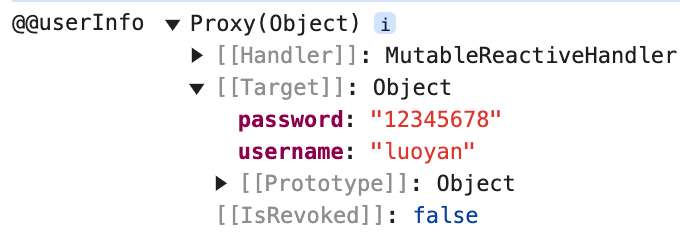

# 数据验证规范

## 规范性验证放在Controller层

例如不能为空，不能为null等基本的规范性验证。前端也验证过了，后端验证确保健壮。但其实它不属于任何业务。而且Spring boot 里面的 @Validated,@NotNull @NotBlank 校验注解也是放在Controller层的。所以规范性校验放在Controller层是大家都比较认可的。

## 业务性验证放在Service层

需要查询数据库的，比如用户名不能重复，这种校验放在service层比较合适。因为与业务挂钩了。我有可能业务需求是用户名第一个字不能重复，也有可能是用户名前两个字不能重复。

## 其他

规范是人定的，是为了使代码方便维护扩展修改。并没有任何强制规定你的代码究应该怎么写。但是规范总是好的。。。


---

# 异常处理规范

## 公司外的HTTP/API[开放接口](https://so.csdn.net/so/search?q=开放接口&spm=1001.2101.3001.7020)使用错误码表示错误

```java
// 正例：使用错误码表示错误
public Result<String> processRequest(Request request) {
    if (!validate(request)) {
        return Result.error(ErrorCode.INVALID_REQUEST);
    }
    // 处理请求...
    return Result.success(response);
}
```

## 应用内部推荐使用异常抛出

```java
// 正例：应用内部使用异常抛出
public void processInternalRequest(Request request) throws CustomException {
    if (!validate(request)) {
        throw new CustomException("Invalid request");
    }
    // 处理请求...
}

// 调用处捕获异常并处理
try {
    processInternalRequest(request);
} catch (CustomException e) {
    // 异常处理逻辑
}
```


## 跨应用间RPC调用使用Result方式封装调用结果

```java
// 正例：使用Result方式封装RPC调用结果
public Result<String> remoteMethod(Request request) {
    try {
        // 远程调用...
        return Result.success(response);
    } catch (RemoteException e) {
        return Result.error(ErrorCode.REMOTE_ERROR, "Remote call failed");
    }
}
```

通过在不同场景中选择合适的错误表示方式，可以提高[错误处理](https://marketing.csdn.net/p/3127db09a98e0723b83b2914d9256174?pId=2782&utm_source=glcblog&spm=1001.2101.3001.7020)的标准化、可读性和可靠性。


---

# Git commit规范

参考：[阿里云回答](https://zhuanlan.zhihu.com/p/182553920)

## commit message格式

```text
<type>(<scope>): <subject>
```

## type(必须)

用于说明git commit的类别，只允许使用下面的标识。

feat：新功能（feature）。

fix/to：修复bug，可以是QA发现的BUG，也可以是研发自己发现的BUG。

- fix：产生[diff](https://zhida.zhihu.com/search?content_id=128701224&content_type=Article&match_order=1&q=diff&zhida_source=entity)并自动修复此问题。适合于一次提交直接修复问题
- to：只产生diff不自动修复此问题。适合于多次提交。最终修复问题提交时使用fix。【To be fixed (used for partial fixes)】

docs：文档（documentation）。

style：格式（不影响代码运行的变动）。

refactor：重构（即不是新增功能，也不是修改bug的代码变动）。

perf：优化相关，比如提升性能、体验。（Performance）

test：增加测试。

chore：构建过程或辅助工具的变动。

revert：回滚到上一个版本。

merge：代码合并。

sync：同步主线或分支的Bug。（Synchronize）

## scope(可选)

scope用于说明 commit 影响的范围，比如数据层、控制层、视图层等等，视项目不同而不同。

例如在Angular，可以是location，browser，compile，compile，rootScope， ngHref，ngClick，ngView等。如果你的修改影响了不止一个scope，你可以使用*代替。

## subject(必须)

subject是commit目的的简短描述，不超过50个字符。

建议使用中文（感觉中国人用中文描述问题能更清楚一些）。

- 结尾不加句号或其他标点符号。
- 根据以上规范git commit message将是如下的格式：

```text
fix(DAO):用户查询缺少username属性 
feat(Controller):用户查询接口开发
```

以上就是我们梳理的git commit规范，那么我们这样规范git commit到底有哪些好处呢？

- 便于程序员对提交历史进行追溯，了解发生了什么情况。
- 一旦约束了commit message，意味着我们将慎重的进行每一次提交，不能再一股脑的把各种各样的改动都放在一个git commit里面，这样一来整个代码改动的历史也将更加清晰。
- 格式化的commit message才可以用于自动化输出Change log。


---

# 命名

## 模块

- Typescript类型命名：PascalCase（大驼峰命名）
- `ec-module-xxx` 包命名：`cn.elitecode.module.member`
- `ec-framework` 包命名：例如 `ec-common` — `cn.elitecode.framework.common[config、core]`

---

## 三层体系（DO、controller、service、mapper）

下面以 `system_users表` 为例

- DO：

  - 类名：`xxxDO`
  - 注释：`system_users(用户表) | 实体类`

- Controller：

  - Tag：管理后台 - 用户

  - `@RequestMapping("/system/user")`

  - 类名：UserController

  - 注释：`用户控制器`

  - 增：

    - 注释：新增用户
    - 方法名：addUser
    - 参数：`@Validated @RequestBody UserAddReqVO addReqVO`
    - 接口地址：`/add`
    - 请求方式：`POST`
    - 返回值：Long（id）

  - 删：

    - 注释：批量删除用户
    - 方法名：removeUsers
    - 参数：`@ApiParam("需要删除的id数组") @RequestParam("id") Long id`
    - 接口地址：`/delete`
    - 请求方式：`DELETE`
    - 返回值：void

  - 改：

    - 注释：根据id更新用户信息
    - 方法名：updateUser
    - 参数：`@Validated @RequestBody UserUpdateReqVO userUpdateReqVO`
    - 接口地址：`/update`
    - 请求方式：`PUT`
    - 返回值：void

  - 分页查询：

    - 注释：获得用户分页列表
    - 方法名：getUserPage
    - 参数：`UserPageReqVO pageReqVO`
    - 接口地址：`/page`
    - 请求方式：`GET`
    - 返回值：`CommonPage<UserDO>`

  - 根据id查询：

    - 注释：根据id查询用户信息

    - 方法名：getUser

    - 参数：`@RequestParam("id") Long userId`

    - 接口地址：`/get`

    - 请求方式：`GET`

    - 返回值：`CommonResult<UserRespVO>`

      ~~~java
      @Schema(description = "管理后台 - 用户信息 Response VO")
      @Data
      @ExcelIgnoreUnannotated
      public class UserRespVO{
      
          @Schema(description = "用户编号", requiredMode = Schema.RequiredMode.REQUIRED, example = "1")
          @ExcelProperty("用户编号")
          private Long id;
      
          @Schema(description = "用户账号", requiredMode = Schema.RequiredMode.REQUIRED, example = "yudao")
          @ExcelProperty("用户名称")
          private String username;
      
          @Schema(description = "用户昵称", requiredMode = Schema.RequiredMode.REQUIRED, example = "芋艿")
          @ExcelProperty("用户昵称")
          private String nickname;
      
          @Schema(description = "备注", example = "我是一个用户")
          private String remark;
      
          @Schema(description = "部门ID", example = "我是一个用户")
          private Long deptId;
          @Schema(description = "部门名称", example = "IT 部")
          @ExcelProperty("部门名称")
          private String deptName;
      
          @Schema(description = "岗位编号数组", example = "1")
          private Set<Long> postIds;
      
          @Schema(description = "用户邮箱", example = "yudao@iocoder.cn")
          @ExcelProperty("用户邮箱")
          private String email;
      
          @Schema(description = "手机号码", example = "15601691300")
          @ExcelProperty("手机号码")
          private String mobile;
      
          @Schema(description = "用户性别，参见 SexEnum 枚举类", example = "1")
          @ExcelProperty(value = "用户性别", converter = DictConvert.class)
          @DictFormat(DictTypeConstants.USER_SEX)
          private Integer sex;
      
          @Schema(description = "用户头像", example = "https://www.iocoder.cn/xxx.png")
          private String avatar;
      
          @Schema(description = "状态，参见 CommonStatusEnum 枚举类", requiredMode = Schema.RequiredMode.REQUIRED, example = "1")
          @ExcelProperty(value = "帐号状态", converter = DictConvert.class)
          @DictFormat(DictTypeConstants.COMMON_STATUS)
          private Integer status;
      
          @Schema(description = "最后登录 IP", requiredMode = Schema.RequiredMode.REQUIRED, example = "192.168.1.1")
          @ExcelProperty("最后登录IP")
          private String loginIp;
      
          @Schema(description = "最后登录时间", requiredMode = Schema.RequiredMode.REQUIRED, example = "时间戳格式")
          @ExcelProperty("最后登录时间")
          private LocalDateTime loginDate;
      
          @Schema(description = "创建时间", requiredMode = Schema.RequiredMode.REQUIRED, example = "时间戳格式")
          private LocalDateTime createTime;
      
      }
      ~~~

- Service：

  - 类名：UserService
  - 注释：`用户表（system_users） | 业务层`
  - 增：
    - 注释：新增用户
    - 方法名：addUser
  - 删：
    - 注释：批量删除用户
    - 方法名：removeUserByIds
  - 改：
    - 注释：根据id更新用户信息
    - 方法名：updateUser
  - 分页查询：
    - 注释：获取用户分页列表
    - 方法名：getUserPage
  - 根据id查询：
    - 注释：根据id查询用户信息
    - 方法名：getUser(id)

- ServiceImpl

  - 类名：UserServiceImpl
  - 注释：`用户表（system_users） | 业务处理层`
  - 业务层校验新增、修改可共同同一个方法 `validateUserForCreateOrUpdate`
  - 增：
    - 设置创建者、更新者
  - 改：
    - 设置更新者
  - 分页查询：
    - 将current设置为分页用的起始索引

- Mapper：

  - 类名：UserMapper

  - 注释：`用户表(system_users) | 数据层`

  - 增

    - 注释：插入用户

    - 方法名：inserUser

    - 设置创建者、更新者

    - ~~~xml
      <!-- int register(String username, String encryptPassword); -->
      <insert id="insertUser" useGeneratedKeys="true" keyProperty="id">
          insert into system_users
              <trim prefix="(" suffix=")" suffixOverrides=",">
              </trim>
          values
              <trim prefix="(" suffix=")" suffixOverrides=",">
              </trim>
      </insert>
      ~~~

  - 删

    - 注释：批量删除用户

    - 方法名：deleteUserByIds

    - 设置更新者

    - ~~~xml
      <!-- int deleteUserByIds(Long[] userIds); -->
      <delete id="deleteUserByIds">
          update system_users
          set
          	del_flag = '2'
          where
              id in
              <foreach collection="userIds" open="(" separator="," close=")" item="id">
              	#{id}
          	</foreach>
      </delete>
      ~~~

  - 改

    - 注释：根据id动态更新用户信息

    - 方法名：updateUserById

    - ~~~xml
      <!-- void updateByPrimaryKeySelective(UserDO userDO); -->
      <update id="updateUserById">
          update system_users
          <set>
          </set>
          where
          	id = #{id}
      </update>
      ~~~

  - 分页查询：

    - 注释：获取用户分页列表

    - 方法名：selectUserPage

    - ~~~xml
      <!--  List<UserDO> selectUserList(UserDO userDO); -->
      <select id="selectUserList" resultMap="UserResult">
          select
          u.id as u_id,
          u.username,
          u.password,
          u.nick_name,
          u.avatar,
          u.profile,
          u.del_flag,
          u.create_by,
          u.create_time,
          u.update_by,
          u.update_time,
          r.id as r_id,
          r.name as r_name,
          r.sort as r_sort
          from
          system_users u
          left join system_user_role_relation ur on ur.user_id = u.id
          left join system_role r on r.id = ur.role_id
          where
          u.del_flag = '0'
          <if test="username != null and username != ''">and u.username like concat("%", #{username}, "%")</if>
          <if test="nickName != null and nickName != ''">and u.nick_name like concat("%", #{nickName}, "%")</if>
          <if test="createBy != null and createBy != 0">and u.create_by = #{createBy}</if>
          <if test="updateBy != null and updateBy != 0">and u.update_by = #{updateBy}</if>
          <if test="startTime != null and endTime != null">and u.create_time between #{startTime} and #{endTime}</if>
          <if test="sortFieldPair != null and sortFieldPair.size() > 0">
              ORDER BY
              <foreach collection="sortFieldPair" separator="," item="sortField">
                  ${sortField}
              </foreach>
          </if>
          limit #{current}, #{pageSize}
      </select>
      ~~~

    - 根据id查询：

      - 注释：根据ID查询用户

      - 方法名：selectUserById

      - ~~~xml
        <!-- public UserDO selectUserById(Long userId); -->
        <select id="selectUserById" resultMap="UserResult" parameterType="Long">
            select
            u.id as u_id,
            u.username,
            u.password,
            u.nick_name,
            u.avatar,
            u.profile,
            u.del_flag,
            u.create_by,
            u.create_time,
            u.update_by,
            u.update_time,
            r.id as r_id,
            r.name as r_name,
            r.sort as r_sort
            from
            system_users u
            left join system_user_role_relation ur on ur.user_id = u.id
            left join system_role r on r.id = ur.role_id
            where
            u.id = #{userId}
        </select>
        ~~~


---

## Vue

事件命名：多单词建议使用 `-` 分隔；方法命名：小驼峰


## 组件命名

**一个单词组成**：
			第一种写法(首字母小写)：school，使用的时候也是小写 `<school></school>`
			第二种写法(首字母大写)：School，使用的时候也是大写 `<School></School>`；有人就喜欢这种写法，因为这样写能跟开发者工具呼应上。（推荐）

**多个单词组成**：
			第一种写法(kebab-case命名)：`my-school`，此时在开发者工具上呈现的是 `MySchool`
			第二种写法(CamelCase命名)：`MySchool` (需要Vue脚手架支持)（推荐）


有序的写组合式API

~~~html
<script setup>
  // import语句
  // Props (defineProps)
  // Emits (defineEmits)
  // 响应式变量定义
  // Computed
  // Watchers
  // 函数
  // 生命周期
  // Expose (defineExpose)
</script>
~~~

有必要的时候可以：抽取出多个`useCount`函数放在当前vue组件内。并且在多个`useCount`函数中我们还是按照前面约定的规范，按照顺序去写`ref`变量、`computed`、函数的代码。

~~~html
<script setup lang="ts">
import { ref, computed } from "vue";

const { count1, doubleCount1, increment1 } = useCount1();
const { count2, doubleCount2, increment2 } = useCount2();
const { count3, doubleCount3, increment3 } = useCount3();
const { count4, doubleCount4, increment4 } = useCount4();
const { count5, doubleCount5, increment5 } = useCount5();

function useCount1() {
  const count1 = ref(0);

  const doubleCount1 = computed(() => count1.value * 2);

  function increment1() {
    count1.value++;
  }

  return { count1, doubleCount1, increment1 };
}

function useCount2() {
  // ...省略
}

function useCount3() {
  // ...省略
}

function useCount4() {
  // ...省略
}

function useCount5() {
  // ...省略
}
</script>
~~~

---

# 数据库

- 关联表：以一个结尾单词`relastion`来标识关联表

  比如商品表：`goods` 商品类型表名：`goods_type`，那么商品和类型关联表名可以表示为：`goods_type_relation`

- `del_flag` 字段：使用二进制的0(false)/1(true)表示


---

# 其它

- 用了scss、less的地方就嵌套写

- 基本数据类型用ref；遇到需要替换的对象类型用ref，不需要替换的对象使用reactive

  ~~~js
  const loginForm = reactive<UserLoginDTO>({
    username: 'luoyan',
    password: '12345678'
  })
  
  userStore.login(loginForm).then(() => {
    // 跳转到主页
    handleGoHome()
  })
  
  ----
  
  // 登录
  login(userInfo: UserLoginDTO) { ... }
  ~~~

  可以发现userInfo接收到的也只有username、password，而不是ref整个代理对象

  


