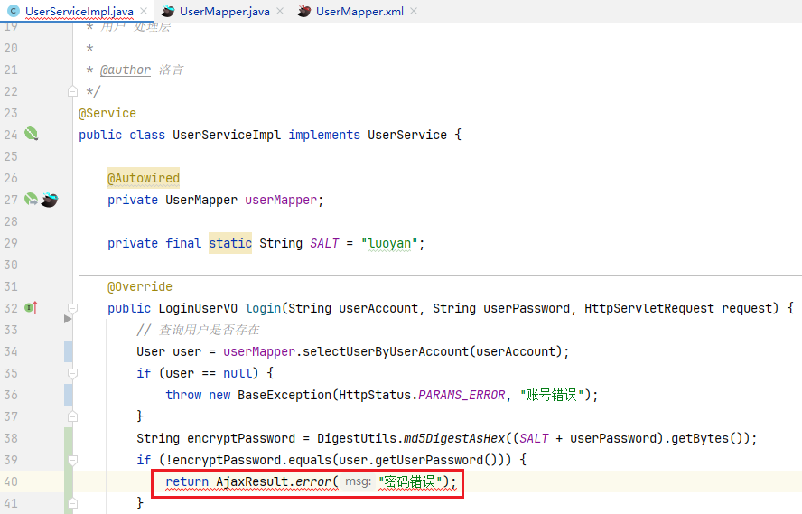

# 数据验证规范

## 规范性验证放在Controller层

例如不能为空，不能为null等基本的规范性验证。前端也验证过了，后端验证确保健壮。但其实它不属于任何业务。而且Spring boot 里面的 @Validated,@NotNull @NotBlank 校验注解也是放在Controller层的。所以规范性校验放在Controller层是大家都比较认可的。

## 业务性验证放在Service层

需要查询数据库的，比如用户名不能重复，这种校验放在service层比较合适。因为与业务挂钩了。我有可能业务需求是用户名第一个字不能重复，也有可能是用户名前两个字不能重复。

## 其他

规范是人定的，是为了使代码方便维护扩展修改。并没有任何强制规定你的代码究应该怎么写。但是规范总是好的。。。


---

# 异常处理规范

## 公司外的HTTP/API[开放接口](https://so.csdn.net/so/search?q=开放接口&spm=1001.2101.3001.7020)使用错误码表示错误

```java
// 正例：使用错误码表示错误
public Result<String> processRequest(Request request) {
    if (!validate(request)) {
        return Result.error(ErrorCode.INVALID_REQUEST);
    }
    // 处理请求...
    return Result.success(response);
}
```

## 应用内部推荐使用异常抛出

```java
// 正例：应用内部使用异常抛出
public void processInternalRequest(Request request) throws CustomException {
    if (!validate(request)) {
        throw new CustomException("Invalid request");
    }
    // 处理请求...
}

// 调用处捕获异常并处理
try {
    processInternalRequest(request);
} catch (CustomException e) {
    // 异常处理逻辑
}
```



## 跨应用间RPC调用使用Result方式封装调用结果

```java
// 正例：使用Result方式封装RPC调用结果
public Result<String> remoteMethod(Request request) {
    try {
        // 远程调用...
        return Result.success(response);
    } catch (RemoteException e) {
        return Result.error(ErrorCode.REMOTE_ERROR, "Remote call failed");
    }
}
```

通过在不同场景中选择合适的错误表示方式，可以提高[错误处理](https://marketing.csdn.net/p/3127db09a98e0723b83b2914d9256174?pId=2782&utm_source=glcblog&spm=1001.2101.3001.7020)的标准化、可读性和可靠性。


---

# Git commit规范

参考：[阿里云回答](https://zhuanlan.zhihu.com/p/182553920)

## commit message格式

```text
<type>(<scope>): <subject>
```

## type(必须)

用于说明git commit的类别，只允许使用下面的标识。

feat：新功能（feature）。

fix/to：修复bug，可以是QA发现的BUG，也可以是研发自己发现的BUG。

- fix：产生[diff](https://zhida.zhihu.com/search?content_id=128701224&content_type=Article&match_order=1&q=diff&zhida_source=entity)并自动修复此问题。适合于一次提交直接修复问题
- to：只产生diff不自动修复此问题。适合于多次提交。最终修复问题提交时使用fix

docs：文档（documentation）。

style：格式（不影响代码运行的变动）。

refactor：重构（即不是新增功能，也不是修改bug的代码变动）。

perf：优化相关，比如提升性能、体验。

test：增加测试。

chore：构建过程或辅助工具的变动。

revert：回滚到上一个版本。

merge：代码合并。

sync：同步主线或分支的Bug。

## scope(可选)

scope用于说明 commit 影响的范围，比如数据层、控制层、视图层等等，视项目不同而不同。

例如在Angular，可以是location，browser，compile，compile，rootScope， ngHref，ngClick，ngView等。如果你的修改影响了不止一个scope，你可以使用*代替。

## subject(必须)

subject是commit目的的简短描述，不超过50个字符。

建议使用中文（感觉中国人用中文描述问题能更清楚一些）。

- 结尾不加句号或其他标点符号。
- 根据以上规范git commit message将是如下的格式：

```text
fix(DAO):用户查询缺少username属性 
feat(Controller):用户查询接口开发
```

以上就是我们梳理的git commit规范，那么我们这样规范git commit到底有哪些好处呢？

- 便于程序员对提交历史进行追溯，了解发生了什么情况。
- 一旦约束了commit message，意味着我们将慎重的进行每一次提交，不能再一股脑的把各种各样的改动都放在一个git commit里面，这样一来整个代码改动的历史也将更加清晰。
- 格式化的commit message才可以用于自动化输出Change log。


---

