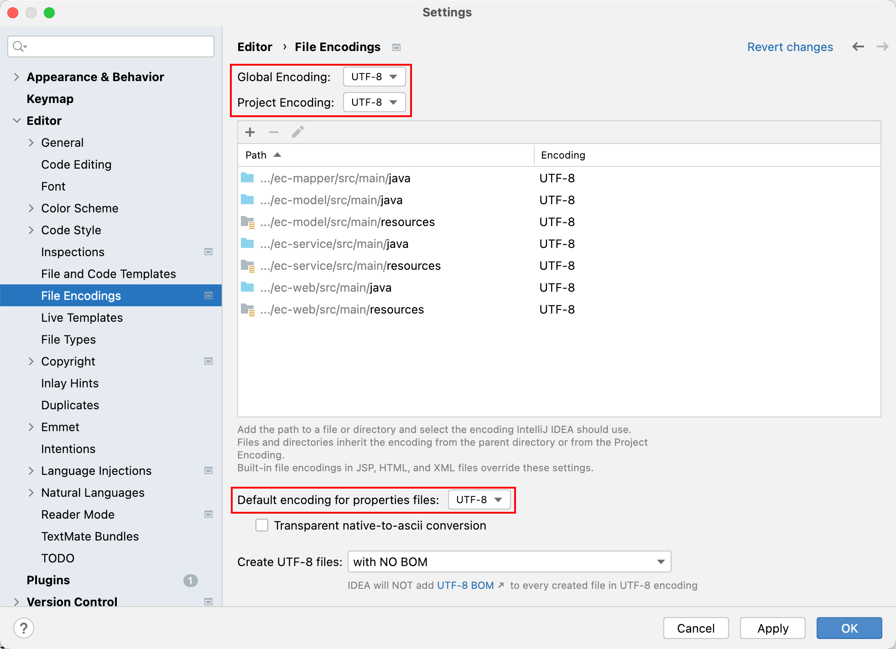
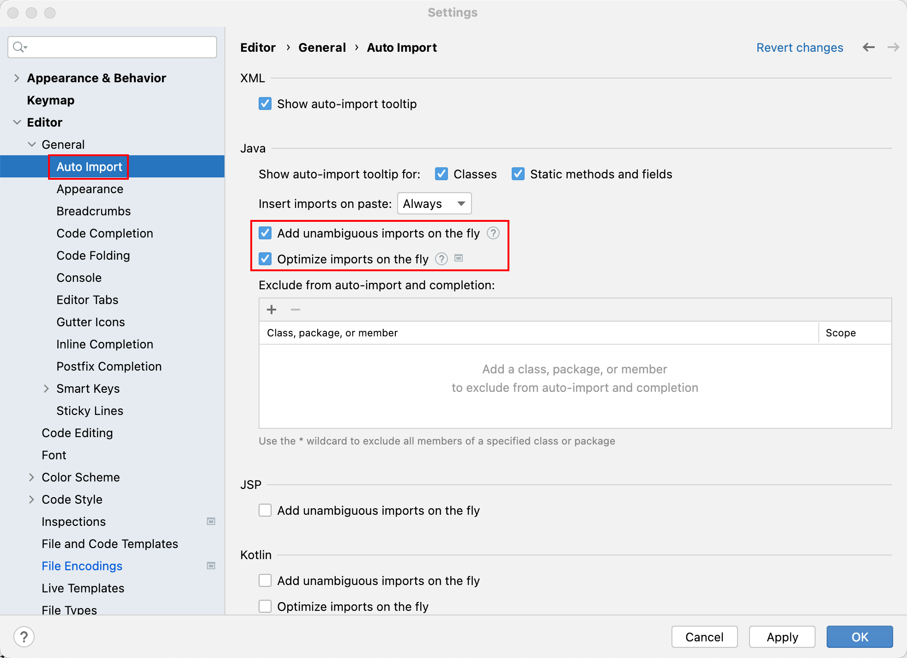
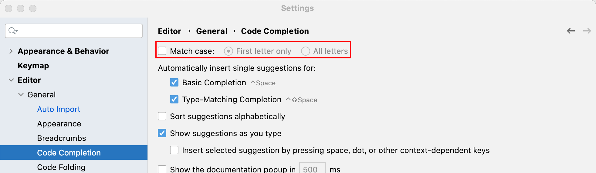
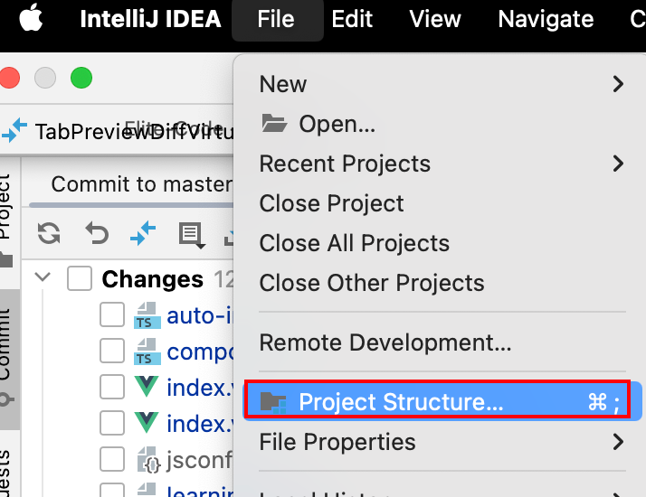
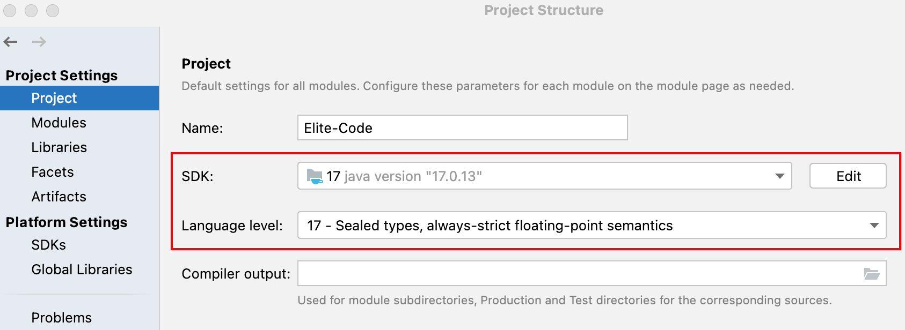

# 开发工具版本

前端：

| 开发工具 | 版本号   | 安装位置 |
| -------- | -------- | -------- |
| WebStorm | 2024.3.3 | 个人电脑 |
| Node     | 18.16.0  | 个人电脑 |

后端：

| 开发工具           | 版本号             | 安装位置 |
| ------------------ | ------------------ | -------- |
| IntelliJ-IDEA      | 2024.3.3           | 个人电脑 |
| JDK                | 17.0.13            | 个人电脑 |
| Maven              | 3.6.3              | 个人电脑 |
| Git                | 2.39.5             | 个人电脑 |
| VMware-workstation | 16.x               | 个人电脑 |
| CentOS             | 7.x                | 虚拟机   |
| Docker             | 18.09.0            | 虚拟机   |
| Mysql              | 8.x                | docker   |
| nacos              | 1.4.1              | docker   |
| rabbitmq           | 3.8.34             | docker   |
| redis              | 6.2.7              | docker   |
| xxl-job-admin      | 2.3.1              | docker   |
| minio              | RELEASE.2022-09-07 | docker   |
| elasticsearch      | 7.12.1             | docker   |
| kibana             | 7.12.1             | docker   |
| gogs               | 0.13.0             | docker   |
| nginx              | 1.12.2             | docker   |

---

# IDEA环境配置

安装指定版本的IDEA，根据下边的步骤进行配置。

## 一、编码配置

---

## 二、自动导包配置

---

## 三、提示忽略大小写

IDEA代码提示默认是区分大小写的，设置为提示忽略大小写，编译我们后期的开发

---

## 四、设置 Java 编译级别

-----

