# CentOS7安装最新Git

## 一、YUM安装

### 删除旧的git

```powershell
sudo yum -y remove git
sudo yum -y remove git-*
```

### 添加端点 CentOS/RHEL 7 存储库

在 CentOS/RHEL 7 上安装最新版本 Git 的最快方法是从 End Point 存储库。

```powershell
sudo yum -y install https://packages.endpointdev.com/rhel/7/os/x86_64/endpoint-repo.x86_64.rpm
```

添加存储库后，[安装 Git](https://so.csdn.net/so/search?q=安装 Git&spm=1001.2101.3001.7020) 2.x：

```powershell
sudo yum install git
```

按 **y** 键接受安装，然后在 CentOS 7 上安装 git。

```powershell
....
Transaction Summary
======================================================================================================================================================================================================
Install  1 Package (+33 Dependent packages)

Total download size: 25 M
Installed size: 82 M
Is this ok [y/d/N]: y
```

安装 `git2u-all` 软件包后检查 `git` 版本

```powershell
$ git --version
git version 2.41.0
```

经确认，当前的 Git 版本是 `2.x.y`

---

## 二、源代码安装

在这种方法中，您的任务是从源代码构建 `git`。安装需要的依赖包：

```powershell
sudo yum -y remove git*
sudo yum -y install epel-release
sudo yum -y groupinstall "Development Tools"
sudo yum -y install wget perl-CPAN gettext-devel perl-devel  openssl-devel  zlib-devel curl-devel expat-devel  getopt asciidoc xmlto docbook2X
sudo ln -s /usr/bin/db2x_docbook2texi /usr/bin/docbook2x-texi
```

下载并安装最新的git：

```powershell
sudo yum -y install wget curl
export VER="v2.41.0"
wget https://github.com/git/git/archive/${VER}.tar.gz
tar -xvf ${VER}.tar.gz
rm -f ${VER}.tar.gz
cd git-*
make configure
sudo ./configure --prefix=/usr
sudo make
sudo make install
```

检查系统上安装的新版本 `git`

```powershell
$ git --version
git version 2.41.0
```

您现在应该在 CentOS 7 服务器上安装了最新版本的 Git 2.x。


----

# 使用轻量应用服务器搭建图床

## 一、在宝塔上安装Nginx

首先安装宝塔：https://www.bt.cn/new/download.html

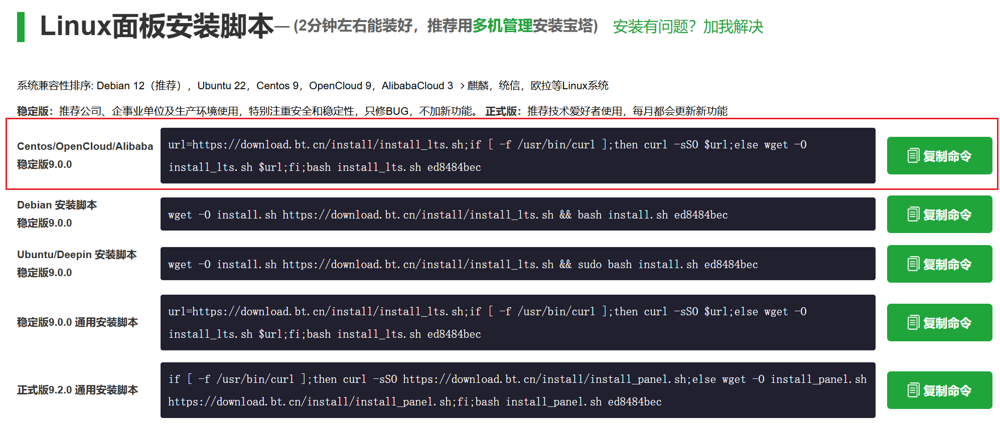

然后在宝塔中安装Nginx

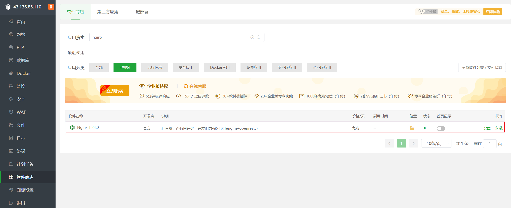

---

## 二、创建图床网站

我们需要通过Nginx设置一个网站，用来展示我们的图片，因为我们刚刚已经通过宝塔安装Nginx，所以在这再设置一个网站：

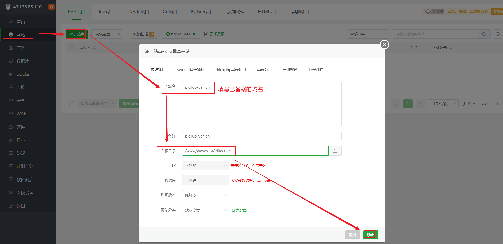

我们这里设置的图床网站地址为：`/www/wwwroot/elitecode`：默认创建的文件没有用可以删掉

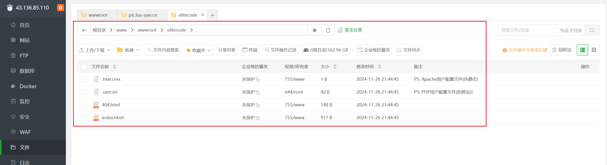

---

## 三、服务器创建Git用户

首先，我们看看我们事先有没有创建Git用户，输入命令：

~~~bash
cat /etc/passwd|grep -v nologin|grep -v halt|grep -v shutdown|awk -F":" '{ print $1"|"$3"|"$4 }'|more
~~~

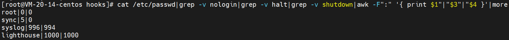

创建`git`用户：

~~~bash
adduser git
~~~

修改git的密码：

~~~bash
passwd git
~~~

然后两次输入git的密码确认后查看git是否添加成功

~~~bash
cd /home && ls -al
~~~

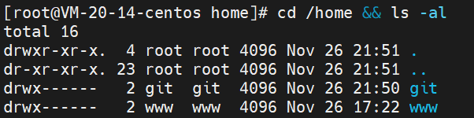

---

## 四、服务器创建图床仓库

切换为git用户

~~~bash
su - git
~~~

初始化叫 `elitecode.git` 的仓库

~~~bash
sudo git init --bare elitecode.git
~~~

看见 `Initialized empty Git repository in /home/git/elitecode.git/` 说明仓库创建成功

此时会多一个项目文件夹：

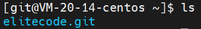

输入以下命令，为git用户赋予权限

~~~bash
chown -R git:git elitecode.git
~~~

进入项目文件夹查看初始化的内容：

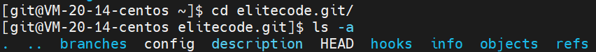

这个时候，我们`图床仓库`就创建好了。

---

## 五、设置hooks

我们设置一下hooks，用于每次本地仓库推送到云端时，自动用最新版本图床图片覆盖至Nginx网站下。我们刚刚Nginx创建的图床网站地址：`/www/wwwroot/elitecode`，所以：

~~~bash
# （当前在项目文件夹内）进入hooks文件夹内
cd hooks
# 创建并编辑钩子
vim post-receive
~~~

敲入：

- `--work-tree`：填Nginx网站地址。
- `--git-dir`：填图床仓库地址。

~~~bash
#!/bin/bash
git --work-tree=/www/wwwroot/elitecode --git-dir=/home/git/elitecode.git checkout -f
~~~

之后提取按，赋予**执行权**：

~~~bash
chmod +x post-receive
~~~

---

## 六、同步本地仓库

刚刚我们已经创建了`图床仓库`，本地也需要安装Git。这里不再赘述。在安装好后，克隆仓库到本地

~~~bash
git clone git@server-IP:/home/git/elitecode.git
~~~

其中，`server-IP`为你服务器的IP或域名：

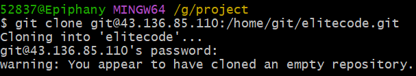

之后，本地就出现这个仓库了：


---

## 七、使用图床

之后，我们对本地仓库加入图片：

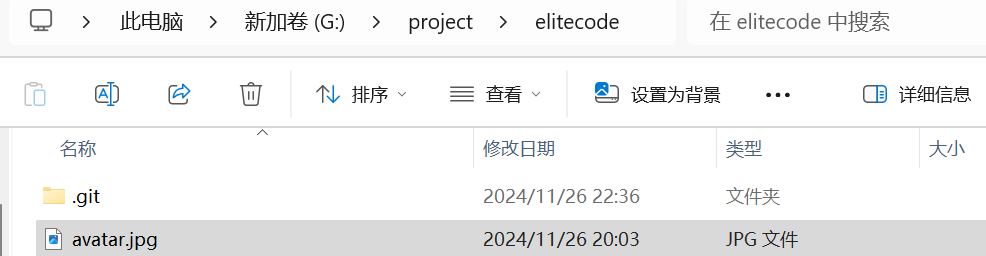

之后，我们在终端内操作：

服务器：

~~~bash
chmod 777 /www/wwwroot/elitecode
~~~

本地：

~~~git
# 添加所有文件
git add 
# 创建commit
git commit -m "init".
# 推送到服务器主分支
git push origin HEAD
~~~

---

## 八、创建SSH Key

~~~bash
ssh-keygen -t rsa -C "youremail@example.com"  
~~~

补充：ssh-keygen -t rsa -b 4096 -C "邮箱"：这条命令的目的是为了让本地机器ssh登录远程机器上的GitHub账户无需输入密码。

> ssh-keygen（基于密匙的安全验证）：需要依靠密钥进行安全验证，必须为自己创建一对密钥，并把公用密钥放在需要访问的服务器上。
> -t 即指定密钥的类型。密钥的类型有两种，一种是RSA，一种是DSA。
> -b 指定密钥长度。对于RSA密钥，最小要求768位，默认是2048位。命令中的4096指的是RSA密钥长度为4096位。DSA密钥必须恰好是1024位(FIPS 186-2 标准的要求)。
> -C 表示要提供一个新注释，用于识别这个密钥。“”里面不一定非要填邮箱，可以是任何内容，邮箱仅仅是识别用的key。

如果一切顺利的话，可以在用户主目录里找到.ssh目录，里面有id_rsa和id_rsa.pub两个文件，这两个就是SSH Key的秘钥对，id_rsa是私钥，不能泄露出去，id_rsa.pub是公钥，可以放心地告诉任何人。

---

## 九、Git服务器打开RSA认证

然后就可以去Git服务器上添加你的公钥用来验证你的信息了。在Git服务器上首先需要将/etc/ssh/sshd_config中将RSA认证打开，即：

~~~asp
1.RSAAuthentication yes     
2.PubkeyAuthentication yes     
3.AuthorizedKeysFile  .ssh/authorized_keys
~~~

这里我们可以看到公钥存放在.ssh/authorized_keys文件中。所以我们在/home/git下创建.ssh目录，然后创建authorized_keys文件，并将刚生成的公钥导入进去。

然后再次clone的时候，或者是之后push的时候，就不需要再输入密码了：

~~~bash
cd /home/git
mkdir .ssh
vim authorized_keys
~~~

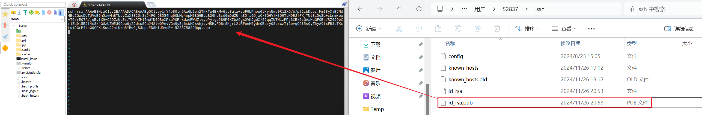

---

## 十、设置git用户不允许Shell登录

为了安全性，一般都禁止

```bash
vi /etc/passwd
```

 按i进入编辑模式，在最后一行将git用户修改成以下配置

```bash
git:x:1000:1000::/home/git:/usr/bin/git-shell
```

按ESC退出插入模式，输入 “:wq” 保存并且退出vi模式 

---

## 十一、启动CDN加速

但是，这样很危险⚠️：

- **容易暴露服务器IP**
- 加载缓慢

所以，我们需要套上CDN加速。

我们进入CDN控制台，选择`域名管理-添加域名`：

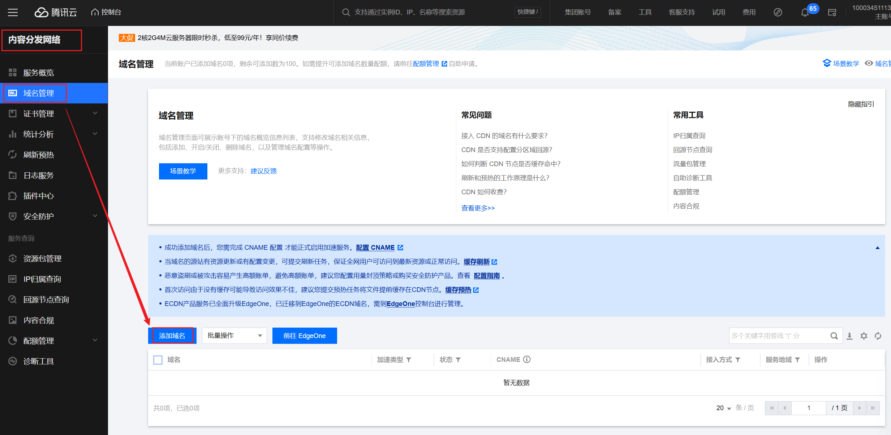

在添加域名时，如果该域名需校验，在域名下方会提示需验证域名归属权，单击**验证方法**；

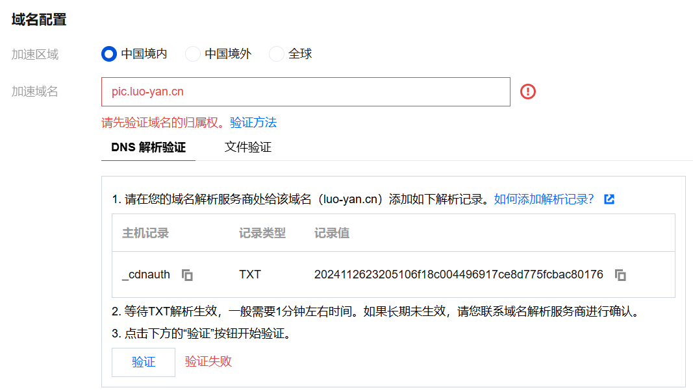

验证方法中，默认为 DNS 解析验证。 使用 DNS 解析验证的方式，需要您前往该域名的解析服务商，在主域名下添加一个主机记录值为`_cdnauth`的 TXT 记录。

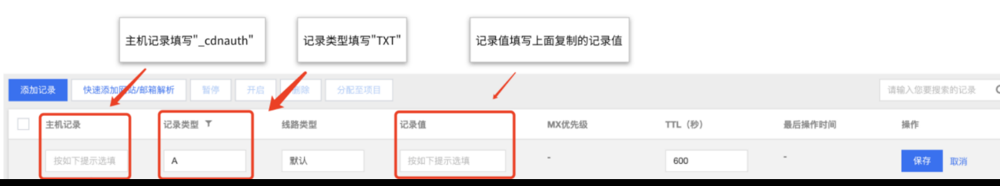

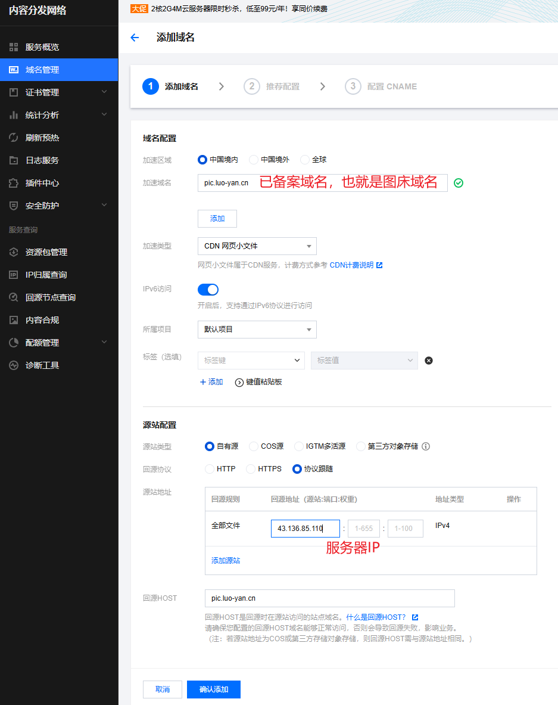


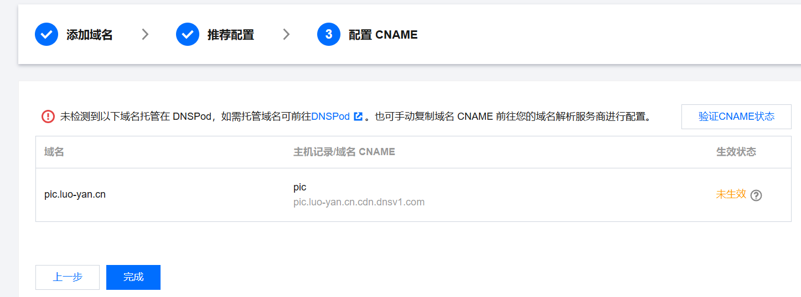

在添加域名后，进入第三步：配置 CNAME 中，在 CNAME 信息内，复制当前域名的 CNAME 值；

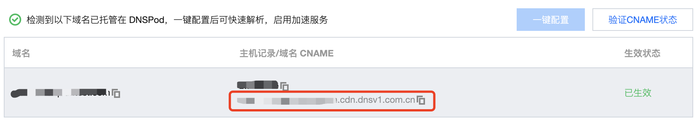

前往 [云解析控制台](https://console.cloud.tencent.com/cns)，找到对应的域名，单击**解析**按钮；

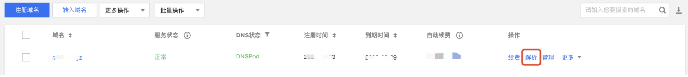

**注意：**同一区域不能同时有 CNAME 记录和A记录，如加速域名已经有A记录，则需将A记录切换为 CNAME 记录。

单击**保存**后，即可完成 CNAME 配置。

即可开启CDN，并可以在CDN控制台看到效果：

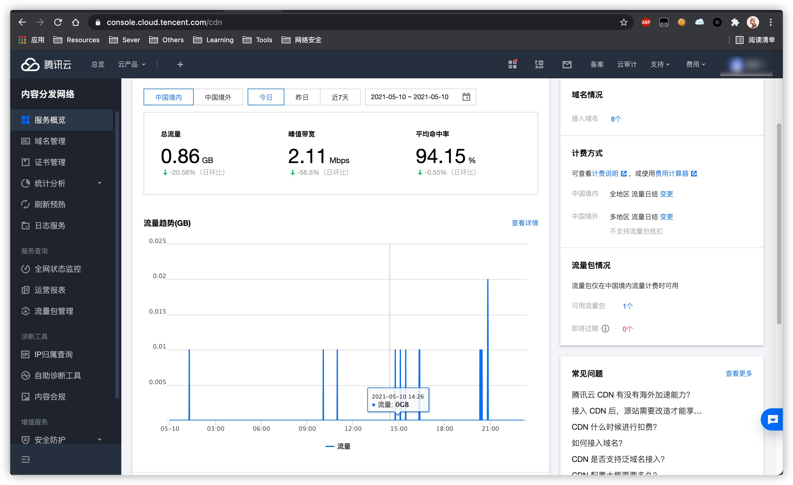

检测一下域名对应IP，可以看到是CDN节点服务器IP，而不是我们轻量应用服务器的IP：

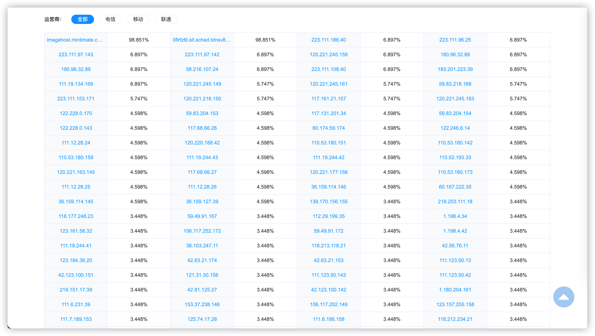

注意⚠️：

- CDN可能会有延迟，最长需要72小时才可以全球缓存刷新
- 注意配置图片防盗链，避免流量被恶意脚本消耗殆尽

---

## 十二、CNAME

### 1、如何验证 CNAME 是否生效

1. 在配置完成 CNAME 后，您可以在添加域名的第三步中，单击验证 CNAME 状态，查看当前域名 CNAME 是否生效，如果生效状态显示为已生效，则当前 CNAME 解析已正确生效，域名已启动 CDN 加速，如果当前生效状态未生效，需检查当前是否已完成 CNAME 配置，如果确认当前 CNAME 已正确配置，可能是当前解析生效延迟问题，您也可以选择用第3种方式进行验证。




2. 您可以在控制台的域名管理列表内查看，如果域名的 CNAME 解析已有正确解析提示，表示当前 CDN 域名加速已生效。如果有两条 CNAME 解析的情况下，其中一条生效即可。

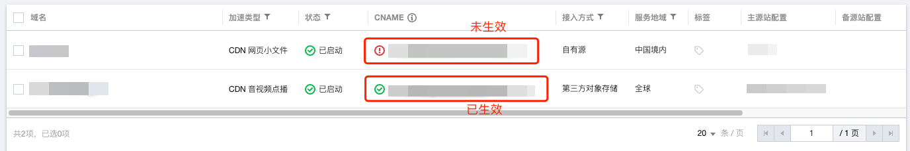



3. 您也可以使用 nslookup 或 dig 命令来查看当前域名的解析生效状态。如果您的系统为 Windows 系统，在 Window 系统中打开 cmd 运行程序，以域名`www.test.com`为例，您可以在 cmd 内运行：`nslookup -qt=cname www.test.com`，根据运行的解析结果内，可以查看该域名的 CNAME 信息，如果与腾讯云 CDN 提供的 CNAME 地址一致，即当前 CDN 加速已生效。

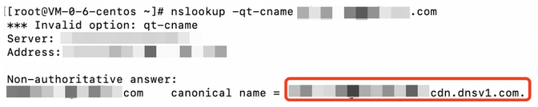


如果您的系统为 Mac 系统或 Linux 系统，可以使用 dig 命令进行验证，以域名`www.test.com`为例，您可以在终端内运行命令：`dig www.test.com`，根据运行的解析结果内，可以查看该域名的 CNAME 信息，如果与腾讯云 CDN 提供的 CNAME 地址一致，即当前的 CDN 加速已生效。

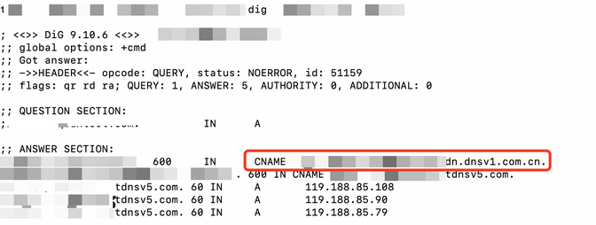

---

### 2、常见问题

#### **域名的 CNAME 已经修改，为什么控制台上还显示未生效？**

新增的 CNAME 配置将实时生效，如果是修改 CNAME 配置，根据所设置的 TTL 时长生效时间不一（默认为600s，即10分钟）。如果您已确定完成了正确的 CNAME 配置，可忽略控制台内提示。

#### `example.com`的域名接入后，`www.example.com`有加速效果吗？

没有，`example.com`和`www.example.com`分别属于两个域名，需要在控制台上全部接入才会有 CDN 加速效果。

#### CNAME 域名可以当访问域名使用吗？

不可以，CNAME 域名为腾讯云 CDN 分配给每个域名的专属加速地址，不可以直接作为访问域名使用，需要用户将接入的业务域名 CNAME 到该地址上，访问用户的业务域名，即可有 CDN 加速效果。